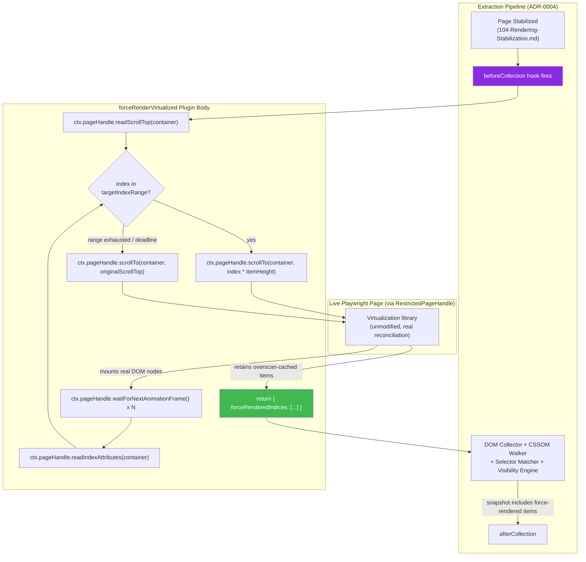

# 003 — Plugin Examples

## 1. Title

**Critical CSS Extraction Engine — Worked Plugin Examples: Force-Render Virtualized Lists, Synthetic `:focus-visible` Injection, and Vendor-Prefix Stripping**

## 2. Version

| Field | Value |
|---|---|
| Document Version | 1.0.0 |
| Status | Accepted |
| Last Updated | 2026-07-10 |
| Owners | Plugin System Working Group |
| Stability | Stable (Phase 12 design document; example code is illustrative reference material, versioned alongside but independent of the normative API surface in 002-Plugin-API.md) |

## 3. Purpose

[002-Plugin-API.md](./002-Plugin-API.md) specifies the concrete Plugin API surface — the `Plugin` interface, per-hook context/patch types, registration, and versioning contract. That document is necessarily abstract: it defines *what a plugin can say*, not *what a real plugin, solving a real, previously-documented engine limitation, looks like end to end*. This document closes that gap with three fully worked examples, each tying directly back to a specific, already-documented gap or limitation elsewhere in the design corpus, so a plugin author (or a reviewer evaluating whether a proposed engine feature should be core-engine behavior or a plugin) has concrete, load-bearing precedent to reason from rather than a purely hypothetical illustration.

The three examples are: **(a)** a `beforeCollection` plugin that force-renders virtualized list items, directly implementing the mitigation [design/207-Virtualized-Lists.md](../design/207-Virtualized-Lists.md) Section 8.5 documents but explicitly defers to "forthcoming `docs/plugins/003-Plugin-Examples.md` content"; **(b)** an `afterCollection`-anchored (with `beforeSerialize` completion) plugin that injects synthetic `:focus-visible` retention for accessibility-critical elements, formalizing the `pluginSyntheticState` mechanism [design/403-Pseudo-Classes.md](../design/403-Pseudo-Classes.md) Section "General extensibility: the synthetic-state plugin hook" specifies at the API-contract level but does not itself implement; and **(c)** a `beforeSerialize` plugin that strips vendor-prefixed CSS rules for a known-modern browser target, an example with no single prior anchor document, included specifically to demonstrate the `removeRuleIds` primitive (per [002-Plugin-API.md](./002-Plugin-API.md) Section 8.3) for a different, more general class of CSS-rewriting use case than the other two examples.

For each example, this document states the problem it solves, the hook(s) it uses and why, worked pseudocode against the exact types from [002-Plugin-API.md](./002-Plugin-API.md), and — the section every example insists on answering explicitly — **why this is implemented as a plugin rather than core-engine behavior**, since that question is precisely the boundary [ADR-0004-Plugin-Lifecycle-Model](../adr/ADR-0004-Plugin-Lifecycle-Model.md) exists to police, and a worked-examples document is exactly where that boundary must be demonstrated concretely, not merely asserted in the abstract.

## 4. Audience

- Plugin authors looking for a working reference implementation to adapt, rather than writing a plugin from the API surface alone.
- Reviewers evaluating a new plugin proposal or a new core-engine feature request, who need worked precedent for "is this the kind of thing that belongs in a plugin" — the extensibility-principle discussion in each example is written specifically for this audience.
- Accessibility engineers evaluating Example B's synthetic-`:focus-visible` approach against their own site's keyboard-navigation requirements.
- Framework/virtualization-library integration authors adapting Example A to a specific library (`react-window`, TanStack Virtual, or a bespoke implementation) beyond the generic pattern shown here.
- Build-target/browser-support engineers evaluating Example C's vendor-prefix-stripping approach against their own supported-browser matrix.
- Documentation maintainers of [design/207-Virtualized-Lists.md](../design/207-Virtualized-Lists.md) and [design/403-Pseudo-Classes.md](../design/403-Pseudo-Classes.md), who should keep those documents' forward-references to this one in sync as this document evolves.

## 5. Prerequisites

- [002-Plugin-API.md](./002-Plugin-API.md) — the `Plugin`, context, and patch types every example in this document is written directly against; this document assumes that API surface as given and does not redefine it.
- [ADR-0004-Plugin-Lifecycle-Model](../adr/ADR-0004-Plugin-Lifecycle-Model.md) — the hook-ordering and patch-merge semantics underpinning why each example uses the hook it uses.
- [000-Plugin-SDK-Overview.md](./000-Plugin-SDK-Overview.md) and [001-Lifecycle-Hooks.md](./001-Lifecycle-Hooks.md) — SDK installation and narrative per-hook semantics, assumed background for the "why this hook" discussions below.
- [004-Sandboxing.md](./004-Sandboxing.md) — the `RestrictedPageHandle` capability model Example A depends on; this document treats that capability's existence and constraints as given, not re-derived.
- [design/207-Virtualized-Lists.md](../design/207-Virtualized-Lists.md) Sections 8.1–8.5, 9.3, and 10.2 — the full problem statement, detection heuristics, and scroll-and-settle algorithm Example A is a concrete instantiation of.
- [design/403-Pseudo-Classes.md](../design/403-Pseudo-Classes.md) Sections on the `:focus-visible` exception and the `pluginSyntheticState` general mechanism — the full rationale Example B is a concrete instantiation of.
- Familiarity with CSS vendor prefixes (`-webkit-`, `-moz-`, `-ms-`, `-o-`) and browser support data (e.g., caniuse.com) for Example C.

## 6. Related Documents

- [002-Plugin-API.md](./002-Plugin-API.md) — the API surface these examples are written against; sibling Phase 12 document.
- [000-Plugin-SDK-Overview.md](./000-Plugin-SDK-Overview.md) — sibling Phase 12 overview document.
- [001-Lifecycle-Hooks.md](./001-Lifecycle-Hooks.md) — sibling Phase 12 per-hook narrative document.
- [004-Sandboxing.md](./004-Sandboxing.md) — sibling Phase 12 document defining `RestrictedPageHandle`, referenced by Example A.
- [ADR-0004-Plugin-Lifecycle-Model](../adr/ADR-0004-Plugin-Lifecycle-Model.md) — architectural foundation for all three examples.
- [design/207-Virtualized-Lists.md](../design/207-Virtualized-Lists.md) — Example A's anchor document; this document fulfills that document's own forward-reference.
- [design/403-Pseudo-Classes.md](../design/403-Pseudo-Classes.md) — Example B's anchor document.
- [design/601-Rule-Ordering.md](../design/601-Rule-Ordering.md), [design/602-Deduplication.md](../design/602-Deduplication.md) — Serializer invariants Example C's `removeRuleIds` patch must not violate.
- [design/104-Rendering-Stabilization.md](../design/104-Rendering-Stabilization.md) — the frame-quiescence primitive Example A's settle loop reuses at a narrower scope.

## 7. Overview

Each example in Section 8 follows an identical five-part structure, deliberately, so the three are directly comparable and so a reader evaluating "should my use case be a plugin" has a repeatable checklist rather than three differently-organized narratives: **(1) Problem** — the concrete engine limitation or requirement, citing its prior documentation where one exists; **(2) Hook(s) Used and Why** — which of the six hooks, and the specific reasoning for that choice over the other five; **(3) Pseudocode** — a worked implementation against [002-Plugin-API.md](./002-Plugin-API.md)'s exact types; **(4) Why a Plugin, Not Core Engine Behavior** — the extensibility-principle argument, addressing directly why this is not instead a built-in engine feature or configuration flag; **(5) Testing/Verification Notes** — how a plugin author would validate the example actually solves the stated problem, anchored to the fixture/testing conventions established elsewhere in the design corpus (BRIEF.md Section 2.15).

Section 9 provides a single Mermaid data-flow diagram for Example A (the most structurally involved of the three, spanning a full scroll-and-settle interaction loop), as representative of how a plugin's data flows through its chosen hook; Examples B and C are comparatively simpler pure-data-transformation patterns whose flow is fully captured in their pseudocode and the shared architecture diagram in [002-Plugin-API.md](./002-Plugin-API.md) Section 9.

## 8. Detailed Design

### 8.1 Example A: Force-Render Virtualized List Items (`beforeCollection`)

#### 8.1.1 Problem

[design/207-Virtualized-Lists.md](../design/207-Virtualized-Lists.md) establishes, as a structural, unavoidable consequence of Principle 1 (Browser Is Source of Truth), that a virtualized/windowed list mounts only a small subset of its logical items in the DOM at any moment. If a design system's list-item component has, say, ten visual variants (default, featured, sold-out, error, and so on), and a given route's initial data happens to render only the "default" variant in the naturally-mounted first window, the CSS for the other nine variants is never observed by the Selector Matcher and is absent from critical CSS — not misclassified, but genuinely never considered, per that document's Section 8.2. An operator who knows their design system's variant set and wants guaranteed above-the-fold coverage for all of it, regardless of which variant a specific route's data happens to render first, needs a way to cause the real virtualization library to mount additional items before the DOM snapshot is taken.

#### 8.1.2 Hook Used and Why

**`beforeCollection`**, exclusively. This is the only hook temporally positioned between "the page has stabilized and a live, interactive `Page` handle exists" ([design/104-Rendering-Stabilization.md](../design/104-Rendering-Stabilization.md)'s `Stabilized` state, entered during `afterNavigation`) and "the DOM/CSSOM collection pass has captured its snapshot" (`afterCollection`) — per [ADR-0004-Plugin-Lifecycle-Model](../adr/ADR-0004-Plugin-Lifecycle-Model.md)'s Architecture flowchart, any DOM mutation this plugin causes must happen strictly before the DOM Collector's traversal, or it will not be reflected in the snapshot at all. `afterNavigation` is too early (per [002-Plugin-API.md](./002-Plugin-API.md) Section 8.2, `AfterNavigationContext` deliberately exposes no live-page-manipulation capability, precisely because navigation-time is not this document's intended scope for interactive mutation — see [design/207-Virtualized-Lists.md](../design/207-Virtualized-Lists.md) Section 8.5's own note on this). `afterCollection` is too late — the snapshot has already been taken and cannot be retroactively expanded.

#### 8.1.3 Pseudocode

```typescript
import { definePlugin } from "@critical-css-engine/plugin-sdk";
import type { BeforeCollectionContext, BeforeCollectionPatch } from "@critical-css-engine/plugin-sdk";

interface ForceRenderOptions {
  containerSelector: string;
  targetIndexRange: [number, number];       // discrete-jump mode, per 207-Virtualized-Lists.md Section 10.2 Optimization Opportunities
  estimatedItemHeightPx: number;
  settleFramesPerIncrement?: number;        // default: 3
  maxElapsedMs?: number;                    // default: 4000, must stay comfortably under the hook-level timeoutMs (002-Plugin-API.md Implementation Notes item 6)
}

export const forceRenderVirtualized = definePlugin<ForceRenderOptions>({
  name: "force-render-virtualized",
  version: "1.0.0",
  sdkVersion: "^2.0.0",
  description: "Scrolls a detected virtualized list through a configured index range before collection, so all configured item variants are real, browser-rendered DOM at snapshot time (design/207-Virtualized-Lists.md Section 8.5).",
  optionsSchema: (input) => validateForceRenderOptions(input), // throws with a structured error at registration time if malformed

  hooks: {
    async beforeCollection(ctx: BeforeCollectionContext<ForceRenderOptions>): Promise<BeforeCollectionPatch> {
      const { containerSelector, targetIndexRange, estimatedItemHeightPx } = ctx.pluginOptions;
      const settleFrames = ctx.pluginOptions.settleFramesPerIncrement ?? 3;
      const maxElapsedMs = Math.min(
        ctx.pluginOptions.maxElapsedMs ?? 4000,
        msUntil(ctx.deadline) - SAFETY_MARGIN_MS,   // never race the hook's own external timeout
      );

      const originalScrollTop = await ctx.pageHandle.readScrollTop(containerSelector);
      const mounted = new Set<number>();
      const deadline = Date.now() + maxElapsedMs;

      for (let index = targetIndexRange[0]; index <= targetIndexRange[1]; index++) {
        if (Date.now() >= deadline) {
          ctx.logger.warn("force-render deadline reached", { reachedIndex: index, targetIndexRange });
          break;
        }
        const targetScrollTop = index * estimatedItemHeightPx;
        await ctx.pageHandle.scrollTo(containerSelector, targetScrollTop);
        for (let i = 0; i < settleFrames; i++) {
          await ctx.pageHandle.waitForNextAnimationFrame();
        }
        const visibleIndices = await ctx.pageHandle.readIndexAttributes(containerSelector);
        visibleIndices.forEach((i) => mounted.add(i));
      }

      // Restore original scroll position so the snapshot's geometry reflects
      // the intended initial-paint scroll state (design/207-Virtualized-Lists.md
      // Section 8.5's explicit restoration requirement).
      await ctx.pageHandle.scrollTo(containerSelector, originalScrollTop);
      for (let i = 0; i < settleFrames; i++) {
        await ctx.pageHandle.waitForNextAnimationFrame();
      }

      const finalMounted = await ctx.pageHandle.readIndexAttributes(containerSelector);
      if (finalMounted.length < mounted.size) {
        ctx.logger.warn("retention policy dropped some force-rendered items", {
          observedDuringLoop: mounted.size,
          finalCount: finalMounted.length,
        });
      }

      return { forceRenderedIndices: Array.from(mounted) };
    },
  },
});
```

`ctx.pageHandle` is the `RestrictedPageHandle` from [002-Plugin-API.md](./002-Plugin-API.md) Section 8.2 / [004-Sandboxing.md](./004-Sandboxing.md); this pseudocode uses only its documented, fixed capability set (`scrollTo`, `waitForNextAnimationFrame`, `readScrollTop`, `readIndexAttributes`) — it never calls an arbitrary `page.evaluate(pluginSuppliedString)`, consistent with the sandboxing model's rejection of open-ended script injection as a plugin capability.

#### 8.1.4 Why a Plugin, Not Core Engine Behavior

Three independent reasons converge, each already anticipated in [design/207-Virtualized-Lists.md](../design/207-Virtualized-Lists.md) Section 8.5's own "scope discipline" discussion:

1. **It is opt-in and operator-specific by nature.** Which container to scroll, which index range matters, and how aggressively to scroll are all facts about a *specific site's* design system and data shape — there is no universal default the core engine could apply without either guessing (rejected, per Principle 1) or requiring every operator to configure a core-engine feature they may not need, which is functionally identical to a plugin except without the isolation and optionality a plugin provides for free.
2. **It has real, non-trivial cost (extra scroll/settle round trips) that must never be paid by operators who do not need it.** Making this core-engine behavior would require a global on/off flag anyway — at which point it is a plugin in every respect except packaging. Per [006-Design-Principles.md](../architecture/006-Design-Principles.md) Principle 3, an additive capability with a real cost must be explicit and opt-in, which the plugin model provides natively (an operator who does not install this plugin pays zero cost, not even a disabled-flag branch check).
3. **It is squarely expressible as a patch from an existing hook.** Per [ADR-0004-Plugin-Lifecycle-Model](../adr/ADR-0004-Plugin-Lifecycle-Model.md)'s Future Implications guidance ("every future capability request must first be evaluated against 'can this be expressed as a patch returned from one of the six existing hooks'"), this capability passes that test cleanly: it needs only `beforeCollection`'s page-handle access and returns a diagnostic-only patch. No new hook, and no core-engine special-casing of virtualization libraries (which the engine deliberately has zero built-in knowledge of, per that document's Section 8.2 rejection of framework-introspection-based reconstruction), is required.

#### 8.1.5 Testing/Verification Notes

Per [design/207-Virtualized-Lists.md](../design/207-Virtualized-Lists.md) Section 15's Integration Tests guidance, verify this plugin against real `react-window`/TanStack Virtual fixtures (not mocks) with a list whose items span multiple visual variants distributed across the index range: assert that, with the plugin disabled, only the naturally-initial window's variant CSS is extracted; assert that, with the plugin configured for a specific range, CSS for variants within that range is present and CSS for variants entirely outside it remains absent, proving the plugin's precision rather than merely its existence. A stress-test variant should deliberately misconfigure `settleFramesPerIncrement` too low relative to a slow-settling library implementation to confirm the `RetentionPolicyDroppedItemsDiagnostic`-equivalent warning fires (Section 8.1.3's `finalMounted.length < mounted.size` check).

### 8.2 Example B: Synthetic `:focus-visible` Injection for Accessibility-Critical Elements (`beforeCollection`)

#### 8.2.1 Problem

[design/403-Pseudo-Classes.md](../design/403-Pseudo-Classes.md) establishes that dynamic pseudo-classes — including `:focus-visible` — are excluded from critical CSS by default because a non-interacted-with DOM snapshot has no live focus state, and `element.matches(':focus-visible')` correctly returns `false` for every element at snapshot time. That document carves out a narrow, deliberate exception: keyboard users tabbing through a page immediately after first paint are a real, accessibility-critical scenario, and an above-fold interactive element (a skip-navigation link, a primary call-to-action button, a form's first input) lacking a visible focus indicator until the deferred, non-critical stylesheet loads is an accessibility regression, not a cosmetic one. The document specifies a `config.forceFocusVisible` flag and a more general `pluginSyntheticState` patch mechanism for this, but does not itself provide a worked plugin implementing the latter for a realistic, multi-selector accessibility policy (e.g., "every focusable element inside the primary navigation and the main call-to-action region, plus any element carrying a project-specific `data-a11y-critical` marker").

#### 8.2.2 Hook Used and Why

**`beforeCollection`**, using the `syntheticState` field of `BeforeCollectionPatch` (per [002-Plugin-API.md](./002-Plugin-API.md) Section 8.3), exactly as [design/403-Pseudo-Classes.md](../design/403-Pseudo-Classes.md)'s "General extensibility" section specifies. This is not a `beforeSerialize`-stage concern because the decision of *which selectors count as force-retained* must be made before the Selector Matcher's retention decision (which happens as part of collection/matching, per [design/400-Selector-Matching.md](../design/400-Selector-Matching.md)), not after — by `beforeSerialize`, the matched/unmatched split has already been finalized, and a `beforeSerialize`-stage plugin would have to re-derive which rules correspond to which selectors from the already-serialized rule set, redoing work the Selector Matcher already did more precisely. Using `beforeCollection`'s declarative `syntheticState` patch lets the existing decision algorithm ([design/403-Pseudo-Classes.md](../design/403-Pseudo-Classes.md) Section "Algorithm: `:focus-visible` / Synthetic-State Force-Retention") handle retention uniformly, whether the override came from the built-in `forceFocusVisible` config flag or from this plugin.

#### 8.2.3 Pseudocode

```typescript
import { definePlugin } from "@critical-css-engine/plugin-sdk";
import type { BeforeCollectionContext, BeforeCollectionPatch } from "@critical-css-engine/plugin-sdk";

interface FocusVisibleSynthesisOptions {
  /** Selectors whose :focus-visible (and, optionally, :focus-within for
   *  ancestor containers) rules should be force-retained regardless of
   *  live focus state at snapshot time. */
  criticalSelectors: string[];
  /** Also force-retain :focus-within on these container selectors, for
   *  the autofocus/keyboard-tab-into-a-form-container case documented
   *  in design/403-Pseudo-Classes.md Edge Cases. */
  criticalContainerSelectors?: string[];
}

export const focusVisibleSynthesis = definePlugin<FocusVisibleSynthesisOptions>({
  name: "focus-visible-synthesis",
  version: "1.0.0",
  sdkVersion: "^2.0.0",
  description: "Declares an explicit, auditable synthetic-state override so accessibility-critical :focus-visible (and optionally :focus-within) rules are retained in critical CSS regardless of live focus state at snapshot time (design/403-Pseudo-Classes.md).",
  optionsSchema: (input) => validateFocusVisibleOptions(input),

  hooks: {
    async beforeCollection(ctx: BeforeCollectionContext<FocusVisibleSynthesisOptions>): Promise<BeforeCollectionPatch> {
      const { criticalSelectors, criticalContainerSelectors = [] } = ctx.pluginOptions;

      const syntheticState = [
        ...criticalSelectors.map((selector) => ({
          selector,
          pseudoClasses: [":focus-visible"],
        })),
        ...criticalContainerSelectors.map((selector) => ({
          selector,
          pseudoClasses: [":focus-within"],
        })),
      ];

      ctx.logger.info("declaring synthetic focus-visible retention", {
        selectorCount: syntheticState.length,
      });

      return { syntheticState };
    },
  },
});
```

Note that this plugin performs **no DOM manipulation whatsoever** — unlike Example A, it never touches `ctx.pageHandle` (indeed, a plugin implementing only this hook body would not need page-handle access at all; per [004-Sandboxing.md](./004-Sandboxing.md), a future capability-declaration mechanism, flagged in [002-Plugin-API.md](./002-Plugin-API.md) Future Work, could let this plugin declare zero capability needs). Its entire contribution is a static, declarative configuration value threaded through the existing retention algorithm — precisely the "static configuration, not runtime-simulated event" property [design/403-Pseudo-Classes.md](../design/403-Pseudo-Classes.md) requires to preserve Principle 5 (Determinism).

#### 8.2.4 Why a Plugin, Not Core Engine Behavior

[design/403-Pseudo-Classes.md](../design/403-Pseudo-Classes.md) itself already answers most of this — the built-in `config.forceFocusVisible` flag *is* core-engine behavior for the common case (`true` or a flat selector allowlist). This plugin exists for the residual case that flag does not cover: **project-specific, potentially data-driven or environment-varying selector policy** (e.g., a policy computed from a design-system registry, or one that differs between staging and production configurations via logic more complex than a static array literal). Baking arbitrary selector-computation logic into the core engine's configuration schema would mean the configuration format itself would need to support computation (functions, conditionals) — at which point it is no longer "configuration," it is "plugin code with extra steps," and the plugin model already provides exactly the right amount of computational expressiveness (a real function body) with no configuration-schema contortion required. This mirrors the general principle, stated in [002-Plugin-API.md](./002-Plugin-API.md) Section 8.6, that a capability expressible as a small, static configuration value belongs in core config, while anything needing actual logic belongs in a plugin.

#### 8.2.5 Testing/Verification Notes

Per [design/403-Pseudo-Classes.md](../design/403-Pseudo-Classes.md) Section 15's Integration Tests guidance: a fixture page with a primary CTA button styled via `:focus-visible` and no other retention path, run once with this plugin configured with the button's selector (rule must be retained) and once without the plugin (rule must be absent, confirmed against the default-exclusion path) — this is a direct differential test proving the plugin's specific, targeted effect rather than a broad "any focus-visible rule survives" assertion, which could pass for the wrong reason (e.g., an unrelated `forceFocusVisible: true` left enabled in the same fixture's config).

### 8.3 Example C: Strip Vendor-Prefixed Rules for a Known-Modern Browser Target (`beforeSerialize`)

#### 8.3.1 Problem

Some legacy stylesheets — vendored component libraries, older CSS resets, third-party widget CSS — retain vendor-prefixed rules (`-webkit-appearance`, `-moz-osx-font-smoothing`, `-ms-flexbox`, and similar) alongside their unprefixed standard equivalents, a pattern common from the pre-Autoprefixer-consolidation era of CSS authoring or from third-party CSS an operator does not control the source of. For a team whose deployment target is a known-modern, evergreen browser matrix (e.g., an internal admin tool restricted to current Chrome/Edge via managed-device policy), every vendor-prefixed rule matching a browser outside that matrix is dead weight in the critical CSS payload — bytes shipped in the render-blocking inline `<style>` block that can never possibly apply. This is not an engine-detected condition (the engine, correctly, has no opinion about an operator's supported-browser matrix — see [design/605-Source-Maps.md](../design/605-Source-Maps.md)/[606-Output-Formats.md](../design/606-Output-Formats.md) for the adjacent but distinct concern of *how* output is packaged) — it is a project-specific optimization opportunity requiring operator-supplied knowledge (their actual supported-browser matrix) the engine cannot infer.

#### 8.3.2 Hook Used and Why

**`beforeSerialize`**, using the `removeRuleIds` field of `BeforeSerializePatch` (per [002-Plugin-API.md](./002-Plugin-API.md) Section 8.3). This must run after dependency resolution (so the plugin sees the final, resolved rule set — the same set that will be serialized, not an intermediate CSSOM-walk artifact that might still be re-ordered or deduplicated downstream) and before serialization (so removed rules never reach the Serializer's invariant-enforcing pass, per [002-Plugin-API.md](./002-Plugin-API.md) Section 8.4's explicit rationale for why `afterSerialize` cannot be used for this). `afterCollection` is too early for this specific use case — at that point, dependency resolution (which can itself introduce or reorder rules per cascade-layer/`@supports` resolution, [design/305-Cascade-Layers.md](../design/305-Cascade-Layers.md), [design/304-Supports-Rules.md](../design/304-Supports-Rules.md)) has not yet run, so a plugin operating on `AfterCollectionContext.matchedRules` would need to redundantly re-derive final rule identity rather than working from `BeforeSerializeContext.resolvedRuleTree`'s already-finalized shape.

#### 8.3.3 Pseudocode

```typescript
import { definePlugin } from "@critical-css-engine/plugin-sdk";
import type { BeforeSerializeContext, BeforeSerializePatch } from "@critical-css-engine/plugin-sdk";

interface StripVendorPrefixesOptions {
  /** Declaration-level vendor prefixes safe to remove for the target
   *  browser matrix — not a browser-version resolver itself (out of
   *  scope for this plugin); the operator supplies the list based on
   *  their own supported-browser-matrix analysis (e.g., via caniuse
   *  data or a browserslist query resolved at config-authoring time). */
  removablePrefixes: Array<"-webkit-" | "-moz-" | "-ms-" | "-o-">;
}

export const stripVendorPrefixes = definePlugin<StripVendorPrefixesOptions>({
  name: "strip-vendor-prefixes",
  version: "1.0.0",
  sdkVersion: "^2.0.0",
  description: "Removes vendor-prefixed CSS rules that are entirely redundant for a known-modern, operator-declared browser support matrix, reducing critical CSS payload size (project-specific; not an engine-wide default).",
  optionsSchema: (input) => validateStripVendorPrefixesOptions(input),

  hooks: {
    async beforeSerialize(ctx: BeforeSerializeContext<StripVendorPrefixesOptions>): Promise<BeforeSerializePatch> {
      const { removablePrefixes } = ctx.pluginOptions;
      const idsToRemove: string[] = [];

      for (const rule of ctx.currentIncludedRules) {
        if (isEntirelyVendorPrefixed(rule, removablePrefixes)) {
          // Only removes a rule if EVERY declaration/selector-affecting
          // prefix in it is in the removable set AND the rule has a
          // sibling unprefixed (or differently-prefixed, retained) rule
          // providing equivalent behavior — never removes a prefixed
          // rule that is the ONLY rule providing a given behavior, since
          // that would be a correctness regression, not an optimization.
          if (hasEquivalentRetainedRule(rule, ctx.currentIncludedRules)) {
            idsToRemove.push(rule.id);
          } else {
            ctx.logger.warn("skipping removal: no equivalent retained rule found", {
              ruleId: rule.id,
              selector: rule.selectorText,
            });
          }
        }
      }

      ctx.logger.info("vendor-prefix stripping complete", {
        removed: idsToRemove.length,
        totalConsidered: ctx.currentIncludedRules.length,
      });

      return { removeRuleIds: idsToRemove };
    },
  },
});
```

The `hasEquivalentRetainedRule` safety check is the load-bearing correctness guard in this example: it is what prevents this plugin from being a blunt, unsafe "delete anything with a vendor prefix" transform, and is what makes this genuinely a size *optimization* rather than a correctness risk masquerading as one — a rule is only ever removed if an equivalent, unprefixed (or otherwise-retained) rule already covers its behavior for the declared target matrix.

#### 8.3.4 Why a Plugin, Not Core Engine Behavior

This example differs from A and B in that it has no single prior anchor document specifying it as a known gap — it is included precisely to demonstrate that the `removeRuleIds` primitive generalizes beyond the two anchored cases, and the "why a plugin" argument here is correspondingly more general:

1. **The engine has, and must have, zero opinion about an operator's supported-browser matrix.** Per [006-Design-Principles.md](../architecture/006-Design-Principles.md) Principle 1, the engine determines critical CSS from what the browser it launched actually renders — it does not, and structurally cannot without an entirely separate, out-of-scope subsystem, know that a *different*, hypothetical browser (an old Safari version, for instance) would or would not need a given prefixed rule. That knowledge is externally supplied, operator-domain knowledge (a browserslist query, a support-matrix policy document), which is exactly the shape of input a plugin's `pluginOptions` exists to carry into the pipeline, not something the core engine's browser-driven extraction model has any way to derive itself.
2. **It is a lossy, policy-driven transformation with real risk if misconfigured**, unlike, say, deduplication ([design/602-Deduplication.md](../design/602-Deduplication.md)), which is core-engine behavior specifically because it is *lossless* by construction (removing a rule only when a provably identical rule already covers its effect, verified by the engine's own analysis, not by operator-supplied policy that could be wrong). A core-engine feature that could silently break rendering in an under-tested browser if an operator's browser-matrix assumption turns out to be wrong is exactly the kind of correctness-affecting, operator-responsibility-bearing behavior [006-Design-Principles.md](../architecture/006-Design-Principles.md) Principle 3 requires be explicit and opt-in — the plugin model's per-project, explicitly-configured nature is a feature here, not a limitation, because it keeps responsibility for the underlying assumption (which browsers actually matter) visibly with the operator who supplied it.
3. **It composes cleanly with, and does not need to be aware of, any other `beforeSerialize` plugin.** Because `removeRuleIds` is a simple ID-set patch (per [002-Plugin-API.md](./002-Plugin-API.md) Section 8.3's array-concatenation merge semantics), this plugin can run alongside Example B or any other `beforeSerialize`/`beforeCollection` plugin with no coordination required — a further point in favor of the plugin model's compositionality over a hypothetical single, core-engine "CSS optimization passes" configuration block that would need to know about every possible optimization a priori.

#### 8.3.5 Testing/Verification Notes

A fixture stylesheet containing paired prefixed/unprefixed rules (e.g., `-webkit-box-shadow`/`box-shadow`) and at least one prefixed rule with **no** unprefixed equivalent present (simulating a case the safety check must refuse to remove) is the minimum required test fixture; assert the paired rule's prefixed variant is removed and its unprefixed variant retained, and assert the unpaired prefixed rule is retained with a logged warning, never silently dropped. A regression test should pin this exact fixture's before/after rule-ID set, per the general regression-test discipline established in [design/207-Virtualized-Lists.md](../design/207-Virtualized-Lists.md) Section 15, so a future refactor of `hasEquivalentRetainedRule`'s matching logic is a reviewed, visible change.

## 9. Architecture

### 9.1 Example A Data Flow: Force-Render Through `beforeCollection`



This diagram makes explicit the property Section 8.1.4 argues for: the plugin's entire contribution is a bounded loop of calls through the narrow `RestrictedPageHandle` capability surface, terminating in a diagnostic-only patch — at no point does the plugin fabricate DOM, bypass the orchestrator's control flow, or require the core pipeline (`Collect`/`AfterC`) to know anything about virtualization at all; from the pipeline's perspective, the snapshot simply contains more real, browser-rendered items than it would have without the plugin installed.

## 10. Algorithms

This document intentionally does not restate the algorithms already fully specified elsewhere: Example A's scroll-and-settle loop is the same algorithm as [design/207-Virtualized-Lists.md](../design/207-Virtualized-Lists.md) Section 10.2 ("Force-Render Scroll-and-Settle Loop"), applied here with the discrete-index-jump optimization that document's Section 10.2 Optimization Opportunities recommends as the default pattern rather than a continuous sweep; its complexity bounds (`O(|targetIndices| × settleFramesPerIncrement)` round trips, bounded by `maxElapsedMs`) are unchanged and are not re-derived here. Example B's retention decision is the same algorithm as [design/403-Pseudo-Classes.md](../design/403-Pseudo-Classes.md)'s "`:focus-visible` / Synthetic-State Force-Retention" algorithm, unchanged; this plugin's only contribution is producing the `pluginSyntheticState` input to that already-specified algorithm. Example C introduces one algorithm not previously specified elsewhere, given below.

### 10.1 Algorithm: Safe Vendor-Prefix Rule Removal

**Problem statement.** Given the final, resolved set of included CSS rules and a configured set of removable vendor prefixes, identify which prefixed rules can be safely removed — defined as: every declaration in the rule uses only removable-prefixed properties/values, and at least one other currently-included rule provides equivalent behavior for browsers outside the removable-prefix scope (i.e., an unprefixed or differently-prefixed-but-retained equivalent already exists).

**Inputs.** `includedRules: CssRule[]`, `removablePrefixes: string[]`.

**Outputs.** `ruleIdsToRemove: string[]`, plus a list of skipped-with-warning rule IDs for operator visibility.

**Pseudocode.**
```text
function computeSafeRemovals(includedRules, removablePrefixes) -> { toRemove: string[], skipped: string[] }:
    // Group rules by a normalized "behavioral key" — same selector plus
    // same declaration property/value with vendor prefixes stripped —
    // so prefixed and unprefixed siblings are recognized as equivalent
    // without needing full CSS semantic analysis (a bounded, declared
    // scope: this plugin recognizes textual prefix-stripping
    // equivalence, not deep semantic equivalence across differently-
    // named prefixed/unprefixed property pairs, which is a documented
    // limitation — see Edge Cases).
    behavioralGroups = groupBy(includedRules, rule => normalizeKey(rule, removablePrefixes))

    toRemove = []
    skipped = []

    for rule in includedRules:
        if not isEntirelyVendorPrefixed(rule, removablePrefixes):
            continue   // not a candidate at all; leave untouched

        group = behavioralGroups[normalizeKey(rule, removablePrefixes)]
        hasEquivalent = group.some(other =>
            other.id != rule.id and not isEntirelyVendorPrefixed(other, removablePrefixes))

        if hasEquivalent:
            toRemove.push(rule.id)
        else:
            skipped.push(rule.id)   // no safe equivalent found; never removed

    return { toRemove, skipped }
```

**Time complexity.** `O(R)` for the grouping pass plus `O(R × G)` worst case for the equivalence check, where `G` is the average behavioral-group size (small in practice — typically one prefixed rule plus one or two unprefixed/alternate-prefixed siblings per behavioral key), giving effectively `O(R)` for realistic stylesheets; pathological cases with very large groups (many rules sharing one normalized key) degrade toward `O(R^2)` in the worst case, mitigated by using a hash-indexed group lookup rather than a linear scan per rule.

**Memory complexity.** `O(R)` for the behavioral-group index, proportional to the included rule count, not to total stylesheet size before inclusion filtering.

**Failure cases.** A rule using a non-standard, project-specific prefix not in `removablePrefixes` and not recognized as any known vendor prefix is simply never a removal candidate (safe, conservative default). A behavioral-key normalization collision (two textually-different rules incorrectly hashing to the same key) could theoretically cause a false "equivalent found," which is why `normalizeKey` must be a conservative, declared, testable function (selector text plus declaration list with only exact, known-prefix substitution — never a fuzzy/semantic similarity heuristic) whose behavior is pinned by the regression fixture described in Section 8.3.5.

**Optimization opportunities.** `normalizeKey` computation and grouping can be memoized across repeated runs for a stable stylesheet (via [design/801-Fingerprinting.md](../design/801-Fingerprinting.md)-style content hashing keyed to the resolved rule tree's fingerprint), avoiding recomputation when only route/viewport — not the underlying CSS source — has changed between runs.

## 11. Implementation Notes

1. **All three examples validate their options eagerly, at `definePlugin`'s `optionsSchema`, never inside the hook body** — consistent with [002-Plugin-API.md](./002-Plugin-API.md) Implementation Notes item 3's guidance that options validation is a one-time, registration-time concern, never re-validated per hook firing.
2. **None of the three examples retain any mutable state across hook firings or across runs** — each hook body is a pure(ish) function of its context and static `pluginOptions`, consistent with [002-Plugin-API.md](./002-Plugin-API.md) Section 8.1's rationale for plain-object, non-class plugins and its Edge Cases discussion of cross-run state contamination risk.
3. **Example A's `SAFETY_MARGIN_MS` constant (Section 8.1.3) must be tuned conservatively** (recommended: at least 250ms, or a configurable fraction of the hook's own `timeoutMs`) — per [002-Plugin-API.md](./002-Plugin-API.md) Implementation Notes item 6, a plugin racing its own internal deadline against the orchestrator's external timeout risks being killed mid-restoration, which is why the restoration step in Example A's pseudocode is structured to run unconditionally after the loop, not conditionally on remaining budget.
4. **Example C's rule removal must be reported in the extraction trace** (per [006-Design-Principles.md](../architecture/006-Design-Principles.md) Principle 6) with enough detail (removed rule's original selector and declaration text, plus the retained "equivalent" rule's ID) that an operator debugging an unexpected rendering difference in an actually-unsupported browser (e.g., a QA engineer testing on an older browser outside the declared matrix by mistake) can trace the missing styling back to this specific plugin's decision, not treat it as an unexplained engine gap.
5. **Example B's `criticalSelectors`/`criticalContainerSelectors` should be validated against the actual stylesheet at plugin-options-validation time where feasible** (a selector matching zero rules in the project's CSS is very likely a typo) — per [002-Plugin-API.md](./002-Plugin-API.md) Edge Cases discussion of unused synthetic-state overrides, this is recommended as an informational warning, not a hard failure, since a selector added preemptively for a not-yet-authored component is a legitimate, if currently-inert, configuration.

## 12. Edge Cases

- **Example A: the container selector matches multiple elements** (e.g., two independent virtualized lists on the same route sharing a class name). The pseudocode as written operates on the first DOM match for `containerSelector`; a plugin author needing to force-render multiple distinct containers must either use a more specific selector per container or extend the plugin to accept an array of `(selector, options)` pairs — noted here as a real limitation of the minimal worked example, not a limitation of the underlying API, since nothing in [002-Plugin-API.md](./002-Plugin-API.md)'s types prevents a more general multi-container implementation.
- **Example A: the virtualization library unmounts far-scrolled-past items faster than the configured increments traverse them**, causing `finalMounted` to diverge from the full `mounted` union observed during the loop — this is the exact scenario [design/207-Virtualized-Lists.md](../design/207-Virtualized-Lists.md) Section 10.2's `RetentionPolicyDroppedItemsDiagnostic` anticipates, and Example A's pseudocode logs an equivalent warning rather than treating it as a hard failure, since a partially-successful force-render (some but not all configured items retained through restoration) is still strictly better coverage than no force-render at all.
- **Example B: an element matches both `criticalSelectors` (as a `:focus-visible` target) and is also inside a `criticalContainerSelectors` ancestor** — both synthetic-state entries are independently included in the returned `syntheticState` array; the underlying retention algorithm ([design/403-Pseudo-Classes.md](../design/403-Pseudo-Classes.md)) evaluates each independently per selector/pseudo-class pair, so this is not a conflict requiring special handling, merely two independently-true facts about the same element.
- **Example C: a prefixed rule with no unprefixed sibling, but which is, in fact, genuinely unnecessary for the declared browser matrix** (the safety check's conservatism produces a false negative — retaining a rule that could have been safely removed) — accepted deliberately; Section 8.3.3's `hasEquivalentRetainedRule` check is intentionally conservative (prefers under-removal, a missed byte-savings opportunity, over over-removal, a rendering correctness risk), consistent with the same asymmetric-risk reasoning [design/207-Virtualized-Lists.md](../design/207-Virtualized-Lists.md) applies to its own detection heuristics (false negatives are accepted; false positives with behavioral consequences are not).
- **All three plugins installed together in the same `plugins` array.** Because Example A and B both implement `beforeCollection` while Example C implements only `beforeSerialize`, their declared order relative to each other for `beforeCollection` (A before B, or B before A) determines which plugin's patch fields "see" the other's contribution via `mergedContextView` (per [ADR-0004-Plugin-Lifecycle-Model](../adr/ADR-0004-Plugin-Lifecycle-Model.md) Algorithms) — in practice these three examples' patch fields (`forceRenderedIndices`, `syntheticState`, and the `beforeSerialize`-only `removeRuleIds`) do not overlap or conflict, so their relative order is inconsequential here, but this is called out explicitly as the kind of ordering question a plugin author combining multiple real plugins must always check, per [002-Plugin-API.md](./002-Plugin-API.md) Section 12's conflicting-patch discussion.

## 13. Tradeoffs

| Example | Core-Engine Alternative Considered | Why Rejected in Favor of a Plugin |
|---|---|---|
| A: Force-render virtualized items | Built-in, first-class `forceRenderVirtualizedList()` engine API with library-specific presets | Requires the core engine to acquire dependencies on/knowledge of specific third-party virtualization libraries, rejected per [design/207-Virtualized-Lists.md](../design/207-Virtualized-Lists.md) Future Work's explicit "community/ecosystem package layer" preference |
| B: Synthetic `:focus-visible` injection | Extend the built-in `forceFocusVisible` config flag to accept arbitrary computed/conditional selector logic | Would require the configuration schema itself to support computation, effectively reinventing plugin code inside a configuration file format |
| C: Vendor-prefix stripping | Built-in "browser target" configuration (browserslist-style) driving automatic prefix removal engine-wide | Couples the core engine to browser-compatibility-data maintenance (an ongoing, external-data-dependent burden akin to Autoprefixer's own caniuse-data update cadence) for a project-specific optimization with real correctness risk if misconfigured, better left as an explicit, auditable, operator-owned plugin |

**Why the boundary lands consistently across all three examples:** in each case, the capability requires either (a) knowledge specific to a particular operator, project, or third-party library the core engine cannot and should not universally embed, or (b) genuine executable logic beyond what a declarative configuration schema can cleanly express, or both. This is the same test [ADR-0004-Plugin-Lifecycle-Model](../adr/ADR-0004-Plugin-Lifecycle-Model.md)'s Future Implications section prescribes ("can this be expressed as a patch from an existing hook") applied three times with three different concrete answers, reinforcing that the test generalizes rather than being tailored after the fact to fit these specific examples.

**Future implications.** If real-world adoption shows most operators configuring near-identical versions of Example A or Example C (e.g., "everyone ends up writing basically the same TanStack-Virtual force-render plugin"), that is itself evidence for promoting a *packaged, published reference plugin* (an ecosystem package, still not core engine) rather than evidence for core-engine adoption — the distinction between "common enough to deserve a maintained, published plugin package" and "common enough to deserve core-engine status" is deliberately kept separate, per the reasoning in Section 13's table, and is revisited only via the same RFC process ADR-0004 requires for any core hook-set change.

## 14. Performance

- **CPU complexity.** Example A's cost is dominated by the scroll-and-settle round trips, already bounded and analyzed in [design/207-Virtualized-Lists.md](../design/207-Virtualized-Lists.md) Section 14; Example B's cost is `O(1)` construction of a small static array, negligible; Example C's cost is `O(R)` per Section 10.1, dominated by the resolved-rule-tree size, not the original pre-filtering stylesheet size.
- **Memory complexity.** Example A: `O(M)` for observed mounted indices, bounded by configured range. Example B: `O(selectorCount)`, negligible. Example C: `O(R)` for the behavioral-group index.
- **Caching strategy.** Example A and B's contributions are correctness-relevant (they change which DOM state is captured or which rules are retained) and must be included in the Cache Manager's fingerprint per [002-Plugin-API.md](./002-Plugin-API.md) Section 14's general guidance and [design/207-Virtualized-Lists.md](../design/207-Virtualized-Lists.md) Section 14's specific precedent; Example C's `removablePrefixes` configuration is likewise fingerprint-relevant, since changing it changes serialized output.
- **Parallelization opportunities.** All three examples are single-plugin, sequential-per-hook by the standard model (ADR-0004); none declares itself order-independent, so none is a candidate for the (currently unimplemented) opt-in parallel-execution mode without further analysis of whether their effects genuinely commute with other plugins on the same hook.
- **Incremental execution.** Example C's `normalizeKey`/grouping computation is the one of the three genuinely amenable to fingerprint-keyed memoization across runs with unchanged CSS source, as noted in Section 10.1's Optimization Opportunities.
- **Profiling guidance.** Per [002-Plugin-API.md](./002-Plugin-API.md) Section 14, each example's hook-firing time is attributed separately in the Reporter's per-plugin timing breakdown; Example A is the one of the three expected to be a meaningfully visible line item (scroll/settle round trips are real wall-clock cost), while B and C are expected to be near-negligible relative to core pipeline stages.
- **Scalability limits.** Example A's cost scales with configured index range across a batch of routes (per [design/207-Virtualized-Lists.md](../design/207-Virtualized-Lists.md) Section 14's scalability discussion, directly applicable here); B and C scale with selector/rule count respectively, both well within the core pipeline's own already-analyzed scalability envelope.

## 15. Testing

- **Unit tests.** Each example's pure-logic helper functions (`hasEquivalentRetainedRule`, `normalizeKey`, the synthetic-state array construction in Example B) tested in isolation with mocked contexts, per the general per-hook unit-testing guidance in [ADR-0004-Plugin-Lifecycle-Model](../adr/ADR-0004-Plugin-Lifecycle-Model.md) Testing section.
- **Integration tests.** Each example registered against the fixture suite (BRIEF.md Section 2.15) exactly as described in each example's own Section 8.x.5 Testing/Verification Notes above.
- **Visual tests.** Example A: golden-snapshot comparison of a force-rendered index position rendering correctly without flash-of-unstyled-content, per [design/207-Virtualized-Lists.md](../design/207-Virtualized-Lists.md) Section 15. Example B: golden-snapshot comparison of simulated keyboard-tab focus state rendering the expected focus ring using only critical CSS. Example C: golden-snapshot comparison confirming rendering is pixel-identical with and without the plugin enabled, on the declared target browser, proving the removal was genuinely lossless for that target.
- **Stress tests.** Example A per [design/207-Virtualized-Lists.md](../design/207-Virtualized-Lists.md) Section 15 (very large virtual list, deliberately misconfigured increments). Example C against a large vendored stylesheet (thousands of prefixed rules) verifying `O(R)`-scaling behavior holds and does not degrade toward the worst-case `O(R^2)` behavioral-group collision scenario.
- **Regression tests.** All three examples' fixture outputs (which rules retained/removed/force-rendered) are pinned as golden fixtures; any future change to the underlying algorithms these examples depend on ([design/207-Virtualized-Lists.md](../design/207-Virtualized-Lists.md)'s force-render loop, [design/403-Pseudo-Classes.md](../design/403-Pseudo-Classes.md)'s retention algorithm, or this document's Section 10.1) must be checked against these pinned fixtures before merging.
- **Benchmark tests.** Track Example A's per-increment wall-clock cost across the three canonical virtualization-library fixtures (per [design/207-Virtualized-Lists.md](../design/207-Virtualized-Lists.md) Section 15's benchmark guidance) to build a shared, documented default `settleFramesPerIncrement` recommendation per library, referenced back into that document's own Implementation Notes.

## 16. Future Work

- **Published, maintained reference-plugin packages for Example A**, one per major virtualization library (`react-window`, `react-virtualized`, TanStack Virtual), promoting this document's generic pattern into concrete, installable packages — tracked as an ecosystem-layer initiative per [design/207-Virtualized-Lists.md](../design/207-Virtualized-Lists.md) Future Work's open question, not a core-engine commitment.
- **A fourth worked example for an `afterSerialize`-only plugin** (e.g., emitting extraction metrics to an external observability system), since none of the three current examples exercises that hook's deliberately observation-only contract ([002-Plugin-API.md](./002-Plugin-API.md) Section 8.4) end to end — flagged as a documentation gap this document should close in a future revision.
- **Extending Example C's safety check to recognize semantically-equivalent but textually-different property pairs** (e.g., `-webkit-box-orient`/`display: flex` era Flexbox-prefix patterns, which are not simple prefix substitutions of the same property name) — currently out of scope and explicitly documented as a conservative limitation (Section 10.1 Failure Cases); would require a small, explicit, versioned equivalence table analogous to [design/403-Pseudo-Classes.md](../design/403-Pseudo-Classes.md)'s classification tables, rather than a general CSS-semantic-equivalence engine (which would risk exactly the kind of custom-parser scope creep [ADR-0002-No-Custom-Selector-Parser](../adr/ADR-0002-No-Custom-Selector-Parser.md) warns against).
- **Open question: should Example A and Example B's patterns be formalized as SDK-provided utility functions** (e.g., an exported `scrollAndSettle(pageHandle, policy)` helper, or a `buildFocusVisibleSyntheticState(selectors)` helper) within `@critical-css-engine/plugin-sdk` itself, reducing the boilerplate every adopting plugin author currently has to reimplement — weighed against the risk of the SDK accumulating an ever-growing grab-bag of narrow utility functions with unclear ownership boundaries relative to the ecosystem-package layer discussed above.

## 17. References

- [002-Plugin-API.md](./002-Plugin-API.md)
- [000-Plugin-SDK-Overview.md](./000-Plugin-SDK-Overview.md)
- [001-Lifecycle-Hooks.md](./001-Lifecycle-Hooks.md)
- [004-Sandboxing.md](./004-Sandboxing.md)
- [ADR-0004-Plugin-Lifecycle-Model](../adr/ADR-0004-Plugin-Lifecycle-Model.md)
- [design/207-Virtualized-Lists.md](../design/207-Virtualized-Lists.md)
- [design/403-Pseudo-Classes.md](../design/403-Pseudo-Classes.md)
- [design/104-Rendering-Stabilization.md](../design/104-Rendering-Stabilization.md)
- [design/305-Cascade-Layers.md](../design/305-Cascade-Layers.md), [design/304-Supports-Rules.md](../design/304-Supports-Rules.md)
- [design/601-Rule-Ordering.md](../design/601-Rule-Ordering.md), [design/602-Deduplication.md](../design/602-Deduplication.md)
- [design/801-Fingerprinting.md](../design/801-Fingerprinting.md)
- [architecture/006-Design-Principles.md](../architecture/006-Design-Principles.md)
- [ADR-0002-No-Custom-Selector-Parser](../adr/ADR-0002-No-Custom-Selector-Parser.md)
- BRIEF.md Section 2.13 (Plugin System Hooks), Section 2.15 (Testing Strategy) — repository root
- react-window, react-virtualized, TanStack Virtual project documentation
- WCAG 2.2 — Focus Visible (2.4.7), Focus Appearance (2.4.11)
- caniuse.com and the `browserslist` project documentation — precedent for operator-declared browser-support-matrix tooling referenced in Example C
