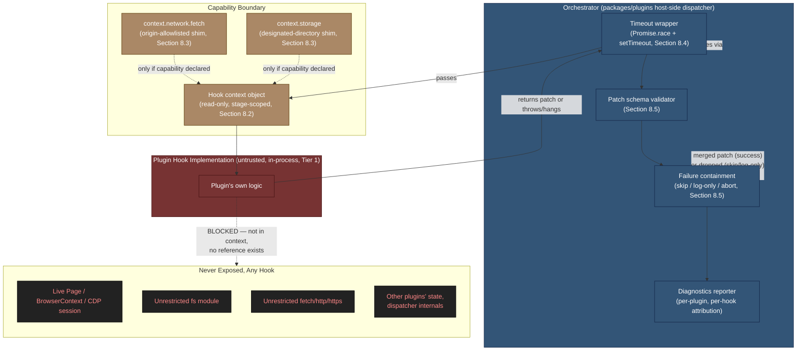
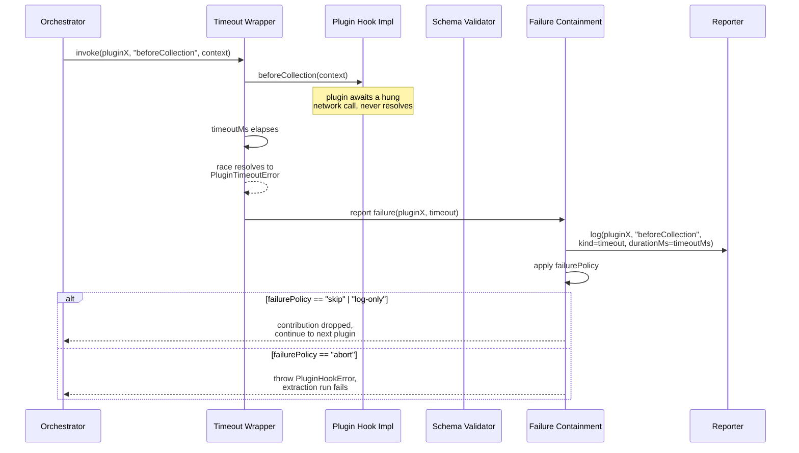

# 004 — Plugin Sandboxing

## 1. Title

**Critical CSS Extraction Engine — Plugin Sandboxing Model**

## 2. Version

| Field | Value |
|---|---|
| Document Version | 1.0.0 |
| Status | Draft — Phase 12 (Plugin SDK) |
| Last Updated | 2026-07-10 |
| Owners | Plugin System Working Group |
| Stability | Core capability-restriction model stable; hardened isolation (worker-thread/`vm`-context) tracked as Future Work, not yet scheduled to a phase |

## 3. Purpose

This document specifies the **sandboxing boundary** enforced around every plugin hook invocation: what a plugin's hook implementation is permitted to observe and mutate, what it is categorically forbidden from touching regardless of hook, how per-invocation timeouts are enforced so a single hung or pathological plugin cannot stall an entire extraction run, and how plugin failures (thrown exceptions, timeouts, malformed return values) are contained so that a misbehaving plugin degrades the run gracefully rather than crashing it outright.

[ADR-0004-Plugin-Lifecycle-Model](../adr/ADR-0004-Plugin-Lifecycle-Model.md) establishes *why* the engine exposes extensibility as six discrete, named lifecycle hooks rather than a middleware chain or event emitter, and sketches a `runHook` orchestration loop with timeout and failure-policy handling in its Algorithms section. [015-Runtime-Model.md](../architecture/015-Runtime-Model.md) Section 8.6 establishes *where*, in process/thread terms, plugin code physically executes (Tier 1, the Node host process, sharing the orchestrating thread's event loop) and states plainly that this is a **capability-restriction** sandbox, not a hard memory-isolation sandbox. This document is the third leg of that tripod: it is the plugin-author-facing and plugin-system-implementer-facing specification of the *concrete enforcement mechanisms* — the capability boundary, the timeout wrapper, and the failure-containment state machine — that make the promises of the other two documents actually true at the code level, and it is the document a security reviewer should read to understand precisely what guarantees this sandbox does and does not provide.

## 4. Audience

- Plugin System implementers (`packages/plugins`) building the hook dispatcher, the capability-gated context objects, and the timeout/error-containment wrapper this document specifies.
- Plugin authors — both first-party (selector-ignore, CSS-rewrite, custom-visibility plugins per [003-Plugin-Examples](./003-Plugin-Examples.md)) and third-party — who need to know exactly what their hook implementations can and cannot reach, and what happens when their code throws, hangs, or misbehaves.
- SSR integration authors implementing framework adapters (React SSR, Next.js, Astro, Remix, Express, Fastify per `BRIEF.md` Section 2.10) as plugins hooked into `beforeLaunch`/`afterNavigation`, who must understand the capability boundary before requesting filesystem or network access.
- Security reviewers evaluating whether the plugin execution model is an acceptable boundary for running untrusted or third-party code, and under what conditions (see Edge Cases, Tradeoffs) that acceptability changes.
- CI/CD platform engineers who need to reason about worst-case plugin behavior (a plugin that never returns, a plugin that allocates unbounded memory) when sizing timeout budgets and failure policies for automated pipelines (`BRIEF.md` Section 2.11).

Readers are assumed to be senior engineers familiar with Node.js's single-threaded event loop model, `async`/`await` semantics, `Promise.race`-style timeout patterns, and the general distinction between capability-based security (restricting what an API surface exposes) and process/memory isolation (restricting what an execution context can physically address). This is not an introduction to either topic.

## 5. Prerequisites

- [ADR-0004-Plugin-Lifecycle-Model](../adr/ADR-0004-Plugin-Lifecycle-Model.md) — the six named hooks, the patch-based mutation model, and the baseline `runHook` algorithm this document extends with concrete capability and timeout enforcement detail.
- [015-Runtime-Model.md](../architecture/015-Runtime-Model.md) Section 8.6 — the process/thread placement of plugin code (Tier 1, in-process, no dedicated worker thread by default) that this document's enforcement mechanisms must work within.
- `BRIEF.md` Section 2.13 (Plugin System Hooks) and Section 2.16 (Security: cross-origin stylesheet handling, browser sandboxing, configurable network restrictions, timeout protection) — the two brief sections this document operationalizes for the plugin subsystem specifically.
- [000-Plugin-SDK-Overview](./000-Plugin-SDK-Overview.md) and [002-Plugin-API](./002-Plugin-API.md) — the public plugin-facing API surface (hook signatures, context object shapes, manifest/capability-declaration format) this document assumes as given and constrains from a security angle.
- Working familiarity with Node.js `AbortController`, `Promise.race`, and the general shape of a capability-gated API wrapper (an object exposing a restricted subset of an underlying API, e.g., a `fetch` wrapper that rejects requests to non-allowlisted origins).

## 6. Related Documents

- [ADR-0004-Plugin-Lifecycle-Model](../adr/ADR-0004-Plugin-Lifecycle-Model.md) — lifecycle hook set, patch-merge model, baseline algorithm
- [015-Runtime-Model.md](../architecture/015-Runtime-Model.md) — Tier 1/Tier 2 process boundary; Section 8.6's runtime-execution angle on sandboxing
- [000-Plugin-SDK-Overview](./000-Plugin-SDK-Overview.md) — plugin package shape, manifest format, installation model
- [001-Lifecycle-Hooks](./001-Lifecycle-Hooks.md) — per-hook context object contracts and patch shapes
- [002-Plugin-API](./002-Plugin-API.md) — public interfaces, DTOs, configuration schema, error types referenced throughout this document
- [003-Plugin-Examples](./003-Plugin-Examples.md) — worked examples (selector-ignore, CSS-injection, custom-visibility plugins) used here to illustrate capability boundaries concretely
- [006-Design-Principles.md](../architecture/006-Design-Principles.md) — Principle 6 (fail loud, fail attributably) and Principle 7 (Plugin Sandboxing contract-level statement), which this document implements
- [ADR-0001-Browser-Is-Source-of-Truth](../adr/ADR-0001-Browser-Is-Source-of-Truth.md) — why raw `Page`/CDP access is reserved for core pipeline code, not plugins
- `BRIEF.md` Sections 2.11 (CI/CD Pipeline), 2.13 (Plugin System Hooks), 2.16 (Security)

## 7. Overview

Plugins are, by construction, untrusted or at least *unvetted* code: they may be authored by a different team, a different organization, or an open-source third party, and the engine has no reliable way to statically verify that a given plugin package does only what its manifest claims. At the same time, [015-Runtime-Model.md](../architecture/015-Runtime-Model.md) establishes that plugins execute in-process, in the same Node.js host process and the same thread as the orchestrator driving the extraction run — a deliberate choice made for latency and simplicity reasons (Section 8.6, Tradeoffs there), not because in-process execution is the *safest* option available. This creates a specific, well-understood tension: the engine wants plugin authors to have a productive, low-friction extension surface, while also wanting a single misbehaving plugin — buggy, slow, or actively malicious — to never be capable of corrupting an extraction run's correctness, hanging a CI pipeline indefinitely, or reaching data/resources outside its legitimate remit.

The resolution this engine adopts, consistent with [015-Runtime-Model.md](../architecture/015-Runtime-Model.md) Section 8.6's explicit framing, is a **capability-and-monitoring sandbox**, not a **memory-isolation sandbox**. Concretely, four independent mechanisms compose to form the sandboxing boundary this document specifies:

1. **Context scoping** — a plugin hook receives only the narrow, versioned context object appropriate to its pipeline stage (per [ADR-0004](../adr/ADR-0004-Plugin-Lifecycle-Model.md)), never a reference to the live `Page`, `BrowserContext`, or raw CDP session, and never the full internal engine state.
2. **Capability-gated shims** — where a plugin legitimately needs a capability that would otherwise be dangerous if unrestricted (network access, filesystem access), the engine provides a narrowed, declaratively-scoped substitute (an allowlist-checked `fetch` shim; a chroot-style path-joined filesystem accessor scoped to a designated cache directory) rather than exposing the raw Node global.
3. **Per-invocation timeout enforcement** — every single hook invocation, for every plugin, is wrapped in a wall-clock deadline; exceeding it aborts *waiting* on that plugin (not necessarily the plugin's own in-flight work, a distinction elaborated in Edge Cases) and is treated as a failure for containment purposes.
4. **Failure containment** — a plugin that throws, times out, or returns a value that fails schema validation is handled according to a configurable failure policy (`abort` | `skip` | `log-only`), defaulting to graceful degradation (skip that plugin's contribution for that hook, log the failure with full attribution, continue the run) rather than aborting the entire extraction, because a single low-stakes diagnostics plugin failing should not, by default, invalidate an otherwise-successful production extraction.

None of these four mechanisms individually is a hard security boundary in the sense that a `vm.Context`, a Node.js `worker_thread`, or an OS-level container/process boundary would be — this document states that plainly, up front, rather than allowing implementers or reviewers to infer a stronger guarantee than the architecture provides. What the four mechanisms *do* provide, in combination, is: a bounded blast radius for plugin bugs (a plugin cannot reach further than its granted capabilities, even if it tries), a bounded worst-case latency contribution per plugin per hook (the timeout), and a well-defined, observable, testable failure mode (containment) rather than an undefined one (a crash, a hang, or silent data corruption). The remainder of this document specifies each of these four mechanisms precisely enough to implement and to test against.

## 8. Detailed Design

### 8.1 The Isolation Spectrum Considered

Four points on the isolation spectrum were evaluated for where plugin hook code should execute:

| Option | Isolation strength | Latency cost | Implementation complexity | Chosen? |
|---|---|---|---|---|
| **In-process, same thread, no capability restriction** ("trust fully") | None — plugin code runs with the full ambient authority of the host process | Zero | Trivial | No |
| **In-process, same thread, capability-restricted** ("trust-and-monitor") | Capability-surface restriction only; no memory/CPU/crash isolation | Zero (no serialization, no IPC, no thread hop) | Low-moderate (capability shims, timeout wrapper, failure containment) | **Yes — this document's model** |
| **Worker-thread isolation** (`node:worker_threads`, separate V8 isolate, structured-clone message passing) | Strong memory isolation (separate heap); no shared-object corruption possible; a worker crash does not crash the host | Moderate — structured-clone serialization cost per hook invocation for context in and patch out; worker spin-up cost if not pooled | Moderate-high (message-passing protocol, worker lifecycle management, DTO clonability constraints per [015-Runtime-Model.md](../architecture/015-Runtime-Model.md) Section 12) | No — deferred, see Future Work |
| **`vm.Context`/`vm.Module` isolation** (Node's `vm` module, separate global object, shared or separate microtask queue depending on configuration) | Weaker than worker-thread isolation in practice — Node's `vm` module is explicitly documented as **not a security boundary** against determined malicious code (it does not protect against, e.g., prototype-pollution attacks reaching back into the host realm via certain built-in object references) | Low-moderate (no thread hop, but still requires marshaling values across realms) | Moderate (careful attention to realm-crossing object identity issues) | No — rejected as a false sense of security; see Tradeoffs |
| **OS-process-per-plugin** (child process, IPC via serialized messages) | Strongest — full OS-level memory/crash/resource isolation, resource-limitable via OS primitives (cgroups, rlimits) | High — process spin-up cost, full serialization for every hook invocation's context and patch, IPC round-trip latency on the hot path of every single hook firing for every plugin | High (process lifecycle management, IPC protocol, crash/restart policy) | No — deferred, flagged for a future hardened mode gated on real third-party plugin marketplace demand |

**Why "trust-and-monitor" (capability-restricted, in-process) was chosen for the current phase:** Three reasons converge. First, latency: per [ADR-0004](../adr/ADR-0004-Plugin-Lifecycle-Model.md) Performance section, plugin hook execution is not expected to dominate total extraction time, and this document's model preserves that property — worker-thread or process isolation would introduce a serialization/IPC cost on literally every hook firing for every plugin, a fixed tax paid regardless of whether any given plugin is actually untrustworthy. Second, DTO clonability: [015-Runtime-Model.md](../architecture/015-Runtime-Model.md) Section 12 already flags that not every pipeline DTO is trivially structured-clonable across a worker-thread boundary (a DTO must not embed live `Page` handles, for instance); building the plugin-hook context/patch contract to be clonable from day one adds constraint but is achievable, while retrofitting it later is a larger effort — this is noted as a design consideration for a *future* hardened mode rather than a blocker to the current model, since the current model does not require clonability at all. Third, and most importantly, threat model calibration: at the current phase, plugins are expected to be first-party or trusted-third-party (documented in a plugin registry with attribution), not anonymous, adversarial, arbitrary code from an open marketplace with no vetting — the "trust-and-monitor" model's actual risk profile (a *buggy* plugin corrupting a run, hanging a hook, or leaking a stack trace) is well-served by capability restriction plus timeout plus containment, whereas the *marginal* protection a full sandbox would add against a genuinely adversarial plugin author is judged, at this phase, not to justify the fixed latency and complexity tax on every invocation. This calibration is explicitly revisitable — see Future Work — once a public plugin marketplace with unvetted third-party submissions becomes a real deployment scenario.

**Why `vm.Context` was rejected outright, not merely deferred:** Unlike worker-thread or process isolation (which are deferred as legitimate future hardening paths), `vm.Context` is rejected as a *false* solution to this problem. Node.js's own documentation is explicit that the `vm` module is not a security mechanism for running untrusted code — determined malicious code can, through various documented and historically-patched-but-recurring techniques, escape a naively-configured `vm.Context` and reach the host realm. Adopting `vm.Context` here would create the *appearance* of sandboxing (a plausible-looking "isolated context" in the code) without the *substance* of it, which this document judges to be worse than clearly documenting the current model as capability-restriction-only: a false sense of security is a security liability in itself, because it discourages the additional scrutiny (manual plugin review, capability-declaration auditing) that a correctly-labeled "trust-and-monitor" model invites by being honest about its limits.

### 8.2 What a Plugin May Touch

A plugin hook implementation receives exactly one argument: the **hook context object** for the specific hook it implements, as defined per-hook in [001-Lifecycle-Hooks](./001-Lifecycle-Hooks.md). This object is:

- **Read-only from the plugin's perspective.** Per [ADR-0004](../adr/ADR-0004-Plugin-Lifecycle-Model.md) Implementation Notes item 2, the context is a read-only view (structurally shared, not deep-copied, for the common case where a plugin only reads and does not need to mutate); a plugin cannot write through it to affect shared pipeline state. Any effect a plugin wants to have on the pipeline must be expressed as a **returned patch object**, validated against that hook's documented schema before being merged.
- **Scoped strictly to what that pipeline stage legitimately knows.** `beforeLaunch`'s context contains launch configuration (viewport profile, target engine choice) and nothing about DOM/CSSOM, because none exists yet at that point in the pipeline; `afterCollection`'s context contains the full matched-rule and visibility dataset but nothing about navigation, because navigation has already concluded. A plugin cannot request "give me everything" — the context shape *is* the capability grant for that hook, and there is no escape hatch to a broader object.
- **Optionally supplemented with declared, capability-gated shims** — specifically, a scoped `fetch`-like function and a scoped filesystem accessor, described in 8.3 below — injected into the context only for plugins whose manifest declares the corresponding capability request, per [002-Plugin-API](./002-Plugin-API.md)'s capability-declaration schema.

A plugin **may not**, under any hook, obtain:

- A reference to the live Playwright `Page`, `BrowserContext`, `Browser`, or the underlying CDP session object. This is an absolute prohibition, not a default-off capability a plugin can request — per [ADR-0001-Browser-Is-Source-of-Truth](../adr/ADR-0001-Browser-Is-Source-of-Truth.md) and [015-Runtime-Model.md](../architecture/015-Runtime-Model.md) Section 8.6, direct browser control is reserved for core pipeline code exclusively, because a plugin with raw `Page` access could arbitrarily navigate, evaluate scripts, or read/write cookies and storage in ways that break the isolation and determinism guarantees the rest of the pipeline depends on — no legitimate plugin use case documented in `BRIEF.md` Section 2.13 (ignore selectors, rewrite CSS, inject rules, customize visibility, customize matching) requires this, so it is not exposed at all, by design, rather than being gated behind a capability flag.
- Unrestricted filesystem access. The Node.js global `fs` module (or `require('fs')`) is not injected into the context, and plugin authors who `require('fs')` directly from within their own package (which the sandbox, being in-process, cannot prevent at the language level — see 8.5's honest limitations) are explicitly acting outside the documented and supported plugin contract; the engine's own injected filesystem shim (8.3) is the only *sanctioned* path, and plugin review/registry policy (organizational, not technical, enforcement) is expected to catch violations of this norm for any plugin accepted into a shared/first-party registry.
- Unrestricted network access. Same reasoning as filesystem: the global `fetch`/`http`/`https` modules are not injected; the capability-gated `fetch` shim (8.3) is the sanctioned path.
- A reference to other plugins' internal state, or to the hook dispatcher's own internal bookkeeping (timing accumulators, failure counters). Plugins interact with each other only indirectly, through the declared-order patch-merge sequencing already specified in [ADR-0004](../adr/ADR-0004-Plugin-Lifecycle-Model.md).

### 8.3 Capability-Gated Shims

For the two capabilities that legitimate plugins plausibly need — outbound network calls (e.g., a plugin fetching a remote ignore-list configuration, or reporting diagnostics to an external service) and filesystem access (e.g., a plugin caching a large, expensive-to-recompute artifact across runs) — the engine does not expose the raw Node primitive. Instead, a plugin manifest declares the specific capability it needs, and the hook dispatcher injects a narrowed substitute into the context only for plugins whose manifest includes that declaration.

**Network shim (`context.network.fetch`).** A `fetch`-compatible function that:
- Is only present in the context object if the plugin's manifest declares `capabilities.network` with an explicit origin allowlist (e.g., `capabilities.network.allowedOrigins: ["https://config.example.com"]`).
- Rejects (returns a rejected promise with a `PluginCapabilityError`) any request whose target origin is not in the plugin's declared allowlist — this check happens inside the shim itself, at every call, not only at plugin-registration time, so a plugin cannot declare a narrow allowlist and then attempt to fetch an arbitrary URL at runtime and succeed.
- Is itself wrapped by the same per-hook timeout budget described in 8.4 — a plugin's own outbound network call, if slow, still counts against that plugin's hook-invocation deadline; the shim does not grant a separate, unbounded timeout budget for network calls.
- Does not attach ambient credentials (cookies, `Authorization` headers) from any other part of the system; a plugin needing authenticated access to an allowlisted origin must supply its own credentials explicitly in the request it constructs.

**Filesystem shim (`context.storage`).** An object exposing `read(relativePath)`/`write(relativePath, data)`/`list(relativePrefix)` methods that:
- Are only present if the plugin's manifest declares `capabilities.storage`.
- Resolve `relativePath` against a per-plugin designated cache directory (conventionally `<engine-cache-root>/plugins/<plugin-name>/`, one subdirectory per installed plugin, keyed by plugin name/identity), rejecting any path that would resolve outside that directory — implemented via a canonicalize-then-prefix-check pattern (resolve the joined path to an absolute path, then verify it still starts with the designated directory's absolute path as a string prefix with a trailing separator) specifically to reject `../../` traversal attempts, symlink-based escapes, and absolute-path overrides.
- Never expose the ability to read or write outside that one directory, including the engine's own cache (`packages/cache`), other plugins' designated directories, or arbitrary host filesystem locations — this is the concrete implementation of the "filesystem outside designated cache paths" restriction referenced in this document's Purpose.

Both shims share one further property worth calling out explicitly: **declaring a capability in a manifest is itself an auditable, reviewable artifact** — a plugin registry (first-party or organizational) can statically inspect which plugins request network or storage access, and to which origins, without needing to execute or reverse-engineer the plugin's code, which is a meaningful practical security property even though it is enforced by convention and manifest-schema validation rather than by a hard runtime sandbox.

### 8.4 Per-Hook Timeout Enforcement

Every single invocation of every hook, for every plugin, is wrapped in a wall-clock deadline (`config.timeoutMs`, configurable globally and, optionally, per-plugin — a slow-but-legitimate plugin, such as one calling a known-slow external linting API, may be granted a longer budget than the default). The purpose is stated plainly in [ADR-0004](../adr/ADR-0004-Plugin-Lifecycle-Model.md)'s Edge Cases and restated here as a first-class requirement of this document: **a single hung plugin must never hang the entire extraction run.**

The mechanism is a `Promise.race` between the plugin's hook invocation and a timer-based rejection:

```text
function withTimeout(promiseFactory, timeoutMs, context):
    timeoutHandle = null
    timeoutPromise = new Promise((_, reject) => {
        timeoutHandle = setTimeout(
            () => reject(new PluginTimeoutError(context.pluginName, context.hookName, timeoutMs)),
            timeoutMs
        )
    })

    try:
        result = await Promise.race([promiseFactory(), timeoutPromise])
        return result
    finally:
        clearTimeout(timeoutHandle)   // always clear, whether raced result won or lost
```

This is a **wall-clock**, not a CPU-time, deadline — deliberately, because a plugin can misbehave in two qualitatively different ways: pure CPU-bound blocking (a synchronous infinite loop, which a wall-clock timer *cannot* actually interrupt, since it shares the single-threaded event loop with the timer itself — see Edge Cases) and I/O-bound waiting (an `await` on a slow or hung network call, which a wall-clock timer *can* correctly bound, since the timer fires as a normal macrotask once the deadline elapses, and the race resolves to the timeout branch). The choice of wall-clock timing over CPU-time accounting is what lets this same mechanism correctly bound both a plugin's own slow synchronous work *and* a plugin awaiting a slow external call, at the cost of the honest limitation (elaborated in 8.5 and Edge Cases) that a genuinely CPU-bound infinite loop cannot be preempted by this mechanism at all in a single-threaded, in-process model — no wall-clock timer, however configured, can interrupt code that never yields control back to the event loop.

### 8.5 Failure Containment

Three distinguishable failure modes are handled uniformly through one containment mechanism:

1. **Synchronous throw or rejected promise** — the plugin's hook function throws directly, or returns a promise that rejects.
2. **Timeout** — the plugin's hook function neither resolves nor rejects within `timeoutMs` (8.4).
3. **Schema-invalid return value** — the plugin's hook function resolves, but the resolved value does not conform to that hook's documented patch schema (per [001-Lifecycle-Hooks](./001-Lifecycle-Hooks.md)) — e.g., a `beforeCollection` implementation returning a serialized CSS string, which is not a valid patch shape for a stage that precedes serialization.

All three are caught at the same point in the dispatcher and handled according to the configured `failurePolicy`:

- **`skip` (default)** — the failing plugin's contribution to *this specific hook firing* is dropped; the accumulated patch chain proceeds without it; other plugins implementing the same hook still run; the plugin remains registered and will be invoked again at the *next* hook it implements (a plugin failing at `beforeCollection` is not thereby barred from participating in `afterCollection`), consistent with the `Quarantined → Registered` transition in [ADR-0004](../adr/ADR-0004-Plugin-Lifecycle-Model.md)'s state diagram.
- **`log-only`** — behaviorally identical to `skip` (the failing contribution is dropped, the run continues), differing only in the verbosity/destination of the failure report — some deployments want a quieter log entry rather than a surfaced warning, without changing the actual containment behavior.
- **`abort`** — the failure is re-thrown as a `PluginHookError` (wrapping the original error, timeout, or validation failure, with full attribution: plugin name, hook name, and either the original error or a description of the validation failure) and propagates up through the orchestrator, failing the entire extraction run. This is the appropriate choice for CI pipelines that want strict "any plugin failure fails the build" semantics (`BRIEF.md` Section 2.11's fail-the-build conditions), and is expected to be configured per-deployment, not hardcoded.

Every containment event, regardless of policy, is reported to the diagnostics/reporting subsystem with full attribution (plugin identity, hook name, failure kind, timing, and — for thrown/rejected errors — the original stack trace) before the policy-determined control-flow decision is made, so that even a `skip`-policy failure is fully visible in the Reporter's timing/diagnostics report (per [ADR-0004](../adr/ADR-0004-Plugin-Lifecycle-Model.md) Implementation Notes item 6) rather than being silently swallowed. A silently-dropped plugin failure that leaves no diagnostic trace is treated as a bug in the containment implementation itself, not an acceptable outcome of any failure policy.

**Honest limitation, stated explicitly:** none of the above prevents a plugin from corrupting *its own* execution's correctness in ways that don't surface as a thrown error or a schema-invalid return — e.g., a plugin that returns a syntactically valid but semantically nonsensical patch (an `ignoreSelectors` list containing selectors that match nothing, silently making the plugin a no-op) will not be caught by any mechanism in this document; schema validation checks *shape*, not *semantic correctness*, and detecting the latter is out of scope for a general-purpose sandboxing mechanism (it is properly the concern of the plugin's own tests, per [003-Plugin-Examples](./003-Plugin-Examples.md)'s testing guidance for plugin authors).

## 9. Architecture



### Sequence: A Timing-Out, Contained Plugin Invocation



## 10. Algorithms

### 10.1 Sandboxed Hook Invocation Wrapper

**Problem statement.** Given a single plugin's hook implementation, a hook-specific context object, a per-hook patch schema, and a configured timeout budget and failure policy, invoke the plugin's hook such that: (a) the invocation never blocks the orchestrator beyond `timeoutMs`; (b) any thrown error, rejected promise, or schema-invalid return value is caught and classified; (c) the outcome (successful patch, or containment decision) is reported with full attribution before control returns to the caller.

**Inputs.** `plugin: { name: string, hooks: Record<string, HookFn> }`, `hookName: string`, `context: Readonly<HookContext>`, `schema: PatchSchema` (per-hook, from [001-Lifecycle-Hooks](./001-Lifecycle-Hooks.md)), `config: { timeoutMs: number, failurePolicy: "abort" | "skip" | "log-only" }`.

**Outputs.** `{ status: "success", patch: Patch } | { status: "contained", reason: string }` — or a thrown `PluginHookError` if `failurePolicy === "abort"`.

**Pseudocode.**

```text
function invokeSandboxed(plugin, hookName, context, schema, config) -> InvocationOutcome:
    hookFn = plugin.hooks[hookName]
    if hookFn is undefined:
        return { status: "success", patch: {} }   // plugin does not implement this hook

    startTime = now()
    timeoutHandle = null

    timeoutPromise = new Promise((_, reject) => {
        timeoutHandle = setTimeout(
            () => reject(PluginTimeoutError(plugin.name, hookName, config.timeoutMs)),
            config.timeoutMs
        )
    })

    invocationPromise = Promise.resolve()
        .then(() => hookFn(context))     // wraps synchronous throws into a rejected promise too

    try:
        rawResult = await Promise.race([invocationPromise, timeoutPromise])
        clearTimeout(timeoutHandle)

        validationResult = validateAgainstSchema(rawResult, schema)
        if not validationResult.valid:
            throw PluginPatchShapeError(plugin.name, hookName, validationResult.errors)

        durationMs = now() - startTime
        reportSuccess(plugin.name, hookName, durationMs)
        return { status: "success", patch: rawResult ?? {} }

    catch (err):
        clearTimeout(timeoutHandle)   // always clear on the failure path too
        durationMs = now() - startTime
        failureKind = classify(err)   // "thrown" | "timeout" | "invalid-shape"
        reportFailure(plugin.name, hookName, failureKind, durationMs, err)

        switch config.failurePolicy:
            case "abort":
                throw PluginHookError(plugin.name, hookName, failureKind, err)
            case "skip":
            case "log-only":
                return { status: "contained", reason: failureKind }
```

**Time complexity.** `O(1)` per invocation — the wrapper adds a constant number of promise allocations, one timer registration/clear, and one schema-validation pass (itself `O(patchSize)`, typically small — a handful of fields per hook's documented contract) around the plugin's own hook body; the wrapper's own overhead does not scale with anything other than the (small, fixed) shape of the patch schema. Aggregated across a full hook firing with `n` plugins implementing that hook (per [ADR-0004](../adr/ADR-0004-Plugin-Lifecycle-Model.md) Algorithms), total wrapper overhead is `O(n)`, dominated in practice by the plugins' own hook bodies, not by the wrapper.

**Memory complexity.** `O(1)` per invocation beyond the context object itself (already accounted for in [ADR-0004](../adr/ADR-0004-Plugin-Lifecycle-Model.md)'s memory analysis) — the wrapper allocates one additional timeout promise and one race, both garbage-collectable immediately after the invocation resolves, plus a small, bounded diagnostic record (plugin name, hook name, duration, outcome) retained for the Reporter.

**Failure cases.** Covered directly by the three classified failure kinds (`thrown`, `timeout`, `invalid-shape`); a fourth, degenerate case worth naming explicitly is a plugin whose hook function is not actually a function (a manifest/registration-time validation error, not a per-invocation one — caught earlier, at plugin-load time, not by this wrapper) and a fifth, the CPU-bound-infinite-loop case discussed in 8.4 and Edge Cases, where the timeout timer itself cannot fire until the loop yields, meaning this wrapper's timeout guarantee is honest only for I/O-bound or cooperatively-yielding CPU-bound plugin code, not for a pathological synchronous infinite loop.

**Optimization opportunities.** Skip schema validation's full-object traversal when the returned patch is `undefined`/`null`/`{}` (the overwhelmingly common "no-op" case for a plugin with nothing to contribute at this particular hook firing for this particular route) via a fast-path identity/emptiness check before invoking the general validator; cache the compiled schema-validator function per hook name at plugin-system startup rather than re-parsing the schema on every invocation.

### 10.2 Capability Shim Path Resolution (Filesystem)

**Problem statement.** Given a plugin's declared designated cache directory and a plugin-supplied relative path, resolve to an absolute path guaranteed to be within the designated directory, rejecting any traversal, symlink, or absolute-path attempt to escape it.

**Inputs.** `designatedDir: string` (absolute, canonicalized at plugin-registration time), `relativePath: string` (plugin-supplied, untrusted).

**Outputs.** `resolvedPath: string` (absolute path within `designatedDir`) or a thrown `PluginCapabilityError`.

**Pseudocode.**

```text
function resolveWithinSandbox(designatedDir, relativePath) -> string:
    // Reject absolute-path overrides outright; only relative paths are ever accepted.
    if isAbsolutePath(relativePath):
        throw PluginCapabilityError("absolute paths are not permitted")

    candidate = pathJoin(designatedDir, relativePath)
    canonical = canonicalizeResolvingSymlinks(candidate)   // resolves ../, symlinks, etc.

    designatedDirWithSep = designatedDir + pathSeparator
    if not canonical.startsWith(designatedDirWithSep) and canonical != designatedDir:
        throw PluginCapabilityError("resolved path escapes designated sandbox directory")

    return canonical
```

**Time complexity.** `O(pathLength)` for join/canonicalization, dominated by filesystem syscalls for symlink resolution (`O(1)` amortized per path component in practice, bounded by the OS's own symlink-loop protection).

**Memory complexity.** `O(pathLength)`, transient.

**Failure cases.** A relative path containing `../` sequences sufficient to escape the designated directory; a relative path that is itself, or traverses through, a symlink pointing outside the designated directory (caught by canonicalizing *after* symlink resolution, not merely string-matching the un-resolved path, which is the classic mistake that makes naive path-prefix checks bypassable); a relative path supplied as an absolute path attempting to override the join entirely (rejected outright before any join is attempted).

**Optimization opportunities.** Cache the canonicalized `designatedDir` once per plugin at registration time rather than re-resolving it on every call; for high-frequency storage access patterns, consider a plugin-held handle abstraction that pre-validates a directory-scoped root once rather than re-validating a full path on every single `read`/`write` call, provided the underlying handle cannot itself be used to escape the sandbox (i.e., the handle must not expose raw file descriptor operations beyond the scoped read/write/list surface).

## 11. Implementation Notes

1. **The timeout wrapper (10.1) must be the single, shared implementation used by every hook firing for every plugin** — per-call-site reimplementation of timeout logic is exactly the kind of inconsistency that leads to one code path correctly clearing its timer on the success path but forgetting to on a particular error path, silently leaking timer handles over a long-running batch extraction (`BRIEF.md` Section 2.14's route-batch processing can run for a long time; a leaked `setTimeout` handle per plugin invocation across thousands of routes is a real, avoidable memory/handle-count concern).
2. **Capability declarations (network allowlist, storage grant) must be validated at plugin-registration time**, not only enforced reactively inside the shim at call time — a plugin manifest requesting a malformed allowlist (e.g., a non-URL string, a wildcard the registry policy disallows) should fail plugin *registration*, surfacing a clear configuration error before any extraction run begins, rather than failing confusingly mid-run on the first call that happens to trigger the malformed check.
3. **The designated cache directory naming convention (`<engine-cache-root>/plugins/<plugin-name>/`) must guarantee uniqueness per plugin identity**, not per plugin *name* alone if plugin names are not guaranteed globally unique (e.g., two organizations both publishing a plugin named `css-optimizer`) — the plugin registration/manifest schema (per [002-Plugin-API](./002-Plugin-API.md)) should key the designated directory off a fully-qualified plugin identifier (package name + version, or a registry-assigned UUID), not the plugin's display name.
4. **Diagnostic records from `reportSuccess`/`reportFailure` (10.1) must feed the same Reporter timing/diagnostics channel referenced in [ADR-0004](../adr/ADR-0004-Plugin-Lifecycle-Model.md) Implementation Notes item 6 and [015-Runtime-Model.md](../architecture/015-Runtime-Model.md) Implementation Notes**, so that a security reviewer or CI operator has one place to look for "which plugins failed, how, and how often" across a run or across a batch of CI runs over time, rather than this sandboxing subsystem inventing its own separate, undiscovered logging channel.
5. **The network shim's origin allowlist check must normalize both the declared allowlist entries and the requested URL's origin identically** (scheme, host, and port, with careful handling of default-port equivalence, e.g., `https://example.com` vs `https://example.com:443`) to avoid both false-negative rejections (breaking a legitimate plugin) and false-positive acceptances (an allowlist bypass via port or scheme confusion).
6. **Plugins should be loaded via a mechanism that at least discourages, even if it cannot technically prevent, direct `require('fs')`/`require('http')` calls that bypass the shims** — e.g., a documented linting rule for first-party/registry-accepted plugins, and a static-analysis check in CI for the plugin registry's own acceptance pipeline, acknowledging per 8.5 that this is a policy/convention enforcement, not a runtime-enforced one, given the in-process execution model.

## 12. Edge Cases

- **A synchronous, CPU-bound infinite loop inside a plugin's hook function.** Because the timeout wrapper (10.1) relies on a `setTimeout` timer, which is itself scheduled on the same single-threaded Node event loop the plugin code is running on, a plugin that never yields control back to the event loop (a `while(true){}` with no `await` inside it) will prevent the timeout timer from ever firing at all — the timer is queued but the event loop cannot service it until the currently-executing synchronous code finishes or yields. This is the sharpest honest limitation of the entire sandboxing model as specified: **the wall-clock timeout mechanism only bounds plugin behavior that eventually yields control back to the event loop** (any `await`, any I/O, any macrotask boundary), and cannot preempt a truly non-yielding synchronous infinite loop in-process. This is the single strongest argument, revisited in Future Work, for worker-thread isolation (where the host's event loop is a *different* thread from the plugin's, and can therefore terminate the plugin's worker regardless of what the plugin's own code is doing) as the eventual hardening path for genuinely untrusted plugins.
- **A plugin's declared network/storage capability is technically satisfied but the plugin still attempts an out-of-policy operation through a different, non-shimmed API** (e.g., a plugin calling Node's global `fetch` directly instead of `context.network.fetch`, bypassing the origin allowlist entirely). As stated in 8.2 and 11.6, this is not preventable by a purely capability-restriction, in-process model — it is a policy violation the sandboxing mechanism cannot technically stop, only discourage via registry review and documentation; this is the second sharpest honest limitation and the second-strongest argument for stronger isolation for unvetted third-party code.
- **A plugin throws during `afterSerialize`**, the final hook — per [ADR-0004](../adr/ADR-0004-Plugin-Lifecycle-Model.md) Edge Cases, this must still allow an already-successfully-serialized output to be reported under a `skip`/`log-only` policy; this document's containment mechanism (10.1) supports this directly, since containment happens per-hook-firing and does not retroactively invalidate work already committed by earlier pipeline stages.
- **Two plugins declare capability requests for the *same* designated storage directory** — not possible under this model, since each plugin's designated directory is keyed by its own unique identity (Implementation Notes item 3); if two plugins need to *share* cached state deliberately, that is out of scope for this document and would require an explicit, separate, opt-in shared-cache capability grant, not an accidental consequence of directory naming collisions.
- **A plugin's returned patch is valid per schema but references data that does not exist in the given context** (e.g., an `ignoreSelectors` patch referencing a selector syntax the Matcher cannot parse) — this is a semantic validation concern belonging to the consuming pipeline stage (the Matcher, for instance), not to this document's schema-shape validation (10.1's `validateAgainstSchema` checks structural shape, not domain-semantic validity); such an error should still be caught and attributed, but by the consuming stage's own error handling, cross-referenced back to the originating plugin/hook via the same diagnostic-attribution mechanism (Implementation Notes item 4) so the failure is not misattributed to core pipeline code.
- **Timeout firing at the exact moment a plugin's promise also resolves** (a race condition inherent to `Promise.race`) — `Promise.race` resolves to whichever promise settles first as observed by the microtask queue; this is a benign, expected non-determinism (the outcome is either "success, arriving just under the wire" or "timeout, arriving just under the wire") and does not require special handling beyond ensuring the losing side's resources (the timer, in the success case; nothing owned by the wrapper in the timeout case, since the plugin's own promise is simply abandoned, not cancelled — see the next edge case) are still cleaned up correctly.
- **An abandoned (timed-out) plugin promise continuing to run in the background after its hook invocation has been reported as failed.** `Promise.race` does not cancel the losing promise — a plugin whose hook invocation "times out" from the orchestrator's perspective may still have in-flight work (e.g., a network request it initiated) that continues executing and eventually resolves or rejects, unobserved, after the wrapper has already moved on. This orphaned execution cannot corrupt the *already-progressed* pipeline state (the orchestrator has already discarded that invocation's result), but it does mean the plugin's side effects (if any, e.g., a write to its designated storage directory) may still land after the hook has notionally "failed" — plugin authors should be advised, per the SDK documentation, that a timed-out hook's own logic is not guaranteed to have actually stopped, only that its result is no longer being waited for.

## 13. Tradeoffs

| Dimension | Trust-Fully (Rejected) | Trust-and-Monitor / Capability-Restricted (Chosen) | Worker-Thread Isolation (Deferred) | OS-Process-per-Plugin (Deferred) |
|---|---|---|---|---|
| Memory/crash isolation | None | None — a plugin can, in principle, corrupt shared in-process state via prototype pollution or similar, though the patch-based mutation model (no direct references to mutable engine internals) substantially narrows this risk in practice | Strong — separate V8 heap | Strongest — full OS isolation |
| Latency overhead per hook invocation | None | Near-zero (timeout wrapper + schema validation only) | Moderate (structured-clone serialization both directions) | High (process IPC round trip both directions) |
| Protection against non-yielding CPU-bound infinite loop | None | **None** — honest limitation (Edge Cases) | Full — a separate thread can be terminated regardless of what it's doing | Full — a separate process can be killed regardless of what it's doing |
| Protection against a plugin bypassing shims via direct `require()` of Node globals | None | **None** — honest limitation (Edge Cases); relies on registry policy, not runtime enforcement | Partial — a worker thread still has access to the same Node built-in modules unless explicitly restricted, so this is not automatically solved by threading alone without additional restriction | Full, if the child process is itself sandboxed (container/seccomp) — otherwise equally unenforced |
| Implementation complexity | Trivial | Low-moderate | Moderate-high | High |
| DTO/context clonability constraints | None | None — context passed by in-process reference (read-only view) | Required — every context/patch DTO must be structured-clonable, a real constraint on future context-object design | Required — same constraint, over IPC serialization instead of structured clone |
| Appropriate threat model | No plugin ecosystem, or fully first-party trusted code only | First-party and vetted/registry-reviewed third-party plugins | Any plugin an operator does not fully trust but wants to keep in-process-adjacent | Fully untrusted, adversarial third-party plugins (e.g., an open public marketplace) |

**Why trust-and-monitor over trust-fully:** Trusting plugin code fully (no capability restriction at all, direct access to `fetch`/`fs`/potentially even `Page`) was rejected outright as inconsistent with `BRIEF.md` Section 2.16's explicit security requirements (configurable network restrictions, timeout protection) — these requirements presuppose *some* restriction mechanism exists, and "none" does not satisfy them regardless of how convenient it would be to implement.

**Why trust-and-monitor over worker-thread/process isolation, for now:** As elaborated in 8.1, the fixed per-invocation serialization/IPC tax that either stronger-isolation option would impose on *every* hook firing for *every* plugin — including the overwhelming majority of plugins that are perfectly well-behaved — is judged, at the current phase and threat model (first-party and reviewed third-party plugins, not an open adversarial marketplace), not to be justified by the marginal protection gained. This is explicitly a phase-appropriate calibration, not a permanent architectural commitment: the Future Work section names the specific trigger condition (a real, unvetted third-party plugin marketplace) that would flip this calibration.

**Future implications:** Because the current model's two sharpest honest limitations (non-yielding CPU-bound loops; shim-bypass via direct `require()`) are *specifically* the two failure modes that worker-thread or process isolation would close, any future decision to hardn the sandbox should be evaluated as "do we now have a plugin population where these two specific limitations are a realistic, not merely theoretical, risk" — rather than as a generic "more isolation is always better" upgrade, since the latter framing would understate the real, non-zero latency and complexity cost stronger isolation carries.

## 14. Performance

- **CPU complexity.** The sandboxing wrapper itself (10.1) contributes `O(1)` overhead per invocation, negligible relative to the plugin's own hook body cost and relative to the core pipeline's collection/matching/dependency-resolution costs described in [ADR-0004](../adr/ADR-0004-Plugin-Lifecycle-Model.md) and [015-Runtime-Model.md](../architecture/015-Runtime-Model.md).
- **Memory complexity.** Bounded by one timer handle and one diagnostic record per in-flight invocation (`O(1)` each), plus whatever the capability shims themselves transiently allocate per call (a joined/canonicalized path string for storage; a request/response buffer for network) — none of which scales with plugin count beyond the already-linear `O(n)` per-hook plugin iteration already accounted for in [ADR-0004](../adr/ADR-0004-Plugin-Lifecycle-Model.md).
- **Caching strategy.** Compiled per-hook patch-schema validators should be built once at plugin-system startup and reused across every invocation of that hook for the life of the process, rather than re-compiled per call (10.1 Optimization Opportunities); capability-shim allowlist checks should similarly pre-normalize the declared allowlist once at plugin registration rather than re-parsing it on every network call.
- **Parallelization opportunities.** None introduced specifically by the sandboxing mechanism itself — per [ADR-0004](../adr/ADR-0004-Plugin-Lifecycle-Model.md) Performance, plugin invocations within a single hook firing are deliberately sequential for determinism, and this document's containment/timeout wrapper does not change that; the timeout mechanism does allow the *rest* of the Node event loop (other pending microtasks/macrotasks unrelated to this particular plugin invocation) to continue being serviced while a slow-but-eventually-yielding plugin is awaited, which is a property inherited from `async`/`await`'s cooperative scheduling model generally, not something this wrapper adds.
- **Incremental execution.** Not applicable at this layer; a plugin's own internal caching/memoization (e.g., of an expensive-to-compute ignore-list loaded once at `beforeLaunch`) is the plugin author's responsibility, not something the sandboxing wrapper provides or should provide, since providing a shared incremental-execution primitive to untrusted plugin code would itself expand the capability surface this document is trying to keep narrow.
- **Profiling guidance.** Per-plugin, per-hook duration is already captured by `reportSuccess`/`reportFailure` (10.1) and should be the first place to look when total extraction time seems dominated by plugin overhead; a plugin consistently near its configured `timeoutMs` ceiling (even if not actually timing out) is a strong signal that its own internal logic, not the sandboxing wrapper, needs profiling attention (or that its timeout budget needs deliberate, explicit widening, not silent tolerance of near-timeout behavior).
- **Scalability limits.** With `n` plugins each implementing all six hooks, and no plugin timing out, total plugin overhead per extraction run scales as `O(6n)` invocations — for the low-single-digit-to-low-tens plugin counts anticipated per [ADR-0004](../adr/ADR-0004-Plugin-Lifecycle-Model.md) Performance, this is a non-issue; the more important scalability limit this document introduces is per-plugin *worst-case latency contribution*, which is hard-bounded by `timeoutMs` regardless of plugin count, meaning total worst-case plugin overhead across a run is bounded by `6 × n × timeoutMs` even under a pathological "every plugin at every hook always times out" scenario — a bound CI operators can reason about explicitly when sizing pipeline time budgets (`BRIEF.md` Section 2.11).

## 15. Testing

- **Unit tests.** Test `invokeSandboxed` (10.1) in isolation against mock hook functions covering: immediate success with a valid patch; synchronous throw; asynchronous rejection; timeout (a mock hook that never resolves, using fake timers to avoid real wall-clock waits in the test suite); schema-invalid return value; and a plugin that does not implement the given hook at all. Test each under all three `failurePolicy` values, asserting the correct `InvocationOutcome` or thrown `PluginHookError` in each combination.
- **Integration tests.** Register real example plugins from [003-Plugin-Examples](./003-Plugin-Examples.md) — including a deliberately-broken variant of each (one that throws, one that hangs, one that returns a malformed patch) — against the fixture suite, and assert that the overall extraction run's outcome matches the configured failure policy, and that a broken plugin's failure never prevents other, well-behaved plugins from contributing their patches at the same hook.
- **Capability shim tests.** For the network shim: assert requests to allowlisted origins succeed and requests to non-allowlisted origins are rejected with `PluginCapabilityError`, including origin-normalization edge cases (default ports, trailing slashes, scheme case-sensitivity). For the storage shim: assert `resolveWithinSandbox` (10.2) correctly rejects `../` traversal, symlink-based escapes (requires a test fixture with an actual symlink pointing outside the designated directory), and absolute-path override attempts, using both a positive suite (paths that should resolve successfully within the sandbox) and a negative/adversarial suite (paths specifically crafted to attempt escape).
- **Visual tests.** Not directly applicable to the sandboxing mechanism itself; visual regression tests for plugins that alter rendered-relevant output (visibility, injected rules) are covered by [ADR-0004](../adr/ADR-0004-Plugin-Lifecycle-Model.md)'s Testing section and remain the correct place for those assertions.
- **Stress tests.** Register a large number (tens) of synthetic plugins, a meaningful fraction of which are configured to always time out, and assert that total extraction wall-clock time grows linearly and predictably with the configured `timeoutMs × failing-plugin-count`, per the Performance section's stated bound, rather than exhibiting any pathological superlinear slowdown or resource leak (verify no leaked timer handles via Node's active-handle introspection after a stress run completes).
- **Regression tests.** Every reported sandboxing-related incident (a capability-shim bypass discovered in review, a timeout that failed to fire correctly, a leaked timer handle found via production memory growth) becomes a permanent fixture in this test suite, mirroring [ADR-0004](../adr/ADR-0004-Plugin-Lifecycle-Model.md)'s general regression-test philosophy for the plugin system.
- **Benchmark tests.** Track per-invocation wrapper overhead (the marginal cost of `invokeSandboxed` versus calling the plugin's hook function directly with no wrapper) as a dedicated microbenchmark, to catch any future change to the wrapper that inadvertently adds non-trivial fixed cost to every single plugin invocation across every extraction run.

## 16. Future Work

- **Worker-thread-based hardened isolation mode**, opt-in per plugin or globally, for deployments running genuinely untrusted third-party plugins — directly addressing this document's two sharpest honest limitations (non-yielding CPU-bound loops; shim-bypass via direct Node global access), at the cost of requiring every hook context/patch DTO to be structured-clonable (a constraint that should inform, not necessarily block, future evolution of the context object shapes in [001-Lifecycle-Hooks](./001-Lifecycle-Hooks.md)) and accepting the per-invocation serialization/IPC latency tax discussed in 8.1 and 13.
- **A public plugin marketplace/registry with automated capability-declaration auditing** — statically diffing a plugin package's actual `require()`/`import` graph against its manifest's declared capabilities, to at least detect (even if not prevent at runtime) a plugin bypassing the network/storage shims via direct Node built-in module access, closing the gap identified in Edge Cases and Implementation Notes item 6 with tooling rather than pure policy.
- **CPU-time-budgeted preemption research** — investigating whether Node's `--cpu-prof`-adjacent instrumentation, or a V8-level interrupt mechanism, could in principle bound even non-yielding synchronous plugin code without requiring full worker-thread isolation; this is flagged as a research idea rather than a committed design, since no mature, production-ready mechanism for this is presently known to the working group.
- **Per-plugin resource-usage quotas beyond wall-clock time** (memory allocation ceilings, network-call-count ceilings, storage-quota ceilings) as a further-hardened variant of the capability-restriction model, addressing the "a plugin can exhaust host CPU/memory even without a bug, just by being resource-hungry" concern flagged in [015-Runtime-Model.md](../architecture/015-Runtime-Model.md) Section 8.6, which the current model does not attempt to bound at all beyond the wall-clock timeout.
- **Open question: should `failurePolicy` be configurable per-plugin rather than only globally or per-run** — e.g., a strict `abort` policy for a small number of load-bearing plugins (a plugin whose CSS-rewriting is essential to correct output) alongside a lenient `skip` policy for purely diagnostic plugins, within the same extraction run — this would require extending the configuration schema in [002-Plugin-API](./002-Plugin-API.md) and is noted here as an open design question rather than a committed direction.
- **Open question: formal threat-modeling exercise once real third-party plugin adoption data exists** — revisiting the 8.1 calibration ("first-party and reviewed third-party plugins" as the assumed threat model) with actual production data on plugin provenance and observed failure/misbehavior rates, to determine empirically whether the trust-and-monitor model's risk profile remains acceptable or whether the worker-thread hardening path should be prioritized sooner than currently anticipated.

## 17. References

- [ADR-0004-Plugin-Lifecycle-Model](../adr/ADR-0004-Plugin-Lifecycle-Model.md)
- [015-Runtime-Model.md](../architecture/015-Runtime-Model.md) — Section 8.6
- [000-Plugin-SDK-Overview](./000-Plugin-SDK-Overview.md)
- [001-Lifecycle-Hooks](./001-Lifecycle-Hooks.md)
- [002-Plugin-API](./002-Plugin-API.md)
- [003-Plugin-Examples](./003-Plugin-Examples.md)
- [006-Design-Principles.md](../architecture/006-Design-Principles.md) — Principles 6 and 7
- [ADR-0001-Browser-Is-Source-of-Truth](../adr/ADR-0001-Browser-Is-Source-of-Truth.md)
- `BRIEF.md` Sections 2.11, 2.13, 2.16
- Node.js `vm` module documentation, including its explicit "not a security mechanism" caveat — https://nodejs.org/api/vm.html
- Node.js `worker_threads` documentation — https://nodejs.org/api/worker_threads.html
- Chrome DevTools Protocol documentation (for context on the CDP session object plugins are forbidden from accessing) — https://chromedevtools.github.io/devtools-protocol/
- OWASP guidance on capability-based access control and sandboxing patterns for plugin/extension systems
