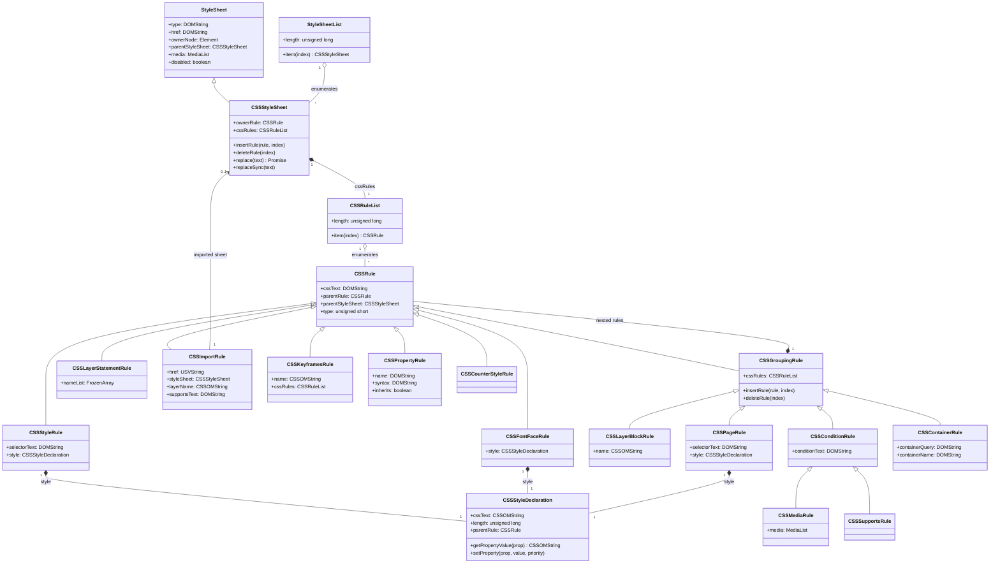
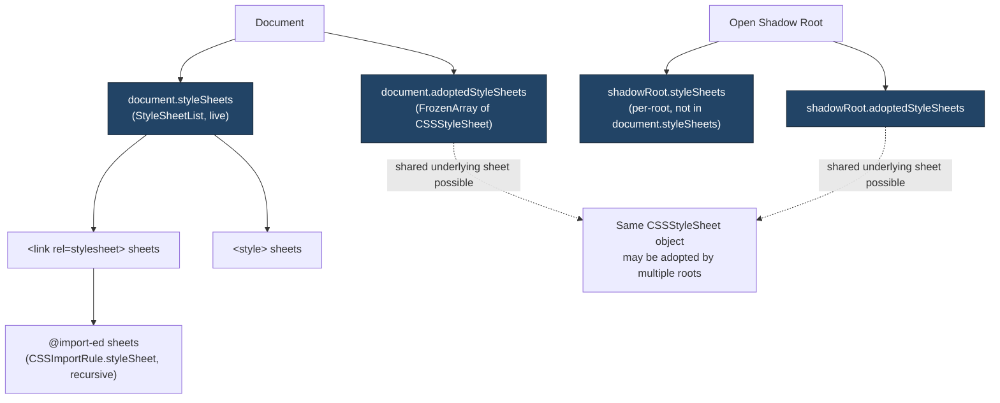
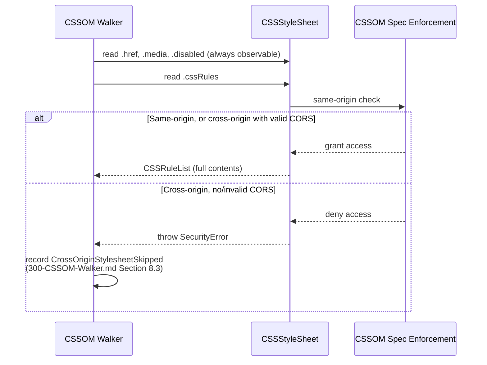

# 000 — CSSOM Specification Reference

## 1. Title

**Critical CSS Extraction Engine — Reference Summary: The CSS Object Model (CSSOM) Specification**

## 2. Version

| Field | Value |
|---|---|
| Document Version | 1.0.0 |
| Status | Accepted |
| Last Updated | 2026-07-09 |
| Owners | Core Architecture Working Group |
| Stability | Stable — this document summarizes an external W3C specification; it is updated only when the referenced specification materially changes or when [300-CSSOM-Walker.md](../design/300-CSSOM-Walker.md)'s implementation surfaces a summarization gap |

## 3. Purpose

This document is a **reference summary** of the W3C CSS Object Model (CSSOM) specification, written for engineers implementing or reviewing this project's browser-facing collection code. It is not a replacement for the specification itself — implementers must consult the normative text at https://www.w3.org/TR/cssom-1/ for edge-case precision — but it exists because every module in `packages/collector` and `packages/matcher` is built directly on top of CSSOM interfaces, and this project's single most important architectural commitment ([ADR-0001-Browser-Is-Source-of-Truth](../adr/ADR-0001-Browser-Is-Source-of-Truth.md)) only makes sense if engineers share a precise, common understanding of what the CSSOM actually guarantees, what it merely happens to do in one engine today, and what it explicitly leaves undefined.

This document exists as `docs/spec/` content — distinct in kind from `docs/design/` content — because it summarizes a specification the engine *depends on but does not implement*, whereas [300-CSSOM-Walker.md](../design/300-CSSOM-Walker.md) specifies *this project's own module* that consumes the CSSOM. The distinction matters: this document has no algorithm to justify, no module boundary to defend, and no tradeoff to argue for — its job is descriptive fidelity to an external standard, and everywhere this document and a `docs/design/` document appear to disagree, the `docs/design/` document's characterization of *this project's* behavior wins, while this document's characterization of *the specification's* behavior wins for questions about what browsers guarantee.

## 4. Audience

- Implementers of the CSSOM Walker ([300-CSSOM-Walker.md](../design/300-CSSOM-Walker.md)) and Stylesheet Loader ([301-Stylesheet-Loader.md](../design/301-Stylesheet-Loader.md)), who need the precise interface hierarchy this document catalogs before writing `page.evaluate()` payloads against it.
- Implementers of the Selector Matcher ([400-Selector-Matching.md](../design/400-Selector-Matching.md)) and Dependency Resolver algorithms ([501-CSS-Variables.md](../algorithms/501-CSS-Variables.md), [502-Keyframes.md](../algorithms/502-Keyframes.md) through [508-Cycle-Detection.md](../algorithms/508-Cycle-Detection.md)), who consume CSSOM objects indirectly through the rule tree and must understand which of their assumptions are specification-guaranteed versus engine-specific.
- Senior engineers reviewing proposed changes to any module that reads `document.styleSheets`, evaluates `CSSRule` subtypes, or interacts with `CSSStyleSheet.insertRule`/`deleteRule`.
- Autonomous coding agents implementing this project from the documentation set, who need a single, load-bearing description of the CSSOM's object graph rather than having to reconstruct it from the specification's own more verbose, IDL-first presentation.

Readers are assumed to have basic familiarity with the DOM (`Document`, `Element`, `Node`) and with CSS itself (selectors, declarations, at-rules) but are not assumed to have read the CSSOM specification text directly — this document's job is precisely to make that unnecessary for the common cases this project touches, while pointing to the specification for everything it does not cover.

## 5. Prerequisites

- [006-Design-Principles.md](../architecture/006-Design-Principles.md) Principle 1 (The Browser Is the Source of Truth) — the architectural commitment this document's summary exists to support; every fact catalogued below is a fact this project reads from the browser rather than re-derives.
- [ADR-0001-Browser-Is-Source-of-Truth](../adr/ADR-0001-Browser-Is-Source-of-Truth.md) — the formal decision record.
- Basic familiarity with IDL (WebIDL) interface notation, since the CSSOM specification and this summary both describe object shapes using it.
- [016-Data-Flow.md](../architecture/016-Data-Flow.md) Section 8.4 — the `CssomRuleList` data-shape contract this project derives from the object model described here.

## 6. Related Documents

- [300-CSSOM-Walker.md](../design/300-CSSOM-Walker.md) — this project's own module for traversing the object model described here; the primary consumer of this document.
- [301-Stylesheet-Loader.md](../design/301-Stylesheet-Loader.md) — stylesheet discovery and load-completion timing, built on `document.styleSheets` and `StyleSheetList`.
- [302-Rule-Tree.md](../design/302-Rule-Tree.md) — this project's internal `RuleNode` envelope, modeled after (but not identical to) the `CSSRule` hierarchy described in Section 8.
- [303-Media-Rules.md](../design/303-Media-Rules.md), [304-Supports-Rules.md](../design/304-Supports-Rules.md), [305-Cascade-Layers.md](../design/305-Cascade-Layers.md), [306-At-Import.md](../design/306-At-Import.md), [307-Constructable-Stylesheets.md](../design/307-Constructable-Stylesheets.md) — sibling design documents specifying type-specific traversal of the at-rule interfaces this document catalogs in Section 8.4.
- [001-CSS-Variables.md](./001-CSS-Variables.md) — the sibling Phase 17 specification summary for CSS Custom Properties, layered conceptually on top of the declaration-block model this document describes.
- [002-Cascade.md](./002-Cascade.md) — the sibling specification summary for the CSS Cascade, which consumes the ordering guarantees this document establishes in Section 8.6.
- [003-Media-Queries.md](./003-Media-Queries.md) — expands on `CSSMediaRule`'s `mediaText` and the `matchMedia()` evaluation model this document introduces only briefly.
- [004-Shadow-DOM.md](./004-Shadow-DOM.md) — expands on the per-shadow-root stylesheet enumeration surface this document flags in Section 8.2 as distinct from `document.styleSheets`.
- [005-Coverage-API.md](./005-Coverage-API.md) — a CDP-level API that operates orthogonally to the CSSOM described here; Section 12 notes the boundary between the two.
- [006-Container-Queries.md](./006-Container-Queries.md) — expands on `CSSContainerRule`, introduced only as a rule-type enumeration entry in Section 8.4 here.
- [007-Nested-CSS.md](./007-Nested-CSS.md) — expands on the selector-flattening behavior this document notes in Section 8.4's `CSSStyleRule` discussion.
- [008-Constructable-Stylesheets.md](./008-Constructable-Stylesheets.md) — expands on the `CSSStyleSheet` constructor and `adoptedStyleSheets` mutation surface this document introduces in Section 8.7.
- [014-Dependency-Graph.md](../architecture/014-Dependency-Graph.md) — the project's dependency graph data model, which is populated by reading declaration values off the objects this document describes.

## 7. Overview

The CSS Object Model is the W3C specification (published in two parts: CSSOM proper, https://www.w3.org/TR/cssom-1/, and CSSOM View Module, https://www.w3.org/TR/cssom-view-1/) that defines the JavaScript-visible object graph a browser exposes for interacting with CSS — both the *stylesheets a document has loaded* (the "stylesheet object model," this document's primary subject) and *the rendered geometry and scrolling behavior of the viewport* (the CSSOM View Module, which this project touches only tangentially, through the Visibility Engine's geometry queries documented in [design/2xx series](../design/200-Visibility-Engine-Overview.md), not through this document).

The stylesheet object model exists to answer one structural question precisely: given that a browser has parsed a page's CSS into an internal representation sufficient to render it, what subset of that internal representation, and in what shape, is exposed back to page script? The specification's answer is a read-and-write object graph rooted at `document.styleSheets`, composed of a small number of interfaces (`StyleSheetList`, `CSSStyleSheet`, `CSSRuleList`, `CSSRule` and its subtypes, `CSSStyleDeclaration`) that mirror — but do not expose the full internal machinery of — the browser's own CSS parser and cascade engine.

Three properties of this object graph dominate every design decision this project makes around it, and each recurs throughout Section 8:

1. **It is a live, browser-parsed representation, not a serialization the engine must re-parse.** `CSSStyleRule.selectorText`, `CSSStyleDeclaration.cssText`, `CSSMediaRule.mediaText` are all getters backed by the browser's own internal parsed form, re-serialized to text on demand. Reading them is cheap, authoritative, and immune to the entire class of bugs a hand-rolled CSS parser could introduce — this is the specification-level fact that makes [ADR-0001-Browser-Is-Source-of-Truth](../adr/ADR-0001-Browser-Is-Source-of-Truth.md) possible to honor at zero cost rather than as a principled-but-expensive constraint.
2. **It is a mutable, live object graph, not an immutable snapshot.** `CSSStyleSheet.insertRule()`/`deleteRule()`, `CSSStyleDeclaration.setProperty()`, and direct assignment to properties like `sheet.disabled` all mutate the actual, rendering-affecting stylesheet state of the live page. This project reads from this graph extensively and, as Section 8.8 discusses at length, deliberately never writes to it during extraction, for reasons specific to this project's correctness requirements rather than any specification-level restriction.
3. **It enforces same-origin content isolation at the object-graph level, not merely at the network level.** A cross-origin, non-CORS `<link>` stylesheet is discoverable (its `href`, its existence in `document.styleSheets`) but its rule contents are not — `CSSStyleSheet.cssRules` throws rather than returning an empty or partial list. This is a deliberate content-isolation boundary (Section 8.5), and this project treats it as authoritative rather than as an obstacle to route around, per [300-CSSOM-Walker.md](../design/300-CSSOM-Walker.md) Section 8.3's extensive discussion.

The remainder of this document catalogs the object hierarchy (Section 8.2–8.4), the `document.styleSheets` entry point and its cross-origin behavior (Section 8.5), the mutation API and why this project never calls it (Section 8.8), and a survey of historical cross-browser divergences engineers should be aware of even though this project's Playwright-mediated, Chromium-first approach ([ADR-0003-Playwright-As-Browser-Abstraction](../adr/ADR-0003-Playwright-As-Browser-Abstraction.md)) insulates most of them.

## 8. Detailed Design

### 8.1 Specification Scope and Versions

The CSSOM specification is maintained by the W3C CSS Working Group as a Living Standard-style document (no versioned "CSSOM 2.0" — the specification is amended in place, similarly to WHATWG-style living standards, though formally still a W3C Recommendation-track document). Two related, but distinct, specification documents matter to this project:

- **CSS Object Model (CSSOM)** — https://www.w3.org/TR/cssom-1/ — defines `StyleSheetList`, `CSSStyleSheet`, `CSSRuleList`, `CSSRule` and its core subtypes, `CSSStyleDeclaration`, and the serialization algorithms (`cssText` getters) that make rule/declaration text observable. This is the primary subject of this document.
- **CSSOM View Module** — https://www.w3.org/TR/cssom-view-1/ — defines viewport geometry (`getBoundingClientRect`, `scrollTo`, `matchMedia`), which this project's Visibility Engine and Media Query evaluation depend on but which is out of scope for this document; see [003-Media-Queries.md](./003-Media-Queries.md) for `matchMedia()` specifically.

Individual at-rule interfaces referenced by CSSOM (`CSSMediaRule`, `CSSSupportsRule`, `CSSFontFaceRule`, `CSSKeyframesRule`, `CSSLayerBlockRule`, `CSSPropertyRule`, `CSSContainerRule`, `CSSCounterStyleRule`) are each actually *defined* in their own respective feature specifications (CSS Conditional Rules, CSS Fonts, CSS Animations, CSS Cascading and Inheritance Level 5 for `@layer`, CSS Properties and Values API for `@property`, CSS Containment for `@container`, CSS Counter Styles) and merely *registered into* the CSSOM's `CSSRule` extension point. This project's rule-type classification algorithm ([300-CSSOM-Walker.md](../design/300-CSSOM-Walker.md) Section 10.2) reflects this reality directly: it is why the algorithm treats `CSSRule.type`'s numeric constant as legacy and `instanceof` checks against each feature specification's own interface as authoritative — the CSSOM specification itself no longer attempts to keep a single central enum synchronized with every feature specification that mints a new rule type.

### 8.2 The Stylesheet Enumeration Entry Points

There are, as of this writing, **three structurally distinct enumeration surfaces** for stylesheets reachable from a document or shadow root, and conflating them is among the most common correctness mistakes an implementer of this project can make:

1. **`document.styleSheets`** (`StyleSheetList`) — a live, read-only, array-like collection of every `CSSStyleSheet` associated with the top-level document via a `<link rel="stylesheet">` or `<style>` element, in document order. This is the surface [300-CSSOM-Walker.md](../design/300-CSSOM-Walker.md) treats as its primary discovery source.
2. **`shadowRoot.styleSheets`** — the equivalent, per-shadow-root enumeration for `<style>` elements authored directly inside an open (and, from privileged contexts only, closed) shadow root. A shadow root's own stylesheets are *not* reachable via `document.styleSheets` at all; they are a structurally separate list, one per shadow root, and a page with many web components may have dozens of these lists, each requiring independent traversal. See [004-Shadow-DOM.md](./004-Shadow-DOM.md) for the full recursive discovery algorithm.
3. **`document.adoptedStyleSheets`** (and `shadowRoot.adoptedStyleSheets`) — an `Array` (not a live `StyleSheetList`) of `CSSStyleSheet` objects constructed via `new CSSStyleSheet()` and explicitly "adopted" by a document or shadow root, sharing the same underlying `CSSStyleSheet` object (and thus the same rules) potentially across *multiple* adopting roots simultaneously. See [008-Constructable-Stylesheets.md](./008-Constructable-Stylesheets.md) for the full semantics, including the single-underlying-sheet-multiple-adopters sharing model.

The specification does not unify these three into one enumeration API — this is a genuine specification-level fragmentation, not an oversight this project's design documents can abstract away entirely. [300-CSSOM-Walker.md](../design/300-CSSOM-Walker.md) Section 12 (Edge Cases) commits to walking all three surfaces explicitly rather than assuming `document.styleSheets` is exhaustive, precisely because the specification itself makes no such exhaustiveness guarantee.

### 8.3 `CSSStyleSheet` — the Per-Sheet Object

A `CSSStyleSheet` is the specification's representation of one stylesheet — whether authored via `<link>`, `<style>`, `@import`, or constructed programmatically. Its IDL-relevant surface, as consumed by this project:

```webidl
interface CSSStyleSheet : StyleSheet {
  readonly attribute CSSRule?      ownerRule;
  readonly attribute CSSRuleList   cssRules;
  unsigned long insertRule(DOMString rule, optional unsigned long index = 0);
  undefined     deleteRule(unsigned long index);
  Promise<CSSStyleSheet> replace(DOMString text);
  undefined     replaceSync(DOMString text);
};

interface StyleSheet {
  readonly attribute DOMString?  type;
  readonly attribute DOMString?  href;
  readonly attribute (Element or ProcessingInstruction)? ownerNode;
  readonly attribute CSSStyleSheet? parentStyleSheet;
  readonly attribute DOMString?  title;
  [SameObject, PutForwards=mediaText] readonly attribute MediaList media;
           attribute boolean     disabled;
};
```

Notable facts this project's `origin` discriminant ([300-CSSOM-Walker.md](../design/300-CSSOM-Walker.md) Section 8.5) depends on:

- `ownerNode` distinguishes `<link>`-authored (`HTMLLinkElement`) from `<style>`-authored (`HTMLStyleElement`) sheets, and is `null` for both `@import`ed sheets (whose parent is instead reachable via `parentStyleSheet`/the owning `CSSImportRule`) and constructable sheets adopted via `adoptedStyleSheets`.
- `href` is the browser's own base-URL-resolved, absolute URL for `<link>` sheets — never the raw, possibly-relative attribute value — which is why [300-CSSOM-Walker.md](../design/300-CSSOM-Walker.md) Section 11 mandates using this getter directly rather than re-resolving the attribute by hand.
- `disabled` is both readable and *writable*; setting it to `true` disables the sheet's contribution to rendering without removing it from `cssRules`'s enumerability, which is exactly the property [300-CSSOM-Walker.md](../design/300-CSSOM-Walker.md) Section 12 exploits to justify walking disabled sheets' rules while still recording their disabled status for the Cascade Resolver to act on.
- `cssRules` is the getter this document's Section 8.5 discusses at length for its same-origin enforcement.
- `insertRule`/`deleteRule`/`replace`/`replaceSync` are the mutation API Section 8.8 discusses and this project never calls during extraction.

### 8.4 The `CSSRule` Hierarchy

`CSSRule` is the specification's base interface for every individual rule reachable inside a stylesheet's (or a grouping rule's) `CSSRuleList`. The hierarchy relevant to this project:

```webidl
interface CSSRule {
  attribute DOMString cssText;
  readonly attribute CSSRule?      parentRule;
  readonly attribute CSSStyleSheet? parentStyleSheet;
  readonly attribute unsigned short type; // legacy numeric enum, see 8.1
};

interface CSSStyleRule : CSSRule {
  attribute DOMString          selectorText;
  [SameObject, PutForwards=cssText] readonly attribute CSSStyleDeclaration style;
};

interface CSSGroupingRule : CSSRule {
  [SameObject] readonly attribute CSSRuleList cssRules;
  unsigned long insertRule(DOMString rule, optional unsigned long index = 0);
  undefined     deleteRule(unsigned long index);
};

interface CSSConditionRule : CSSGroupingRule {
  attribute DOMString conditionText;
};

interface CSSMediaRule : CSSConditionRule {
  [SameObject, PutForwards=mediaText] readonly attribute MediaList media;
};

interface CSSSupportsRule : CSSConditionRule { };

interface CSSLayerBlockRule : CSSGroupingRule {
  readonly attribute CSSOMString name;
};

interface CSSLayerStatementRule : CSSRule {
  readonly attribute FrozenArray<CSSOMString> nameList;
};

interface CSSImportRule : CSSRule {
  readonly attribute USVString    href;
  [SameObject, PutForwards=mediaText] readonly attribute MediaList media;
  readonly attribute CSSStyleSheet? styleSheet;
  readonly attribute CSSOMString? layerName;
  readonly attribute DOMString?   supportsText;
};

interface CSSFontFaceRule : CSSRule {
  [SameObject, PutForwards=cssText] readonly attribute CSSStyleDeclaration style;
};

interface CSSKeyframesRule : CSSRule {
  attribute CSSOMString          name;
  [SameObject] readonly attribute CSSRuleList cssRules;
  undefined   appendRule(CSSOMString rule);
  undefined   deleteRule(CSSOMString select);
  CSSKeyframeRule? findRule(CSSOMString select);
};

interface CSSPageRule : CSSGroupingRule {
  attribute DOMString              selectorText;
  [SameObject, PutForwards=cssText] readonly attribute CSSStyleDeclaration style;
};
```

Several rule types with narrower, feature-specific scope are minted by their own specifications rather than by CSSOM proper: `CSSPropertyRule` (`@property`, CSS Properties and Values API), `CSSCounterStyleRule` (`@counter-style`, CSS Counter Styles), and `CSSContainerRule` (`@container`, CSS Containment Module Level 3) all extend `CSSRule` or `CSSGroupingRule`/`CSSConditionRule` following the same shape conventions. This project's classification algorithm treats all of these uniformly via `instanceof` (per [300-CSSOM-Walker.md](../design/300-CSSOM-Walker.md) Section 10.2) precisely because the specification's own extension model is open-ended — a forward-compatible classifier is not an optional nicety but a structural necessity given how this hierarchy is designed to grow.

**A note on `CSSGroupingRule` versus `CSSConditionRule`.** The specification distinguishes rules that merely *group* other rules structurally (`@layer` blocks, which have no evaluable condition) from rules that group *conditionally* — `@media` and `@supports`, whose nested rules apply only when `conditionText`'s condition currently evaluates true. This distinction is exactly why this project's rule-tree traversal ([300-CSSOM-Walker.md](../design/300-CSSOM-Walker.md) Section 8.2) captures `conditionText` only for `CSSConditionRule` descendants, and why `@media`/`@supports` evaluation is delegated to `window.matchMedia()`/`CSS.supports()` respectively (per [ADR-0002-No-Custom-Selector-Parser](../adr/ADR-0002-No-Custom-Selector-Parser.md)'s extended principle against hand-rolled condition evaluation of any CSS grammar, not merely selectors) rather than to any parsing of `conditionText`'s string value.

### 8.5 `document.styleSheets` and Cross-Origin Access Restrictions

`document.styleSheets` returns every `CSSStyleSheet` associated with the document via `<link>` or `<style>`, in strict document order, **regardless of whether that sheet's contents are actually readable**. This is the specification's deliberate design: *existence* of a stylesheet (its `href`, `media`, `disabled` state, `ownerNode`) is always observable to page script, but *contents* (`cssRules`) are gated by the Cross-Origin Resource Sharing model layered on top of the CSSOM by the HTML specification's own resource-fetching rules, not by CSSOM itself.

Concretely: a `<link rel="stylesheet" href="https://other-origin.example/theme.css">` with no `crossorigin` attribute, or with `crossorigin` set but the response lacking a matching `Access-Control-Allow-Origin` header, produces a fully populated `CSSStyleSheet` object in `document.styleSheets` whose `.cssRules` getter throws a `SecurityError` `DOMException` the instant page script attempts to read it. This is not a bug, not a race condition, and not something that "usually works but sometimes doesn't" — it is unconditional, specification-mandated content isolation, present in every conformant browser engine, and it is the single most consequential access restriction this project's CSSOM Walker must handle, as [300-CSSOM-Walker.md](../design/300-CSSOM-Walker.md) Section 8.3 details exhaustively.

The restriction exists for a content-security reason worth stating precisely: a cross-origin stylesheet's rule text can, in principle, leak information about the responding server's internal state (some historical CSS-based side-channel attacks exploited attribute selectors like `input[value^="a"]` to probe form autofill data cross-origin before this restriction was tightened). The restriction is therefore a deliberate security boundary the specification imposes on *all* page script uniformly — including this project's `page.evaluate()` payload, which executes as ordinary page script from the browser's perspective and receives no special dispensation. [300-CSSOM-Walker.md](../design/300-CSSOM-Walker.md) Section 8.3 explicitly declines to use CDP-level privileged access (`CSS.getStyleSheetText`) to bypass this, on the grounds that doing so would mean the engine "sees" content no real page-rendering computation could have derived from an in-page-readable source.

**CORS-enabled cross-origin sheets are indistinguishable from same-origin sheets.** When `crossorigin="anonymous"` (or `"use-credentials"`) is set on the `<link>` element and the response includes a permissive `Access-Control-Allow-Origin` header, the browser grants full `cssRules` access exactly as for a same-origin sheet — there is no partial or degraded access mode; it is a binary all-or-nothing gate per stylesheet.

### 8.6 Ordering Guarantees

The specification is precise, and this project depends heavily on that precision, about **iteration order**:

- `StyleSheetList` (returned by `document.styleSheets`) iterates in the exact order the corresponding `<link>`/`<style>` elements appear in the document tree — interleaved correctly across element type, per the tree-order definition the DOM specification establishes and CSSOM inherits.
- `CSSRuleList` (returned by `cssRules`, whether at the top level of a sheet or nested inside a `CSSGroupingRule`) iterates in insertion order, which for a parsed (as opposed to programmatically mutated) stylesheet is identical to the rule's order of appearance in the original source text.

This is not an incidental implementation detail — it is the load-bearing guarantee [300-CSSOM-Walker.md](../design/300-CSSOM-Walker.md) Section 8.4 builds its entire `sourceStylesheetIndex`/`sourceRuleIndex` scheme on, and which the Cascade Resolver (per [002-Cascade.md](./002-Cascade.md)) depends on for correct "last rule wins" specificity-tie resolution. Any traversal implementation that reorders rules relative to this guaranteed order — for instance, by collecting them into a `Map` keyed by selector text, or by parallelizing traversal without re-threading results back into source order — silently diverges from the real browser's own cascade computation, which is precisely the class of bug [006-Design-Principles.md](../architecture/006-Design-Principles.md) Principle 5 (Determinism) exists to prevent.

### 8.7 `CSSStyleDeclaration` — the Per-Rule Declaration Block

`CSSStyleRule.style`, `CSSFontFaceRule.style`, and `CSSPageRule.style` all expose a `CSSStyleDeclaration` — the specification's object representation of a rule's `{ property: value; ... }` block:

```webidl
interface CSSStyleDeclaration {
  attribute [LegacyNullToEmptyString] CSSOMString cssText;
  readonly attribute unsigned long length;
  getter CSSOMString item(unsigned long index);
  CSSOMString getPropertyValue(CSSOMString property);
  CSSOMString getPropertyPriority(CSSOMString property);
  undefined setProperty(CSSOMString property, [LegacyNullToEmptyString] CSSOMString value,
                        optional [LegacyNullToEmptyString] CSSOMString priority = "");
  CSSOMString removeProperty(CSSOMString property);
  [SameObject] readonly attribute CSSRule? parentRule;
};
```

This project's Dependency Resolver algorithms ([501-CSS-Variables.md](../algorithms/501-CSS-Variables.md) Section 8.1, and identically-patterned sections of [502](../algorithms/502-Keyframes.md)–[505](../algorithms/505-Counters.md)) read declarations exclusively through `item(index)`/`getPropertyValue()`, never by re-parsing `cssText` as a whole — because `getPropertyValue()` already gives per-declaration granularity without any text-splitting logic, whereas `cssText` is a single serialized string an implementer might otherwise be tempted to tokenize by hand (a direct violation of the "never parse CSS text" discipline [300-CSSOM-Walker.md](../design/300-CSSOM-Walker.md) Section 8.2 establishes for the rule level and this project extends uniformly to the declaration level).

### 8.8 The Mutation API, and Why This Project Never Calls It

`CSSStyleSheet.insertRule()`/`deleteRule()`/`replace()`/`replaceSync()`, `CSSGroupingRule.insertRule()`/`deleteRule()`, `CSSKeyframesRule.appendRule()`/`deleteRule()`, and `CSSStyleDeclaration.setProperty()`/`removeProperty()` collectively constitute the CSSOM's **live mutation surface** — the specification-provided mechanism by which page script can alter, at runtime, the actual stylesheet state the browser uses for rendering, without a full document reload.

**This project reads from every corner of the object graph this document describes, and writes to none of it, during extraction.** This is a deliberate, load-bearing architectural decision, not an oversight, and it is worth stating the reasoning precisely because the mutation API's mere *existence* invites the (incorrect) assumption that a critical CSS extractor might use it — for instance, to programmatically strip non-critical rules from a live page and observe the result, or to inject a candidate critical stylesheet and screenshot-diff against the original.

The reasons this project never mutates the live CSSOM during extraction:

1. **Determinism (per [006-Design-Principles.md](../architecture/006-Design-Principles.md) Principle 5).** A mutation is, by definition, a side effect on shared, observable page state. If the CSSOM Walker or any downstream module called `deleteRule()` while traversal was still in progress — even transiently, even if later reverted — any concurrent read (including the Selector Matcher's `element.matches()` calls, which are themselves evaluated against the live, current cascade) would observe a different, transiently-mutated rule set than a read performed a moment earlier or later. [300-CSSOM-Walker.md](../design/300-CSSOM-Walker.md) Section 8.1 states its traversal "assumes it is invoked... against a CSSOM that is not concurrently mutating" as an explicit precondition; a design that mutates the CSSOM as part of its own traversal would violate its own precondition by construction.
2. **Rendering-fidelity risk.** This project's entire vision ([BRIEF.md](../../BRIEF.md) Section 2.1) is to preserve rendering fidelity relative to the original page. Mutating live stylesheet state to test a hypothesis (e.g., "does the page still render acceptably with only this rule subset applied?") requires either applying the mutation to the *actual* page under test — risking genuinely corrupting the page's rendering state for any other concurrent observation (screenshots, coverage collection, accessibility tree queries) running against the same page — or applying it to a cloned page, which reintroduces exactly the "static re-derivation" risk [ADR-0001-Browser-Is-Source-of-Truth](../adr/ADR-0001-Browser-Is-Source-of-Truth.md) exists to avoid, since a cloned/reconstructed stylesheet state is no longer guaranteed identical to what the original page's own browser-driven parse produced.
3. **The engine's output is a new artifact, not an edited original.** The Serializer (Phase 8, [design/600-Serialization-Overview.md](../design/600-Serialization-Overview.md)) constructs the critical CSS bundle as freshly serialized text from the matched-rule subset the Selector Matcher and Cascade Resolver identify — it does not produce its output by calling `deleteRule()` repeatedly on a cloned sheet until only the critical subset remains and then serializing what's left. Both approaches could, in principle, produce textually identical output; this project chooses the non-mutating path because it composes better with parallel, read-only traversal (Section 8.6's ordering guarantees, and the concurrent DOM/CSSOM collection pattern [300-CSSOM-Walker.md](../design/300-CSSOM-Walker.md) Section 9.3 diagrams) and never risks a partially-mutated intermediate state being observed by a concurrent read.
4. **Testability and auditability.** A purely read-only collection phase can be exhaustively golden-snapshot tested (per [300-CSSOM-Walker.md](../design/300-CSSOM-Walker.md) Section 15) by asserting the exact `RuleNode[]` produced for a fixture, with no dependency on mutation-ordering or rollback correctness. A design that mutates the live CSSOM as part of extraction would need additional tests for "does reverting the mutation correctly restore original state," a whole additional correctness surface this project's architecture avoids entirely by never introducing the mutation in the first place.

The one place a *future*, explicitly-scoped mode might reintroduce controlled mutation is Coverage Mode ([700-Coverage-Mode.md](../design/700-Coverage-Mode.md), [005-Coverage-API.md](./005-Coverage-API.md)) and Visual Diff ([703-Visual-Diff.md](../design/703-Visual-Diff.md)), both of which may operate against a *disposable, cloned* browser context specifically so that any experimental stylesheet toggling (e.g., disabling a candidate-non-critical sheet and screenshotting the result) never touches the page instance the CSSOM Walker itself is concurrently traversing. Even there, the mutation would be scoped to a throwaway context, never applied to the canonical extraction page — see [701-Hybrid-Mode.md](../design/701-Hybrid-Mode.md) for how the two contexts are kept from interfering.

### 8.9 The `MediaList` Interface

`CSSStyleSheet.media` and `CSSMediaRule.media` both expose a `MediaList` — a live, array-like list of the individual comma-separated media-query components of a `media`/`mediaText` attribute string. This project's rule-tree traversal treats `mediaText` as an opaque, browser-serialized string handed untouched to `window.matchMedia()` for evaluation (per Section 8.4's discussion of `CSSConditionRule`), never enumerating `MediaList`'s individual entries for evaluation purposes — see [003-Media-Queries.md](./003-Media-Queries.md) for the full media-query evaluation model this project uses instead.

## 9. Architecture

### 9.1 CSSOM Class Hierarchy



### 9.2 Discovery Surfaces Relative to Document Structure



### 9.3 Cross-Origin Access Decision Flow



## 10. Algorithms

This document summarizes a specification rather than defining project-internal algorithms; the two algorithmic procedures below are the specification's own defined behaviors, included because implementers must replicate their exact semantics when interpreting CSSOM getters — they are not this project's inventions.

### 10.1 Algorithm: Stylesheet Enumeration Order (Specification-Defined)

**Problem statement.** Given a document, determine the order in which `document.styleSheets` exposes stylesheets, since this order is load-bearing for cascade tiebreaking (Section 8.6).

**Inputs.** `document: Document`.

**Outputs.** An ordered sequence of `CSSStyleSheet` objects.

**Pseudocode (specification-defined, not project-authored).**

```text
function enumerateStyleSheets(document) -> CSSStyleSheet[]:
    result = []
    for node in treeOrder(document):     // DOM tree order: depth-first, document order
        if node is HTMLLinkElement and node.rel includes "stylesheet" and node.sheet exists:
            result.append(node.sheet)
        else if node is HTMLStyleElement and node.sheet exists:
            result.append(node.sheet)
        else if node is SVGStyleElement and node.sheet exists:
            result.append(node.sheet)
    return result
```

**Time complexity.** `O(n)` in total DOM node count, since this is conceptually a single tree walk (in practice, browsers maintain this list incrementally as the tree mutates, rather than re-walking on every access, but the specification's behavioral contract is as if freshly computed in tree order).

**Memory complexity.** `O(s)` where `s` is the number of stylesheet-bearing elements.

**Failure cases.** A `<link>` element whose stylesheet failed to load (404, network error, or blocked by CSP) does not contribute a `CSSStyleSheet` to this list at all — `node.sheet` is `null` in that case, not a placeholder empty sheet. This project's Stylesheet Loader ([301-Stylesheet-Loader.md](../design/301-Stylesheet-Loader.md)) is responsible for distinguishing "not yet loaded" from "failed to load" for this reason, since both transiently present as `sheet === null`.

**Optimization opportunities.** None applicable — this is browser-internal behavior this project only observes, never re-implements.

### 10.2 Algorithm: `cssRules` Access Gate (Specification-Defined)

**Problem statement.** Given a `CSSStyleSheet`, determine whether `.cssRules` returns content or throws.

**Inputs.** `sheet: CSSStyleSheet`, `accessingOrigin: Origin` (the origin of the script attempting the read — always the document's own origin for this project's `page.evaluate()` payloads).

**Outputs.** Either a `CSSRuleList`, or a thrown `SecurityError`.

**Pseudocode (specification-defined).**

```text
function getCssRules(sheet, accessingOrigin) -> CSSRuleList:
    if sheet.originClean:
        // originClean is a spec-internal flag set true if:
        //  - the sheet's fetch was same-origin, OR
        //  - the sheet was fetched CORS-enabled with a passing check, OR
        //  - the sheet was constructed via `new CSSStyleSheet()` in-page (always originClean)
        return sheet.rulesList
    else:
        throw SecurityError
```

**Time complexity.** `O(1)` for the gate check itself; the returned `CSSRuleList`'s own enumeration is `O(r)` as discussed in [300-CSSOM-Walker.md](../design/300-CSSOM-Walker.md) Section 10.1.

**Memory complexity.** `O(1)` for the gate check.

**Failure cases.** None beyond the `SecurityError` itself, which is the entire point of the gate — this is by-design behavior, not a failure mode this project needs to work around, only diagnose (per [300-CSSOM-Walker.md](../design/300-CSSOM-Walker.md) Section 8.3).

**Optimization opportunities.** None — a probe-then-catch pattern (attempt the read, catch the exception) is the only correct way to determine accessibility, since the specification provides no separate, side-effect-free "is this sheet accessible" query distinct from actually attempting the read.

## 11. Implementation Notes

- The `CSSOMString` IDL type used throughout the specification's more recent additions (e.g., `CSSLayerBlockRule.name`, `CSSPropertyRule.name`) is simply `DOMString` under a different alias for specification-internal reasons (a migration path toward eventual `USVString` semantics); implementers should treat it identically to `DOMString` for all practical purposes in this project's code.
- `CSSRule.type`'s numeric constants (`CSSRule.STYLE_RULE = 1`, `CSSRule.MEDIA_RULE = 4`, etc.) are marked as **legacy** in the current specification text — newer rule types (`CSSLayerBlockRule`, `CSSPropertyRule`, `CSSContainerRule`) do not receive new numeric constants at all in some engines, which is the specification-level fact underlying [300-CSSOM-Walker.md](../design/300-CSSOM-Walker.md)'s decision to prefer `instanceof` classification (Section 10.2 of that document) over the numeric enum.
- `CSSGroupingRule.insertRule()`/`deleteRule()` operate on the grouping rule's *own* nested `cssRules`, not the top-level stylesheet's — implementers reading the specification's IDL casually can mistake these for the top-level `CSSStyleSheet` methods of the same name; they are structurally distinct methods on distinct interfaces that happen to share names, a specification design choice for API-shape consistency.
- The `MediaList` interface (Section 8.9) supports `appendMedium()`/`deleteMedium()` mutation methods this project never calls, for the same reasons Section 8.8 gives for the mutation API generally.
- Engines differ subtly in whether `sheet.cssRules` and `sheet.rules` (the legacy alias, retained for compatibility with pre-CSSOM-specification Internet Explorer code) are the exact same object reference or merely behaviorally equivalent lists; this project's traversal uses `cssRules` exclusively and never touches the legacy `rules` alias, per [ADR-0003-Playwright-As-Browser-Abstraction](../adr/ADR-0003-Playwright-As-Browser-Abstraction.md)'s Chromium-primary target.

## 12. Edge Cases

- **`sheet.href` for `<style>`-authored sheets is always `null`** — there is no URL for an inline stylesheet; this project's `origin: 'style'` discriminant ([300-CSSOM-Walker.md](../design/300-CSSOM-Walker.md) Section 8.5) exists precisely because downstream diagnostics need a non-URL way to describe such a sheet's provenance (e.g., "inline `<style>` block, document position N").
- **A `<link>` stylesheet still loading at read time** has `node.sheet === null`, not a `CSSStyleSheet` with empty `cssRules` — this project's Stylesheet Loader ([301-Stylesheet-Loader.md](../design/301-Stylesheet-Loader.md)) exists specifically to gate CSSOM Walker invocation until this transient `null` state has resolved one way or the other.
- **Closed shadow roots.** `shadowRoot.styleSheets` is only reachable given a reference to the shadow root itself; a *closed* shadow root's reference is not retained anywhere page script (including this project's `page.evaluate()` payload, which is bound by the same restriction) can obtain it, short of a privileged CDP-level channel this project declines to use for the same reasons given in Section 8.5 for cross-origin sheets — see [004-Shadow-DOM.md](./004-Shadow-DOM.md) Section 8 for the full treatment.
- **`@import` cycles.** The specification does not prevent an author from writing a stylesheet that (directly or transitively) imports itself; browsers detect and break such cycles by refusing to re-import an already-in-progress sheet, but the exact detection mechanism is engine-internal and unspecified in observable-behavior terms beyond "the cycle does not cause an infinite loop or hang." This project's own cycle detection for dependency graphs ([508-Cycle-Detection.md](../algorithms/508-Cycle-Detection.md)) is a separate, project-level concern from this browser-internal one, though the two are conceptually related.
- **Vendor-specific or experimental rule interfaces** not covered by any of the interfaces cataloged in Section 8.4 — the specification's own extension model anticipates this via the generic `CSSRule` base and the `type` escape value; this project's `UNKNOWN_RULE` classification fallback ([300-CSSOM-Walker.md](../design/300-CSSOM-Walker.md) Section 10.2) is the direct project-level response.
- **Constructable stylesheets shared across multiple adopting roots.** A single `CSSStyleSheet` constructed via `new CSSStyleSheet()` may be present in *multiple* documents' or shadow roots' `adoptedStyleSheets` simultaneously (the specification explicitly permits sharing the same sheet object across roots, which is the mechanism enabling efficient cross-component design-system theming). This project's discovery traversal must therefore de-duplicate by the underlying `CSSStyleSheet` object identity, not merely by discovery-path, to avoid double-counting the same rules — see [008-Constructable-Stylesheets.md](./008-Constructable-Stylesheets.md) Section 8 for the full de-duplication algorithm.
- **Nested CSS's effect on `selectorText`.** The specification requires that a `CSSStyleRule` produced by parsing nested CSS syntax (`.card { & .title { ... } }`) expose an already-flattened, fully-resolved `selectorText` (e.g., `.card .title`), not the original nested authoring syntax — this project relies on this flattening being complete and correct per [007-Nested-CSS.md](./007-Nested-CSS.md), never attempting to reconstruct or reinterpret nesting structure itself.
- **`CSSStyleDeclaration.cssText` for a rule with `!important` declarations.** The serialized `cssText` includes the `!important` suffix verbatim on each affected declaration; this project's declaration-reading algorithms treat `!important` as an opaque part of the value/priority pair (readable separately via `getPropertyPriority()`) rather than a syntax feature requiring special parsing, consistent with Section 8.7's discipline.

## 13. Tradeoffs

| Decision | Primary Cost Accepted | Primary Benefit Gained | Chosen Because |
|---|---|---|---|
| Treat CSSOM getters as authoritative, never re-parse `cssText`/`selectorText` | Cannot recover original source formatting/whitespace/comments the browser's serialization discards | Zero risk of parser divergence from the actual browser-computed rule structure | Direct instantiation of [ADR-0001-Browser-Is-Source-of-Truth](../adr/ADR-0001-Browser-Is-Source-of-Truth.md) |
| Never call the CSSOM's mutation API (`insertRule`/`deleteRule`/`setProperty`) during extraction | Forgoes a conceptually simpler "mutate then serialize what's left" implementation strategy | Guarantees read-only, side-effect-free, concurrency-safe traversal; supports parallel DOM/CSSOM collection | Section 8.8's determinism and rendering-fidelity arguments |
| Accept same-origin `cssRules` restriction as-is rather than bypassing via CDP | Cannot extract critical CSS contributed by an inaccessible cross-origin, non-CORS sheet even when it visually matters | Extraction never diverges from what real page script (and thus real end-user rendering computation) can observe | Section 8.5's content-isolation argument, elaborated fully in [300-CSSOM-Walker.md](../design/300-CSSOM-Walker.md) Section 8.3 |
| Treat `CSSRule.type`'s numeric enum as legacy, prefer `instanceof` | Requires per-engine feature-detection guards for newer rule interfaces that may not exist in every target engine | Forward-compatible with new CSS rule types the specification's open extension model continues to mint | Section 8.1's observation that the numeric enum is not kept synchronized with every feature specification |
| Walk all three stylesheet-discovery surfaces (`document.styleSheets`, `shadowRoot.styleSheets`, `adoptedStyleSheets`) explicitly rather than assuming one is exhaustive | More traversal code paths, more discovery-source bookkeeping | Correctness — no silent omission of shadow-scoped or constructable stylesheet content | Section 8.2's observation that the specification itself does not unify these surfaces |

## 14. Performance

- **CPU complexity.** Reading any single CSSOM getter (`selectorText`, `cssText`, `mediaText`) is `O(1)` amortized per the specification's serialization algorithms, though the underlying serialization from the browser's internal parsed form to a string is not free — repeated reads of the same getter without caching the result do repeat this serialization cost, which is why [300-CSSOM-Walker.md](../design/300-CSSOM-Walker.md) Section 8.2 captures each fact exactly once per traversal rather than re-querying it later.
- **Memory complexity.** The live CSSOM itself is memory the browser already retains as part of normal page operation; this project's traversal adds `O(r)` additional memory for its own copied, plain-data `RuleNode` records (per [300-CSSOM-Walker.md](../design/300-CSSOM-Walker.md) Section 10.1), which is unavoidable overhead of the "copy out, never hold a live reference across the `page.evaluate()` boundary" pattern [015-Runtime-Model.md](../architecture/015-Runtime-Model.md) mandates.
- **Caching strategy.** The CSSOM itself is not something this project caches across navigations — a fresh navigation produces a fresh CSSOM the browser parses from scratch. What *is* cached, per [800-Cache-Overview.md](../design/800-Cache-Overview.md), is this project's own derived `CssomRuleList`, keyed by a fingerprint of the underlying CSS asset content, which is a project-level optimization layered entirely on top of, and independent from, whatever internal caching the browser's own CSS parser performs.
- **Parallelization opportunities.** The specification imposes no ordering requirement on *when* different stylesheets' `cssRules` are read relative to each other (only that, once read, their own internal rule order is preserved) — this is what permits [300-CSSOM-Walker.md](../design/300-CSSOM-Walker.md) Section 14's per-frame concurrent dispatch, since distinct `CSSStyleSheet` objects share no mutable state from the reader's perspective during a read-only traversal.
- **Scalability limits.** The specification places no hard limit on stylesheet count, rule count, or declaration count; practical limits are the structured-clone serialization boundary for a `page.evaluate()` return value ([101-Playwright-Adapter.md](../design/101-Playwright-Adapter.md)) and the browser engine's own internal memory limits for extremely large stylesheets, neither of which this document (a specification summary) is positioned to bound further.

## 15. Testing

- **Unit tests.** This document itself is not a code module and has no unit tests; however, any project code asserting a specific CSSOM behavioral claim (e.g., "cross-origin `cssRules` throws `SecurityError`") should have a corresponding fixture-driven test in [300-CSSOM-Walker.md](../design/300-CSSOM-Walker.md)'s test suite, run against a real browser context per [006-Design-Principles.md](../architecture/006-Design-Principles.md) Principle 1 — never against a mocked, spec-shaped stand-in object, since a mock could silently drift from actual browser behavior in exactly the way this document exists to prevent.
- **Integration tests.** Cross-browser-engine conformance checks (Chromium, and to the extent [ADR-0003-Playwright-As-Browser-Abstraction](../adr/ADR-0003-Playwright-As-Browser-Abstraction.md)'s multi-engine ambition extends, WebKit/Gecko via Playwright) verifying that the interface shapes cataloged in Section 8.4 behave identically across engines for the fixture categories in `BRIEF.md` Section 2.15.
- **Visual tests.** Not directly applicable to this specification-summary document; visual regression testing belongs to the modules that consume the CSSOM, not to this reference summary.
- **Stress tests.** N/A at the specification-summary level; see [300-CSSOM-Walker.md](../design/300-CSSOM-Walker.md) Section 15 for the enterprise-huge stylesheet stress test that actually exercises this object model at scale.
- **Regression tests.** Web Platform Tests (WPT)'s own CSSOM conformance suite (https://github.com/web-platform-tests/wpt/tree/master/css/cssom) is the authoritative, externally-maintained regression suite for the specification itself; this project does not maintain its own copy but should track WPT results for the specific interfaces it depends on as an early-warning signal for browser-engine behavioral changes, per [300-CSSOM-Walker.md](../design/300-CSSOM-Walker.md) Section 16's identical suggestion.
- **Benchmark tests.** N/A at this document's level; see [300-CSSOM-Walker.md](../design/300-CSSOM-Walker.md) Section 15 and `docs/performance/005-Benchmarks.md` for project-level CSSOM traversal benchmarks.

## 16. Future Work

- Track the CSS Working Group's ongoing discussion of unifying the three stylesheet-discovery surfaces (Section 8.2) into a single enumeration API, which — should it land — would let [300-CSSOM-Walker.md](../design/300-CSSOM-Walker.md)'s discovery traversal simplify from three explicit code paths to one.
- Monitor whether `CSSRule.type`'s numeric enum is ever formally deprecated (versus merely "not extended further") across all target engines, which would let this project simplify [300-CSSOM-Walker.md](../design/300-CSSOM-Walker.md) Section 10.2's classification to `instanceof`-only with no numeric fallback path at all.
- Watch the CSS Properties and Values API's `@property` and CSS Containment's `@container` specifications for any changes to how their rule interfaces integrate with `CSSGroupingRule`/`CSSConditionRule`, since a re-parenting of either interface in the hierarchy would require a corresponding update to Section 9.1's class diagram and to [300-CSSOM-Walker.md](../design/300-CSSOM-Walker.md)'s `hasNestedRuleList` classification.
- Investigate whether an eventual "trusted cross-origin stylesheet" opt-in mode (flagged as future work in [300-CSSOM-Walker.md](../design/300-CSSOM-Walker.md) Section 16) should be scoped at the CSSOM Walker level or as a distinct, CDP-backed sibling module, given Section 8.5's content-isolation argument against baking it into the default traversal path.
- Consider whether this document should be split into a `Part-2` covering the CSSOM View Module (`getBoundingClientRect`, `scrollTo`, viewport geometry) once the Visibility Engine design documents ([design/200](../design/200-Visibility-Engine-Overview.md)–[207](../design/207-Virtualized-Lists.md)) mature enough to need a dedicated specification-summary cross-reference of their own, rather than the current arrangement where geometry-related CSSOM View Module facts live scattered across those design documents directly.

## 17. References

- [ADR-0001-Browser-Is-Source-of-Truth](../adr/ADR-0001-Browser-Is-Source-of-Truth.md)
- [ADR-0002-No-Custom-Selector-Parser](../adr/ADR-0002-No-Custom-Selector-Parser.md)
- [ADR-0003-Playwright-As-Browser-Abstraction](../adr/ADR-0003-Playwright-As-Browser-Abstraction.md)
- [006-Design-Principles.md](../architecture/006-Design-Principles.md)
- [014-Dependency-Graph.md](../architecture/014-Dependency-Graph.md)
- [015-Runtime-Model.md](../architecture/015-Runtime-Model.md)
- [016-Data-Flow.md](../architecture/016-Data-Flow.md)
- [300-CSSOM-Walker.md](../design/300-CSSOM-Walker.md)
- [301-Stylesheet-Loader.md](../design/301-Stylesheet-Loader.md)
- [302-Rule-Tree.md](../design/302-Rule-Tree.md)
- [303-Media-Rules.md](../design/303-Media-Rules.md)
- [304-Supports-Rules.md](../design/304-Supports-Rules.md)
- [305-Cascade-Layers.md](../design/305-Cascade-Layers.md)
- [306-At-Import.md](../design/306-At-Import.md)
- [307-Constructable-Stylesheets.md](../design/307-Constructable-Stylesheets.md)
- [001-CSS-Variables.md](./001-CSS-Variables.md)
- [002-Cascade.md](./002-Cascade.md)
- [003-Media-Queries.md](./003-Media-Queries.md)
- [004-Shadow-DOM.md](./004-Shadow-DOM.md)
- [005-Coverage-API.md](./005-Coverage-API.md)
- [006-Container-Queries.md](./006-Container-Queries.md)
- [007-Nested-CSS.md](./007-Nested-CSS.md)
- [008-Constructable-Stylesheets.md](./008-Constructable-Stylesheets.md)
- W3C CSS Object Model (CSSOM) — https://www.w3.org/TR/cssom-1/
- W3C CSSOM View Module — https://www.w3.org/TR/cssom-view-1/
- W3C CSS Properties and Values API Level 1 (`@property`, `CSSPropertyRule`) — https://www.w3.org/TR/css-properties-values-api-1/
- W3C CSS Containment Module Level 3 (`@container`, `CSSContainerRule`) — https://www.w3.org/TR/css-contain-3/
- W3C CSS Counter Styles Level 3 (`@counter-style`, `CSSCounterStyleRule`) — https://www.w3.org/TR/css-counter-styles-3/
- W3C CSS Cascading and Inheritance Level 5 (`@layer`, `CSSLayerBlockRule`/`CSSLayerStatementRule`) — https://www.w3.org/TR/css-cascade-5/
- Web Platform Tests, CSSOM conformance suite — https://github.com/web-platform-tests/wpt/tree/master/css/cssom
- [BRIEF.md](../../BRIEF.md) Section 2.1, Section 2.16
