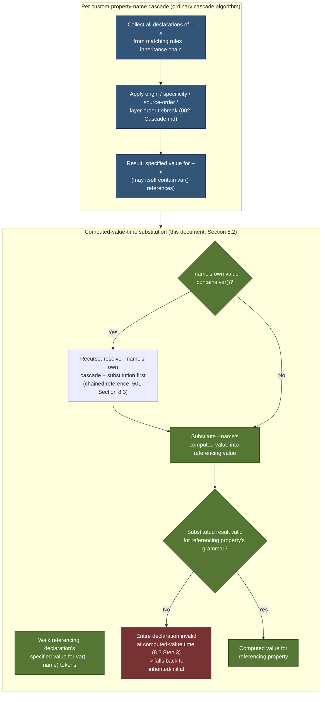
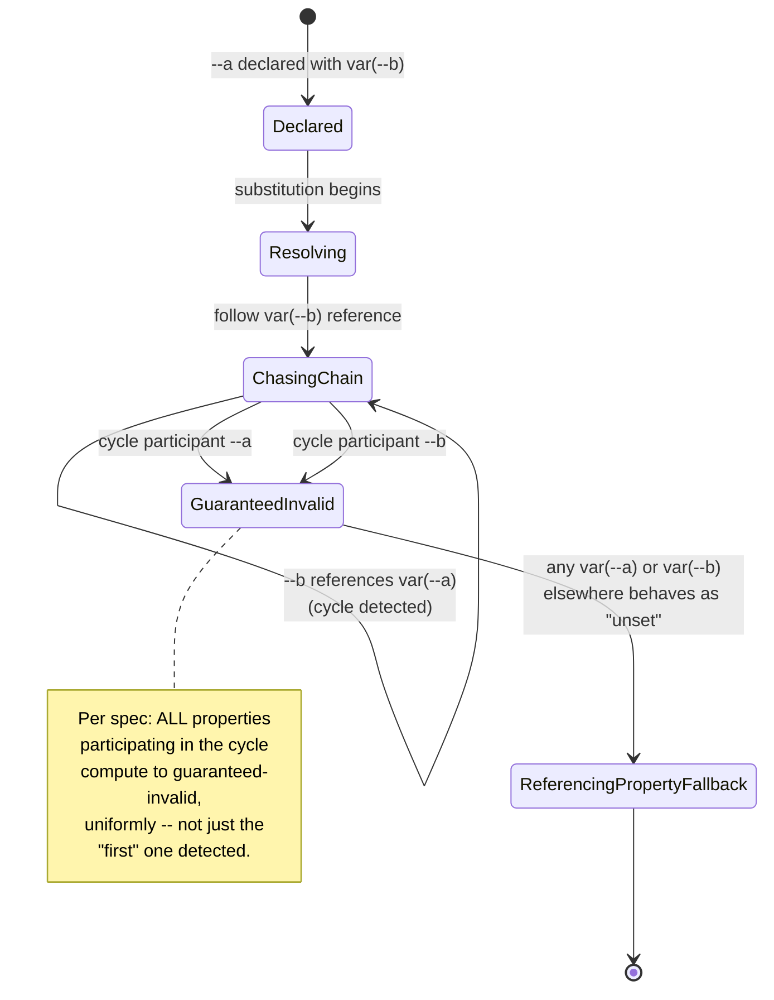
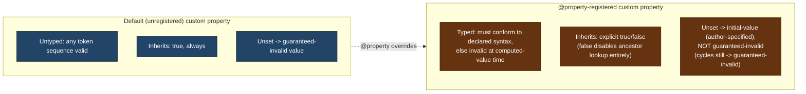

# 001 — CSS Custom Properties for Cascading Variables Specification Reference

## 1. Title

**Critical CSS Extraction Engine — Reference Summary: CSS Custom Properties for Cascading Variables Module Level 1, and the `@property` Extension**

## 2. Version

| Field | Value |
|---|---|
| Document Version | 1.0.0 |
| Status | Accepted |
| Last Updated | 2026-07-09 |
| Owners | Core Architecture Working Group |
| Stability | Stable — this document summarizes external W3C specifications; updated only when those specifications materially change or when [501-CSS-Variables.md](../algorithms/501-CSS-Variables.md)'s implementation surfaces a summarization gap |

## 3. Purpose

This document is a **reference summary** of the W3C CSS Custom Properties for Cascading Variables Module Level 1 specification (https://www.w3.org/TR/css-variables-1/) and its layered extension, the CSS Properties and Values API Level 1 (`@property`, https://www.w3.org/TR/css-properties-values-api-1/), written for engineers implementing or reviewing this project's dependency-resolution code. It exists for the same structural reason [000-CSSOM.md](./000-CSSOM.md) exists: this project's Dependency Resolver ([500-Dependency-Resolution-Overview.md](../design/500-Dependency-Resolution-Overview.md)) and its `Variable`-kind discovery algorithm ([501-CSS-Variables.md](../algorithms/501-CSS-Variables.md)) are built directly on top of custom-property semantics defined by these two specifications, and a shared, precise understanding of what the specification actually guarantees — substitution timing, inheritance, the guaranteed-invalid value, cycle handling, and `@property`'s effect on all of the above — is a prerequisite for correctly implementing or reviewing that algorithm.

Custom properties are, among every CSS feature this project's dependency graph must model, the single richest source of cross-cutting complexity, for a reason this document establishes precisely in Section 8: **custom properties are not resolved lexically** (unlike, say, a font-family reference, which is a comparatively simple string-to-`@font-face`-rule lookup). They cascade and inherit exactly like ordinary CSS properties, which means "what value does `var(--x)` substitute to for this element" is, in the general case, exactly as hard a question as "what value does the `color` property resolve to for this element" — a full cascade computation, not a lookup. This document establishes the specification-level facts that make [501-CSS-Variables.md](../algorithms/501-CSS-Variables.md)'s deliberately narrower, over-inclusive-candidate-set algorithm the only architecturally sound design available to a module that runs *before*, not as part of, full cascade resolution.

## 4. Audience

- Implementers of the `Variable`-kind branch of the Dependency Resolver ([501-CSS-Variables.md](../algorithms/501-CSS-Variables.md)), who need the specification's exact substitution-timing and cycle-handling rules before writing or reviewing discovery code.
- Implementers of [504-At-Property.md](../algorithms/504-At-Property.md), since `@property`'s effect on inheritance and typed-value validity directly changes the base specification's default (untyped, always-inheriting) behavior.
- Implementers of [508-Cycle-Detection.md](../algorithms/508-Cycle-Detection.md), since the specification's own "guaranteed-invalid value" cycle-breaking behavior is the browser-side behavior this project's cycle detection must mirror, not merely detect abstractly.
- Implementers of the Cascade Resolver (Phase 7, forward reference; see [002-Cascade.md](./002-Cascade.md)), who perform the final cascade-winner narrowing this document's Section 8.5 explicitly defers from the Dependency Resolver's scope.
- Senior engineers auditing correctness of dependency resolution for custom-property-heavy design systems (design-token architectures, Tailwind's CSS-variable-based theming, Bootstrap 5's variable maps) — the common, high-stakes case this specification's inheritance model makes structurally hard.

Readers are assumed to be fluent in ordinary CSS cascade concepts (specificity, origin, inheritance, computed values) and in the CSSOM object model summarized in [000-CSSOM.md](./000-CSSOM.md), but are not assumed to have read either underlying W3C specification directly.

## 5. Prerequisites

- [000-CSSOM.md](./000-CSSOM.md) — the object model (`CSSStyleDeclaration`, `getComputedStyle`) this document's substitution and inheritance discussion is expressed in terms of.
- [006-Design-Principles.md](../architecture/006-Design-Principles.md) Principle 1 (Browser Is Source of Truth) and Principle 2 (Never Implement a Custom Selector Parser, extended by clear implication to "never implement a custom cascade resolver") — the architectural commitments this document's Section 8.5 depends on.
- [014-Dependency-Graph.md](../architecture/014-Dependency-Graph.md) Section 8.1 (`Variable` node kind), Section 8.2 (`references`/`inherits-from`/`requires-registration` edge kinds) — the data model this document's semantics populate.
- [500-Dependency-Resolution-Overview.md](../design/500-Dependency-Resolution-Overview.md) — the orchestration loop [501-CSS-Variables.md](../algorithms/501-CSS-Variables.md)'s algorithm plugs into, which this document assumes as context for Section 8.6's cycle discussion.

## 6. Related Documents

- [501-CSS-Variables.md](../algorithms/501-CSS-Variables.md) — this project's own dependency-discovery algorithm, the primary consumer of this document; where this document describes *what the specification guarantees*, that document describes *what this project's algorithm does with that guarantee*.
- [508-Cycle-Detection.md](../algorithms/508-Cycle-Detection.md) — the generic cycle-detection procedure triggered by `references`/`inherits-from` edges this document's Section 8.6 (guaranteed-invalid value) motivates.
- [504-At-Property.md](../algorithms/504-At-Property.md) — the algorithm handling `@property` registration's effect on inheritance and typed-value validity, layered on this document's Section 8.7.
- [000-CSSOM.md](./000-CSSOM.md) — the object model (`CSSStyleDeclaration`) custom property values are read through.
- [002-Cascade.md](./002-Cascade.md) — the sibling specification summary for the CSS Cascade, which performs the final cascade-winner narrowing this document's Section 8.5 explicitly defers.
- [003-Media-Queries.md](./003-Media-Queries.md) — media-conditional custom property declarations (`@media (...) { :root { --x: ...; } }`) compose with this document's substitution model exactly as any other conditional rule does.
- [004-Shadow-DOM.md](./004-Shadow-DOM.md) — custom properties are explicitly exempted from Shadow DOM style encapsulation; Section 8.4 here and that document's Section 8 both describe this from complementary angles.
- [005-Coverage-API.md](./005-Coverage-API.md) — orthogonal; coverage instrumentation observes which *rules* execute, not which custom property substitutions occur, a distinction Section 12 notes.
- [006-Container-Queries.md](./006-Container-Queries.md) — container query conditions may themselves be expressed relative to custom-property-influenced container sizes in advanced cases; noted as a forward-looking interaction in Section 16.
- [007-Nested-CSS.md](./007-Nested-CSS.md) — nested CSS's selector flattening (per [000-CSSOM.md](./000-CSSOM.md) Section 12) has no special interaction with custom property declaration or substitution beyond ordinary selector-scope considerations.
- [008-Constructable-Stylesheets.md](./008-Constructable-Stylesheets.md) — constructable stylesheets adopted into multiple roots may each declare or reference the same custom property name independently; Section 12 notes the scoping implication.
- [014-Dependency-Graph.md](../architecture/014-Dependency-Graph.md) — the project's dependency graph data model this document's semantics populate.

## 7. Overview

The CSS Custom Properties for Cascading Variables Module Level 1 specification defines two closely related but distinct things, and keeping them distinct is essential to correctly reasoning about this project's dependency resolution:

1. **Custom properties** — author-defined properties with names beginning `--` (e.g., `--brand-color`), declared exactly like any other CSS property (`--brand-color: #1a3;`) and participating in the ordinary cascade and inheritance model precisely as if they were a standard, if untyped, CSS property.
2. **The `var()` function** — a value-level substitution mechanism (`color: var(--brand-color);`) that, at a precisely specified point in value computation (Section 8.2), is replaced by the custom property's current value for the element in question, with an optional fallback for when that value is not set.

These two mechanisms are specified separately but designed to work together: without `var()`, a declared custom property has no observable effect on rendering at all (it is inert data attached to an element via the cascade, nothing more); without custom properties, `var()` would have nothing to substitute. This project's dependency graph reflects this two-part structure directly — a `Variable` node ([014-Dependency-Graph.md](../architecture/014-Dependency-Graph.md) Section 8.1) represents one declared custom property at one declaring rule, and a `references` edge ([501-CSS-Variables.md](../algorithms/501-CSS-Variables.md) Section 8.2) represents one `var()` substitution site's dependency on that declaration.

The specification is precise about **when**, in the broader process of computing an element's styles, `var()` substitution occurs: it happens at **computed-value time**, a specific, well-defined stage in the CSS value-processing pipeline (specified value → computed value → used value → actual value) that occurs *after* the cascade has already determined which declaration wins for the *custom property itself*, but *before* the referencing property's own type-specific parsing and validation. This timing has a load-bearing consequence this document returns to repeatedly: **a custom property's own cascade winner must be resolved before any `var()` reference to it can be substituted**, which is precisely why a dependency-discovery algorithm for `var()` references cannot avoid touching cascade-adjacent questions ("which rule's declaration of `--x` applies to this element") even though, per [500-Dependency-Resolution-Overview.md](../design/500-Dependency-Resolution-Overview.md)'s module boundary, it must not attempt to fully answer them.

Three specification-level facts dominate this document and, transitively, [501-CSS-Variables.md](../algorithms/501-CSS-Variables.md)'s entire design:

1. **Custom properties inherit by default, exactly like `color` or `font-family` — unlike most standard CSS properties, which do not inherit by default.** This single fact is why "which rule's declaration of `--x` applies to element E" is not answerable by inspecting only rules matching E — it requires walking E's ancestor chain, exactly as inheritance-based resolution for any inheriting property does.
2. **A cyclic reference (`--a: var(--b); --b: var(--a);`) is defined, precisely, to resolve to the "guaranteed-invalid value" for every custom property participating in the cycle** — not a parse error, not `initial`, not the last non-cyclic value seen, but a specific, spec-named computed-value outcome with its own defined interaction with inheritance and fallback.
3. **`@property` layers optional type-checking and optional non-inheriting behavior on top of an otherwise untyped, always-inheriting default**, and this layering changes both the fallback-triggering conditions (a typed, invalid value triggers the property's `initial-value` rather than being silently accepted as a string) and the inheritance-edge logic this project's dependency graph must apply.

The remainder of this document works through registration and naming syntax (Section 8.1), substitution timing relative to the broader cascade (Section 8.2, with the accompanying Mermaid diagram Section 9.1 promises), inheritance rules (Section 8.3), the guaranteed-invalid value and cycle handling (Section 8.4), fallback semantics (Section 8.5), and the `@property` extension (Section 8.6–8.7).

## 8. Detailed Design

### 8.1 Custom Property Syntax: the `<custom-ident>`-Derived Naming Rule

The specification defines a custom property's name via a dedicated grammar production, not the general `<custom-ident>` production used elsewhere in CSS (though closely related to it): a custom property name is any identifier beginning with two dashes (`--`), case-sensitively distinguished (`--Brand-Color` and `--brand-color` are two different, unrelated properties — unlike most CSS keyword matching, which the specification defines as ASCII case-insensitive), and, notably, an *empty* identifier after the dashes (`--`, with nothing following) is explicitly valid per the grammar, though authoring one is unusual in practice.

The two-dash prefix is not merely a naming convention this project's tooling could choose to ignore — it is the specification's formal discriminant for what constitutes a custom property declaration at parse time. A declaration whose property name does not begin with `--` is parsed as an ordinary (possibly unknown/invalid) property; a declaration whose property name does begin with `--` is parsed with an entirely different, much more permissive grammar for its *value*: **a custom property's declared value, absent an `@property` registration constraining it (Section 8.6), is not validated against any specific value grammar at declaration time at all** — it is retained as an opaque token sequence (the specification calls this a "declaration-value" production), deferring all validation to substitution time, when a `var()` reference attempts to use it in a context that *does* have a specific expected grammar (e.g., `color: var(--x);` expects a `<color>`).

This has a direct, load-bearing consequence for this project's lexical-extraction discipline ([501-CSS-Variables.md](../algorithms/501-CSS-Variables.md) Section 8.1): because an untyped custom property's declared value is not validated against any grammar at declaration time, this project's extraction of `var(--name)` tokens from a value string cannot assume the value "makes sense" in any type-specific way — it is, and must be treated as, an opaque, browser-tokenized-but-not-type-checked value, exactly the reasoning [501-CSS-Variables.md](../algorithms/501-CSS-Variables.md) Section 8.1 gives for why this specific, narrow lexical extraction is compatible with [006-Design-Principles.md](../architecture/006-Design-Principles.md) Principle 2 despite superficially looking like "parsing CSS."

### 8.2 `var()` Substitution Timing Relative to the Cascade

The specification's CSS value-processing model defines four stages a property's value passes through: **specified value** (the literal value after the cascade has chosen a winning declaration, but before any further processing) → **computed value** (after resolving relative units, `inherit`/`initial`/`unset` keywords, and, critically, `var()` substitution) → **used value** (after layout-dependent resolution, e.g., percentages resolved against an actual box size) → **actual value** (after any final rendering-engine rounding/snapping).

**`var()` substitution occurs at computed-value time**, and the specification is precise about the ordering this implies relative to the cascade:

1. The cascade first determines, independently for *each* custom property name referenced (including the custom property being declared with a `var()`-containing value itself, if chained), which declaration wins — using the ordinary cascade algorithm (origin, specificity, source order, and, per [002-Cascade.md](./002-Cascade.md), layer order) exactly as for any other property. This step produces a *specified value* for each custom property, which may itself contain further `var()` references (Section 8.3's chaining case).
2. Substitution then walks each `var()`-containing declaration's specified value, replacing each `var(--name[, fallback])` token with the *computed value* of `--name` on the same element — which, if `--name`'s own specified value itself contained `var()` references, requires those to have already been substituted (i.e., substitution proceeds depth-first / bottom-up through any chain, conceptually — the specification frames this as "used values are substituted," implying full resolution of the referenced custom property before it is substituted into a referencing declaration).
3. The fully-substituted value is then validated against the *referencing* property's actual value grammar (e.g., is the substituted result a valid `<color>` for a `color` declaration). If validation fails, the **entire declaration** (not just the failed substitution) becomes invalid at computed-value time — the specification calls this outcome **"invalid at computed-value time,"** and its handling (falling back to the property's inherited value if it inherits, or its initial value otherwise — the exact rule ordinary CSS uses for any other invalid-at-computed-value-time declaration) is identical to how any other computed-value-time validation failure is handled, custom-property-specific or not.

This ordering — cascade-for-the-custom-property-itself *before* substitution-into-the-referencing-property — is precisely why [501-CSS-Variables.md](../algorithms/501-CSS-Variables.md)'s dependency-discovery algorithm cannot avoid a cascade-adjacent question ("which rule's declaration of `--x` could apply here") even though it explicitly declines to fully answer it (deferring the final narrowing to the Cascade Resolver, per that document's Section 3). The specification's own two-step model — resolve the custom property's cascade, *then* substitute — is the structural reason a dependency-discovery pass positioned *before* full cascade resolution must, at minimum, identify every rule that is a *candidate* winner for step 1, since it cannot yet know, at the point dependency discovery runs, which one the eventual cascade computation will select.

### 8.3 Inheritance

Custom properties, absent an `@property` registration specifying otherwise (Section 8.6), **inherit by default** — a fact the specification states explicitly as a deliberate departure from the inheritance behavior of most standard CSS properties (which mostly do not inherit; `color`, `font-family`, `line-height`, and a handful of others are the well-known exceptions that do inherit by default among standard properties, whereas *all* untyped custom properties inherit by default, with no per-property exception list).

The practical consequence: an element's *value* for a given custom property name is not necessarily declared by any rule matching that element directly — it may instead be the inherited value from the nearest ancestor (in the sense of the cascaded-and-inherited value chain, not merely nearest DOM ancestor with *any* style) whose own cascade computation for that property name produced a value. This is the specification-level fact underlying [501-CSS-Variables.md](../algorithms/501-CSS-Variables.md) Section 8.2's decision to search not just rules matching the referencing element, but rules matching **any ancestor** of that element, via `element.matches()` invoked against the full ancestor-inclusive element set — a direct, mechanical consequence of this inheritance rule, not an independent design choice this project's algorithm invented.

`:root`-scoped custom property declarations (`:root { --brand-color: #1a3; }`) exploit this inheritance rule maximally: because `:root` matches the document's root element, which is trivially an ancestor of every other element in the document, a `:root`-scoped custom property is available for inheritance by every element in the document, absent any closer override — the conventional mechanism by which CSS custom properties implement global design tokens. [501-CSS-Variables.md](../algorithms/501-CSS-Variables.md) Section 8.2 notes this is not special-cased in that algorithm's implementation; it falls out naturally from the same ancestor-matching check applied uniformly to every candidate rule, `:root`-scoped or not.

**Explicit `inherit`/`initial`/`unset`/`revert` keywords apply to custom properties identically to standard properties** — `--x: inherit;` explicitly forces the inherited value even if some other, lower-priority-but-still-cascade-eligible rule also declares `--x`; `--x: initial;` resets to the guaranteed-invalid value (Section 8.4, since an untyped custom property's "initial value" *is* the guaranteed-invalid value absent `@property`); these are ordinary CSS-wide keywords, not custom-property-specific inventions, and this project's declaration-reading logic treats them as opaque literal token sequences requiring no special handling beyond what any CSS-wide keyword requires elsewhere.

### 8.4 The Guaranteed-Invalid Value and Cycle Detection

The specification defines a special computed value, the **guaranteed-invalid value**, as the result when: (a) a custom property is referenced via `var()` but has no declared or inherited value anywhere in its cascade-and-inheritance chain, or (b) — the case most relevant to this project's cycle-detection design — a custom property's value, directly or transitively through chained `var()` references, **depends on itself**, i.e., participates in a reference cycle.

The specification is explicit and precise about cycle handling: **when cyclic dependencies are detected among custom properties, every custom property participating in the cycle computes to its guaranteed-invalid value** — not merely the "first" one detected, not an arbitrary one, but *all* of them, uniformly. This is a deliberate, defined outcome, not an implementation-defined error state: `--a: var(--b); --b: var(--a);` results in both `--a` and `--b` computing to the guaranteed-invalid value for any element where both declarations would otherwise apply, and any `var(--a)` or `var(--b)` reference elsewhere then behaves exactly as if the referenced property were entirely undeclared (triggering that reference's own fallback, if any, or the referencing property's own inherited/initial value per Section 8.2's computed-value-time-invalid handling).

This specification-defined behavior is the browser-side ground truth [508-Cycle-Detection.md](../algorithms/508-Cycle-Detection.md) exists to mirror at the dependency-graph level: this project's cycle detection does not invent its own semantics for "what should happen when a cycle is found" — it detects, in the dependency graph, the same structural condition (`references` edges forming a cycle) the specification defines as triggering the guaranteed-invalid value, and reports it as a distinct diagnostic outcome so the Cascade Resolver and Serializer can correctly omit or flag the cyclic declarations rather than naively including all of them as if they contributed a meaningful value. See [508-Cycle-Detection.md](../algorithms/508-Cycle-Detection.md) Section 8 for the graph-traversal algorithm and [501-CSS-Variables.md](../algorithms/501-CSS-Variables.md) Section 8.3 for how chained references are discovered incrementally (one hop per orchestration-loop iteration) in a way that makes cycles representable in the first place, rather than causing this project's own discovery process to loop forever.

A subtlety the specification is careful about, and which this project's cycle detection must mirror precisely: **cycle detection for guaranteed-invalid-value purposes operates per-element, on the actual chain of values that would apply to that specific element** — it is not simply "is there a cycle anywhere in the stylesheet's custom property declarations in the abstract," because two rules declaring `--a` and `--b` in a way that *would* cycle if both applied to the same element do not actually cycle if they never apply to a shared element (e.g., `--a` declared under `.theme-light` referencing `--b`, and `--b` declared under `.theme-dark` referencing `--a`, where no element ever has both classes). [501-CSS-Variables.md](../algorithms/501-CSS-Variables.md) Section 12's edge case on "cycles spanning multiple selector scopes" and its node-keying-by-`(propertyName, definingSelectorScope)` discipline is the project-level mechanism that keeps this per-element precision representable in the dependency graph rather than collapsing distinct-scope declarations into one node and reporting false-positive cycles.

### 8.5 Fallback Values

`var(--x, fallback)`'s second, comma-separated argument is used **only** when `--x`'s value, at the point of use, is the guaranteed-invalid value (Section 8.4) — not when it is merely "falsy" in a scripting-language sense, since CSS custom properties have no boolean-falsy concept; an empty string, the number `0`, or any other value that a general-purpose programming language might treat as falsy is a perfectly valid, non-invalid custom property value and does **not** trigger the fallback.

The specification permits the fallback expression itself to contain arbitrary CSS value syntax, including further `var()` references (`var(--x, var(--y))`) and function calls (`var(--x, calc(1px + var(--y)))`), with normal parenthesis-nesting rules determining where the fallback expression ends. This is precisely the grammar [501-CSS-Variables.md](../algorithms/501-CSS-Variables.md) Section 10.2's `extractVarReferences` pseudocode implements a depth-aware scan for, and it is why that algorithm must track nested-paren depth explicitly rather than simply splitting on the first comma (a fallback's own nested function calls may themselves contain commas, e.g., `var(--x, rgb(0, 0, 0))`, which a naive first-comma split would incorrectly treat as ending the fallback expression prematurely).

**Whether the primary or fallback branch is actually taken is unknowable to a static (pre-cascade-computation) analysis**, since it depends on whether `--x` resolves to the guaranteed-invalid value for the *specific element* under consideration — a full per-element cascade-and-inheritance question, precisely the class of question [501-CSS-Variables.md](../algorithms/501-CSS-Variables.md) Section 3 has scoped away from the Dependency Resolver's responsibilities. This specification-level unknowability is the direct justification for that document's Section 8.4 decision to retain *both* branches' dependencies as candidates unconditionally, rather than attempting to determine, ahead of time, which branch "actually" applies — any such attempt would require reimplementing exactly the cascade computation the module architecture has deliberately deferred to a later phase.

### 8.6 Substitution Failure and `!important`

A `var()` reference that would produce an invalid computed value for its referencing property (e.g., `color: var(--x);` where `--x` computes to a non-color string, and no valid fallback rescues it) causes the **entire declaration** — not merely the one property — to be treated as invalid at computed-value time, per Section 8.2's step 3. The specification is explicit that this differs from an ordinary CSS parse-time syntax error (which the browser can often detect and reject at parse time, before the declaration is even accepted into the CSSOM at all): a `var()`-involving invalidity is fundamentally a *computed-value-time* phenomenon, meaning the declaration is syntactically well-formed and is accepted into the CSSOM (its `cssText` is readable, its presence in `CSSStyleDeclaration` is unaffected) — the invalidity is only observable once the browser actually computes styles for a specific element, which for this project's `getComputedStyle`-based verification pass ([702-Computed-Style-Mode.md](../design/702-Computed-Style-Mode.md)) means invalidity of this kind can only be discovered by actually querying computed style for a matched element, never by inspecting the CSSOM declaration in isolation.

`!important` on a custom property declaration behaves exactly as `!important` does for any ordinary property with respect to cascade-priority ordering (a `!important` custom property declaration outranks a non-`!important` one from a lower-priority origin/specificity tier per the ordinary cascade rules elaborated in [002-Cascade.md](./002-Cascade.md)) — there is no custom-property-specific interaction with `!important` beyond this.

### 8.7 The `@property` Rule: Typed Registration

The CSS Properties and Values API Level 1 specification defines the `@property` at-rule, which lets an author **register** a custom property name with three declared characteristics, changing its default (untyped, always-inheriting) behavior:

```css
@property --gap {
  syntax: '<length>';
  inherits: false;
  initial-value: 16px;
}
```

- **`syntax`** — a value-grammar string (drawn from a defined, restricted set of syntax component names like `<color>`, `<length>`, `<percentage>`, `<number>`, `<integer>`, `<string>`, custom-ident lists, or the universal `*`) that the property's value must conform to. Once registered with a non-universal syntax, a declaration of that property whose value does not parse as the declared syntax is **invalid at computed-value time** for that specific rule (not merely inert as an untyped custom property's "anything goes" value would otherwise be) — the specification's typed validation is stricter than the untyped default described in Section 8.1.
- **`inherits`** — a required boolean (no default; every `@property` registration must specify it explicitly) that, if `false`, **disables inheritance entirely** for that property name: an element can then only obtain the property's value from a rule that directly, cascade-wins on *that specific element*, or from the registration's own `initial-value`, never from any ancestor's declaration — a direct, specification-mandated override of Section 8.3's inherit-by-default behavior.
- **`initial-value`** — required unless `syntax` is the universal `*`, providing the value used when no declaration and (if `inherits: false`) no ancestor-inherited value applies; this replaces the otherwise-guaranteed-invalid-value default (Section 8.4) with a concrete, author-specified fallback for the *unset* case specifically (this is distinct from, and does not override, the guaranteed-invalid-value outcome for a genuine reference *cycle*, which remains guaranteed-invalid even for a registered, typed property with an `initial-value` — cycles are a different failure mode than "simply never declared").

This registration has two consequences load-bearing for this project's dependency graph, both handled by [504-At-Property.md](../algorithms/504-At-Property.md) and cross-referenced by [501-CSS-Variables.md](../algorithms/501-CSS-Variables.md) Section 8.6:

1. **`inherits: false` eliminates the entire ancestor-matching search** ([501-CSS-Variables.md](../algorithms/501-CSS-Variables.md) Section 8.2's Step 2) for that property name — no `inherits-from` edge is ever emitted for a non-inheriting registered property, since the specification defines that an element can only obtain its value from a directly-matching rule or the registration's own `initial-value`, never from an ancestor.
2. **A registered `syntax` narrows what counts as a *valid* candidate declaration** — a candidate rule whose declared value does not parse under the registered syntax is not a valid cascade winner regardless of specificity or source order (per Section 8.7's typed-invalidity rule), which [504-At-Property.md](../algorithms/504-At-Property.md) can, as a safe narrowing optimization (flagged as future work in [501-CSS-Variables.md](../algorithms/501-CSS-Variables.md) Section 16), use to discard provably-invalid candidates from the over-inclusive candidate set without performing full cascade computation.

**`@property` registration is itself just another CSSOM rule** (`CSSPropertyRule`, per [000-CSSOM.md](./000-CSSOM.md) Section 8.4) discoverable via ordinary CSSOM traversal — this project's Dependency Resolver discovers `AtProperty` graph nodes ([014-Dependency-Graph.md](../architecture/014-Dependency-Graph.md) Section 8.1) by the same rule-tree traversal mechanism as any other rule type, per [504-At-Property.md](../algorithms/504-At-Property.md)'s own algorithm.

**The JavaScript equivalent, `CSS.registerProperty()`**, registers a custom property with identical semantics to `@property` but via a script call rather than a stylesheet rule — a page using `CSS.registerProperty()` produces no corresponding `CSSPropertyRule` anywhere in the CSSOM, since the registration is not stylesheet-authored at all. This is an edge case [504-At-Property.md](../algorithms/504-At-Property.md) must account for by querying registration state via `getComputedStyle`-adjacent introspection or a dedicated browser-side registration query rather than assuming every registration is CSSOM-rule-discoverable — see that document's Edge Cases section for the full treatment; this document notes it here only as the specification-level fact motivating that design.

## 9. Architecture

### 9.1 `var()` Substitution Timing Relative to the Cascade



### 9.2 Guaranteed-Invalid Value: Cycle Outcome



### 9.3 `@property` Layering Over Default Semantics



## 10. Algorithms

This document summarizes specification-defined behavior; the two procedures below describe the specification's own algorithms (substitution and cycle detection as browsers implement them), included so implementers understand precisely what [501-CSS-Variables.md](../algorithms/501-CSS-Variables.md)'s project-level discovery algorithm is designed to safely approximate without reimplementing.

### 10.1 Algorithm: `var()` Substitution (Specification-Defined, Browser-Internal)

**Problem statement.** Given an element's cascaded declarations (including custom properties) and a declaration whose value contains one or more `var()` references, compute the fully-substituted computed value, correctly handling chains and cycles.

**Inputs.** `element`, `declaration` (a property/value pair whose value contains `var()`), the full set of cascaded custom property declarations reachable via cascade + inheritance for `element`.

**Outputs.** The computed value for `declaration`'s property, or "invalid at computed-value time."

**Pseudocode (specification-defined browser behavior, not this project's own algorithm).**

```text
function substituteVar(element, declaration, visiting = new Set()) -> ComputedValue | Invalid:
    value = declaration.specifiedValue
    for each var(name, fallback?) token in value, depth-first:
        if name in visiting:
            // cycle detected: name transitively depends on itself
            return GuaranteedInvalid    // applies to every property in the cycle
        visiting.add(name)

        customPropDecl = resolveCascadeWinner(element, name)   // ordinary cascade algorithm,
                                                                 // out of this function's scope --
                                                                 // see 002-Cascade.md
        if customPropDecl is unset (no declaration, no inherited value):
            if fallback exists:
                substituted = substituteVar(element, fallback, visiting)
            else:
                substituted = GuaranteedInvalid
        else if customPropDecl.value contains var():
            substituted = substituteVar(element, customPropDecl, visiting)   // chained (8.3)
        else:
            substituted = customPropDecl.value

        visiting.remove(name)
        value = replaceToken(value, name, substituted)

    if value does not parse under declaration.property's grammar:
        return Invalid   // entire declaration invalid at computed-value time (8.2 Step 3)
    return value
```

**Time complexity.** `O(c)` per declaration where `c` is the length of the reference chain (bounded in practice, since pathological chains are rare in authored CSS), each hop requiring a cascade-winner resolution that is itself `O(rules matching element or an ancestor)` in the worst case — the specification does not bound this, but real stylesheets keep it small.

**Memory complexity.** `O(c)` for the `visiting` set used for cycle detection, one entry per in-progress hop.

**Failure cases.** Cycle detected (`name in visiting`) is the specification's own defined trigger for the guaranteed-invalid value (Section 8.4) — this is not an error state from the browser's perspective, merely a defined outcome. An unset property with no fallback likewise resolves to guaranteed-invalid, not an error.

**Optimization opportunities.** Real browser engines cache resolved custom property values per element during a single style-recalculation pass, avoiding redundant re-resolution of the same property name referenced from multiple declarations on the same element — an engine-internal optimization this project neither replicates nor needs to, since [501-CSS-Variables.md](../algorithms/501-CSS-Variables.md)'s own discovery algorithm operates at a different granularity (candidate identification, not value computation).

### 10.2 Algorithm: Cycle Detection Among Custom Property Declarations (Specification-Defined Outcome, Project-Level Mirrored in 508-Cycle-Detection.md)

**Problem statement.** Given a set of custom property declarations reachable for a given element (via cascade and inheritance), determine which, if any, participate in a reference cycle, so that the guaranteed-invalid value can be assigned per Section 8.4.

**Inputs.** `customPropertyDeclarations: Map<name, Declaration>` (the cascade-resolved declarations for one element's custom properties, each possibly containing `var()` references to other names in the same map).

**Outputs.** `cyclicNames: Set<name>` — every custom property name participating in at least one cycle.

**Pseudocode (specification-defined outcome; this project's own graph-level mirror lives in [508-Cycle-Detection.md](../algorithms/508-Cycle-Detection.md)).**

```text
function detectCycles(customPropertyDeclarations) -> Set<name>:
    // Standard directed-graph cycle detection (e.g., DFS with recursion-stack tracking),
    // applied to the "references" relation among declared custom property names.
    graph = buildReferenceGraph(customPropertyDeclarations)   // edge name -> referencedName
                                                                // for each var(referencedName) found
    visited = new Set()
    onStack = new Set()
    cyclic = new Set()

    function dfs(name):
        visited.add(name)
        onStack.add(name)
        for referencedName in graph.edgesFrom(name):
            if referencedName in onStack:
                // back edge: name -> ... -> referencedName -> ... -> name is a cycle
                markAllOnStackFrom(referencedName, cyclic)   // every node in the cycle, not just one
            else if referencedName not in visited:
                dfs(referencedName)
        onStack.remove(name)

    for name in customPropertyDeclarations.keys():
        if name not in visited:
            dfs(name)

    return cyclic
```

**Time complexity.** `O(n + e)` where `n` is the number of distinct custom property names reachable for the element and `e` is the number of `references` edges among them — standard DFS-based cycle detection.

**Memory complexity.** `O(n)` for the visited/on-stack sets and recursion stack.

**Failure cases.** None beyond correctly identifying cycles — this is a well-understood graph algorithm; the specification-level subtlety is not the algorithm itself but the scoping (Section 8.4's note that this must run per-element, on the actually-applicable chain, not globally across the whole stylesheet's declarations in the abstract).

**Optimization opportunities.** [501-CSS-Variables.md](../algorithms/501-CSS-Variables.md) Section 8.3 and [508-Cycle-Detection.md](../algorithms/508-Cycle-Detection.md) both note that this project's own graph-level cycle detection runs incrementally, interleaved with discovery (per edge, as it is added), rather than as a single batch pass after full graph construction — because full graph construction may itself not terminate on a cyclic input if attempted as a single unbounded recursive expansion, a distinct concern from the cycle-detection algorithm itself.

## 11. Implementation Notes

- This project's Dependency Resolver never re-implements Section 10.1's substitution algorithm in full — [501-CSS-Variables.md](../algorithms/501-CSS-Variables.md) is explicit that final cascade-winner selection (the `resolveCascadeWinner` call inside Section 10.1's pseudocode) is deferred entirely to the Cascade Resolver; the Dependency Resolver's job is only to ensure every rule that *could* be the winner is discoverable in the graph before that later phase runs.
- The lexical extraction of `var()` tokens (Section 8.5, [501-CSS-Variables.md](../algorithms/501-CSS-Variables.md) Section 10.2) must handle nested function calls in fallback expressions with proper parenthesis-depth tracking — a naive comma-split will misparse `var(--x, rgb(0, 0, 0))` or `var(--x, var(--y, calc(1px + 2px)))`.
- `@property`'s `inherits` field must be checked, per name, **before** this project's ancestor-matching walk ([501-CSS-Variables.md](../algorithms/501-CSS-Variables.md) Section 8.2 Step 2) is performed — performing the (more expensive) ancestor walk first and only afterward discarding results for non-inheriting properties wastes work the `inherits: false` check could have short-circuited entirely.
- `CSS.registerProperty()` registrations (Section 8.7) are invisible to CSSOM stylesheet traversal; implementers of [504-At-Property.md](../algorithms/504-At-Property.md) must query registration state via a dedicated browser-side mechanism (e.g., a `page.evaluate()` call enumerating known-referenced property names against `CSS.registerProperty`'s own introspection surface, or inferring registration indirectly via `getComputedStyle` typed-value behavior) rather than assuming `CSSPropertyRule` traversal alone is exhaustive.
- Case sensitivity (Section 8.1) must be preserved exactly through every stage of this project's pipeline — `--Foo` and `--foo` are different properties, and any code path that normalizes CSS identifier casing elsewhere in this project (none should, per [006-Design-Principles.md](../architecture/006-Design-Principles.md) Principle 2's general anti-normalization stance, but custom properties are the sharpest case where a casing bug would be silently, confusingly wrong) must special-case custom property names as always case-sensitive.

## 12. Edge Cases

- **Cycles spanning multiple selector scopes.** Covered in Section 8.4 and cross-referenced to [501-CSS-Variables.md](../algorithms/501-CSS-Variables.md) Section 12 and [508-Cycle-Detection.md](../algorithms/508-Cycle-Detection.md) Section 12 — cycle detection must be scoped per-element (or, at the graph level, per `(propertyName, definingSelectorScope)` node), not globally, to avoid both false positives (unrelated same-named declarations in disjoint scopes) and false negatives (missing a genuine cross-scope cycle).
- **`var()` inside a custom property's own fallback value that references the same property being declared** — a subtle self-reference variant (`--a: var(--a, red);` on the *same* declaration) which the specification treats identically to any other cycle: `--a` referencing `--a` is a one-node cycle, and computes to guaranteed-invalid per Section 8.4's uniform rule, not to the fallback (`red`), a common point of author confusion this project's diagnostics ([501-CSS-Variables.md](../algorithms/501-CSS-Variables.md), Reporter integration) should surface clearly rather than silently "fixing" by preferring the fallback.
- **`@property`-registered non-inheriting property shadowed by an unregistered same-named declaration in another stylesheet load order** — not possible in practice, since `@property` registration is document-global and singular per name (a second `@property --x { ... }` registration for an already-registered name is either ignored or, per specification nuance, must be identical to not conflict); this project's [504-At-Property.md](../algorithms/504-At-Property.md) treats the first-encountered valid registration as authoritative, consistent with browser behavior.
- **Shadow DOM boundary crossing for inheritance.** Custom properties are explicitly *not* encapsulated by Shadow DOM per specification — an inheriting custom property's value passes through shadow boundaries via the composed tree exactly as it would through ordinary light-DOM ancestry, which is why [501-CSS-Variables.md](../algorithms/501-CSS-Variables.md) Section 10.1's ancestor walk explicitly uses the composed tree (`getRootNode()`/host traversal), not `parentElement` alone — see [004-Shadow-DOM.md](./004-Shadow-DOM.md) Section 8 for the full inheritance-crossing model.
- **Constructable stylesheets adopted into multiple roots, each declaring the same custom property name differently.** Each adopting root's own cascade computation for elements within it is independent — the same underlying `CSSStyleSheet` object being shared across roots (per [008-Constructable-Stylesheets.md](./008-Constructable-Stylesheets.md)) does not imply the custom property's *value* is shared; only the *rule declaring it* is shared, and the cascade computation (including inheritance) still runs independently per element within whichever root it belongs to.
- **`initial-value` interacting with `revert`/`revert-layer`.** `@property`'s `initial-value` (Section 8.7) is used when a property is entirely unset, but an explicit `revert`/`revert-layer` keyword on a declaration reverts to a *previous cascade origin/layer's* value, not necessarily the registration's `initial-value` — this project's declaration-reading logic treats these CSS-wide keywords as opaque literal values requiring no special custom-property-specific handling, consistent with Section 8.3's treatment of `inherit`/`initial`/`unset`.
- **A `var()` reference used inside a media query's `@container` size query or similar non-declaration-value context.** As of this specification's current scope, `var()` substitution is defined only for use within property *declaration values*, not within selector text, media conditions, or (with narrow, evolving exceptions under active specification discussion) container query conditions — this project's algorithm, per Section 8.5 and [501-CSS-Variables.md](../algorithms/501-CSS-Variables.md) Section 8.1, only scans declaration *values*, consistent with this scope limitation; see [006-Container-Queries.md](./006-Container-Queries.md) Section 16 for tracking of the evolving proposal to permit `var()` in container query conditions.

## 13. Tradeoffs

| Decision | Primary Cost Accepted | Primary Benefit Gained | Chosen Because |
|---|---|---|---|
| This document defers all cascade-winner computation to [002-Cascade.md](./002-Cascade.md)/the Cascade Resolver, describing only specification semantics | Readers must consult a second document for the actual winner-selection algorithm this document's substitution timing presupposes | Keeps this specification-summary document strictly descriptive, avoiding duplication of project-specific algorithm documentation | Consistent with this document's stated purpose (Section 3): descriptive fidelity to the external spec, not project algorithm design |
| Treat the guaranteed-invalid value's cycle-triggering condition as authoritative and mirror it exactly in [508-Cycle-Detection.md](../algorithms/508-Cycle-Detection.md) rather than inventing a project-specific cycle-handling policy | Project-level cycle detection must replicate a subtle, per-element-scoped browser behavior rather than a simpler global graph check | Guarantees the project's diagnosed cyclic declarations correspond exactly to what the browser itself would treat as cyclic — no false positives/negatives relative to actual rendering | [006-Design-Principles.md](../architecture/006-Design-Principles.md) Principle 1: browser is the source of truth, including for this failure mode |
| Document `@property`'s layering as changes-on-top-of-defaults rather than as a wholly separate model | Requires readers to hold both the default and registered behaviors in mind simultaneously, cross-referencing which parts of Section 8.3/8.4 a given registration overrides | Mirrors how the specification itself frames `@property` — an incremental extension, not a parallel system — keeping this document's mental model aligned with the spec's own | The specification's `@property` proposal was explicitly designed as backward-compatible layering, not a competing custom-property model |

## 14. Performance

- **CPU complexity.** Substitution itself (Section 10.1) is a browser-internal cost this project never re-implements; this project's own cost is entirely in [501-CSS-Variables.md](../algorithms/501-CSS-Variables.md)'s candidate-discovery algorithm, which Section 10.1 of that document shows is effectively `O(1)` per `var()` reference given small, bounded candidate-rule and ancestor-set sizes.
- **Memory complexity.** Negligible at the specification-summary level; see [501-CSS-Variables.md](../algorithms/501-CSS-Variables.md) Section 14 for the project's own memory analysis of its candidate-discovery data structures.
- **Caching strategy.** The specification does not mandate any particular caching strategy for browsers (though all production engines cache computed custom property values per style-recalculation pass, an implementation detail outside specification scope); this project's own caching of the `rulesDeclaringCustomProperty` index (per [501-CSS-Variables.md](../algorithms/501-CSS-Variables.md) Section 11) is a project-level optimization independent of, though motivated by, the specification's inheritance-heavy resolution cost.
- **Parallelization opportunities.** N/A at the specification-summary level.
- **Incremental execution.** N/A at the specification-summary level; see [501-CSS-Variables.md](../algorithms/501-CSS-Variables.md) Section 14 for project-level incremental execution discussion (cost scales with reference count, not stylesheet declaration volume).
- **Scalability limits.** The specification places no hard limit on `var()` chain depth or fan-out; pathologically deep or wide custom-property graphs are, per [501-CSS-Variables.md](../algorithms/501-CSS-Variables.md) Section 14, bounded in this project by the orchestration loop's own resolution budget, not by anything specification-mandated.

## 15. Testing

- **Unit tests.** N/A directly for this specification-summary document; see [501-CSS-Variables.md](../algorithms/501-CSS-Variables.md) Section 15 for the project's own unit test catalog (lexical extraction edge cases, fallback nesting).
- **Integration tests.** Fixtures verifying this project's algorithm correctly mirrors specification-defined outcomes: a genuine two-property cycle producing guaranteed-invalid (verifying both `--a` and `--b` are flagged, not just one), a cross-scope non-cycle (two same-named declarations in disjoint scopes, verifying no false-positive cycle), a `@property inherits: false` case verifying no `inherits-from` edge, a `@property` with a typed `syntax` and an invalid declared value (verifying the candidate is still discovered per Section 8.7's "candidate regardless of eventual validity" policy).
- **Visual tests.** Rendering-parity checks on themed components using chained custom properties, per [501-CSS-Variables.md](../algorithms/501-CSS-Variables.md) Section 15's identical guidance — a missed dependency in this project's discovery manifests as a visibly wrong computed style in critical-CSS-only rendering, an effective end-to-end oracle.
- **Stress tests.** See [501-CSS-Variables.md](../algorithms/501-CSS-Variables.md) Section 15 for the project's deep-chain and wide-fan-out stress fixtures, which directly exercise this document's Section 8.3 chaining and Section 8.4 cycle-handling semantics at scale.
- **Regression tests.** Web Platform Tests' CSS Custom Properties conformance suite (https://github.com/web-platform-tests/wpt/tree/master/css/css-variables) and Properties and Values API suite (https://github.com/web-platform-tests/wpt/tree/master/css/css-properties-values-api) are the authoritative external regression suites for the specification itself; this project should track relevant subsets as an early-warning signal for engine behavioral drift, per [000-CSSOM.md](./000-CSSOM.md) Section 15's identical recommendation for CSSOM conformance.
- **Benchmark tests.** See [501-CSS-Variables.md](../algorithms/501-CSS-Variables.md) Section 15 for batched-versus-naive `element.matches()` timing benchmarks on design-token-heavy fixtures.

## 16. Future Work

- Track the CSS Working Group's evolving discussion of permitting `var()` substitution in additional non-declaration-value contexts (container query conditions, media query conditions under certain proposals) — noted in Section 12 — which would require extending [501-CSS-Variables.md](../algorithms/501-CSS-Variables.md)'s lexical extraction scope beyond declaration values if and when such proposals reach Candidate Recommendation status.
- Monitor `@property`'s `syntax` grammar for additions of new component value types, which would expand the set of type-checkable candidate-narrowing opportunities flagged as future work in [501-CSS-Variables.md](../algorithms/501-CSS-Variables.md) Section 16.
- Investigate whether a future specification revision formalizes `CSS.registerProperty()` discoverability via a dedicated CSSOM-visible enumeration (rather than requiring the introspection workaround Section 8.7 and [504-At-Property.md](../algorithms/504-At-Property.md) currently need), which would simplify that algorithm's registration-discovery logic considerably.
- Research whether `@scope`'s eventual stabilization (tracked identically in [501-CSS-Variables.md](../algorithms/501-CSS-Variables.md) Section 16) changes the guaranteed-invalid-value cycle-scoping model (Section 8.4) in any way that would require revisiting this document's per-element cycle-scoping description.
- Consider whether a future `Part-2` of this document is warranted once `@property`'s interaction with View Transitions or Scroll-Driven Animations (both currently deferred per [014-Dependency-Graph.md](../architecture/014-Dependency-Graph.md)'s own deferral) matures enough to require dedicated specification-summary treatment of custom-property-driven animation interpolation, a currently out-of-scope but plausible future extraction concern.

## 17. References

- [000-CSSOM.md](./000-CSSOM.md)
- [002-Cascade.md](./002-Cascade.md)
- [003-Media-Queries.md](./003-Media-Queries.md)
- [004-Shadow-DOM.md](./004-Shadow-DOM.md)
- [005-Coverage-API.md](./005-Coverage-API.md)
- [006-Container-Queries.md](./006-Container-Queries.md)
- [007-Nested-CSS.md](./007-Nested-CSS.md)
- [008-Constructable-Stylesheets.md](./008-Constructable-Stylesheets.md)
- [500-Dependency-Resolution-Overview.md](../design/500-Dependency-Resolution-Overview.md)
- [501-CSS-Variables.md](../algorithms/501-CSS-Variables.md)
- [504-At-Property.md](../algorithms/504-At-Property.md)
- [508-Cycle-Detection.md](../algorithms/508-Cycle-Detection.md)
- [014-Dependency-Graph.md](../architecture/014-Dependency-Graph.md)
- [006-Design-Principles.md](../architecture/006-Design-Principles.md) — Principle 1, Principle 2
- [ADR-0001-Browser-Is-Source-of-Truth](../adr/ADR-0001-Browser-Is-Source-of-Truth.md)
- W3C CSS Custom Properties for Cascading Variables Module Level 1 — https://www.w3.org/TR/css-variables-1/
- W3C CSS Properties and Values API Level 1 — https://www.w3.org/TR/css-properties-values-api-1/
- W3C CSS Cascading and Inheritance Level 5 — https://www.w3.org/TR/css-cascade-5/
- Web Platform Tests, CSS Custom Properties conformance suite — https://github.com/web-platform-tests/wpt/tree/master/css/css-variables
- Web Platform Tests, Properties and Values API conformance suite — https://github.com/web-platform-tests/wpt/tree/master/css/css-properties-values-api
- [BRIEF.md](../../BRIEF.md) Section 2.5, Section 2.4
