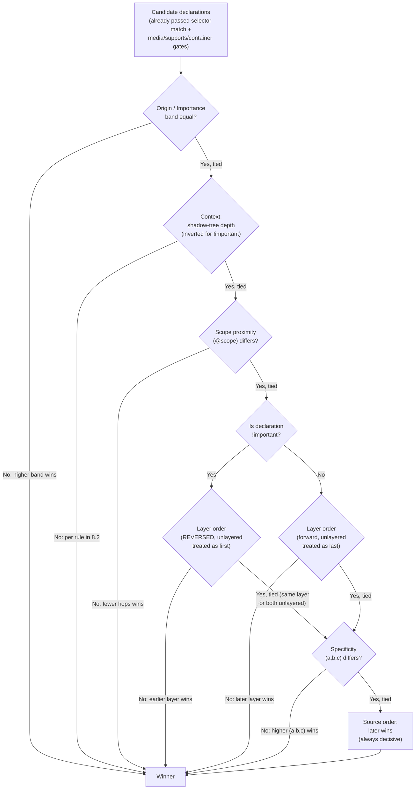

# 002 — Cascade

## 1. Title

**Critical CSS Extraction Engine — CSS Cascading and Inheritance Level 5: Reference Summary and Engine Implications**

## 2. Version

| Field | Value |
|---|---|
| Document Version | 1.0.0 |
| Status | Draft — Phase 17 (Browser Specifications) |
| Last Updated | 2026-07-10 |
| Owners | Core Architecture Working Group |
| Stability | Cascade sort order is stable per spec; engine-side "defer to browser" posture is foundational and not expected to change |

## 3. Purpose

This document is a reference summary of the **CSS Cascading and Inheritance Level 5** specification (with forward notes on Level 6 where relevant, e.g. `@scope` proximity), written for engineers building and maintaining the Critical CSS Extraction Engine. It is not a copy of the specification and does not attempt to be normative — the W3C specification remains the single source of truth for edge-case behavior. Its purpose is narrower and more operational: to state, in one place, exactly which parts of the cascade algorithm the engine must reason about statically (during CSSOM traversal and rule capture), which parts it must delegate to the browser at runtime, and why that split exists.

The engine's foundational commitment — stated in [ADR-0001-Browser-Is-Source-of-Truth](../adr/ADR-0001-Browser-Is-Source-of-Truth.md) and elaborated in [006-Design-Principles.md](../architecture/006-Design-Principles.md) — is that **the engine never re-implements a browser sub-language's grammar or semantics if the browser can be asked directly.** The cascade algorithm is the single most consequential place this principle is tested, because unlike selector matching (`Element.matches()`) or media query evaluation (`window.matchMedia()`), there is **no single browser API that returns "the winning declaration for property P on element E."** The browser computes cascade winners internally as part of style resolution and exposes only the *result* (via `getComputedStyle()`), never the *algorithm's intermediate steps* as a callable primitive. This forces the engine into a more nuanced position than "always delegate": it must understand the cascade algorithm well enough to reason about which *rules* are candidates for retention, while still relying on the browser's `getComputedStyle()` and rendering pipeline as the ground truth for which candidate rule actually painted a given pixel.

This document exists to make that nuance precise, so that every downstream design document — the Cascade Resolver, the Serializer, the Dependency Resolver's layer/media-conditioned edges — shares one unambiguous mental model of the cascade and one unambiguous statement of what the engine computes itself versus what it asks the browser to confirm.

## 4. Audience

- Implementers of the Cascade Resolver (`packages/matcher` or a dedicated cascade module; see [014-Dependency-Graph.md](../architecture/014-Dependency-Graph.md) for where cascade-adjacent metadata is tracked today), who must rank candidate declarations for retention decisions.
- Implementers of the CSSOM Walker ([300-CSSOM-Walker.md](../design/300-CSSOM-Walker.md)) and Rule Tree ([302-Rule-Tree.md](../design/302-Rule-Tree.md)), whose captured metadata (origin, layer, source order, specificity) is the raw input the cascade algorithm consumes.
- Implementers of the Serializer, who must emit output CSS in an order that — combined with the browser's own cascade computation at the consumer's render time — reproduces the original page's visual result.
- Senior engineers reviewing whether a proposed optimization ("we can skip retaining rule X because rule Y always wins") is actually cascade-sound, or is a plausible-looking shortcut that breaks under `!important`, layer reordering, or `@scope` proximity.

Readers are assumed to be senior engineers with working familiarity with CSS specificity, the cascade origins (user agent, user, author), and at least passing awareness of cascade layers and `@scope`. This document does not re-teach specificity arithmetic from first principles but does restate it precisely enough to be self-contained for the engine's purposes.

## 5. Prerequisites

- [006-Design-Principles.md](../architecture/006-Design-Principles.md) — Principle 1 (Browser Is Source of Truth) and Principle 5 (Determinism of Output), both directly governing this document's posture.
- [ADR-0001-Browser-Is-Source-of-Truth](../adr/ADR-0001-Browser-Is-Source-of-Truth.md).
- [ADR-0002-No-Custom-Selector-Parser](../adr/ADR-0002-No-Custom-Selector-Parser.md) — the sibling non-interpretation commitment for selector grammar, whose reasoning this document extends to cascade-sort grammar.
- Familiarity with [305-Cascade-Layers.md](../design/305-Cascade-Layers.md) — cascade layer capture and ordering bookkeeping, a direct input to the cascade sort this document describes.
- Familiarity with [303-Media-Rules.md](../design/303-Media-Rules.md) — media-conditioned rules are cascade candidates only when applicable per viewport; this document assumes that applicability filtering has already happened before cascade sort begins.
- Working knowledge of CSS specificity calculation (id/class/type selector counting) and the CSS Cascading and Inheritance Level 5 specification's defined sort keys.

## 6. Related Documents

- [305-Cascade-Layers.md](../design/305-Cascade-Layers.md) — cascade layer capture and declaration/usage order bookkeeping; this document's §7/§8 consume that bookkeeping as one sort key.
- [303-Media-Rules.md](../design/303-Media-Rules.md) — per-viewport media applicability filtering that gates which rules are even cascade candidates.
- [000-CSSOM.md](./000-CSSOM.md) — CSSOM traversal fundamentals that produce the rule records this document's algorithm sorts.
- [001-CSS-Variables.md](./001-CSS-Variables.md) — custom property resolution, which has its own cascade-adjacent but distinct resolution model (custom properties do not "win" via specificity in the same way as regular properties when consumed via `var()`, since substitution happens at computed-value time).
- [004-Shadow-DOM.md](./004-Shadow-DOM.md) — shadow tree encapsulation interacts with cascade scoping (`::part()`, `:host`) and is a forward-reference for how the cascade algorithm's "context" axis (Section 7.2 below) extends across shadow boundaries.
- [005-Coverage-API.md](./005-Coverage-API.md) — the Coverage extraction strategy observes *which rules the browser actually applied*, an empirical cross-check against this document's static cascade-candidate reasoning.
- [006-Container-Queries.md](./006-Container-Queries.md) — `@container` is, like `@media`, an applicability gate that must resolve before cascade sort; container-conditioned rules follow the same "filter first, sort second" pattern as media-conditioned rules.
- [007-Nested-CSS.md](./007-Nested-CSS.md) — CSS nesting desugars to flat selectors with specificity computed via `:is()` semantics for the nesting selector; this affects the specificity sort key but not the overall algorithm.
- [008-Constructable-Stylesheets.md](./008-Constructable-Stylesheets.md) — adopted stylesheets participate in the same cascade as document stylesheets but have their own layer-ordering scope, relevant to the layer-order sort key.
- [014-Dependency-Graph.md](../architecture/014-Dependency-Graph.md) — dependency graph node/edge kinds for cascade-relevant conditioning (layers, media).
- [ADR-0001-Browser-Is-Source-of-Truth](../adr/ADR-0001-Browser-Is-Source-of-Truth.md), [ADR-0002-No-Custom-Selector-Parser](../adr/ADR-0002-No-Custom-Selector-Parser.md).

## 7. Overview

The CSS cascade is the algorithm that, for a given element and a given CSS property, selects exactly one declaration from among all declarations that apply to that element for that property, across all stylesheets, all origins, and all cascade layers. CSS Cascading and Inheritance Level 5 defines this as a strict, fully-ordered sort: every applicable declaration is a candidate, and the candidates are sorted by a sequence of keys, most significant first, until a unique winner is determined (ties at every level are structurally impossible once source order is reached, since two declarations cannot occupy the same source position).

### 7.1 The four inputs "applicability" already assumes

Before cascade sort begins, a declaration must already have cleared three independent applicability gates, each governed by its own specification and its own engine document:

1. **Selector matching** — the element must match the rule's selector (`Element.matches()`, delegated per [ADR-0002](../adr/ADR-0002-No-Custom-Selector-Parser.md)).
2. **Conditional-rule applicability** — any enclosing `@media` ([303-Media-Rules.md](../design/303-Media-Rules.md)), `@supports`, or `@container` ([006-Container-Queries.md](./006-Container-Queries.md)) condition must evaluate true for the current viewport/environment.
3. **Scoping proximity** (Level 6, `@scope`) — the element must fall within the scope's donor/limit boundaries, and if multiple `@scope` blocks match, proximity (not specificity) breaks ties *before* the main cascade sort even considers specificity — `@scope` proximity is inserted into the sort key sequence between layer order and specificity, per the Level 5/6 draft ordering.

Only declarations that clear all three gates become *cascade candidates*. The cascade sort proper — the subject of this document — operates exclusively on that already-filtered candidate set.

### 7.2 The full sort key sequence

For a set of cascade candidates targeting the same element and property, CSS Cascading and Inheritance Level 5 defines the winner as the result of sorting by the following keys, in this exact precedence order (each key breaks ties only among candidates still tied on all preceding keys):

1. **Origin and importance** (combined into one axis — see §8.1 for why these are one axis, not two)
2. **Context** — normal author declarations inside vs. outside a shadow tree; specifically, for `!important` declarations the *outer* (lighter) tree wins, and for normal declarations the *inner* (host-nested) tree wins — the inverse relationship is intentional (§8.2)
3. **Scoping proximity** (`@scope`) — fewer ancestor hops between the scoping root and the element wins; unscoped declarations are treated as having "no proximity" and lose to any scoped declaration at the same origin/importance tier
4. **Cascade layer order** — declarations in a layer declared/used later win over earlier layers; unlayered author declarations are treated as an implicit final layer that wins over all named/anonymous author layers (§8.3, and see the importance-reversal caveat in §9)
5. **Specificity** — the familiar (id-count, class/attribute/pseudo-class-count, type/pseudo-element-count) triple, compared lexicographically
6. **Order of appearance** — later in the (concatenated, in-order) source wins; this is the final, always-decisive tiebreaker, since two declarations can never share the exact same source position

Inheritance is a distinct, prior mechanism (§10) that supplies a property's *specified value* when no cascade candidate exists at all for that element/property pair — inheritance is not itself a cascade tiebreaker, it is what happens when the candidate set is empty.

### 7.3 Why this matters for a critical CSS engine specifically

A critical CSS engine's core obligation is to retain *every rule that could possibly win the cascade for at least one in-scope element*, and to discard rules that provably cannot. Getting the cascade sort wrong in the conservative direction (retaining too much) merely bloats output; getting it wrong in the aggressive direction (discarding a rule that actually wins) produces a visually broken page — a strictly worse failure mode. Sections 8–11 below make precise which parts of this six-key sort the engine reasons about statically during rule capture (origin, layer membership, source order, specificity — all directly observable from the CSSOM) and which part it cannot fully reason about without runtime confirmation (final computed-style verification via `getComputedStyle()`, used as a correctness cross-check, not as the primary retention mechanism — see §11).

## 8. Detailed Design

### 8.1 Origin and importance as one combined axis

A common misconception is that "origin" and "`!important`" are two separate sort keys. The specification actually defines six *origin-and-importance bands*, ordered from lowest to highest cascade priority:

1. User-agent normal declarations
2. User normal declarations
3. Author normal declarations (includes author cascade layers, in layer order — see §8.3)
4. Animations (CSS Animations, a distinct pseudo-origin ranking above author-normal)
5. Author `!important` declarations (author layers reversed — see §9)
6. User `!important` declarations
7. User-agent `!important` declarations
8. Transitions (CSS Transitions, ranking above everything, including user-agent `!important`)

(The canonical Level 5 list has eight bands when animations and transitions are included; the "six-band" folk description omits them. The engine's Cascade Resolver must model all eight, since animation- and transition-generated declarations are real cascade candidates the CSSOM Walker will encounter via `CSSKeyframesRule`/`CSSKeyframeRule` traversal and via the Web Animations API's computed effect stack.)

**Why the engine must capture origin explicitly.** The CSSOM does not tag individual `CSSStyleRule` instances with an origin flag directly — origin is a property of the *stylesheet* (`document.styleSheets` vs. user-agent default stylesheets, which are not enumerable via `document.styleSheets` at all) and, for `!important`, a property of the individual declaration (`CSSStyleDeclaration.getPropertyPriority(prop) === 'important'`). Because user-agent default styles are invisible to `document.styleSheets` enumeration, the engine's Rule Tree ([302-Rule-Tree.md](../design/302-Rule-Tree.md)) only ever captures **author-origin** rules directly — user-agent and user-origin declarations are cascade candidates the engine cannot enumerate statically at all, and are instead accounted for implicitly through `getComputedStyle()`'s already-cascaded output when the engine needs a baseline (e.g., to detect whether an author rule is redundant with a UA default — an optimization explicitly out of scope for the MVP per [BRIEF.md §2.14](../../BRIEF.md)).

This has a direct, important consequence: **the engine's cascade reasoning is only ever comparing author-origin candidates against each other.** Cross-origin comparisons (author vs. user vs. UA) are never something the engine computes — they are already baked into the browser's `getComputedStyle()` result the engine may consult for verification, and the engine never needs to decide "does this author rule beat the UA default," because retaining an author rule that turns out to be redundant with a UA default is merely a (harmless, conservative) missed micro-optimization, not a correctness bug.

### 8.2 Context (shadow-inclusive trees) and the importance inversion

CSS Cascading and Inheritance Level 5 introduces "context" as a cascade sort key to resolve competition between a shadow host's outer-tree styles and the shadow tree's own inner styles (e.g., via `::part()` from outside, vs. a rule inside the shadow tree targeting the same part). The rule is deliberately asymmetric:

- For **normal-importance** declarations, the shadow tree that is *more deeply nested* (closer to the element, i.e. the shadow tree the element is actually inside) wins. This matches encapsulation intuition: a component's own internal styles should win over an outer page's attempt to style into it, absent `!important` or `::part()`/`::theme()` escape hatches.
- For **`!important`** declarations, this is inverted: the *outer* (less nested) tree wins. This lets a page-level `!important` override reach into a component even when the component's own internal styles are also `!important` — otherwise a component could never be overridden by its consumer at all, which would make `!important` useless as a last-resort escape hatch across encapsulation boundaries.

This context axis sits **above** scoping proximity, layer order, and specificity in the sort sequence — it is resolved first, immediately after origin/importance. See [004-Shadow-DOM.md](./004-Shadow-DOM.md) for how the engine's DOM Collector and Rule Tree represent shadow-tree membership; this document only specifies where "context" sits in the sort order, not how shadow trees are traversed.

**Engine implication:** because the engine's DOM Collector already tags each captured rule with its originating shadow root (or the light DOM, treated as the outermost context) per [004-Shadow-DOM.md](./004-Shadow-DOM.md), context comparison is a simple ancestor-depth comparison between two already-known shadow-root identities — no additional runtime delegation is needed for this key specifically, though the *composed tree ancestry* it depends on is itself sourced from the DOM, not hand-computed.

### 8.3 Cascade layer order

[305-Cascade-Layers.md](../design/305-Cascade-Layers.md) fully specifies how the CSSOM Walker captures `@layer` declaration order and usage order into a per-run layer-order list. This document's concern is narrower: **where** that layer-order list is consumed in the overall sort sequence, and what "layer order" means as a comparison operation.

Given two author-normal candidates, if both are unlayered, or both are in the same layer, layer order does not distinguish them (fall through to scoping proximity, then specificity). If exactly one is unlayered, the unlayered declaration wins (unlayered author styles are cascade-equivalent to an implicit, always-last layer). If both are layered but in different layers, the layer that appears *later* in the run's canonical layer-order list (per [305-Cascade-Layers.md](../design/305-Cascade-Layers.md) §"Layer declaration order vs. layer usage order") wins — **regardless of specificity or source order**. This is the layer system's entire point: a `@layer base { #id { color: red; } }` loses to `@layer utilities { .u { color: blue; } }` if `utilities` is ordered after `base`, even though `#id` has vastly higher specificity than `.u`. Specificity is simply never consulted when layer order alone already distinguishes the candidates.

**Nested layers** (`@layer a.b`) are compared by first comparing top-level layer identity (`a` vs. some other top-level layer), and only if both candidates share the same top-level ancestor layer does the comparison descend to compare sublayer order within that ancestor's own internal order list. A rule in `a.b` is not comparable "on its own" against a rule in top-level layer `c` without first establishing `a`'s position relative to `c`.

### 8.4 Specificity

Specificity is computed as an ordered triple `(a, b, c)` where `a` counts ID selectors, `b` counts class selectors, attribute selectors, and pseudo-classes (with `:where()`'s contents contributing **zero** specificity by design, and `:is()`/`:not()`/`:has()` contributing the specificity of their *most specific* matching argument, not a flat count), and `c` counts type selectors and pseudo-elements. Comparison is lexicographic: any nonzero difference in `a` decides the comparison outright regardless of `b` and `c`; only if `a` ties does `b` decide; only if `a` and `b` both tie does `c` decide.

Inline `style="..."` attributes are modeled as having a specificity that outranks any selector-based specificity entirely (effectively `(1,0,0,0)` with an implicit leading component above `a`), which the engine's DOM Collector must account for separately from stylesheet-sourced rules, since inline styles never appear in `document.styleSheets` and must be read from `element.style` directly.

### 8.5 Source order

The final tiebreaker is textual order of appearance, computed across the *concatenation* of all stylesheets in the order the browser loaded them (document order for `<link>`/`<style>` elements, then `@import` targets inlined at their import point, then constructable/adopted stylesheets in `adoptedStyleSheets` array order — see [008-Constructable-Stylesheets.md](./008-Constructable-Stylesheets.md)). Two declarations can never tie at this key: total order is guaranteed because no two declarations occupy the same textual position.

### 8.6 `!important` and Layer Order: The Reversal

The single most counter-intuitive interaction in the entire cascade algorithm is this: **`!important` reverses cascade layer priority.** For normal-importance declarations, a later-ordered layer wins. For `!important` declarations, an **earlier**-ordered layer wins.

Concretely: given `@layer base { .x { color: red !important; } }` declared before `@layer utilities { .x { color: blue !important; } }` (so `utilities` is the later, normally-higher-priority layer), the `!important` on both declarations flips the comparison — `base`'s `!important` declaration wins, because among `!important` declarations, earlier layers are treated as higher priority. The specification's stated rationale is that `!important` is meant to function as an override mechanism that authors reach for defensively, most often in "base"/reset-style layers that need to guarantee they cannot be casually overridden by later, more specific application code — reversing layer order for `!important` preserves this defensive-override intuition, since without the reversal, `!important` inside an intentionally-early "foundation" layer would be trivially defeated by any later layer's `!important`, defeating the entire purpose of reaching for `!important` in a layered stylesheet architecture.

The unlayered-vs-layered relationship also reverses under `!important`: for normal declarations, unlayered author styles beat all layers (as if unlayered were an implicit final layer). For `!important` declarations, unlayered author styles are treated as coming **before** all layers — i.e., an `!important` declaration inside *any* named layer beats an `!important` declaration in unlayered author CSS. This is consistent with treating the reversal as a literal flip of the entire layer-order axis (including the unlayered position within it), not merely a flip of relative named-layer order.

**Engine implication.** The Cascade Resolver cannot compute a single static layer-priority ranking and reuse it for both normal and `!important` candidates — it must maintain two ranking views derived from the same underlying layer-order list: the forward view (for normal-importance comparisons) and the reversed view, with the unlayered position also relocated, for `!important` comparisons. A common implementation bug is to reverse the named-layer list but forget to relocate the unlayered "virtual layer" position; this document calls that out explicitly because it is exactly the kind of subtle-but-real bug this document exists to prevent (see Edge Cases §12 for a worked example).

### 8.7 Inheritance vs. Cascade

Inheritance and cascade are frequently conflated but are distinct mechanisms operating at different stages of value resolution:

- **Cascade** determines the *winning declaration* for a property on an element, considering all declarations that directly target that element (via matching selectors). If the candidate set is non-empty, cascade produces a *specified value* and inheritance plays no further role for that element/property pair.
- **Inheritance** applies only when the cascade produces **no winning declaration at all** for an inherited property (e.g., `color`, `font-family`, `line-height` — the CSS specification defines, per property, whether it is inherited by default) — in that case, the property's specified value becomes the *inherited value*, i.e., the parent element's **computed value** for that property, propagated down the DOM tree. Non-inherited properties (e.g., `margin`, `width`, `display`) instead fall back to their **initial value** when the cascade produces no winner, never to a parent's value.
- The keywords `inherit`, `initial`, `unset`, and `revert`/`revert-layer` are themselves cascade-winning *values* (not different mechanisms) that explicitly force inheritance, force the initial value, force whichever of the two is the property's default behavior, or force re-evaluation of the cascade as if the current origin/layer's declarations were absent, respectively.

**Why this distinction matters for the engine.** The Rule Tree only ever needs to capture explicit author declarations — it has no need to model inheritance as a graph relationship for cascade-candidate purposes, because inheritance is not a competing candidate, it is what fills the gap when there are no candidates. However, inheritance **is** directly relevant to a different engine concern: **selector-implied dependency retention**. If an element's `color` is only ever set via inheritance from an ancestor (no rule directly targets the element for `color`), the critical CSS output must still retain whichever ancestor rule supplies that inherited value, or the extracted CSS will render the element with the wrong initial-value fallback. This is why the Dependency Resolver ([014-Dependency-Graph.md](../architecture/014-Dependency-Graph.md)) must track inheritance-sourced dependencies as a distinct edge kind from cascade-candidate matching, even though this document's cascade algorithm itself does not need to model inheritance as part of the sort.

### 8.8 Why the Engine Defers Final Cascade-Winner Computation to the Browser

Given that this document has just spent nine sections precisely describing the cascade sort algorithm, it is worth being explicit about what the engine actually *does* with that knowledge, and why it stops short of being the sole source of truth for cascade-winner computation.

**What the engine computes statically.** During extraction, the Cascade Resolver uses the six-key sort (§7.2, with the §9 reversal for `!important`) to make a **retention decision**, not a **rendering decision**: for a given matched selector/element pair, is this declaration a plausible cascade winner for at least one in-scope element, such that dropping it could change what renders? This is deliberately a conservative, over-inclusive question — the Cascade Resolver's job is to identify the *candidate set* that could matter, not to pick the single winner per property per element the way a browser's style engine does.

**Why not compute the actual winner per property per element.** Doing so exactly would require the engine to reimplement not just the six-key sort (tractable) but the full universe of what counts as a "declaration" — including UA stylesheet declarations invisible to `document.styleSheets` (§8.1), inheritance fallback chains (§10), the interaction of shorthand/longhand expansion, and revert/revert-layer's re-evaluation semantics — essentially reimplementing the browser's style resolution engine. This directly violates [ADR-0001](../adr/ADR-0001-Browser-Is-Source-of-Truth.md): any of these sub-behaviors, if hand-rolled, is a place a future browser spec change (a new pseudo-origin, a new `@scope`-like construct, a change to `:where()` handling) silently desyncs the engine's model from actual browser behavior, with no compiler error to catch it — only a silent rendering regression in production.

**What the engine asks the browser to confirm instead.** Where the engine needs a ground-truth check — most notably in the Coverage extraction strategy ([005-Coverage-API.md](./005-Coverage-API.md)) and in visual regression testing ([Testing](#15-testing) below) — it uses `getComputedStyle()` and actual rendered layout as the empirical source of truth, comparing the *retained rule set's* rendering against the *original page's* rendering. The cascade algorithm described in this document is therefore used purely as a **conservative filter** during the CSSOM-driven retention pass (deciding what to keep), while the browser itself remains the authority on what a kept rule set actually renders as. This two-tier design — static cascade-aware filtering for retention, browser-driven verification for correctness — is what lets the engine scale to enterprise stylesheets without either (a) re-implementing a browser engine or (b) falling back to "retain everything," and it is the same two-tier pattern already used for selector matching (statically enumerate candidates via attribute/class heuristics, confirm via `Element.matches()`) and media queries (statically enumerate `@media` blocks, confirm via `window.matchMedia()`).

## 9. Architecture



**Decision-tree reading note.** Each diamond is evaluated only when all preceding diamonds ended in a tie; the moment any diamond resolves to "No" (i.e., the two candidates differ at that key), the higher-ranked candidate per that key's rule is the winner and no further keys are consulted. The `!important` branch point (E) is what determines whether the layer-order comparison (F vs. G) uses the reversed or forward view, per §9 — this is the one place the tree branches on importance *after* origin/importance banding has already been checked, because within a single origin/importance band (e.g., "author `!important`"), all candidates share the same importance state, so this branch is really re-deriving which *sub-comparison rule* applies, not re-checking importance itself.

## 10. Algorithms

### 10.1 `resolveCascadeWinner` — per property, per element, given a candidate set

```
function resolveCascadeWinner(candidates: Declaration[]): Declaration | null
  # Precondition: every candidate has already passed selector match,
  # media/supports/container applicability, and (if any) @scope inclusion.
  if candidates.isEmpty(): return null
  if candidates.length == 1: return candidates[0]

  # Key 1: origin/importance band (8 bands, see 8.1)
  best = maxBy(candidates, c => originImportanceBand(c))
  candidates = filter(candidates, c => originImportanceBand(c) == originImportanceBand(best))
  if candidates.length == 1: return candidates[0]

  # Key 2: context (shadow depth, inverted under !important)
  candidates = filterByContext(candidates)  # see 8.2
  if candidates.length == 1: return candidates[0]

  # Key 3: scope proximity
  minProximity = minBy(candidates, c => scopeProximity(c))  # unscoped = +infinity
  candidates = filter(candidates, c => scopeProximity(c) == scopeProximity(minProximity))
  if candidates.length == 1: return candidates[0]

  # Key 4: layer order (view depends on importance of this band)
  layerRank = isImportantBand(best) ? reversedLayerRank : forwardLayerRank
  bestLayer = maxBy(candidates, c => layerRank(c.layerId))
  candidates = filter(candidates, c => layerRank(c.layerId) == layerRank(bestLayer.layerId))
  if candidates.length == 1: return candidates[0]

  # Key 5: specificity, lexicographic triple compare
  bestSpec = maxBy(candidates, c => c.specificity)   # (a,b,c) lexicographic
  candidates = filter(candidates, c => c.specificity == bestSpec)
  if candidates.length == 1: return candidates[0]

  # Key 6: source order — always decisive, no further ties possible
  return maxBy(candidates, c => c.sourceOrderIndex)
```

**Complexity.** Let `n` be the candidate count for a given property/element pair (in practice small — typically single digits, bounded by how many rules in the whole stylesheet corpus target that exact element via matching selectors). Each filtering pass is `O(n)`; there are six passes; specificity and layer-rank lookups are `O(1)` given precomputed rank tables. Total: `O(n)` per property/element pair. Precomputing `forwardLayerRank`/`reversedLayerRank` from the layer-order list (per [305-Cascade-Layers.md](../design/305-Cascade-Layers.md)) is `O(L)` once per run, where `L` is the total distinct layer count — negligible relative to rule count.

### 10.2 `isRetentionCandidate` — the engine's actual conservative filter (not full winner resolution)

```
function isRetentionCandidate(rule: CandidateRule, allCandidatesForSameElementProp): boolean
  # A rule must be retained if it is NOT strictly dominated, under the
  # six-key order, by some OTHER candidate that is guaranteed to apply
  # to every element the rule could match (conservative: if unsure, keep).
  for other in allCandidatesForSameElementProp:
    if other == rule: continue
    if dominatesUnconditionally(other, rule):
      # 'other' wins the cascade for every element 'rule' could match,
      # AND 'other' is guaranteed applicable (same or superset viewport/
      # media/layer applicability) -- only then is 'rule' safely dropped.
      return false
  return true
```

**Complexity.** `O(n^2)` per property across the candidate set, `n` again small in practice; run once during the retention pass, not per rendered element, since it is selector/rule-level reasoning rather than per-DOM-node reasoning. Dominance is deliberately conservative (§11): `dominatesUnconditionally` returns `true` only when `other`'s applicability conditions are a superset of `rule`'s (never narrower), avoiding the unsound shortcut of comparing rules that apply to only partially-overlapping element sets.

## 11. Implementation Notes

- **Precompute layer rank tables once per run**, not per comparison — both forward and reversed views, and cache the unlayered "virtual layer" rank in both. Recomputing per comparison is a real (if minor) performance bug worth flagging in code review, since it turns an `O(1)` lookup into an `O(L)` scan.
- **Track origin/importance band as an integer**, not a set of booleans, to avoid the classic bug of comparing "is `!important`" and "is author origin" as two independent flags — they interact (§8.1's eight-band list) in ways that are much easier to get right as a single ordered enum than as boolean combinations checked ad hoc at each comparison site.
- **Inline styles need a synthetic specificity sentinel** that outranks all selector-based specificity unconditionally — do not attempt to express this as "just a very high `(a,b,c)`" using large integers, since that invites off-by-one bugs if a selector's own `a` count could theoretically approach the sentinel; use a distinct leading tier instead.
- **`:where()` must contribute zero specificity** even though it contains selectors — this is the one place naive specificity-counting code (that recursively sums selector-list contents without checking for `:where()`) silently produces wrong `(a,b,c)` triples. Cross-check against [ADR-0002](../adr/ADR-0002-No-Custom-Selector-Parser.md): specificity computation is one of the narrow places the engine *does* need to reason about selector structure directly (there is no `element.matches()`-equivalent for "what is this selector's specificity"), so this is an explicit, acknowledged exception to "never hand-roll selector grammar" — bounded to specificity arithmetic only, and covered by golden-snapshot tests against known-tricky selectors (`:is()`, `:not()`, `:where()`, deeply nested `:has()`).
- **Never conflate `revert`/`revert-layer` with `unset`** — `revert` re-runs the cascade as if the current origin (or, for `revert-layer`, the current layer) had no declarations, falling through to the next origin/layer, whereas `unset` unconditionally resolves to `inherit` or `initial` per the property's inheritance default. The Cascade Resolver must model `revert`/`revert-layer` as a control-flow instruction to *re-enter* the sort at a later stage, not as a fixed value.

## 12. Edge Cases

- **`!important` reversal combined with unlayered styles**: given `@layer a { .x { color: red !important; } }` and unlayered `.x { color: blue !important; }`, the *layered* declaration (`red`) wins, because unlayered is treated as coming after all layers under the reversal (§9) — this is the single most commonly mis-implemented case; a naive implementation that only reverses the *named*-layer list while leaving unlayered pinned to "always wins" produces the wrong answer here.
- **Nested layers spanning different top-level ancestors**: `@layer a.b` vs. `@layer c.d` — comparison must resolve at the top level (`a` vs. `c`) first; it is a bug to compare `b` against `d` directly as if sublayer names formed a single flat namespace.
- **Anonymous layers and specificity illusions**: because every `@layer { ... }` occurrence is a distinct anonymous layer (per [305-Cascade-Layers.md](../design/305-Cascade-Layers.md)), two rules that look textually identical across two anonymous blocks do not "merge" the way same-named layers do — the engine must not assume layer-based deduplication is possible for anonymous layers.
- **`@scope` proximity with no scoping at all**: an unscoped declaration must be treated as having proximity "worse than any scoped declaration," not merely "proximity zero," or an unscoped low-specificity rule could wrongly appear to win against a scoped high-specificity one at the proximity key.
- **Shadow DOM `!important` inversion combined with `::part()`**: a page author's `!important` `::part()` rule intentionally outranks a component's own internal `!important` rule for the same part — this is correct per §8.2 and must not be "fixed" by well-meaning code that assumes inner-tree styles should always win for encapsulation's sake.
- **Custom properties (`--foo`) do not participate in the cascade the same way**: a `var(--foo)` reference's substitution happens at computed-value time using whichever `--foo` declaration won the cascade *as a custom property itself* (custom properties do cascade normally among themselves), but the substitution can then interact with the property it's substituted into in ways this document does not cover — see [001-CSS-Variables.md](./001-CSS-Variables.md).
- **Transitions/animations outranking `!important`**: per the eight-band list in §8.1, CSS Transitions rank above even user-agent `!important` — an actively transitioning property value can visually override what looks like the "obviously winning" declaration by every other key; the engine's retention logic must not assume `!important` is always the final word.

## 13. Tradeoffs

**Static cascade-candidate filtering (chosen) vs. full browser-engine reimplementation.** Reimplementing the complete style resolution engine would let the engine compute exact per-element winners without any runtime browser dependency, enabling pure offline analysis. This was rejected because (a) it directly violates [ADR-0001](../adr/ADR-0001-Browser-Is-Source-of-Truth.md), (b) UA stylesheets are not fully introspectable from JavaScript, making exact reimplementation impossible even in principle without hand-copying UA stylesheet defaults per browser/version, and (c) any future cascade spec addition (new pseudo-origin, new scoping construct) becomes a silent correctness gap until manually ported. The chosen approach accepts a *conservative* retention filter (potentially retaining slightly more CSS than a perfect implementation would) in exchange for zero risk of under-retention and zero dependency on reimplementing browser internals.

**Retain-if-plausible-winner (chosen) vs. exact-winner-only retention.** An exact-winner-only design would produce smaller output by discarding every rule that is not the actual winner for at least one concretely observed element during the extraction pass. This was rejected as the primary mechanism because it requires per-element, per-property `getComputedStyle()` calls at a scale that is prohibitively slow for enterprise stylesheets with thousands of candidate rules and thousands of DOM nodes (see [BRIEF.md §2.14](../../BRIEF.md) performance goals), and because it is fragile against dynamic states (`:hover`, `:focus`) not observable in a single static snapshot. The chosen conservative-filter approach is used for the primary CSSOM strategy, with the Coverage strategy ([005-Coverage-API.md](./005-Coverage-API.md)) available as an alternative, empirically-driven strategy for callers who accept its tradeoffs (see that document).

**Modeling origin/importance as a single ordered enum (chosen) vs. as separate origin + importance flags compared via nested conditionals.** The enum approach is less "obviously correct at a glance" for engineers unfamiliar with the eight-band list, since the band numbers are not self-documenting without this document. It was chosen anyway because nested-conditional implementations of the origin/importance interaction are the single most common source of real-world cascade bugs in hand-rolled CSS engines historically (per public post-mortems from multiple CSS-in-JS libraries), and a single enum with an explicit, documented band table is far easier to unit test exhaustively (one test per adjacent band pair) than a conditional tree.

## 14. Performance

The cascade resolution algorithm (§13.1) is `O(n)` per property/element pair and is invoked only for property/element pairs with more than one candidate — the overwhelmingly common case in real stylesheets is exactly one candidate per property/element pair (most elements are targeted by a handful of non-competing rules), making the amortized cost across a full page negligible relative to CSSOM traversal and selector matching costs, which dominate the extraction pipeline's runtime per [BRIEF.md §2.14](../../BRIEF.md).

The retention filter (§13.2) is the more expensive operation at `O(n^2)` per property across candidates, but `n` (candidates competing for the *same* property on overlapping element sets) is bounded in practice by stylesheet authoring conventions — pathological cases (hundreds of competing rules for one property) are rare and, per [BRIEF.md §2.14](../../BRIEF.md)'s rule-indexing optimization, pre-partitioned by property name during Rule Tree construction so that `n` reflects only genuinely competing rules, not the whole stylesheet corpus.

Precomputed layer-rank tables (§14) turn what would otherwise be an `O(L)` layer-order lookup into `O(1)` per comparison, which matters because layer-order comparisons occur inside the innermost loop of both algorithms above; failing to precompute this table is the single most impactful performance regression this document warns against (see Implementation Notes §14).

No network or I/O is involved in cascade resolution — it operates entirely over already-captured Rule Tree metadata (origin flags, layer IDs, specificity triples, source-order indices) computed once during CSSOM traversal, making this stage CPU-bound and straightforwardly parallelizable across independent property/element pairs if profiling ever identifies it as a bottleneck (not expected, per the amortized-cost argument above).

## 15. Testing

- **Unit tests per sort key**, isolating each of the six keys with fixtures that hold all higher-precedence keys constant and vary only the key under test — e.g., a fixture with identical origin, context, scope, and layer but differing specificity, verifying the `(a,b,c)` lexicographic comparison in isolation.
- **The `!important`-reversal fixture set**: explicit test fixtures for every combination called out in Edge Cases §15 — layered vs. unlayered under `!important`, nested layers under `!important`, and the eight-band origin list's `!important` sub-ordering (author `!important` vs. user `!important` vs. UA `!important`).
- **Golden CSS snapshots** ([BRIEF.md §2.15](../../BRIEF.md)) built from real-world stylesheet fixtures (Tailwind, Bootstrap) exercising realistic layer/specificity/media combinations, diffed against known-correct extracted output on every change to the Cascade Resolver.
- **Cross-check against `getComputedStyle()`**: for a sample of extraction fixtures, assert that the engine's retained rule set, when rendered standalone, produces `getComputedStyle()` results matching the original page's `getComputedStyle()` results for the same elements/properties — this is the empirical correctness backstop described in §11, implemented as part of the Visual Regression test layer ([BRIEF.md §2.15](../../BRIEF.md)).
- **Fuzz/property-based testing** over randomly generated candidate sets (random origin/importance/context/scope/layer/specificity/source-order combinations), asserting the algorithm always terminates with exactly one winner and that the winner is invariant under candidate list reordering (the algorithm must not be accidentally order-sensitive in ways the specification does not mandate).
- **Regression fixtures for `:where()` zero-specificity and `:is()`/`:not()` max-argument specificity**, since these are the specificity edge cases most likely to silently regress if a future selector-handling refactor touches specificity computation without awareness of this document's Implementation Notes §14 callout.

## 16. Future Work

- **`@scope` proximity implementation**, once Phase 6+ scoping support is scheduled — this document already reserves the sort-key slot (§7.2 item 3) but the engine does not yet implement `@scope` capture; a future `design/` document analogous to [305-Cascade-Layers.md](../design/305-Cascade-Layers.md) will need to specify `@scope` donor/limit capture before this document's proximity key can be exercised in practice.
- **CSS Cascade Level 6 tracking**: the specification is still evolving (e.g., refinements to `@scope` and possible future pseudo-origins); this document should be revisited whenever a new CSS Working Group draft materially changes the sort-key sequence.
- **Formal verification of the reversal logic** (§9) via a small model-checked specification (e.g., TLA+ or an exhaustive enumeration harness) covering all origin/importance/layer/unlayered combinations, given how easy this specific interaction is to get subtly wrong (see Edge Cases §15).
- **Cross-document reconciliation with the Dependency Resolver's forward-referenced `Cascade-Resolver.md`** design document (referenced from [305-Cascade-Layers.md](../design/305-Cascade-Layers.md) as not-yet-authored) — once that design document exists, it should cite this spec-reference document as its normative background rather than re-deriving the cascade algorithm independently.
- **Animation/transition candidate modeling** (the two additional origin/importance bands in §8.1) is currently described at the specification level only; the CSSOM Walker's actual capture of `CSSKeyframesRule` contents and Web Animations API computed-effect stacks as cascade candidates is tracked as an open implementation gap, not yet covered by a dedicated design document.

## 17. References

- [CSS Cascading and Inheritance Level 5 — W3C](https://www.w3.org/TR/css-cascade-5/)
- [CSS Cascading and Inheritance Level 6 — W3C Editor's Draft](https://www.w3.org/TR/css-cascade-6/) (for `@scope` refinements)
- [CSS Scoping Module Level 1 — W3C](https://www.w3.org/TR/css-scoping-1/)
- [MDN — Cascade, specificity, and inheritance](https://developer.mozilla.org/en-US/docs/Web/CSS/CSS_cascade/Cascade)
- [MDN — CSS cascade layers](https://developer.mozilla.org/en-US/docs/Web/CSS/@layer)
- [MDN — `:where()`](https://developer.mozilla.org/en-US/docs/Web/CSS/:where) and [MDN — `:is()`](https://developer.mozilla.org/en-US/docs/Web/CSS/:is)
- [305-Cascade-Layers.md](../design/305-Cascade-Layers.md)
- [303-Media-Rules.md](../design/303-Media-Rules.md)
- [006-Design-Principles.md](../architecture/006-Design-Principles.md)
- [014-Dependency-Graph.md](../architecture/014-Dependency-Graph.md)
- [ADR-0001-Browser-Is-Source-of-Truth](../adr/ADR-0001-Browser-Is-Source-of-Truth.md)
- [ADR-0002-No-Custom-Selector-Parser](../adr/ADR-0002-No-Custom-Selector-Parser.md)
