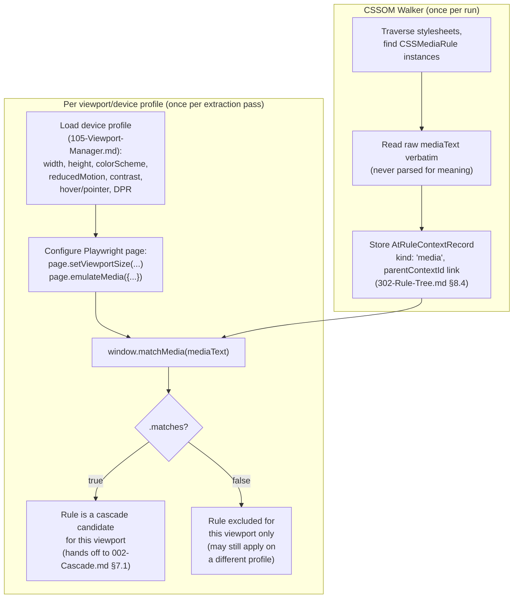

# 003 — Media Queries

## 1. Title

**Critical CSS Extraction Engine — Media Queries Level 4/5: Reference Summary and `window.matchMedia` as Canonical Evaluation API**

## 2. Version

| Field | Value |
|---|---|
| Document Version | 1.0.0 |
| Status | Draft — Phase 17 (Browser Specifications) |
| Last Updated | 2026-07-10 |
| Owners | Core Architecture Working Group |
| Stability | Media Queries Level 4 is a stable Recommendation; Level 5 features (`prefers-*`, custom media, more range syntax) are implementer-shipped but spec-track; this document tracks both |

## 3. Purpose

This document is a reference summary of the **Media Queries Level 4** specification (a W3C Recommendation) and the in-progress **Media Queries Level 5** draft, written for engineers building and maintaining the Critical CSS Extraction Engine. Its scope is deliberately narrow and operational, matching the pattern established in [002-Cascade.md](./002-Cascade.md): it is not a substitute for the specification text, but a statement of exactly which parts of the media query grammar and semantics the engine's design documents assume, and why `window.matchMedia()` — not a hand-rolled parser — is the engine's sole mechanism for deciding whether a media condition holds for a given viewport/device profile.

The design document that actually implements this evaluation for the engine's Rule Tree is [303-Media-Rules.md](../design/303-Media-Rules.md), which this reference document supports and does not duplicate. Where [303-Media-Rules.md](../design/303-Media-Rules.md) specifies *how the engine captures and evaluates* `@media` rules during CSSOM traversal, this document specifies *what the underlying Media Queries specification actually says* — media types, the feature grammar (boolean, discrete, and range contexts), the `prefers-*` family and its role in device profiles, and why `matchMedia` is the correct, and only correct, delegation point.

This distinction matters because a critical CSS engine that gets media query semantics wrong produces the same class of user-visible defect described in [002-Cascade.md](./002-Cascade.md) §7.3: a false negative (dropping a rule that should render on some viewport) causes visible FOUC or layout shift, and a false positive (retaining a rule that can never match) bloats the per-viewport output, defeating the tool's purpose. Media queries are, per [303-Media-Rules.md](../design/303-Media-Rules.md) §7, "the single most consequential at-rule type for a multi-viewport critical CSS engine," which is why this reference document exists as a standalone companion rather than being folded entirely into the design document.

## 4. Audience

- Implementers of the CSSOM Walker ([300-CSSOM-Walker.md](../design/300-CSSOM-Walker.md)) and the `@media` capture logic in [303-Media-Rules.md](../design/303-Media-Rules.md), who need a precise mental model of the grammar being captured (even though it is never hand-parsed).
- Implementers of the Viewport Manager ([105-Viewport-Manager.md](../design/105-Viewport-Manager.md)), whose device profile configuration (viewport dimensions, `prefers-color-scheme`, `prefers-reduced-motion`, pointer/hover capability) is the direct input this document's evaluation model consumes.
- Implementers of the multi-viewport orchestration layer, who must reason about a rule being applicable on one profile and inapplicable on another.
- Senior engineers reviewing whether a proposed "fast path" (e.g., regex-extracting a `min-width` breakpoint number for a perceived performance win) violates the engine's "never hand-roll a browser sub-language's grammar" commitment — this document exists partly to make that commitment concrete enough to catch such proposals in review.

Readers are assumed to be senior engineers familiar with responsive design practice (breakpoints, mobile-first authoring) and with the `window.matchMedia` API and `MediaQueryList` object at a working level; this document restates the underlying grammar precisely enough to be self-contained but does not re-teach responsive design from first principles.

## 5. Prerequisites

- [006-Design-Principles.md](../architecture/006-Design-Principles.md) — Principle 1 (Browser Is Source of Truth), the direct governing constraint for this entire document.
- [ADR-0001-Browser-Is-Source-of-Truth](../adr/ADR-0001-Browser-Is-Source-of-Truth.md) and [ADR-0002-No-Custom-Selector-Parser](../adr/ADR-0002-No-Custom-Selector-Parser.md) — the latter's "never hand-roll a browser sub-language's grammar" reasoning, extended here to media query syntax exactly as [303-Media-Rules.md](../design/303-Media-Rules.md) already extends it.
- [303-Media-Rules.md](../design/303-Media-Rules.md) — the design document this reference document supports; read together, not in isolation.
- [105-Viewport-Manager.md](../design/105-Viewport-Manager.md) — device profile configuration, the concrete input this document's evaluation model is applied against.
- Working familiarity with `window.matchMedia`, `MediaQueryList`, and the CSSOM's `CSSMediaRule.media` (`MediaList`) surface.

## 6. Related Documents

- [303-Media-Rules.md](../design/303-Media-Rules.md) — Rule Tree capture and per-viewport applicability evaluation for `@media`; this document's normative companion.
- [305-Cascade-Layers.md](../design/305-Cascade-Layers.md) — cascade layers frequently nest around or inside `@media` blocks; capture order interactions are covered there.
- [002-Cascade.md](./002-Cascade.md) — the cascade sort that operates on the already-filtered candidate set media applicability produces (§7.1 of that document explicitly names conditional-rule applicability as a pre-cascade gate).
- [105-Viewport-Manager.md](../design/105-Viewport-Manager.md) — device/viewport profile definitions, the direct evaluation input this document is written against.
- [000-CSSOM.md](./000-CSSOM.md) — CSSOM traversal fundamentals; `CSSMediaRule` discovery is a CSSOM-level operation this document assumes.
- [001-CSS-Variables.md](./001-CSS-Variables.md) — environment/custom properties can themselves be referenced inside media feature values in some proposals; noted as a forward-looking interaction, not yet standard.
- [004-Shadow-DOM.md](./004-Shadow-DOM.md) — media queries are document/browsing-context-global and are unaffected by shadow tree boundaries, a useful contrast to the context-sensitivity described there.
- [006-Container-Queries.md](./006-Container-Queries.md) — `@container` is the element-relative sibling of `@media`'s viewport-relative conditions; this document's §7.3 draws the contrast explicitly.
- [007-Nested-CSS.md](./007-Nested-CSS.md) — nested `@media` blocks inside rule bodies behave identically to top-level `@media` blocks for evaluation purposes, differing only in CSSOM capture shape.
- [008-Constructable-Stylesheets.md](./008-Constructable-Stylesheets.md) — adopted stylesheets carry `@media` rules subject to the same evaluation model, with no special-casing needed.
- [ADR-0001-Browser-Is-Source-of-Truth](../adr/ADR-0001-Browser-Is-Source-of-Truth.md), [ADR-0002-No-Custom-Selector-Parser](../adr/ADR-0002-No-Custom-Selector-Parser.md).

## 7. Overview

A media query is a boolean expression over **media types** and **media features**, used to conditionally apply a stylesheet, a set of rules (`@media { ... }`), or a resource link (`<link media="...">`, `@import url(...) screen and (...)`) based on characteristics of the output device and, as of Level 5, user-expressed preferences. Media Queries Level 4 formalized syntax that had accumulated organically since Level 3 (range context, `not`/`and`/`or` precedence rules) into a single coherent grammar; Level 5 adds an entirely new category of feature — **user preference media features** (`prefers-color-scheme`, `prefers-reduced-motion`, `prefers-contrast`, `prefers-reduced-data`, `prefers-reduced-transparency`) — that query the user's OS/browser-level accessibility and preference settings rather than device hardware characteristics.

### 7.1 Media types

A media type names a broad category of output device: `screen`, `print`, `speech`, and the legacy catch-all `all` (the implicit default when no type is specified). Media Queries Level 4 formally **deprecated** most of the Level 3 media type list (`tty`, `tv`, `projection`, `handheld`, `braille`, `embossed`, `aural`) in favor of media *features* expressing the same distinctions more precisely (e.g., a `tv`-like large-screen, coarse-pointer device is better expressed via `(hover: none) and (pointer: coarse)` than via a `tv` type keyword) — user agents are required to continue parsing the deprecated types without erroring, but are permitted to evaluate all of them as matching only `screen` or not matching at all, per the deprecation table. `screen`, `print`, `speech`, and `all` remain the only four media types with well-defined, universally implemented evaluation semantics.

A bare media type with no feature list (e.g., `@media print { ... }`) matches whenever the current output medium equals that type. `not` negates a full media query (`@media not screen { ... }` matches everything that is not a screen medium); `only` is a legacy syntax hint (`@media only screen and (...)`) that exists purely to hide a media query from CSS1-era user agents that would otherwise misparse a feature-only query as a type list — it has no effect on modern evaluation and the engine's capture logic ([303-Media-Rules.md](../design/303-Media-Rules.md)) must not treat its presence or absence as semantically meaningful.

### 7.2 Media features and the three evaluation contexts

A media feature is a parenthesized name/value expression: `(feature-name)`, `(feature-name: value)`, or, for range-capable features, `(min-feature-name: value)` / `(max-feature-name: value)` or the Level 4 range syntax `(value <= feature-name <= value)`. Every feature falls into exactly one of three evaluation contexts, and confusing them is the most common source of hand-implementation bugs this document warns against:

1. **Boolean context** — `(feature-name)` alone, with no value, evaluates to true if and only if the feature's value is not the "zero"/falsy value for that feature (e.g., `(color)` is true if the device has at least one bit of color depth; `(monochrome)` is true if the device is a monochrome device with nonzero bits per pixel; `(hover)` is *not* boolean-context-capable in the same sense — it is discrete — see below). Boolean context is really "is this discrete or range feature present with a non-zero/non-none value," not a distinct third value type.
2. **Discrete context** — the feature accepts one value from a fixed, named enumeration and does not support ranges or `min-`/`max-` prefixing. Examples: `orientation` (`portrait` | `landscape`), `hover` (`hover` | `none`), `pointer` (`fine` | `coarse` | `none`), `scan` (`interlace` | `progressive`), `update` (`none` | `slow` | `fast`), and all `prefers-*` features (each with its own small enumeration, e.g., `prefers-color-scheme`: `light` | `dark`; `prefers-reduced-motion`: `no-preference` | `reduce`).
3. **Range context** — numeric or dimensioned features that support `min-`/`max-` prefixed legacy forms and, as of Level 4, the comparison-operator range syntax directly (`(width >= 600px)`, `(400px <= width <= 900px)`). Examples: `width`, `height`, `aspect-ratio`, `resolution`, `color`, `color-index`, `monochrome`.

**Why this taxonomy matters to the engine.** [303-Media-Rules.md](../design/303-Media-Rules.md) commits to never parsing `mediaText` to interpret feature/value pairs — this document's three-context taxonomy is exactly the grammar that commitment refuses to hand-implement. A hand-rolled "fast path" that regex-matches `min-width:\s*(\d+)px` to extract a breakpoint number, for instance, silently mishandles: the Level 4 range-operator form (`(width >= 600px)` has no `min-` prefix to match), unit variety (`min-width` can be expressed in `em`, `rem`, or any valid CSS length, not just `px`), and the boolean-context distinction (a bare `(width)` with no comparison is valid and means "the width feature has a non-zero value," which a `min-`-prefix regex would simply fail to match and silently treat as "not this kind of query" rather than correctly evaluating it as always-true-for-any-real-viewport).

### 7.3 Boolean combinators and precedence

Media queries combine with `and`, `or`, `not`, and comma-separated lists (which behave as `or` between whole queries, historically the only way to express "or" before Level 4 added the `or` keyword within a single query). Level 4 codified a strict precedence and mutual-exclusion rule: **a single media query cannot freely mix `and` and `or` without parentheses** — `screen and (width > 600px) or print` is a syntax error, requiring explicit grouping (`screen and ((width > 600px) or print)` or restructuring as two comma-separated queries) to disambiguate, precisely because unparenthesized mixed boolean operators are the class of ambiguity that has caused real authoring bugs in other CSS-adjacent boolean grammars (e.g., `@supports`). This restriction is a specification-level "pit of success" design choice: rather than defining a precedence order for mixed `and`/`or` (as most programming languages do for their own boolean operators) and asking authors to memorize it, Media Queries Level 4 simply disallows the ambiguous form outright, forcing explicit grouping.

**Engine implication.** Because the engine never parses `mediaText` itself, this grammar detail is informational, not something the CSSOM Walker enforces — a syntactically invalid media query is simply reported as non-matching by `window.matchMedia()` itself (browsers are required to treat an unparseable media query as matching nothing, per the "future-proof" error-handling rule — see §9), so the engine's non-parsing posture is not merely safe here but actively simpler than a parsing approach would be, since the browser already absorbs all precedence and error-handling complexity on the engine's behalf.

## 8. Detailed Design

### 8.1 `window.matchMedia` as canonical evaluation API

`window.matchMedia(mediaQueryString)` returns a `MediaQueryList` object with a `.matches` boolean property (and legacy `.media` echoing the input string) evaluated **at call time** against the current document's `window`, its viewport dimensions, and the browser's/OS's currently reported preference/capability values. This is the only browser-exposed API that evaluates arbitrary media query text end-to-end — there is no equivalent for `@media` that returns a structured AST for the engine to walk and interpret itself (contrast with `CSSMediaRule.media`, which exposes only the raw `mediaText` string and a `MediaList` that is really just an array-like of comma-separated query strings, not a parsed feature tree).

For the engine's per-viewport extraction model, `matchMedia` evaluation must happen **inside a browser context already configured for the specific viewport/device profile under extraction** (per [105-Viewport-Manager.md](../design/105-Viewport-Manager.md)) — a Playwright page with its viewport, `colorScheme`, `reducedMotion`, and `forcedColors` emulation options already set for that profile, per [303-Media-Rules.md](../design/303-Media-Rules.md) §8's evaluation procedure (forward reference to that document's operational detail; this document only asserts *why* that must be the shape of the call, not the calling code itself).

**Why `matchMedia` and not `CSSMediaRule.media.mediaText` inspection.** The two are not interchangeable: `mediaText` gives the engine the raw *condition string* the CSSOM Walker needs anyway (for capture and for constructing the exact string to hand to `matchMedia`), but it gives zero information about whether that condition is currently *true*. Evaluating truth requires either (a) delegating to `matchMedia`, which correctly incorporates every current and future media feature the browser understands, or (b) hand-parsing the string and hand-evaluating it against manually-tracked viewport/preference state — option (b) is precisely the reimplementation [ADR-0002](../adr/ADR-0002-No-Custom-Selector-Parser.md) forbids, generalized here from selector grammar to media query grammar exactly as [303-Media-Rules.md](../design/303-Media-Rules.md) §7 states.

### 8.2 `prefers-*` features and device profiles

The `prefers-*` family is Level 5's most consequential addition for a critical CSS engine, because unlike `width`/`height` (which the engine can trivially set via viewport resize), preference features correspond to **OS- or browser-level settings** that must be explicitly emulated in the browser automation layer rather than derived from geometry:

- **`prefers-color-scheme`** (`light` | `dark` | `no-preference`, though `no-preference` is now rarely implemented as a distinct value in practice — most browsers resolve to `light` or `dark` unconditionally once the feature is supported) — reflects OS/browser dark-mode setting. Playwright exposes this via `page.emulateMedia({ colorScheme })`.
- **`prefers-reduced-motion`** (`reduce` | `no-preference`) — reflects an OS-level accessibility setting requesting reduced animation. Playwright: `page.emulateMedia({ reducedMotion })`.
- **`prefers-contrast`** (`no-preference` | `more` | `less` | `custom`) — reflects an OS-level contrast preference/accessibility setting.
- **`prefers-reduced-data`** (`no-preference` | `reduce`) — reflects a user/network-level data-saving preference (distinct from, though sometimes correlated with, `Save-Data` HTTP client hints).
- **`prefers-reduced-transparency`** (`no-preference` | `reduce`) — reflects an OS-level preference to reduce transparency/blur effects.

**Why device profiles must model these explicitly.** A device profile in [105-Viewport-Manager.md](../design/105-Viewport-Manager.md) (conceptually — that document owns the concrete schema) is not just a `{width, height}` pair; for correct critical CSS extraction it must be a full tuple of `{viewport dimensions, colorScheme, reducedMotion, contrast preference, pointer/hover capability, DPR}`, because production stylesheets routinely gate entire rule blocks behind `@media (prefers-color-scheme: dark)` and `@media (prefers-reduced-motion: reduce)`, and a critical CSS extraction that only varies viewport width while holding these at browser defaults will systematically under-extract dark-mode and reduced-motion critical styles for any user whose actual browsing session has those preferences set — a correctness gap that is invisible in default-profile testing and only surfaces for a subset of real users, making it exactly the kind of defect most likely to escape manual QA and reach production silently.

**`hover` and `pointer` as device-profile inputs, not preferences.** Distinct from the `prefers-*` family, `hover` and `pointer` (and their `any-hover`/`any-pointer` variants for multi-input devices) describe *input hardware capability* rather than user preference — a touch-primary device reports `(hover: none) and (pointer: coarse)`, a mouse-primary device reports `(hover: hover) and (pointer: fine)`. These are part of the same device-profile tuple conceptually but are configured via Playwright's `hasTouch`/device-descriptor emulation rather than `emulateMedia`, a distinction the Viewport Manager's implementation must track even though this document treats them as evaluation-model peers of `prefers-*` for media-query purposes.

### 8.3 Range syntax: legacy `min-`/`max-` vs. Level 4 comparison operators

Media Queries Level 3 offered only the `min-feature`/`max-feature` prefixed forms for range-capable features (`(min-width: 600px)`, `(max-width: 899px)`). Level 4 additionally permits direct mathematical comparison-operator syntax: `(width >= 600px)`, `(width <= 899px)`, and — uniquely useful for expressing a bounded range without an `and` — the two-sided form `(600px <= width <= 899px)` in one atomic feature expression, equivalent to `(min-width: 600px) and (max-width: 899px)` but as a single parenthesized unit rather than a boolean conjunction of two.

Both forms remain valid indefinitely — Level 4 did not deprecate the `min-`/`max-` prefix forms, and production stylesheets (and CSS frameworks' generated breakpoint media queries) predominantly still use the legacy prefixed form for now, since it has universal support back to CSS2.1-era implementations while the comparison-operator form is comparatively recent. The engine's capture layer ([303-Media-Rules.md](../design/303-Media-Rules.md)) must treat both forms as equally valid `mediaText` content to hand to `matchMedia` verbatim — there is no engine-side normalization needed or attempted, since `matchMedia` itself already understands both forms natively.

### 8.4 Custom media queries (Level 5, `@custom-media`)

Media Queries Level 5 proposes `@custom-media --breakpoint-name (min-width: 600px);`, allowing that name to be referenced later as `@media (--breakpoint-name) { ... }`, analogous to how CSS custom properties let authors name reusable values. As of this document's authoring, `@custom-media` has **no shipping browser implementation** (it exists only via build-time preprocessing, e.g., PostCSS's `postcss-custom-media` plugin, which expands the custom media reference to its full expansion *before* the browser ever sees the CSS). Because no browser evaluates `@custom-media`/`(--name)` natively, `window.matchMedia('(--breakpoint-name)')` would not correctly evaluate it even inside a browser context — this is not a case where the engine can delegate to the browser, because the browser itself provides no such capability yet. This is noted here specifically because it is an exception to this document's "always delegate" framing worth flagging explicitly: if `@custom-media` ever reaches production stylesheets the engine processes, either (a) the build pipeline that produces those stylesheets has already expanded it before the engine sees the CSS (the expected and current case for all realistic input), or (b) the engine would need a narrowly-scoped, spec-tracking exception to hand-expand `@custom-media` references before capture — tracked as Future Work (§19), not a current requirement, since no fixture or real production input has surfaced this gap to date.

### 8.5 Error Handling and Forward-Compatibility

Media Queries Level 4 mandates a specific, deliberate error-handling philosophy: an **unknown or invalid media feature/value inside an otherwise well-formed media query** should not cause the entire query (or, worse, the entire stylesheet) to be treated as invalid — it causes only the smallest enclosing parenthesized feature expression to evaluate as unrecognized, which in turn makes any conjunction (`and`) containing it evaluate false, while disjunctions (`or`, comma-lists) containing it fall through to the other unaffected alternatives. This "graceful degradation to false, at the narrowest possible scope" rule is what lets authors write forward-looking media queries (`@media (prefers-color-scheme: dark)` in 2020, when far fewer browsers supported the feature) that safely no-op on older browsers instead of accidentally invalidating an entire stylesheet or an entire comma-separated rule list.

**Engine implication.** This is a second, distinct reason `matchMedia` delegation is strictly superior to hand-parsing: the engine's runtime browser (via Playwright) is a specific, known, modern browser version, so `matchMedia` evaluation inside that context automatically reflects exactly that browser's actual feature-support surface and its exact graceful-degradation behavior for anything it doesn't recognize — with zero engine-side logic needed to model "which features does this browser version support" or "what happens when it encounters one it doesn't." A hand-rolled evaluator would need to separately maintain a feature-support matrix per target browser version to replicate this correctly, which is exactly the kind of perpetual-maintenance burden [ADR-0001](../adr/ADR-0001-Browser-Is-Source-of-Truth.md) is designed to avoid.

## 9. Architecture



**Reading note.** Capture (top subgraph) happens exactly once per Rule Tree construction, independent of viewport count — the raw `mediaText` string is the only artifact carried forward. Evaluation (bottom subgraph) happens once per `(mediaText, viewport profile)` pair, and the same captured `mediaText` is re-evaluated fresh for every profile in a multi-viewport run, since `.matches` is not a static property of the rule but a function of both the condition text and the currently emulated environment — this is why capture and evaluation are drawn as separate subgraphs with capture feeding into (not merging with) every per-viewport evaluation pass.

## 10. Algorithms

### 10.1 `evaluateMediaApplicability` — per rule, per viewport profile

```
function evaluateMediaApplicability(rule: AtRuleContextRecord, profile: DeviceProfile, page: BrowserPage): boolean
  # Precondition: `page` has already been configured for `profile` via
  # setViewportSize + emulateMedia (105-Viewport-Manager.md), performed
  # ONCE per profile, not once per rule -- see Performance (14).

  if rule.parentContextId != null:
    parentApplicable = evaluateMediaApplicability(
      lookupContext(rule.parentContextId), profile, page
    )
    if not parentApplicable:
      return false   # nested @media short-circuits: parent false => child moot

  result = page.evaluate(
    (mediaText) => window.matchMedia(mediaText).matches,
    rule.mediaText
  )
  return result
```

**Complexity.** `O(d)` browser round-trips per rule, where `d` is nesting depth (typically 1-2; deeply nested `@media` inside `@media` inside `@layer` is rare but structurally legal). Each round-trip is a `page.evaluate` call, dominated by IPC/serialization overhead to the browser process, not by `matchMedia`'s own (effectively `O(1)`, browser-internal) evaluation cost. See Performance (§14) for the batching optimization that amortizes this across all rules sharing a profile.

### 10.2 `buildPerViewportCandidateSet` — orchestration across all rules for one profile

```
function buildPerViewportCandidateSet(allMediaContexts: AtRuleContextRecord[], profile: DeviceProfile, page: BrowserPage): Set<ContextId>
  configurePageForProfile(page, profile)   # setViewportSize + emulateMedia, ONCE

  # Batch-evaluate all distinct mediaText strings in a single page.evaluate
  # round-trip, rather than one round-trip per rule (see Performance 14).
  distinctMediaTexts = dedupe(map(allMediaContexts, r => r.mediaText))
  matchResults = page.evaluate(
    (texts) => texts.map(t => window.matchMedia(t).matches),
    distinctMediaTexts
  )
  matchByText = zip(distinctMediaTexts, matchResults)

  applicable = new Set()
  for context in allMediaContexts (in parent-before-child order):
    selfMatches = matchByText[context.mediaText]
    parentApplicable = context.parentContextId == null
                        or applicable.has(context.parentContextId)
    if selfMatches and parentApplicable:
      applicable.add(context.id)
  return applicable
```

**Complexity.** `O(m)` distinct `matchMedia` evaluations per profile (`m` = distinct media condition strings across the whole stylesheet corpus, typically far smaller than total rule count since breakpoints are heavily reused across a stylesheet), plus `O(k)` for the parent-applicability propagation pass (`k` = total media context count, `k >= m`). One `page.evaluate` round-trip per profile, not per rule — this is the batching optimization referenced in §11.1 and detailed in §14.

## 11. Implementation Notes

- **Deduplicate `mediaText` before evaluating.** Real stylesheets reuse the same breakpoint string (`(min-width: 768px)`) across dozens or hundreds of rules; evaluating it once per distinct string and fanning the boolean result back out (§11.2) avoids redundant browser round-trips that would otherwise dominate extraction time for large stylesheets.
- **Never normalize or canonicalize `mediaText` before matching** (e.g., do not lowercase, do not strip whitespace beyond what's needed for dedup-key equality, do not reorder `and`-joined features) — pass it to `matchMedia` exactly as `CSSMediaRule.media.mediaText` reports it, since the browser's own parser is fully responsible for and capable of handling any valid formatting variation, and any engine-side "normalization" is unnecessary risk surface for zero benefit.
- **Configure `emulateMedia` before `setViewportSize`, or vice versa — order does not matter for Playwright's API**, but both must be fully applied *before* any `matchMedia` evaluation for that profile begins; a race where evaluation starts against a partially-configured page is a real bug class in naive multi-viewport orchestration code, particularly if profile switches are pipelined for throughput.
- **Nested `@media` short-circuit must check the parent first**, not evaluate both independently and AND the booleans after the fact — while mathematically equivalent for `matches` (since AND is commutative), evaluating the parent first lets the algorithm skip the child's `matchMedia` call entirely when the parent is false, which matters at scale when nested media blocks are common (framework-generated responsive utility CSS often nests `@media` inside `@supports` inside `@layer`, though the `@supports`/`@layer` legs of that nesting are handled by their respective sibling documents, not this one).
- **Treat `@import url(...) media-condition` identically to `@media` block conditions** for evaluation purposes — the media condition on an `@import` is evaluated via the same `matchMedia` delegation, the only difference being that it gates whether the *imported stylesheet's rules exist as CSSOM entries at all* (per [306-At-Import.md](../design/306-At-Import.md), forward reference) rather than gating an already-captured rule's applicability.

## 12. Edge Cases

- **`prefers-reduced-motion: no-preference` vs. feature absence**: a browser/OS that has never had the reduced-motion setting touched typically reports `no-preference` explicitly (not "feature unsupported"), which is a valid, matchable discrete value — engine code must not conflate "matches `no-preference`" with "feature not supported by this browser," since both are real, distinct outcomes with different implications for retention (the former is a legitimate applicability result; the latter, per §9, degrades the whole feature expression to non-matching).
- **Comma-separated media lists inside `<link media="...">`** behave identically to comma-separated media queries inside `@media`, but are captured via a different CSSOM surface (`HTMLLinkElement.media`, not `CSSMediaRule.media`) — the Rule Tree's stylesheet-loading layer ([301-Stylesheet-Loader.md](../design/301-Stylesheet-Loader.md), forward reference) must ensure a `<link media="print">` stylesheet's rules are gated by that condition even though no `CSSMediaRule` wraps them once loaded; this is a stylesheet-inclusion-level gate, not a rule-level one, and must not be dropped during capture.
- **Zero-value boolean context on a feature the device genuinely lacks**: `(color)` evaluates false only for genuinely monochrome/no-color output (vanishingly rare for `screen` media in modern usage, more plausible for certain `print` emulation scenarios) — extraction fixtures targeting `print` media specifically should include at least one monochrome-emulation test case, since this is an easy code path to leave completely untested if all fixtures assume color-capable output.
- **`prefers-contrast: custom`**: this value indicates the user has a custom (non-standard "more"/"less") contrast configuration and is matched by `(prefers-contrast: custom)` specifically — a naive discrete-context implementation that only checks for `more`/`less`/`no-preference` and treats anything else as false would silently mishandle a real, spec-defined value; this is exactly the class of bug the "always delegate to `matchMedia`" posture eliminates by construction, since the browser's own enumeration handling can never drift from the browser's own supported value set.
- **`not all` and vendor-legacy always-false hacks**: some older stylesheets contain deliberately-always-false media queries (`@media not all { ... }` or similar CSS-hack patterns used historically for browser-targeting) — these must still be captured and evaluated via `matchMedia` rather than special-cased as "obviously dead code," since assuming a pattern is dead code based on textual inspection is exactly the kind of hand-interpretation this document's governing principle forbids, however tempting the shortcut looks for a pattern that is admittedly almost always genuinely inapplicable.
- **Viewport resize race during batched multi-profile runs**: if the orchestration layer parallelizes profile evaluation across multiple browser contexts/pages (recommended for throughput, see Performance §14) rather than sequentially reusing one page, each page must be independently configured — sharing one page across profiles sequentially without a full re-configuration between profiles is a realistic implementation bug where a stale `emulateMedia` setting from the previous profile leaks into the next profile's evaluation.

## 13. Tradeoffs

**Batched, deduplicated `matchMedia` evaluation per profile (chosen) vs. one evaluation per rule.** Evaluating every captured media rule's `mediaText` individually is the naive, obviously-correct baseline, but incurs one `page.evaluate` IPC round-trip per rule — for enterprise stylesheets with thousands of media-gated rules (per [BRIEF.md §2.15](../../BRIEF.md) fixture goals), this round-trip overhead dominates extraction time. The chosen approach (§11.2) deduplicates by distinct `mediaText` string and batches all distinct evaluations into a single round-trip per profile, trading a small amount of orchestration complexity (building and later indexing the dedup map) for what is typically a large constant-factor speedup, since real stylesheets reuse a small number of canonical breakpoint strings across large numbers of rules.

**Never hand-parsing `mediaText`, even for the "obviously simple" cases (chosen) vs. a hand-rolled fast path for common patterns with `matchMedia` fallback for anything unrecognized.** A hybrid approach — regex-matching common `min-width`/`max-width` patterns directly and falling back to `matchMedia` for anything else — was considered and rejected. It would reduce browser round-trips for the common case, but reintroduces exactly the maintenance and correctness risk [ADR-0001](../adr/ADR-0001-Browser-Is-Source-of-Truth.md) is designed to eliminate: two independent code paths (fast-path regex logic and `matchMedia` delegation) that must be kept semantically identical forever, with silent divergence risk on every future CSS media query grammar change (e.g., a future spec level changing what counts as a valid length unit, or adding a new discrete feature that happens to textually resemble the regex's assumed shape). The chosen all-`matchMedia`, batched-and-deduplicated approach (previous tradeoff item) achieves comparable throughput without this dual-maintenance risk, making the hybrid's marginal performance benefit not worth its correctness cost.

**Modeling `hover`/`pointer` as device-profile inputs distinct from `prefers-*` (chosen) vs. folding all of them into one undifferentiated "media context" bag.** Keeping the distinction explicit (§8.2) costs a small amount of documentation and schema complexity in [105-Viewport-Manager.md](../design/105-Viewport-Manager.md) (two logically distinct configuration categories instead of one flat bag), but pays for itself by keeping the Viewport Manager's device-profile presets (e.g., "iPhone 14, light mode, standard motion" vs. "Desktop Chrome, dark mode, reduced motion") composable along independently-meaningful axes, rather than requiring every profile permutation to be enumerated as an opaque, undifferentiated bundle.

## 14. Performance

Per-profile `matchMedia` evaluation cost, after the batching and deduplication optimization (§11.2, §14), is dominated by a single `page.evaluate` round-trip's fixed IPC overhead, not by the number of distinct media conditions being evaluated within that round-trip — `matchMedia` itself is an effectively `O(1)`, browser-internal operation per condition, and evaluating even hundreds of distinct condition strings inside one batched `page.evaluate` call adds negligible marginal cost over evaluating one. This means the dominant cost driver for a multi-viewport extraction run is the **number of device profiles**, not the number of media-gated rules — each additional profile requires its own `setViewportSize`/`emulateMedia` reconfiguration plus one batched evaluation round-trip, a cost that is `O(1)` per profile regardless of stylesheet size, consistent with [BRIEF.md §2.14](../../BRIEF.md)'s stated goal of parallel/batched browser-side execution.

Parallelizing profile evaluation across multiple concurrent Playwright browser contexts (rather than reconfiguring and re-evaluating sequentially against one page) is the natural scaling strategy for extraction runs targeting many device profiles, subject to the per-context resource cost tracked by the Browser Pool ([102-Browser-Pool.md](../design/102-Browser-Pool.md), forward reference) — this document does not prescribe the pool sizing strategy itself, only notes that media evaluation's per-profile independence makes it embarrassingly parallel at the profile level.

No caching of `matchMedia` results across extraction runs is safe by default, since device profile configuration (viewport size, preference emulation) is run-specific input, not a property of the stylesheet content itself — however, the *set of distinct `mediaText` strings* discovered during CSSOM capture is a property of the stylesheet content and can be cached/fingerprinted across runs targeting the *same* stylesheet corpus under [BRIEF.md §2.6](../../BRIEF.md)'s incremental caching goal, re-evaluated fresh against `matchMedia` only when either the stylesheet corpus or the device profile set changes.

## 15. Testing

- **Unit tests per media feature category** (boolean, discrete, range — §7.2), each with fixtures asserting correct `matches` results for at least one true and one false case, run against real Playwright-driven `matchMedia` calls rather than mocked browser behavior, since the entire point of this document's design is to trust the browser's own evaluation rather than modeling it.
- **`prefers-*` fixture matrix**: for each of the five Level 5 preference features (§8.2), a fixture profile with the preference explicitly set to each of its enumerated values, verifying the Viewport Manager's `emulateMedia` configuration correctly produces the expected `matchMedia` result for a rule gated on that exact feature/value pair.
- **Nested `@media` short-circuit fixtures**: a rule nested two or three `@media` blocks deep, with fixtures covering (a) all levels true, (b) only the innermost false, (c) only the outermost false — verifying the outermost-false case correctly short-circuits without needing the innermost condition to even be independently testable as false (per §11.1's parent-first evaluation).
- **Legacy vs. Level 4 range syntax equivalence tests**: fixtures asserting `(min-width: 768px)` and `(width >= 768px)` produce identical `matches` results across the same set of viewport widths, guarding against any future accidental engine-side special-casing of one form over the other.
- **`<link media="...">` stylesheet-inclusion gating**, tested distinctly from `@media` rule-level gating (per Edge Cases §13), since it is captured through a different CSSOM surface and is a plausible place for a coverage gap to hide undetected.
- **Golden CSS snapshots across the full device profile matrix** ([BRIEF.md §2.15](../../BRIEF.md)) — real-world responsive fixtures (Tailwind's responsive utility classes, Bootstrap's breakpoint grid) extracted against every standard device profile the Viewport Manager ships, diffed against known-correct expected output, specifically to catch the "under-extract dark-mode/reduced-motion styles" class of regression called out in §8.2.
- **Performance regression tests** asserting that evaluation round-trip count scales with distinct `mediaText` count and device profile count, not with total rule count — a regression here (e.g., a refactor that accidentally reintroduces one round-trip per rule) should fail a benchmark threshold test before reaching production, per [BRIEF.md §2.15](../../BRIEF.md)'s performance benchmark testing layer.

## 16. Future Work

- **`@custom-media` support** (§8.4), contingent on either browser-native shipping of the Level 5 proposal or a documented decision to hand-expand it at capture time as a narrowly-scoped, explicitly-tracked exception to the "always delegate" posture — not needed today since no observed fixture or production input uses unexpanded `@custom-media`.
- **Container query interaction modeling** ([006-Container-Queries.md](./006-Container-Queries.md)) — as `@container` adoption grows, stylesheets increasingly mix `@media` (viewport-relative) and `@container` (element-relative) conditions in the same nesting chain; a future revision of this document or a dedicated cross-reference document should formalize how the two evaluation models compose when nested inside one another.
- **Media feature value interpolation via custom properties**: an early-stage CSSWG proposal would allow media feature values to reference custom properties (env-like values); should this reach Level 5 or Level 6 in a shipping form, this document's §8 will need a new subsection, and the "always delegate to `matchMedia`" posture should hold unchanged since the substitution, like everything else, would happen browser-side before `matchMedia` evaluation.
- **Network Information API-derived features** (`prefers-reduced-data`'s relationship to `Save-Data` client hints and the broader Network Information API) — currently treated as an independent preference feature (§8.2); a future revision should clarify whether the Viewport Manager needs to jointly configure both to keep device profiles internally consistent for fixtures that exercise data-saving-conditional CSS.
- **Formal cross-reference table** enumerating every media feature this document names against its current baseline browser support level (a living table, since support surfaces shift), to give implementers a single place to check before authoring a new device profile preset — deferred rather than included inline here, since such a table would go stale faster than this document's own review cadence and is better maintained as a separate, more frequently updated artifact.

## 17. References

- [Media Queries Level 4 — W3C Recommendation](https://www.w3.org/TR/mediaqueries-4/)
- [Media Queries Level 5 — W3C Editor's Draft](https://www.w3.org/TR/mediaqueries-5/)
- [MDN — Using media queries](https://developer.mozilla.org/en-US/docs/Web/CSS/CSS_media_queries/Using_media_queries)
- [MDN — `window.matchMedia()`](https://developer.mozilla.org/en-US/docs/Web/API/Window/matchMedia)
- [MDN — `MediaQueryList`](https://developer.mozilla.org/en-US/docs/Web/API/MediaQueryList)
- [Playwright — `page.emulateMedia()`](https://playwright.dev/docs/api/class-page#page-emulate-media)
- [303-Media-Rules.md](../design/303-Media-Rules.md)
- [305-Cascade-Layers.md](../design/305-Cascade-Layers.md)
- [002-Cascade.md](./002-Cascade.md)
- [105-Viewport-Manager.md](../design/105-Viewport-Manager.md)
- [006-Design-Principles.md](../architecture/006-Design-Principles.md)
- [ADR-0001-Browser-Is-Source-of-Truth](../adr/ADR-0001-Browser-Is-Source-of-Truth.md)
- [ADR-0002-No-Custom-Selector-Parser](../adr/ADR-0002-No-Custom-Selector-Parser.md)
