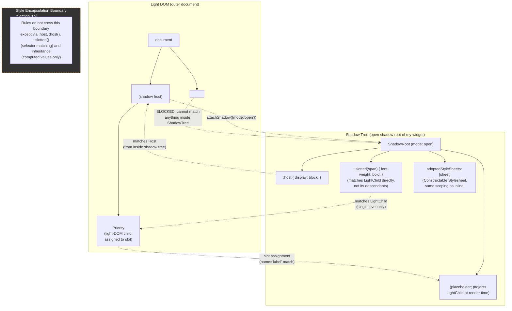

# 004 — Shadow DOM

## 1. Title

**Critical CSS Extraction Engine — Browser Specification Reference: Shadow DOM (Encapsulation, Slotting, and Style Scoping)**

## 2. Version

| Field | Value |
|---|---|
| Document Version | 1.0.0 |
| Status | Accepted |
| Last Updated | 2026-07-10 |
| Owners | Core Architecture Working Group |
| Stability | Stable (Phase 17 — Browser Specifications; this document is a reference summary and does not itself define implementation behavior — implementation behavior is normatively owned by [../design/106-DOM-Snapshot.md](../design/106-DOM-Snapshot.md) and [../design/307-Constructable-Stylesheets.md](../design/307-Constructable-Stylesheets.md); changes to the underlying DOM/CSSOM specification require updating this document plus a re-review of both) |

## 3. Purpose

This document is a **reference summary** of the Shadow DOM specification (part of the WHATWG DOM Standard, `https://dom.spec.whatwg.org/#shadow-trees`) as it pertains to this engine's extraction correctness. It exists to give implementers and reviewers a single, engine-scoped statement of what the specification actually guarantees — open versus closed shadow roots, `attachShadow()` semantics, slot assignment and the flattened tree, the `:host`/`:host()`/`::slotted()` selector family, and the style-encapsulation guarantee itself — without requiring every reader to re-derive those guarantees from the raw specification text or from Chromium/WebKit/Gecko source.

Unlike [../design/106-DOM-Snapshot.md](../design/106-DOM-Snapshot.md) (which specifies *how the DOM Collector walks* a shadow tree) and [../design/307-Constructable-Stylesheets.md](../design/307-Constructable-Stylesheets.md) (which specifies *how the CSSOM Walker discovers* `adoptedStyleSheets` on a shadow root), this document does not specify engine behavior at all. It specifies what the *browser* does, so that those two design documents — and every future document that touches Shadow DOM — have a stable, correct, non-redundant foundation to cite instead of re-explaining the specification inline. This division of labor mirrors the relationship [../design/106-DOM-Snapshot.md](../design/106-DOM-Snapshot.md) Section 6 establishes between architecture documents (what crosses a boundary) and design documents (the algorithm that produces it): this document is the spec-reference layer beneath both.

The practical motivation is that Shadow DOM is the single most consequential browser feature this engine must model correctly and does not control. A critical-CSS engine that gets Shadow DOM wrong — by flattening shadow trees into light DOM, by assuming closed roots are reachable, by mismatching `::slotted()` against un-flattened tree structure, or by treating a shadow root's adopted stylesheet as document-global — will silently produce incorrect output for the entire class of modern component-library-based sites (Lit, Stencil, native Web Components, and a growing share of design systems) that this project exists to serve correctly, per the general thesis in `BRIEF.md` Section 2.1 that static-approximation tools diverge from real rendering precisely at encapsulation seams.

## 4. Audience

- Implementers of the DOM Collector ([../design/106-DOM-Snapshot.md](../design/106-DOM-Snapshot.md)) and the CSSOM Walker's Constructable Stylesheets discovery pass ([../design/307-Constructable-Stylesheets.md](../design/307-Constructable-Stylesheets.md)), who need a precise, engine-independent statement of what the specification guarantees before reading how this engine implements against it.
- Implementers of the Selector Matcher (forward reference, Phase 5 sibling documents [000-CSSOM.md](./000-CSSOM.md), [002-Cascade.md](./002-Cascade.md)), who must reason about `:host`, `:host()`, and `::slotted()` matching semantics against the flattened tree rather than the light-DOM tree.
- Implementers of the Hybrid extraction mode ([../design/701-Hybrid-Mode.md](../design/701-Hybrid-Mode.md)) and Coverage mode ([../design/700-Coverage-Mode.md](../design/700-Coverage-Mode.md)), who need to understand why Coverage's byte-range reporting and CSSOM matching each interact with shadow-scoped stylesheets differently.
- Reviewers evaluating any proposed change to shadow-tree traversal, slot-assignment handling, or style-scoping behavior, who need a specification-grounded reference to check a proposal against, independent of any one browser engine's current (possibly buggy or lagging) implementation.
- Engineers debugging a fixture where extracted critical CSS renders differently once inlined — a common root cause is a `::slotted()` or `:host()` rule whose scoping this document explains precisely.

Readers are assumed to be fluent in ordinary DOM tree structure (`Node`, `Element`, `parentNode`, `childNodes`) and to have read [../design/106-DOM-Snapshot.md](../design/106-DOM-Snapshot.md) Section 8.3–8.4, which this document underpins. This is not an introduction to Web Components; it is a normative specification reference scoped to what this engine's extraction correctness depends on.

## 5. Prerequisites

- [../design/106-DOM-Snapshot.md](../design/106-DOM-Snapshot.md) Sections 8.3 (Shadow DOM: Open Roots, Closed Roots, and Reachability) and 8.4 (Slot Assignment) — the design document whose reachability and slot-linkage decisions this reference document underwrites specification-side.
- [../design/307-Constructable-Stylesheets.md](../design/307-Constructable-Stylesheets.md) Sections 9.1–9.4 — the design document whose `adoptedStyleSheets`-on-shadow-root discovery this document's Section 8.6 (`adoptedStyleSheets` on Shadow Roots) grounds specification-side.
- [000-CSSOM.md](./000-CSSOM.md) — baseline CSSOM concepts (`CSSStyleSheet`, `CSSRule`, rule lists) this document assumes as background for the `adoptedStyleSheets` and selector discussion.
- [002-Cascade.md](./002-Cascade.md) — cascade origin and scoping-proximity concepts this document's style-encapsulation discussion (Section 8.5) references without re-deriving.
- Familiarity with the WHATWG DOM Standard's shadow-tree terminology: *shadow host*, *shadow root*, *shadow tree*, *light tree*, *flattened tree* (`https://dom.spec.whatwg.org/#shadow-trees`).

## 6. Related Documents

- [../design/106-DOM-Snapshot.md](../design/106-DOM-Snapshot.md) — the DOM Collector's shadow-tree walking algorithm; this document is that algorithm's specification-side justification.
- [../design/307-Constructable-Stylesheets.md](../design/307-Constructable-Stylesheets.md) — the CSSOM Walker's `adoptedStyleSheets` discovery on shadow roots; this document's Section 8.6 is its specification-side grounding.
- [../design/700-Coverage-Mode.md](../design/700-Coverage-Mode.md) — Coverage's per-stylesheet-resource usage model and how it interacts with shadow-scoped stylesheets (Edge Cases: "Shadow DOM").
- [../design/701-Hybrid-Mode.md](../design/701-Hybrid-Mode.md) — the reconciliation strategy that must apply the scoping rules this document defines when combining Coverage and CSSOM signals for shadow-scoped rules.
- [000-CSSOM.md](./000-CSSOM.md) — CSSOM primitives referenced throughout.
- [001-CSS-Variables.md](./001-CSS-Variables.md) — custom-property inheritance across shadow boundaries, a distinct-but-related encapsulation topic this document cross-references in Edge Cases.
- [002-Cascade.md](./002-Cascade.md) — cascade origin/scoping-proximity model this document's style-encapsulation section depends on.
- [003-Media-Queries.md](./003-Media-Queries.md) — media-query evaluation is host-document-relative, not shadow-tree-relative, a point this document's Edge Cases section notes for completeness.
- [006-Container-Queries.md](./006-Container-Queries.md) — container queries can cross shadow boundaries in ways media queries cannot, a contrast this document's Edge Cases section draws explicitly.
- [007-Nested-CSS.md](./007-Nested-CSS.md) — nested CSS's `&` resolution inside `:host()`/`::slotted()` rules, a compounding-complexity case this document flags for the Selector Matcher.
- [008-Constructable-Stylesheets.md](./008-Constructable-Stylesheets.md) — the Phase 17 spec-reference sibling for Constructable Stylesheets generally, which this document's Section 8.6 defers to for API-level detail beyond the shadow-root-specific case.

## 7. Overview

Shadow DOM, as defined by the WHATWG DOM Standard, gives an element (the **shadow host**) a second, hidden child tree (the **shadow tree**, rooted at a **shadow root**) that renders in place of — and encapsulates — the host's ordinary light-DOM children. Three properties of this mechanism dominate everything downstream in this engine's extraction pipeline, and are previewed here because every section below elaborates one of them:

1. **A shadow root has a `mode`: `"open"` or `"closed"`.** This is not a style-encapsulation distinction — both modes encapsulate style identically — it is a *script-reachability* distinction. `"open"` exposes the shadow root via `element.shadowRoot`; `"closed"` returns `null` from that same accessor for any script running in the page's own JavaScript execution context, including this engine's injected `page.evaluate()` payload (per [../design/106-DOM-Snapshot.md](../design/106-DOM-Snapshot.md) Section 8.3). This engine's extraction of closed shadow roots is consequently bounded by the same reachability rule any other page script is bound by, with one documented, narrow exception at the automation-protocol layer (Section 8.2 below).
2. **Rendering does not walk the light tree or the shadow tree in isolation — it walks the *flattened tree*, a composed view produced by resolving `<slot>` assignment.** A `<slot>` element inside a shadow tree does not contain its assigned nodes as DOM children; it *projects* light-DOM children into its rendered position without altering DOM parentage. Any component of this engine that reasons about "what actually renders where" — the Visibility Engine, geometry capture, and any future layout-aware selector matching — must reason in terms of the flattened tree, not either tree alone.
3. **Style encapsulation is a two-way guarantee: rules inside a shadow tree do not leak out, and (with narrow, explicit exceptions) rules outside a shadow tree do not leak in.** `:host`, `:host()`, and `::slotted()` are the specification's three purpose-built escape hatches through this boundary, each with narrow, precisely-defined matching semantics this document specifies in full (Section 8.4), because a Selector Matcher that gets any one of them wrong will misattribute a rule to the wrong scope — producing either an over-inclusive critical bundle (a rule wrongly judged in-scope) or a rendering regression when the extracted-and-inlined subset is later replayed without the full stylesheet (a rule wrongly judged out-of-scope).

This document works through `attachShadow()` and the open/closed distinction (Section 8.1–8.2), slot assignment and the flattened tree (Section 8.3), the `:host`/`:host()`/`::slotted()` selector family (Section 8.4), the style-encapsulation guarantee stated precisely (Section 8.5), and `adoptedStyleSheets` on shadow roots with a cross-reference to the Constructable Stylesheets design document (Section 8.6), before the standard closing sections.

## 8. Detailed Design

### 8.1 `attachShadow()` and Shadow Root Creation

A shadow root is created by calling `element.attachShadow(init)`, where `init` is a dictionary with (at minimum) a required `mode: "open" | "closed"` field and an optional `slotAssignment: "named" | "manual"` field (default `"named"`, discussed in Section 8.3). `attachShadow()` throws if the host element already has a shadow root, or if the host's tag name is not on the specification's allow-list of elements permitted to host a shadow tree (custom elements, and a fixed set of built-in elements including `div`, `span`, `section`, `article`, `aside`, `header`, `footer`, `nav`, `main`, `p`, and a handful of others; notably ``, `<input>`, and several other "already have complex internal rendering" elements are **not** permitted to host a shadow root). This allow-list matters to this engine only insofar as it bounds where a shadow host can legitimately appear in a DOM snapshot — the DOM Collector does not need to special-case disallowed elements, since the browser itself guarantees they never carry a `shadowRoot`.

Once created, the shadow root is a `ShadowRoot` object — itself a subtype of `DocumentFragment` — permanently associated with its host. There is no API to detach a shadow root from its host or reassign it to a different host; the association is for the host element's lifetime. A shadow root's children (its own light tree, from the shadow tree's own perspective) are added via ordinary DOM mutation (`shadowRoot.appendChild(...)`, `shadowRoot.innerHTML = ...`), exactly as for any other document fragment.

**Declarative Shadow DOM.** A more recent specification extension, Declarative Shadow DOM, allows a shadow root to be created directly from server-rendered HTML via a `<template shadowrootmode="open">` (or `"closed"`) element, without any JavaScript execution — critical for this engine's SSR-adapter integrations (`../design/900-SSR-Overview.md` et seq., outside this document's scope but noted here for completeness). The resulting shadow root is indistinguishable, from the DOM Collector's perspective, from one created imperatively via `attachShadow()`: both expose (or hide) `element.shadowRoot` identically per the `mode` recorded at parse time. This matters for this engine specifically because a page rendered via SSR streaming may already have shadow roots present at the moment the DOM Collector's walk begins — no `page.evaluate()`-timing race with client-side hydration is introduced by Declarative Shadow DOM's presence, whereas an imperatively-`attachShadow()`-created shadow root attached by a client-side script *does* introduce such a race, addressed by [../design/104-Rendering-Stabilization.md](../design/104-Rendering-Stabilization.md)'s stabilization gate.

### 8.2 Open Versus Closed Shadow Roots: The Reachability Distinction

Both `mode: "open"` and `mode: "closed"` shadow roots encapsulate *style* identically — this is the single most commonly misunderstood point about the `mode` flag, and it is worth stating plainly: **`mode` controls script reachability only, not style scoping.** A closed shadow root's internal `<style>` elements and any `::slotted()`/`:host` rules behave exactly as an open shadow root's would with respect to the cascade; nothing about style computation, inheritance, or `getComputedStyle()` resolution differs between the two modes.

What differs is exactly one thing: `element.shadowRoot`. For an open shadow root, this accessor returns the live `ShadowRoot` object to any script with a reference to the host element. For a closed shadow root, it returns `null` — unconditionally, for any script running in the page's ordinary JavaScript execution context, with no legitimate in-page workaround. The component author who chose `mode: "closed"` has made a deliberate encapsulation decision (commonly, to prevent external code from reaching into a component's internals via `host.shadowRoot.querySelector(...)`), and per [../design/106-DOM-Snapshot.md](../design/106-DOM-Snapshot.md) Section 8.3, this engine treats that choice as authoritative and does not attempt to defeat it from within page-script context.

**The one documented exception, and why this engine still does not exploit it for closed roots' *content*.** The Chrome DevTools Protocol's `DOM.getFlattenedDocument`/`DOM.describeNode` methods, and Playwright's underlying CDP session generally, operate at a privilege level *below* the page's own JavaScript sandbox — CDP can, in principle, observe a closed shadow root's structure because the encapsulation the DOM specification grants is scoped to "script running as the page," not to "any observer whatsoever," and a CDP-connected devtools client has always been able to inspect closed shadow roots in the browser's own DevTools panel. [../design/106-DOM-Snapshot.md](../design/106-DOM-Snapshot.md) Section 8.3 explicitly declines to use this privileged path for the DOM Collector's structural enumeration, on Principle 1 grounds: a real page script — and, transitively, real rendering as an ordinary user experiences it — cannot see into a closed shadow root, so an extraction engine that reports structure a normal script cannot see is reporting something other than "what actually happens when this page renders for a real visitor." This document adds the specification-level confirmation that supports that design choice: closed-mode reachability is a script-context property, not a rendering-affecting property, so declining to use privileged access costs the engine nothing in *rendering* fidelity — a closed shadow root renders identically regardless of whether any external observer can inspect it, and this engine's stated purpose is to extract CSS relevant to *rendering*, not to reverse-engineer component internals for other purposes.

The practical consequence for critical CSS specifically: content and styles inside a closed shadow root are recorded, per [../design/106-DOM-Snapshot.md](../design/106-DOM-Snapshot.md) Section 8.3, as a `ClosedShadowRootDiagnostic` — an explicit, surfaced gap — rather than either a silent omission or a privilege-escalated extraction. This is self-consistent with the Selector Matcher's own blind spot: `Element.matches()` and `querySelectorAll()`, called from outside, cannot match into a closed shadow root either, so the DOM Collector's declared gap and the Selector Matcher's declared gap are the same specification-mandated boundary, described once, correctly, here.

### 8.3 Slot Assignment and the Flattened Tree

A `<slot>` element, placed inside a shadow tree, is a *placeholder* — it does not itself hold rendered content by DOM parentage. Instead, the specification defines a process, **slot assignment**, that associates zero or more light-DOM children of the shadow host with a given `<slot>`, and a second process, **flattening**, that produces the tree the browser actually paints: wherever a `<slot>` appears in the shadow tree, its *assigned nodes* render in its place, as if they were the slot's children, without their DOM `parentNode` ever changing to point at the slot or the shadow tree.

**Named slot assignment (the default, `slotAssignment: "named"`).** Each light-DOM child of a shadow host may carry a `slot="name"` attribute; each `<slot>` inside the shadow tree may carry a matching `name="name"` attribute (or no `name` attribute at all, in which case it is the **default slot** and receives every light-DOM child that has no `slot` attribute, or whose `slot` attribute names a slot that does not exist in the current shadow tree). Assignment under this mode is automatic and attribute-driven: the browser recomputes assignment whenever a relevant attribute or child changes, with no script involvement required.

**Manual slot assignment (`slotAssignment: "manual"`).** Introduced as a later specification addition, this mode disables automatic name-attribute-based assignment entirely; assignment is instead performed imperatively via `slotElement.assign(...nodes)`. This exists for component authors who need assignment logic more dynamic than static attribute matching can express (e.g., assignment based on node type rather than an author-supplied attribute). For this engine's extraction purposes, manual assignment is observationally identical once resolved — `slot.assignedNodes()` reports the current assignment regardless of which mode produced it — but it means assignment *cannot* be inferred by inspecting attributes alone; the DOM Collector must query the live `assignedNodes()` result at snapshot time (per [../design/106-DOM-Snapshot.md](../design/106-DOM-Snapshot.md) Section 8.4), never re-derive it from `slot`/`name` attribute matching, precisely because manual mode makes that re-derivation wrong.

**`assignedNodes({flatten})` and nested slot chains.** `slot.assignedNodes({flatten: false})` (the default) returns only the nodes directly assigned to that slot — which may themselves include other `<slot>` elements, in the case of nested shadow trees each re-projecting content inward (a common pattern in component libraries that compose smaller shadow-DOM components inside larger ones). `slot.assignedNodes({flatten: true})` instead resolves the entire chain, returning the ultimate non-slot leaf nodes that end up rendering. As [../design/106-DOM-Snapshot.md](../design/106-DOM-Snapshot.md) Section 8.4 states, this engine's DOM Collector deliberately uses `{flatten: false}` and retains one-hop assignment per slot, so that a downstream consumer can reconstruct the full nested-slotting chain rather than only its resolved endpoint — a design choice this document confirms is specification-compatible: `{flatten: false}` is the specification's own default precisely because most consumers of `assignedNodes()` want the direct, one-hop mapping and can recurse themselves if the full chain is needed.

**The flattened tree is the tree that geometry and paint operate on.** `getBoundingClientRect()`, `getComputedStyle()`, and the browser's own layout/paint pipeline all operate against the flattened tree — a slotted node's rendered position is wherever the flattened tree places it (inside the shadow tree's layout, at the slot's position), not wherever its DOM-tree `parentNode` chain would suggest. This is precisely why [../design/106-DOM-Snapshot.md](../design/106-DOM-Snapshot.md) Section 8.4 requires the DOM Collector to record slot/assignment linkage explicitly rather than relying on DOM parentage: the Visibility Engine's above-the-fold determination for a slotted node depends on the flattened tree's geometry, which the DOM-tree structure alone does not expose.

### 8.4 The `:host`, `:host()`, and `::slotted()` Selector Family

The specification provides exactly three selector constructs designed to let a `<style>` element *inside* a shadow tree reach across the encapsulation boundary in narrowly-scoped, well-defined ways. No other selector, written inside a shadow tree's own stylesheet, can match anything outside that shadow tree, and (with the sole exception of these three constructs plus inherited custom properties, [001-CSS-Variables.md](./001-CSS-Variables.md)) no selector written *outside* a shadow tree can match anything inside it.

**`:host`.** Matches the shadow host itself, from inside the shadow tree's own stylesheet. `:host { display: block; }` inside a component's shadow root styles the custom element itself (e.g., `<my-widget>`) as it appears in the *light* DOM — this is the one case where a shadow-tree-scoped rule reaches out to affect an element that is not itself inside the shadow tree, because the host element is definitionally outside its own shadow tree (the shadow tree is the host's hidden *child* content, not the host). `:host` has the lowest possible specificity contribution from the pseudo-class itself (equivalent to a single pseudo-class), and, critically, **is always overridable by a normal, outside selector targeting the same host element with higher specificity** (e.g., a light-DOM stylesheet rule `my-widget.active { ... }` can override `:host { ... }` inside the component's own shadow tree, because the outside rule is not blocked by encapsulation when targeting the host element itself — the host is a normal light-DOM element from the outside stylesheet's perspective). This asymmetry — `:host` rules can be overridden from outside, but shadow-tree-internal rules that are not `:host`/`:host()`/`::slotted() ` cannot even be *reached* from outside — is a frequent source of confusion this document states explicitly because it directly affects cascade-order reasoning in [002-Cascade.md](./002-Cascade.md).

**`:host(<compound-selector>)`.** A functional form matching the shadow host only when the host itself additionally matches the given compound selector — e.g., `:host(.large) { padding: 2rem; }` matches the host only if the host element also carries class `large`. The argument is restricted to a single compound selector (no combinators, no complex selector lists with descendant/child relationships) — a specification-level restriction that keeps `:host()` inherently host-scoped rather than accidentally expressive enough to reach further into the light DOM.

**`::slotted(<compound-selector>)`.** Matches a light-DOM node that has been slotted into the shadow tree (i.e., is a current assignment target of some `<slot>` in this shadow tree, per Section 8.3), and additionally matches the given compound selector. `::slotted()` is a pseudo-*element*, not a pseudo-class, which has a specification-mandated consequence the Selector Matcher must respect precisely: **`::slotted()` matches only the slotted node itself, never its descendants.** `::slotted(span)` matches a slotted `<span>` but a rule with that selector does not cascade to style a `<button>` nested inside that `<span>`, even though the `<button>` visually renders inside the slot's position too — because `::slotted()`'s specification-defined matching scope is exactly "the top-level assigned node," not "everything the assignment transitively renders." A common and consequential implementation error is treating `::slotted()` as though it behaved like a descendant combinator into slotted content; it does not, and the Selector Matcher (forward reference, sibling Phase 5 documents) must encode this narrow, single-level matching rule exactly, or it will systematically over-match rules against a slotted subtree's descendants that the browser itself never applies those rules to.

Additionally, `::slotted()`'s argument, like `:host()`'s, is restricted to a single compound selector — `::slotted(div.card)` is valid, `::slotted(div .card)` (a descendant combinator inside the argument) is not permitted by the grammar and must be treated as an invalid/non-matching selector by any conformant parser, including this engine's CSSOM Walker.

### 8.5 The Style-Encapsulation Guarantee, Stated Precisely

Putting Sections 8.1–8.4 together, the specification's style-encapsulation guarantee for a shadow tree can be stated as a small number of precise rules this engine's Selector Matcher and Cascade Resolver must both encode identically (any divergence between the two would itself be a correctness bug, since they must agree on scope):

1. **A selector written in a stylesheet whose "home" is a shadow tree (a `<style>` element physically inside that shadow tree, or a `CSSStyleSheet` adopted via that shadow root's `adoptedStyleSheets`, Section 8.6) can only match elements within that same shadow tree, plus — via `:host`/`:host()` — the shadow host itself, plus — via `::slotted()` — light-DOM nodes currently slotted into that shadow tree (single-level only, per Section 8.4).** It cannot match any element in the outer light DOM, in a sibling shadow tree, or in an ancestor's shadow tree, by ordinary type/class/attribute/descendant selectors, full stop.
2. **A selector written in a stylesheet whose home is the outer light document (or a `<style>`/`<link>` sheet outside any shadow tree) cannot match any element inside a shadow tree, at all, by any selector construct** — there is no light-DOM-side equivalent of `::slotted()` that reaches *inward*. The only two mechanisms by which outer-document authored styling can affect shadow-tree-internal rendering are: (a) ordinary CSS inheritance of inheritable properties (`color`, `font-family`, etc., which cross the shadow boundary the same way they cross any other element boundary, because inheritance is a computed-value mechanism, not a selector-matching mechanism) and custom-property inheritance specifically ([001-CSS-Variables.md](./001-CSS-Variables.md)); and (b) the `:host`/`:host()` asymmetry noted in Section 8.4, where an *outside* selector can still target the host element itself as an ordinary light-DOM element (this is not the shadow tree being reached into — the host element is not inside its own shadow tree).
3. **This encapsulation is bidirectional and total for structural selector matching, but one-directional for value inheritance.** Values inherit inward (outer document → shadow tree, for inheritable properties and custom properties); no equivalent inheritance-like mechanism exists outward.

**Why this matters for critical CSS bundling specifically.** A critical-CSS engine that fails to encode rule 2 correctly risks two distinct classes of bug: (a) *under-inclusion* — treating a shadow-tree-internal `<style>`'s rules as globally scoped and therefore matching them against the wrong node set (light-DOM nodes) yields zero matches for rules that are, in fact, essential once the actual shadow-scoped node set is considered, so the rule never makes it into the critical bundle at all; and (b) *over-inclusion* — the inverse error, treating a rule that can only match inside one specific shadow tree as though it could match any element anywhere, producing false-positive matches against unrelated light-DOM elements that happen to share a class name, bloating the extracted bundle with rules that will never actually apply to the elements they were matched against. Both failure modes trace back to the same root cause: not modeling shadow-tree scope as a hard partition on the candidate node set a given stylesheet's rules are matched against.

### 8.6 `adoptedStyleSheets` on Shadow Roots

A shadow root, like a document, exposes a mutable `adoptedStyleSheets: CSSStyleSheet[]` array (per the Constructable Stylesheets specification), populated with `CSSStyleSheet` objects constructed via `new CSSStyleSheet()` and `replaceSync()`/`replace()`. Every rule in Sections 8.4–8.5 above applies identically regardless of whether a shadow tree's rules arrived via a `<style>` element physically inside the shadow tree or via an adopted, constructed sheet — **adoption does not change scoping semantics in any way; it only changes discovery mechanics.** A rule from an adopted sheet is exactly as shadow-tree-scoped as a rule from an inline `<style>` element in the same shadow root, and `:host`/`:host()`/`::slotted()` behave identically in both cases.

What *does* differ, and what makes `adoptedStyleSheets` a distinct topic from ordinary shadow-tree style scoping, is discovery: a `<style>` element inside a shadow tree is found by the DOM Collector's ordinary tree walk (it is a normal child node), whereas an adopted `CSSStyleSheet` is not a DOM node at all and is invisible to any traversal that only walks tree structure — it must be found by explicitly querying `shadowRoot.adoptedStyleSheets`, a fact this document defers, for full mechanical detail (dedup-by-reference-identity, adoption-site attribution, the specific reason this discovery is implemented as a hook into the DOM Collector's existing shadow-root visitation rather than a second traversal), to [../design/307-Constructable-Stylesheets.md](../design/307-Constructable-Stylesheets.md) Sections 9.1–9.4, which this document's Section 8.5 scoping rules underpin specification-side. The one fact worth restating here, because it is easy to get backwards: **the same constructed `CSSStyleSheet` object can be adopted by many different shadow roots (and/or the document) simultaneously, and each adoption site's rules are independently scoped to that adopter** — adopting a sheet into shadow root A does not make its rules match inside shadow root B, even if B also adopts the identical sheet object; each adoption is its own independent scoping relationship, per Section 8.5 rule 1, applied once per adopter.

## 9. Architecture

### 9.1 Shadow Tree Structure, Slot Assignment, and Encapsulation Boundary

The diagram below shows a shadow host with an open shadow root containing a named slot, a light-DOM child assigned into that slot, an adopted stylesheet, and the encapsulation boundary that separates outer-document selectors from shadow-tree-internal ones. The dotted boundary is the specification's style-encapsulation guarantee (Section 8.5); solid arrows are ordinary DOM parent/child edges; dashed arrows denote the non-DOM-parentage relationships (slot assignment, sheet adoption) that flattening and rule discovery must resolve explicitly.



Two structural facts this diagram is designed to make visible: **(a)** `LightChild` remains a DOM child of `Host`, not of `Slot` or `SRoot` — the dashed "slot assignment" edge is a flattening/rendering relationship, not a reparenting one — which is exactly why [../design/106-DOM-Snapshot.md](../design/106-DOM-Snapshot.md) Section 8.4 records `assignedSlotId`/`slottedNodeIds` as an explicit linkage separate from `parentNodeId`; and **(b)** the outer document's `.card` rule and the shadow tree's `:host`/`::slotted()` rules occupy genuinely separate matching universes that intersect only at the three narrow points Section 8.4 defines — there is no general-purpose selector that reaches either direction across the boundary.

## 10. Algorithms

This document specifies browser behavior, not engine algorithms — the engine-side walking and discovery algorithms live in [../design/106-DOM-Snapshot.md](../design/106-DOM-Snapshot.md) Section 10 and [../design/307-Constructable-Stylesheets.md](../design/307-Constructable-Stylesheets.md). This section instead specifies, in algorithmic terms, the two specification-defined *browser* procedures a correct engine implementation must model faithfully: slot assignment resolution and `::slotted()`/`:host()` matching. Per Global Rule 4.5, each includes inputs/outputs, pseudocode, and complexity, expressed as the conceptual browser-side procedure this engine's Selector Matcher must reproduce host-side (since the engine does not have a "call into the browser's internal matcher" primitive for arbitrary selectors at bulk scale — see [400-Selector-Matching.md](../design/400-Selector-Matching.md) for why matching is host-side, not `element.matches()`-per-pair, at scale).

### 10.1 Algorithm: Slot Assignment Resolution (Named Mode)

**Problem statement.** Given a shadow host's light-DOM children and a shadow tree containing zero or more `<slot>` elements, determine, for each light-DOM child, which slot (if any) it is assigned to, per the named-slot-assignment algorithm the specification defines (`https://dom.spec.whatwg.org/#find-a-slot`, `#find-slotables`, `#assign-slotables`).

**Inputs.** `host: Element` (the shadow host), `shadowRoot: ShadowRoot` (with `slotAssignment: "named"`), `lightChildren: Node[]` (`host`'s direct children, element and non-element nodes alike — text nodes are slotable, though this engine's DOM Collector excludes them from `DomNodeRecord` enumeration per [../design/106-DOM-Snapshot.md](../design/106-DOM-Snapshot.md) Section 8.2, a scope decision orthogonal to this algorithm).

**Outputs.** `assignment: Map<Node, SlotElement | null>` — each light child mapped to its assigned slot, or `null` if unassigned (no matching slot exists and no default slot is present).

**Pseudocode.**

```text
function resolveNamedSlotAssignment(host, shadowRoot, lightChildren) -> Map<Node, Slot|null>:
    slots = shadowRoot.querySelectorAll("slot")   # all <slot> descendants, in tree order
    slotsByName = {}
    defaultSlot = null
    for slot in slots:
        name = slot.getAttribute("name") or ""
        if name == "":
            defaultSlot = defaultSlot or slot      # first default slot in tree order wins
        else:
            slotsByName.setdefault(name, slot)     # first slot with this name in tree order wins

    assignment = new Map()
    for child in lightChildren:
        if not isSlotable(child):                  # element or text node only
            continue
        slotAttr = child.getAttribute?.("slot") or ""
        if slotAttr == "":
            assignment.set(child, defaultSlot)      # may be null if no default slot exists
        else:
            assignment.set(child, slotsByName.get(slotAttr, null))
    return assignment
```

**Time complexity.** `O(S + C)` where `S` is the number of `<slot>` elements in the shadow tree and `C` is the number of light-DOM children being assigned, since slot lookup is a single hash-map probe per child after an `O(S)` indexing pass. The browser's own live implementation additionally maintains this incrementally under mutation (recomputing only the affected child/slot on a relevant attribute or childList change), which this engine's snapshot-time, non-incremental version does not need to replicate, since the DOM Collector captures a single-instant snapshot rather than tracking live mutation (per [../design/106-DOM-Snapshot.md](../design/106-DOM-Snapshot.md) Section 8.6's eager, single-pass design).

**Memory complexity.** `O(S + C)` for the name index and the resulting assignment map.

**Failure cases.** A light-DOM child whose `slot` attribute names a slot that does not exist anywhere in the shadow tree is assigned `null` (unassigned, and therefore not rendered at all — a specification behavior worth stating explicitly, since an unassigned slotable simply does not appear in the flattened tree and is consequently invisible to the Visibility Engine, correctly, since it genuinely does not render). A shadow tree with two `<slot>` elements sharing the same `name` attribute (a markup error) resolves by "first in tree order wins," per the specification; a duplicate is orphaned, receiving no assignment, and is a legitimate lint/diagnostic target for a future authoring-time check (Section 16) but not a fatal error for this engine's extraction.

**Optimization opportunities.** Since this engine performs assignment resolution once per DOM Collector snapshot rather than tracking live mutation, the `O(S)` indexing pass is only ever paid once per shadow root per snapshot, which is already optimal for the single-pass model; no further optimization is warranted absent a future incremental/live-DOM extraction mode (out of this engine's current scope per `BRIEF.md` Section 2.2 Non-Goals).

### 10.2 Algorithm: `::slotted()` and `:host()` Matching Against a Compound Selector

**Problem statement.** Given a candidate node and a `::slotted(<compound>)` or `:host(<compound>)` pseudo-selector, determine whether the node matches, respecting the specification's restriction that the pseudo-selector's argument is a single compound selector (no combinators) and that `::slotted()` matches only direct slot assignees, never their descendants.

**Inputs.** `pseudo: {kind: "slotted" | "host", compound: CompoundSelector}`, `candidateNode: Element`, `context: {slotAssignments: Map<Node, Slot>, shadowHost: Element}` (the resolved assignment map from Section 10.1, and the shadow host under consideration).

**Outputs.** `boolean` — whether `candidateNode` matches the pseudo-selector in this context.

**Pseudocode.**

```text
function matchesShadowPseudo(pseudo, candidateNode, context) -> boolean:
    if pseudo.kind == "host":
        if candidateNode != context.shadowHost:
            return false                                  # :host only ever matches the host itself
        return matchesCompoundSelector(candidateNode, pseudo.compound)

    if pseudo.kind == "slotted":
        assignedSlot = context.slotAssignments.get(candidateNode)
        if assignedSlot is null or undefined:
            return false                                  # not a currently-assigned slotable at all
        # Deliberately no recursion into candidateNode's descendants:
        # ::slotted() matches ONLY the directly assigned node itself (Section 8.4).
        return matchesCompoundSelector(candidateNode, pseudo.compound)

    unreachable()
```

**Time complexity.** `O(1)` per `(node, pseudo-selector)` pair, given the precomputed `slotAssignments` map (an `O(1)` hash lookup) and treating `matchesCompoundSelector` — ordinary compound-selector matching with no combinators — as `O(k)` in the number of simple selectors within the compound, which [400-Selector-Matching.md](../design/400-Selector-Matching.md) bounds as a small constant per selector in practice. Across the full `(node × rule)` matching pass this engine performs (per [400-Selector-Matching.md](../design/400-Selector-Matching.md)), this adds no asymptotic cost beyond ordinary compound matching — the only addition is the constant-time assignment-map lookup and the host-identity check.

**Memory complexity.** `O(1)` beyond the already-materialized `slotAssignments` map from Section 10.1.

**Failure cases.** A `::slotted()` selector whose compound argument itself illegally contains a combinator (invalid per grammar) must be rejected at parse time by the CSSOM Walker's selector parser, not silently matched against — treating an invalid selector as "matches nothing" versus "matches everything" is a meaningful correctness distinction the parser, not this matching function, is responsible for getting right (parse-time rejection, consistent with how browsers themselves treat invalid selectors within a rule as making the *entire selector list entry* invalid, dropping just that selector, not the whole rule, per CSS Syntax's error-recovery model, cross-referenced in [000-CSSOM.md](./000-CSSOM.md)). A node that is a *descendant* of a slotted node (not the slotted node itself) must never be passed to this function expecting a `::slotted()` match — this is a Selector Matcher-side responsibility to scope correctly before calling into shadow-pseudo matching at all, since this function has no way to detect "you passed me a descendant by mistake" versus "this genuinely is the assigned node" without external context.

**Optimization opportunities.** Because `slotAssignments` is precomputed once per snapshot (Section 10.1) rather than recomputed per rule, matching cost for `N` rules against `M` candidate nodes remains `O(N × M)` in the worst case exactly as for ordinary selector matching (no shadow-pseudo-specific blowup), and the existing selector memoization strategy in [401-Selector-Memoization.md](../design/401-Selector-Memoization.md) applies unchanged to `::slotted()`/`:host()` compound sub-selectors.

## 11. Implementation Notes

1. **Do not conflate `mode` with style scoping.** As Section 8.2 states, `mode: "closed"` affects only script reachability of `element.shadowRoot`; it has zero effect on style-encapsulation behavior, cascade participation, or `getComputedStyle()` resolution. Any implementation code that branches on `mode` for a style-related decision (rather than a reachability-related one) is very likely a bug.
2. **Always resolve slot assignment via the flattened-tree-aware primitives (`assignedNodes()`), never by re-deriving assignment from `slot`/`name` attribute matching alone**, because manual slot assignment (Section 8.3) makes attribute-based re-derivation actively wrong, not merely redundant.
3. **`::slotted()` matching must be scoped to exactly the directly-assigned node** — implementers should write an explicit unit test asserting that a rule targeting `::slotted(span)` does not match a `<button>` nested inside a slotted `<span>`, since this is the single most common `::slotted()` implementation error (Section 8.4).
4. **`:host` rules remain overridable from the light DOM.** When computing cascade order and specificity for a `:host` rule (deferred in full to [002-Cascade.md](./002-Cascade.md)), do not treat the shadow-tree boundary as conferring any specificity or origin advantage over an outside selector targeting the same host element — encapsulation restricts *reachability*, not *cascade priority*, for the host-element case specifically.
5. **`adoptedStyleSheets` rules on a shadow root follow identical scoping rules to inline `<style>` rules in the same shadow root** — do not special-case adopted-sheet rules' scoping in the Selector Matcher; only their *discovery* (Section 8.6) differs, per [../design/307-Constructable-Stylesheets.md](../design/307-Constructable-Stylesheets.md).
6. **Custom-property inheritance is the one legitimate value-level crossing of the encapsulation boundary** and must not be confused with selector-level crossing; see [001-CSS-Variables.md](./001-CSS-Variables.md) for the inheritance algorithm itself, which this document does not restate.

## 12. Edge Cases

- **Closed shadow roots.** Structurally unreachable from page script; recorded as `ClosedShadowRootDiagnostic` per [../design/106-DOM-Snapshot.md](../design/106-DOM-Snapshot.md) Section 8.3. Not a defect — an authorial encapsulation decision this engine has no legitimate authority to defeat (Section 8.2).
- **Unassigned slotables.** A light-DOM child with a `slot` attribute naming a nonexistent slot is unassigned and does not render at all; the Visibility Engine correctly reports it as not visible, since it genuinely is not painted (Section 10.1 Failure Cases).
- **Duplicate-named slots.** First-in-tree-order wins per specification; the duplicate is orphaned. Worth a lint diagnostic (Section 16) but not an extraction failure.
- **Nested shadow trees and multi-hop slot chains.** A slotted node can itself be a `<slot>` in a further-nested shadow tree; `{flatten: false}` (Section 8.3) preserves each hop so the full chain remains reconstructable, per [../design/106-DOM-Snapshot.md](../design/106-DOM-Snapshot.md) Section 8.4.
- **`::slotted()` against a descendant of the slotted node.** Never matches — a frequent implementation mistake (Section 8.4, Section 11 item 3).
- **`:host()` argument restricted to a compound selector.** `:host(.a .b)` (with a descendant combinator inside the argument) is grammatically invalid and must be treated as a non-matching, parse-rejected selector, not silently coerced into some other interpretation.
- **Custom-property inheritance crossing the boundary while ordinary selectors do not.** A shadow tree inherits computed custom-property values from its host's scope, but no selector written in either direction can select across the boundary except the three constructs in Section 8.4; see [001-CSS-Variables.md](./001-CSS-Variables.md) for the full inheritance algorithm.
- **Media queries versus container queries at the shadow boundary.** `@media` evaluates against the top-level browsing context's viewport regardless of shadow nesting depth — there is no "shadow-tree-relative viewport" ([003-Media-Queries.md](./003-Media-Queries.md)). Container queries, by contrast ([006-Container-Queries.md](./006-Container-Queries.md)), resolve against the nearest queried ancestor **container**, and a `container-type` can be declared on an element that is itself inside a different shadow tree than the element being queried in some component-composition patterns, which the Selector Matcher must resolve via the flattened tree's containment chain, not the DOM tree's shadow-oblivious ancestor chain.
- **Nested CSS `&` inside `:host()`/`::slotted()`.** [007-Nested-CSS.md](./007-Nested-CSS.md)'s `&` nesting selector, when used inside a rule whose outer selector is `:host(.a)` or `::slotted(.b)`, resolves relative to that outer compound — this compounds two independently-specified resolution mechanisms and is flagged here as a case the Selector Matcher must test explicitly against real Lit/Stencil output, since it is a realistic pattern in modern component authoring, not a theoretical corner case.
- **Declarative Shadow DOM present at initial SSR paint.** No hydration-timing race exists for a shadow root created via `<template shadowrootmode>` at parse time, unlike an imperatively `attachShadow()`-created one; see Section 8.1 and [../design/104-Rendering-Stabilization.md](../design/104-Rendering-Stabilization.md).
- **A `CSSStyleSheet` adopted by many shadow roots simultaneously.** Rules remain independently scoped per adopter — adoption by one shadow root never makes a rule match inside a different (even identical-content) shadow root (Section 8.6, [../design/307-Constructable-Stylesheets.md](../design/307-Constructable-Stylesheets.md) Section 9.3–9.4).
- **Future: cross-root `::part()`/`::theme()` styling.** The CSS Shadow Parts specification (a separate, more recent proposal) introduces `::part()` for exporting specific internal elements for external styling, and is intentionally out of this document's normative scope (Section 16) pending broader engine support, but is flagged since it is a fourth, narrower escape hatch analogous in spirit to `::slotted()`.

## 13. Tradeoffs

| Decision | Alternative Considered | Why Chosen | Cost Accepted |
|---|---|---|---|
| Model Shadow DOM scoping as a hard partition on the Selector Matcher's candidate node set (per shadow tree) | Flatten all shadow trees into one global light-DOM-equivalent tree for matching purposes | A flattened-for-matching model cannot express `:host`/`::slotted()`'s narrow escape hatches correctly and would systematically over-match encapsulated rules against unrelated global elements (Section 8.5) | The Selector Matcher must carry and thread shadow-tree-scope context through every matching call, adding implementation complexity beyond a naive single global matcher |
| Treat closed shadow roots as an accepted, diagnosed gap rather than using privileged CDP access to see into them | Use CDP's `DOM.getFlattenedDocument` to observe closed shadow root structure despite page-script inaccessibility | Matches Principle 1 (browser-as-source-of-truth for what a real page script/user actually sees); costs nothing in rendering fidelity since closed-mode affects only reachability, not rendering (Section 8.2) | A documented, unavoidable extraction gap for closed-mode components; cannot be closed without violating the encapsulation the component author deliberately chose |
| Use `assignedNodes({flatten: false})`, retaining one-hop slot linkage | Use `{flatten: true}` and record only the resolved leaf assignment | Preserves reconstructability of nested-slotting chains for downstream consumers, at the cost of slightly more bookkeeping (Section 8.3, mirrors [../design/106-DOM-Snapshot.md](../design/106-DOM-Snapshot.md) Section 8.4) | Consumers needing the fully-resolved leaf mapping must perform their own recursive resolution over the one-hop links |
| Specify `::slotted()` as matching only the directly assigned node, never descendants | Implement `::slotted()` as an implicit descendant-combinator-like reach into the slotted subtree, matching common intuition | Faithful to the specification and to actual browser behavior; deviating would make extracted-and-inlined output behave differently from the original page, directly violating rendering-fidelity acceptance criteria | Requires an explicit regression test guarding against the intuitive-but-wrong descendant-reach implementation (Section 11 item 3) |

## 14. Performance

- **CPU complexity.** Slot-assignment resolution (Section 10.1) is `O(S + C)` per shadow root, and shadow-pseudo matching (Section 10.2) adds only `O(1)` amortized cost per `(node, rule)` pair already being matched by the ordinary Selector Matcher pipeline ([400-Selector-Matching.md](../design/400-Selector-Matching.md)) — Shadow DOM support introduces no new asymptotic class of cost, only additional bookkeeping proportional to the number of shadow roots and slots present, which for realistic pages (excluding the `fixtures/enterprise-huge/` category) is a small fraction of total node count.
- **Memory complexity.** `O(S + C)` per shadow root for assignment maps, retained only for the duration of one extraction pass and discarded per the transient-per-route memory model ([../design/015-Runtime-Model.md](../architecture/015-Runtime-Model.md) Section 8.5, referenced via [../design/106-DOM-Snapshot.md](../design/106-DOM-Snapshot.md)).
- **Caching strategy.** Slot assignment and shadow-root/adopted-sheet discovery are recomputed per navigation/snapshot, consistent with the DOM Collector's eager, non-incremental capture model (Section 10.1 Optimization Opportunities); no cross-route caching applies to assignment itself, though the underlying `CSSStyleSheet` objects an adopted sheet references may be fingerprint-cacheable at the rule-content level per [704-Incremental-Extraction.md](../design/704-Incremental-Extraction.md).
- **Parallelization.** Shadow-root discovery and slot-assignment resolution for independent shadow roots within one page are embarrassingly parallel in principle (no shadow root's assignment depends on another's), though in practice they are computed within the same single `page.evaluate()` walk as the rest of DOM Collection (per [../design/106-DOM-Snapshot.md](../design/106-DOM-Snapshot.md) Section 8.6) and are not separately parallelized at the browser-IPC level.
- **Incremental execution.** Out of scope for this document; governed by [704-Incremental-Extraction.md](../design/704-Incremental-Extraction.md) at the route/dependency-graph level, not at the shadow-tree level specifically.
- **Profiling guidance.** A page with an unusually large number of shadow roots (a design-system-heavy page with thousands of small custom-element instances) is the realistic scaling concern; profile the DOM Collector's per-shadow-root visitation overhead (Section 10.1's `O(S)` indexing pass, repeated once per shadow root) as the first suspect if collection time scales worse than linearly with node count on such fixtures.
- **Scalability limits.** Bounded by total shadow-root count and total slot count across the page; both are proportional to component instance count in realistic design-system-heavy sites and do not independently blow up beyond that proportionality.

## 15. Testing

- **Unit tests.** `resolveNamedSlotAssignment()` and `matchesShadowPseudo()` (Section 10) against synthetic shadow-tree structures: named slots, default slots, duplicate-named slots, unassigned slotables, manual-mode assignment, nested slot chains, and `::slotted()`/`:host()`/`:host(<compound>)` matching including the descendant-non-matching guarantee.
- **Integration tests.** Full extraction against Lit/Stencil/native-Web-Component fixtures (per `BRIEF.md` Section 2.15's fixture categories) exercising: open shadow roots, closed shadow roots (asserting the diagnostic fires, not a silent gap), nested shadow trees, and adopted stylesheets shared across many shadow-root instances.
- **Visual tests.** Render the original fixture and the extracted-critical-CSS-inlined version side by side, specifically for pages exercising `:host()`/`::slotted()` rules, to catch any scoping-fidelity regression that would not necessarily surface in a rule-set-level unit test.
- **Stress tests.** A synthetic fixture with a very large number (thousands) of shallow shadow-root instances (a design-system stress case), measuring DOM Collector and Selector Matcher time as shadow-root count scales.
- **Regression tests.** Every previously-found `::slotted()`-descendant-matching bug, `:host()` specificity-inversion bug, or closed-shadow-root silent-omission bug becomes a permanent fixture with an explicit expected result.
- **Benchmark tests.** Measure `resolveNamedSlotAssignment()` and shadow-pseudo matching overhead as a fraction of total extraction time on the design-system-heavy fixture category, to confirm Section 14's "no new asymptotic class" claim holds in practice, not just in complexity-theoretic terms.

## 16. Future Work

- **CSS Shadow Parts (`::part()`/`::theme()`).** A more recent specification proposal for exporting specific shadow-tree-internal elements for external, scoped styling; not yet in normative scope here but a natural extension of this document once engine support and real-world adoption justify it.
- **Duplicate-named-slot and unassigned-slot lint diagnostics.** Surfacing these as author-facing warnings (distinct from extraction-blocking errors) is a plausible Diagnostics-module extension ([../design/1000-Diagnostics-Overview.md](../design/1000-Diagnostics-Overview.md)).
- **Declarative Shadow DOM streaming-SSR interactions.** A deeper study of exactly how streamed, chunked Declarative Shadow DOM markup interacts with this engine's navigation/stabilization model, beyond the single note in Section 8.1, is worth a dedicated future document once the SSR-adapter phase ([../design/900-SSR-Overview.md](../design/900-SSR-Overview.md) et seq.) matures further.
- **Manual slot-assignment authoring pattern census.** An empirical survey of how commonly `slotAssignment: "manual"` appears in real-world component libraries, to prioritize test-fixture investment proportionally.
- **Cross-shadow-root container-query resolution edge cases.** The interaction flagged in Section 12 between container queries and shadow boundaries deserves deeper treatment once [006-Container-Queries.md](./006-Container-Queries.md) is fully specified.

## 17. References

- WHATWG DOM Standard, Shadow Trees — https://dom.spec.whatwg.org/#shadow-trees
- WHATWG DOM Standard, `attachShadow()` — https://dom.spec.whatwg.org/#dom-element-attachshadow
- WHATWG DOM Standard, Slots and Slot Assignment — https://dom.spec.whatwg.org/#node-trees-slots, https://dom.spec.whatwg.org/#find-a-slot, https://dom.spec.whatwg.org/#assign-slotables
- WHATWG DOM Standard, Declarative Shadow DOM — https://html.spec.whatwg.org/multipage/scripting.html#the-template-element (shadowrootmode attribute)
- CSS Scoping Module Level 1, `:host`, `:host()`, `::slotted()` — https://drafts.csswg.org/css-scoping/
- CSS Shadow Parts (`::part()`/`::theme()`, forward reference for Future Work) — https://drafts.csswg.org/css-shadow-parts/
- [../design/106-DOM-Snapshot.md](../design/106-DOM-Snapshot.md)
- [../design/307-Constructable-Stylesheets.md](../design/307-Constructable-Stylesheets.md)
- [../design/700-Coverage-Mode.md](../design/700-Coverage-Mode.md)
- [../design/701-Hybrid-Mode.md](../design/701-Hybrid-Mode.md)
- [000-CSSOM.md](./000-CSSOM.md)
- [001-CSS-Variables.md](./001-CSS-Variables.md)
- [002-Cascade.md](./002-Cascade.md)
- [003-Media-Queries.md](./003-Media-Queries.md)
- [006-Container-Queries.md](./006-Container-Queries.md)
- [007-Nested-CSS.md](./007-Nested-CSS.md)
- [008-Constructable-Stylesheets.md](./008-Constructable-Stylesheets.md)
- [400-Selector-Matching.md](../design/400-Selector-Matching.md)
- [401-Selector-Memoization.md](../design/401-Selector-Memoization.md)
- Section 2.1 ("Vision"), 2.2 ("Non-Goals"), 2.15 ("Testing Strategy") of the Documentation Agent Brief — `BRIEF.md` at repository root
