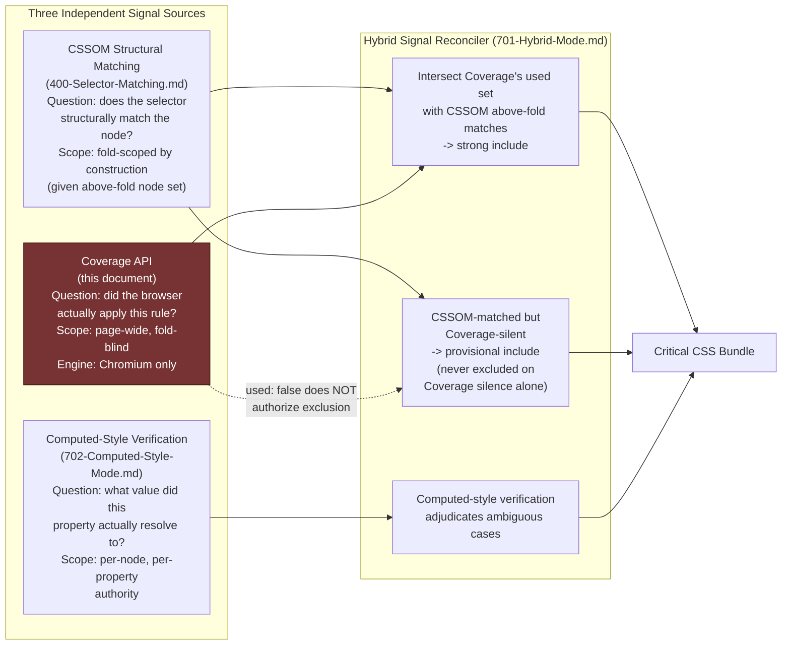

# 005 — Coverage API

## 1. Title

**Critical CSS Extraction Engine — Browser Specification Reference: Chrome DevTools Protocol CSS Coverage Domain**

## 2. Version

| Field | Value |
|---|---|
| Document Version | 1.0.0 |
| Status | Accepted |
| Last Updated | 2026-07-10 |
| Owners | Core Architecture Working Group |
| Stability | Stable (Phase 17 — Browser Specifications; this document is a reference summary of the third-party CDP `CSS` domain and does not itself define engine behavior — engine behavior is normatively owned by [../design/700-Coverage-Mode.md](../design/700-Coverage-Mode.md) and [../design/701-Hybrid-Mode.md](../design/701-Hybrid-Mode.md); changes to the CDP specification itself, or to the pinned Chromium build's implementation of it, require a re-review of both) |

## 3. Purpose

This document is a **reference summary** of the Chrome DevTools Protocol's (CDP) `CSS` domain coverage-tracking methods — `CSS.startRuleUsageTracking`, `CSS.takeCoverageDelta`, `CSS.stopRuleUsageTracking`, and the `CSS.RuleUsage` record they produce — as an external, third-party browser-automation API this engine consumes rather than a specification this engine's own architecture defines. It exists to give implementers and reviewers a precise, engine-scoped statement of exactly what "used" means under this API, why the API is Chromium-only (a Blink-internal instrumentation feature, not a cross-engine web standard), and why — given both of those facts — this engine treats Coverage as **one signal among three** in Hybrid extraction mode rather than as an authoritative, standalone source of truth.

This document does not re-specify how this engine wires the API (owned by [../design/101-Playwright-Adapter.md](../design/101-Playwright-Adapter.md) Section 8.4), how Coverage mode's standalone pipeline runs (owned by [../design/700-Coverage-Mode.md](../design/700-Coverage-Mode.md)), or how Coverage's output is reconciled with the other two signals in Hybrid mode (owned by [../design/701-Hybrid-Mode.md](../design/701-Hybrid-Mode.md)). Rather, it is the specification-reference layer those three design documents sit on top of — the same layering relationship [004-Shadow-DOM.md](./004-Shadow-DOM.md) establishes with respect to [../design/106-DOM-Snapshot.md](../design/106-DOM-Snapshot.md) and [../design/307-Constructable-Stylesheets.md](../design/307-Constructable-Stylesheets.md): a design document specifies *what the engine does*; a Phase 17 spec-reference document specifies *what the underlying browser/protocol guarantees, and does not guarantee*, so the engine's design choices can be checked against a stable, correct foundation rather than every design document re-deriving CDP semantics inline.

The practical motivation for treating this as reference material worth its own document, rather than a paragraph inside [../design/700-Coverage-Mode.md](../design/700-Coverage-Mode.md), is that "used" is a term with a precise, narrow, and easy-to-over-trust meaning under this API, and getting that meaning wrong in either direction — assuming Coverage is more authoritative than it is, or dismissing it as noise rather than a genuinely valuable signal — leads directly to either an under-scoped critical-CSS bundle (missing rules a real user's browser needed) or an unnecessarily bloated one (rules Coverage's page-wide scope over-reports as relevant). Both failure modes are avoidable once "used" is understood precisely, which is this document's entire purpose.

## 4. Audience

- Implementers of the Coverage Engine package (`packages/coverage`, per [../design/700-Coverage-Mode.md](../design/700-Coverage-Mode.md)), who need the CDP-level ground truth this document states before implementing against it.
- Implementers of the Playwright Adapter's `CoverageSession` primitive ([../design/101-Playwright-Adapter.md](../design/101-Playwright-Adapter.md) Section 8.4), who own the direct CDP wiring this document describes at the protocol-message level.
- Implementers of Hybrid mode's Signal Reconciler ([../design/701-Hybrid-Mode.md](../design/701-Hybrid-Mode.md)), who must understand precisely why Coverage's `used: true`/`used: false` cannot be treated as either a sufficient or a necessary condition for inclusion on its own.
- Engineers configuring extraction-mode selection in CI (Coverage-only smoke check versus full Hybrid mode), who need to understand what accuracy tradeoff a Coverage-only choice actually accepts.
- Engineers debugging discrepancies between what Coverage reports as used and what the CSSOM Walker's selector matching reports as matched, for whom this document's Section 8.4 (Precisely What "Used" Means) is the primary reference.
- Engineers evaluating browser-engine support matrices for CI targets (Chromium, Firefox, WebKit), who need an authoritative statement of Coverage's Chromium-only availability and its failure mode on other engines.

Readers are assumed to have a working familiarity with the Chrome DevTools Protocol's general session/domain model (`https://chromedevtools.github.io/devtools-protocol/`) and with this project's CSSOM Walker and rule-matching baseline ([000-CSSOM.md](./000-CSSOM.md), [400-Selector-Matching.md](../design/400-Selector-Matching.md)). This is not an introduction to CDP; it is a normative reference to one CDP domain's exact semantics as they bear on this engine's correctness.

## 5. Prerequisites

- [../design/700-Coverage-Mode.md](../design/700-Coverage-Mode.md) — the engine's Coverage extraction mode design, which this document's Section 8 (in particular 8.4, "Precisely What 'Used' Means") underwrites at the protocol-specification level.
- [../design/701-Hybrid-Mode.md](../design/701-Hybrid-Mode.md) — the three-signal reconciliation strategy that consumes Coverage as one input; this document's Section 8.5 explains why that architectural choice is the only defensible one given Coverage's actual guarantees.
- [../design/101-Playwright-Adapter.md](../design/101-Playwright-Adapter.md) Section 8.4 — the concrete `CoverageSession` wrapper around the CDP calls this document describes.
- [000-CSSOM.md](./000-CSSOM.md) — baseline CSSOM concepts (`CSSStyleSheet`, `CSSRule`, source text and byte offsets) this document's byte-range discussion assumes.
- [002-Cascade.md](./002-Cascade.md) — cascade resolution concepts (specificity, origin, `!important`, layers) relevant to understanding why Coverage's rule-level "applied" signal is cascade-aware in a way structural matching is not.
- Familiarity, at a conceptual level, with the CDP session/domain model: `Target`, `Session`, domain `enable`/`disable` lifecycle, and CDP's general request/response/event message shapes.

## 6. Related Documents

- [../design/700-Coverage-Mode.md](../design/700-Coverage-Mode.md) — the engine's Coverage extraction mode; this document is its protocol-level specification reference.
- [../design/701-Hybrid-Mode.md](../design/701-Hybrid-Mode.md) — the three-signal reconciliation strategy Coverage is one input to.
- [../design/101-Playwright-Adapter.md](../design/101-Playwright-Adapter.md) — the concrete CDP session wiring and Coverage-to-CSSOM correlation algorithm.
- [../design/106-DOM-Snapshot.md](../design/106-DOM-Snapshot.md) — the DOM Collector, whose above-fold node set is the CSSOM-matching signal Coverage is intersected against in Hybrid mode.
- [../design/307-Constructable-Stylesheets.md](../design/307-Constructable-Stylesheets.md) — Constructable Stylesheets discovery, relevant to Coverage's attribution gaps for `adoptedStyleSheets`-sourced rules (Section 8.6 below).
- [000-CSSOM.md](./000-CSSOM.md) — CSSOM primitives (`CSSStyleSheet`, `CSSRule`, `cssText`) this document's byte-offset discussion depends on.
- [001-CSS-Variables.md](./001-CSS-Variables.md) — custom-property usage is not separately reported by the CSS Coverage domain (it tracks rule application, not per-declaration variable resolution), a distinction this document's Edge Cases section notes.
- [002-Cascade.md](./002-Cascade.md) — cascade semantics underlying why "used" reflects real cascade outcome rather than structural match.
- [003-Media-Queries.md](./003-Media-Queries.md) — a rule inside an inactive `@media` block is correctly unreported by Coverage, an expected agreement this document's Edge Cases section cross-references.
- [004-Shadow-DOM.md](./004-Shadow-DOM.md) — Coverage instruments resource-level stylesheet application regardless of shadow-root scoping; attributing a covered range back to the correct shadow-scoped rule depends on the CSSOM Walker's shadow-aware enumeration this sibling document specifies.
- [006-Container-Queries.md](./006-Container-Queries.md) — container-query-gated rules interact with Coverage similarly to media queries but with layout-dependent (not viewport-static) activation, noted in Edge Cases.
- [007-Nested-CSS.md](./007-Nested-CSS.md) — nested rules complicate byte-range-to-rule attribution in ways this document's Section 8.3 discusses in relation to minification.
- [008-Constructable-Stylesheets.md](./008-Constructable-Stylesheets.md) — the Phase 17 spec-reference sibling covering `adoptedStyleSheets` in full; this document's Section 8.6 defers to it for the Constructable-Stylesheets-specific attribution gap.

## 7. Overview

The Chrome DevTools Protocol exposes, within its `CSS` domain, a small family of methods purpose-built for exactly one job: telling an external tool which CSS rules the browser's own rendering engine actually applied while rendering a page, at a byte-range granularity within each stylesheet's source text. `CSS.startRuleUsageTracking()` begins instrumentation before any rendering occurs; `CSS.takeCoverageDelta()` can be called mid-session to sample accumulated usage without stopping tracking; and `CSS.stopRuleUsageTracking()` ends instrumentation and returns the final accumulated `CSS.RuleUsage[]` array. Each `RuleUsage` record names a `styleSheetId`, a `[startOffset, endOffset)` byte range within that stylesheet's source text, and a boolean `used` flag.

This is, in one sense, the single most trustworthy signal available to this engine: unlike CSSOM structural matching (`element.matches(selectorText)`, per [400-Selector-Matching.md](../design/400-Selector-Matching.md)), which can only ask "does this selector, as written, structurally correspond to this node?" — a question blind to the cascade's actual outcome — Coverage asks the browser itself "did you actually apply this rule?" A rule that structurally matches a node but loses the cascade to a higher-specificity or later-declared competing rule is correctly reported as **not** used for the properties it lost, because Chromium's own style-resolution machinery, not an external approximation of it, is the thing doing the reporting. This makes Coverage's false-positive rate for the narrow question "was this rule applied at all, anywhere" close to zero.

But this document's central subject is that this narrow question — "applied at all, anywhere on the page" — is emphatically **not** the question this engine exists to answer. This engine exists to answer "what CSS is required to render *above the fold*, for *this specific viewport*" (per `BRIEF.md` Section 2.1's Vision statement), and Coverage's page-wide, viewport-and-fold-blind reporting model is structurally incapable of distinguishing "used because it styles the visible hero" from "used because it styles a footer eight thousand pixels below the fold." Combined with the API's Chromium-only availability — it is a Blink-internal instrumentation hook exposed via CDP, with no equivalent in Firefox's or WebKit's remote-debugging protocols, and no standardization track toward becoming a cross-engine web platform feature — these two facts jointly explain why [../design/700-Coverage-Mode.md](../design/700-Coverage-Mode.md) and [ADR-0005-Hybrid-Extraction-Mode](../adr/ADR-0005-Hybrid-Extraction-Mode.md) treat Coverage as one signal among three (alongside CSSOM structural matching and computed-style verification, per [../design/701-Hybrid-Mode.md](../design/701-Hybrid-Mode.md)) rather than as this engine's sole or primary extraction strategy.

This document works through the exact protocol lifecycle and message shapes (Section 8.1–8.2), a precise statement of what "used" does and does not mean (Section 8.3–8.4), the Chromium-only availability constraint and its consequences (Section 8.5), and Coverage's interaction with Shadow DOM and Constructable Stylesheets attribution (Section 8.6), before the standard closing sections.

## 8. Detailed Design

### 8.1 The CDP `CSS` Domain Coverage Methods

The relevant methods, in the order a session invokes them, are:

**`CSS.enable`** — a prerequisite for any other `CSS` domain method; must be called once per CDP session before coverage tracking or any other `CSS` domain functionality (stylesheet enumeration via `CSS.getStyleSheetText`, etc.) is available. This is a general CDP domain-activation convention, not coverage-specific.

**`CSS.startRuleUsageTracking()`** — takes no parameters, returns no meaningful payload beyond acknowledgment. Its effect is to instruct Blink's style-resolution engine to begin recording, for every rule it applies during subsequent style recalculation and layout passes, the fact that it was applied. Critically, this instrumentation has a **hard ordering requirement**: it must be started before the page begins loading and rendering, because usage that occurs before tracking starts is never recorded — there is no retroactive accounting. A tool that starts tracking after `goto()` has already resolved initial styles will have already lost the render-blocking-stylesheet usage that is, for a critical-CSS tool specifically, the single most relevant usage window to observe.

**`CSS.takeCoverageDelta()`** — an optional, repeatable mid-session sampling call, returning the `RuleUsage[]` delta accumulated since the last `takeCoverageDelta()` call (or since `startRuleUsageTracking()`, if never previously called). This exists to let a caller observe usage at multiple checkpoints across a page's lifecycle (e.g., immediately after first paint, then again after a simulated scroll or interaction) without ending the tracking session. This engine's standalone Coverage pipeline ([../design/700-Coverage-Mode.md](../design/700-Coverage-Mode.md) Section 8.3) does not currently use mid-session deltas in its standard path — it accumulates across the entire navigation-to-stabilization window and reads the total via `stopRuleUsageTracking()` — but flags multi-checkpoint delta sampling as Future Work ([../design/700-Coverage-Mode.md](../design/700-Coverage-Mode.md) Section 16) for diagnosing which rules become used at which rendering phase.

**`CSS.stopRuleUsageTracking()`** — ends the instrumentation and returns the complete, accumulated `RuleUsage[]` array covering the entire tracked window (from `startRuleUsageTracking()` to this call, inclusive of anything already retrieved via intervening `takeCoverageDelta()` calls, whose semantics with respect to whether the final `stop` call's result is cumulative-total or remaining-delta-only is itself a detail this engine's adapter must handle correctly — see Implementation Notes item 2). After this call, the `CSS` domain reverts to its non-instrumented state; a subsequent `startRuleUsageTracking()` call within the same session begins a fresh, independent tracking window.

### 8.2 The `CSS.RuleUsage` Record Shape

```
CSS.RuleUsage {
  styleSheetId: string      // CDP-internal identifier, opaque, assigned fresh per navigation
  startOffset: number       // byte offset into the stylesheet's source text (UTF-16 code unit offset,
                             // matching the offset convention CDP uses elsewhere for source text)
  endOffset: number         // byte offset (exclusive) into the stylesheet's source text
  used: boolean             // whether the browser applied the rule occupying [startOffset, endOffset)
}
```

Three structural facts about this shape are consequential enough to state explicitly, since every downstream design decision in [../design/700-Coverage-Mode.md](../design/700-Coverage-Mode.md) traces back to one of them:

1. **Granularity is a byte range within source text, not a `CSSRule` object reference.** CDP has no notion of "this `CSSRule` object was used" — it reports "this span of characters in this stylesheet's original text corresponds to something that was applied." Mapping a byte range back to a specific `CSSStyleRule` the CSSOM Walker separately enumerated is *this engine's* responsibility, performed by a correlation algorithm ([../design/101-Playwright-Adapter.md](../design/101-Playwright-Adapter.md) Section 10.2) that indexes each stylesheet's rules by their own source byte ranges and does a containment lookup per `RuleUsage` entry. CDP does not do this mapping for the caller, and there is no protocol-level guarantee that a reported range aligns exactly with any single rule's boundaries (Section 8.3 below).
2. **`styleSheetId` is per-session, per-navigation, and semantically opaque.** It is not derived from, and bears no fixed relationship to, whatever indexing scheme the CSSOM Walker uses internally (`sourceStylesheetIndex`, per [../design/700-Coverage-Mode.md](../design/700-Coverage-Mode.md) Section 8.1 item 2). A fresh `styleSheetIdMap` bridging the two numbering schemes must be built after every navigation; caching a `styleSheetIdMap` across navigations is a well-documented silent-correctness trap ([../design/700-Coverage-Mode.md](../design/700-Coverage-Mode.md) Implementation Notes item 2), because a `styleSheetId` value from one navigation may coincidentally reuse an ID a *different* stylesheet was assigned in a prior navigation, silently misattributing usage.
3. **`used` is a single boolean per rule-sized range, not a per-declaration bitmap.** Within a single CSS rule with multiple declarations (`.btn { color: red; padding: 4px }`), CDP has no mechanism to report that `color` lost the cascade while `padding` won — the entire rule's occupied byte range is reported `used: true` if *any* of its declarations were applied at all. This is a genuine granularity ceiling of the current protocol, not an implementation gap in this engine's adapter, and it is the direct cause of [../design/700-Coverage-Mode.md](../design/700-Coverage-Mode.md)'s "Blind Spot 3" and Hybrid mode's provisional-include-by-default policy for matched-but-Coverage-silent declarations.

### 8.3 Byte-Range-to-Rule Attribution: Where Precision Breaks Down

Because CDP reports byte ranges rather than rule identities, this engine's correlation step (owned in full by [../design/101-Playwright-Adapter.md](../design/101-Playwright-Adapter.md) Section 10.2) must map each range to the CSSOM Walker's own rule-boundary bookkeeping. Under normal, unminified, non-nested stylesheet text, this mapping is exact and unambiguous: a rule's byte range is well-defined by its opening/closing brace positions in the original source text, and a reported `RuleUsage` range corresponds cleanly to exactly one rule (or, for a rule nested inside `@media`/`@supports`/`@layer`, to the innermost rule the range falls within).

Two conditions this document flags explicitly degrade that precision, and both are **protocol-level realities this engine's design must accommodate, not implementation defects to eliminate**:

**Minification.** Aggressively minified stylesheets — whitespace elision, adjacent-rule concatenation with no separating characters beyond the minimum the grammar requires — can produce byte ranges that align less cleanly with a naive text-offset understanding of "where does this rule start and end." The correlation algorithm mitigates this by indexing through the CSSOM Walker's own parsed rule-boundary metadata (which the Walker derives from actually parsing the stylesheet's grammar, not from re-scanning raw text for brace characters) rather than doing independent text arithmetic — but residual imprecision at exact boundary edges remains a documented, Chromium-build-version-dependent risk that must be validated against the pinned build ([../design/700-Coverage-Mode.md](../design/700-Coverage-Mode.md) Edge Cases, Blind Spot 4).

**Deep nesting.** A rule nested several levels inside `@media`/`@supports`/`@layer` blocks, or (per [007-Nested-CSS.md](./007-Nested-CSS.md)) inside native CSS nesting's `&`-relative rule structure, still occupies one contiguous byte range in the original source text from CDP's perspective — CDP does not itself understand nesting semantics; it reports usage purely in terms of the flat source-text position where Blink's parser determined a rule's declaration block begins and ends. The correlation algorithm's containment lookup must therefore walk the CSSOM Walker's rule tree to the correct nesting depth to find the innermost rule whose range contains a given `RuleUsage` entry's offsets, rather than assuming a flat, unnested rule list.

### 8.4 Precisely What "Used" Means

This is the section every other part of this document exists to support, and its content is stated as plainly as possible because imprecision here is the single most common source of Coverage-related bugs in a critical-CSS tool.

**"Used" means: during the window between `startRuleUsageTracking()` and the corresponding `stopRuleUsageTracking()`/`takeCoverageDelta()` call, Blink's style-resolution and layout engine applied the declaration(s) occupying this byte range to at least one element, anywhere in the document, at least once.** Every clause in that sentence carries weight:

- **"Applied," not "matched."** A selector can structurally match an element (per [400-Selector-Matching.md](../design/400-Selector-Matching.md)'s `element.matches()`-equivalent question) and still lose the cascade entirely to a competing declaration — in which case the losing rule is correctly reported `used: false` (or, at declaration granularity within a partially-winning rule, the whole rule is still `used: true` per Section 8.2 item 3's ceiling, even though one of its declarations individually lost). "Used" tracks the browser's actual cascade *outcome*, which is strictly more accurate than structural matching for the question it answers, and strictly narrower in scope than the question this engine needs answered.
- **"Anywhere in the document."** Coverage has no viewport, fold, or geometry concept whatsoever. A rule styling an element 10,000 pixels below the fold that the user will very likely never scroll to is reported identically to a rule styling the page's most prominent above-fold hero — both are simply "used." This is Blind Spot 1 in [../design/700-Coverage-Mode.md](../design/700-Coverage-Mode.md), and it is the single most important reason Coverage cannot be this engine's sole signal: the engine's entire purpose is fold-scoping, and Coverage's reporting model is fold-blind by construction, not by an oversight that could be patched.
- **"At least once, during the observed window."** A rule gated behind an interaction state (`:hover`, `:focus`, `:active`, a `[data-expanded]` attribute toggled by a click handler) that the automated extraction run never triggers is never applied during the tracked window and is therefore reported `used: false` — correctly, from CDP's perspective (it genuinely was not applied while being observed), but a false negative from this engine's perspective if that rule would, in fact, be needed for a real user's above-fold, post-interaction render. This is Blind Spot 2 in [../design/700-Coverage-Mode.md](../design/700-Coverage-Mode.md).
- **"During the window between start and stop."** Anything the browser applies *before* `startRuleUsageTracking()` completes is permanently unobserved — there is no retroactive query. This is why the ordering constraint in Section 8.1 is a hard correctness requirement, not a performance nicety: starting late loses exactly the render-blocking-stylesheet usage most relevant to above-fold, first-paint content.

**What "used: false" does *not* mean.** A `used: false` entry does not mean "this rule is safe to exclude." It means only "this rule was not applied during the observed window" — which is consistent with at least three distinct underlying realities: (a) the rule genuinely never applies to this page at all (a true negative, safe to exclude); (b) the rule applies only below the fold and was never in this engine's scope of interest anyway (also effectively safe to exclude for critical-CSS purposes, though for a different reason than (a)); or (c) the rule would apply above the fold but requires an interaction state, hydration step, or conditional branch this specific automated run did not trigger (an unsafe exclusion — a false negative). Coverage's own output cannot distinguish these three cases from each other; only combining it with CSSOM structural matching against the fold-scoped node set (per [../design/701-Hybrid-Mode.md](../design/701-Hybrid-Mode.md)) can, which is precisely why [../design/700-Coverage-Mode.md](../design/700-Coverage-Mode.md) Implementation Notes item 6 states: "never treat `used: false` as authoritative for exclusion in Hybrid mode."

### 8.5 Chromium-Only Availability

The `CSS.startRuleUsageTracking`/`CSS.takeCoverageDelta`/`CSS.stopRuleUsageTracking` trio is a **Blink-internal instrumentation feature exposed through CDP**, not a cross-engine web-platform API and not part of any W3C/WHATWG standards track. It exists because Chromium's own DevTools Coverage panel (the user-facing feature developers see when they open DevTools' "Coverage" tab) needs exactly this data, and CDP is the mechanism by which any external tool — including this engine's browser automation layer — gets programmatic access to the same instrumentation DevTools itself uses internally.

This has one direct, unavoidable consequence for this engine's cross-browser story: **Coverage mode has no equivalent on Firefox or WebKit.** Firefox's Remote Protocol and WebKit's remote-debugging protocol (the protocols underlying Playwright's Firefox and WebKit automation, per [../design/101-Playwright-Adapter.md](../design/101-Playwright-Adapter.md)) do not expose an equivalent rule-usage-tracking instrumentation hook, because neither engine's internal style-resolution machinery has been instrumented this way for external consumption, and no standards effort is underway to define a cross-engine equivalent as of this document's writing. This is not a temporary gap this engine's adapter can work around with a different CDP call, nor a configuration this engine can enable on a non-Chromium target — it is a structural absence in those browsers' automation surfaces.

**The consequence for this engine's design, stated precisely, is per [../design/700-Coverage-Mode.md](../design/700-Coverage-Mode.md) Tradeoffs table: fail fast (throw `CapabilityUnavailableError`) on a non-Chromium target rather than silently returning an empty used-rule set.** A silent empty result on Firefox/WebKit would be catastrophic and undetectable: every rule would appear "never used," and if Coverage were ever mistakenly treated as authoritative rather than one signal among three, this would look identical to "nothing on this page is critical" — a silent correctness failure of the worst kind (per [../design/006-Design-Principles.md](../architecture/006-Design-Principles.md) Principle 6, Fail-Fast Diagnostics). The correct behavior — and the one this engine implements — is for the Coverage Engine to detect the target browser engine before attempting `CSS.enable`/`startRuleUsageTracking`, and to throw explicitly, forcing the caller (whether the standalone Coverage pipeline or the Hybrid Signal Reconciler) to choose an explicit fallback: for standalone Coverage-only CI checks, this typically means the check is simply not run on non-Chromium targets; for Hybrid mode, this means degrading gracefully to CSSOM-matching-plus-computed-style-verification only, with the Coverage signal's absence explicitly recorded rather than silently treated as "zero rules used" ([../design/701-Hybrid-Mode.md](../design/701-Hybrid-Mode.md)).

This constraint is the second (alongside fold-blindness, Section 8.4) of the two structural reasons Coverage cannot be this engine's sole extraction strategy: even where Coverage's signal would be maximally useful, it is simply unavailable on two of the three browser engines this project targets for rendering-fidelity validation ([../design/703-Visual-Diff.md](../design/703-Visual-Diff.md)), so a Coverage-only design would mean this engine's core extraction correctness varies by target engine — an unacceptable inconsistency for a tool whose entire premise is browser-fidelity-first extraction (`BRIEF.md` Section 2.1).

### 8.6 Interaction with Shadow DOM and Constructable Stylesheets

Coverage instruments rule application at the level of **stylesheet resources**, tracked by Blink's style engine regardless of where in the DOM tree — light DOM or any depth of shadow tree — the rule's matched elements happen to live. This means a `RuleUsage` entry for a rule whose only matching elements are inside a shadow tree is reported identically in shape to one whose matches are all in the light DOM: same `styleSheetId`, same byte-range/`used` structure. Correctly attributing such an entry back to "this rule belongs to this specific shadow root's stylesheet" is not something Coverage itself disambiguates — it requires the CSSOM Walker's own shadow-root-aware stylesheet enumeration (per [004-Shadow-DOM.md](./004-Shadow-DOM.md) Section 8.6 and [../design/307-Constructable-Stylesheets.md](../design/307-Constructable-Stylesheets.md)) to have already correctly indexed which `styleSheetId` corresponds to which shadow root's `<style>` element or adopted sheet, so that the correlation step (Section 8.3) resolves into the right scope.

**Constructable Stylesheets specifically** introduce a documented, Chromium-build-version-dependent attribution risk: Coverage's resource-tracking model was designed around `<link>`/`<style>`-element-sourced stylesheets, which have a natural, stable network-resource or DOM-element identity CDP can key off of. A `CSSStyleSheet` constructed via `new CSSStyleSheet()` and adopted via `adoptedStyleSheets` has no such natural resource identity — it was never fetched, and it may not correspond to any DOM element at all. Whether, and how reliably, a given Chromium build's Coverage instrumentation correctly assigns a `styleSheetId` to such a sheet (as opposed to failing to instrument it, or reporting it under an identifier the `styleSheetIdMap` construction step cannot cleanly resolve) is a build-version-dependent detail this document does not assume is stable across Chromium releases — [008-Constructable-Stylesheets.md](./008-Constructable-Stylesheets.md) and [../design/307-Constructable-Stylesheets.md](../design/307-Constructable-Stylesheets.md) Section 12 (Edge Cases) both flag this as requiring validation against the pinned Chromium build ([../design/101-Playwright-Adapter.md](../design/101-Playwright-Adapter.md) Section 12), and this document's role is simply to make explicit that the uncertainty originates in Coverage's own resource-tracking design assumptions, not in this engine's correlation code.

When attribution genuinely fails for either reason — a shadow-scoped stylesheet the Walker did not enumerate at all (cross-origin, or an attribution gap of the kind just described), or a Constructable Stylesheet Coverage reports usage for under a `styleSheetId` the `styleSheetIdMap` cannot resolve — the correlation algorithm records an `ORPHANED_COVERAGE_ENTRY` diagnostic (per [../design/700-Coverage-Mode.md](../design/700-Coverage-Mode.md) Section 10.3) rather than silently discarding the entry, consistent with Principle 6's fail-fast-diagnostics discipline applied throughout this engine.

## 9. Architecture

### 9.1 Coverage API Lifecycle — Sequence Diagram

The following sequence diagram elaborates the protocol-level start/navigate/stop/collect lifecycle Section 8.1 describes in prose, showing the CDP session boundary, the hard pre-navigation ordering constraint, and the point at which usage becomes retrievable.

```mermaid
sequenceDiagram
    participant Orch as Orchestrator
    participant Cov as Coverage Engine (packages/coverage)
    participant Adapter as PlaywrightPageHandle
    participant CDP as CDP Session
    participant Blink as Blink Style Engine (Chromium renderer)

    Orch->>Cov: begin extraction (target engine confirmed Chromium)
    Cov->>Adapter: startCoverage()
    Adapter->>CDP: attach CDP session to page/target
    Adapter->>CDP: send('CSS.enable')
    CDP->>Blink: activate CSS domain instrumentation hooks
    Adapter->>CDP: send('CSS.startRuleUsageTracking')
    CDP->>Blink: begin recording rule-application events
    Note over Cov,Blink: MUST precede navigation — usage before this point<br/>is never retroactively recorded (Section 8.1)

    Orch->>Adapter: goto(route)
    Blink->>Blink: parse CSS, resolve cascade,<br/>lay out, paint —<br/>record every applied rule's byte range<br/>(page-wide, no fold/viewport awareness)
    Orch->>Adapter: await stabilization (per 104-Rendering-Stabilization.md)

    opt Mid-session sampling (optional, not in standard pipeline)
        Cov->>CDP: send('CSS.takeCoverageDelta')
        CDP-->>Cov: RuleUsage[] (delta since last checkpoint)
    end

    Orch->>Cov: coverageSession.stop()
    Cov->>CDP: send('CSS.stopRuleUsageTracking')
    CDP->>Blink: finalize accumulated usage, end instrumentation
    Blink-->>CDP: RuleUsage[] (styleSheetId, startOffset, endOffset, used)
    CDP-->>Cov: RuleUsage[]
    Cov->>CDP: detach()

    Cov->>Cov: build styleSheetIdMap (CDP id -> Walker sourceStylesheetIndex),<br/>fresh for this navigation
    Cov->>Cov: correlate each RuleUsage range -> CSSRule<br/>via Walker's rule-boundary index
    Cov->>Cov: partition used === true / used === false;<br/>record ORPHANED_COVERAGE_ENTRY for unresolved ranges
    Cov-->>Orch: CoverageResult { usedRules, unusedRules, diagnostics }
```

This diagram makes explicit the fact stated in prose in Section 8.1: **there is no protocol message that lets a caller retroactively ask "what was used before I started tracking?"** — the `Note` marking the pre-navigation ordering constraint is the single most consequential detail in this entire lifecycle, and its violation (starting tracking after `goto()`) is a silent, hard-to-detect correctness bug rather than an error CDP itself surfaces.

### 9.2 Coverage as One of Three Signals — Component View



This view is the architectural payoff of Sections 8.4–8.5: Coverage is drawn as one of three peer inputs, never as the sole gate, and the diagram deliberately marks the "used: false does not authorize exclusion" edge as a dashed, negative constraint rather than a normal data-flow edge, mirroring [../design/700-Coverage-Mode.md](../design/700-Coverage-Mode.md) Implementation Notes item 6's explicit prohibition.

## 10. Algorithms

Per Global Rule 4.5, this section specifies, in algorithmic terms, the protocol-level procedure a correct adapter implementation must follow to safely acquire and interpret a Coverage session — complementing (not duplicating) the byte-range-to-rule correlation algorithm already specified in full in [../design/700-Coverage-Mode.md](../design/700-Coverage-Mode.md) Section 10. This document's algorithm is scoped one level earlier: acquiring the session correctly and validating engine capability before any correlation is attempted.

### 10.1 Algorithm: Capability-Gated Coverage Session Acquisition

**Problem statement.** Given a `PageHandle` for a target that may be backed by any of Chromium, Firefox, or WebKit, safely start a rule-usage-tracking session before navigation if and only if the target is Chromium-backed, and fail explicitly and immediately otherwise — never silently proceeding as though tracking had started.

**Inputs.** `pageHandle: PageHandle` (per [../design/100-Browser-Abstraction.md](../design/100-Browser-Abstraction.md)), `engineKind: "chromium" | "firefox" | "webkit"` (known at Browser Pool acquisition time, per [../design/102-Browser-Pool.md](../design/102-Browser-Pool.md)).

**Outputs.** `CoverageSession` (an active, pre-navigation tracking handle) on success; throws `CapabilityUnavailableError` on a non-Chromium target.

**Pseudocode.**

```text
function acquireCoverageSession(pageHandle, engineKind) -> CoverageSession:
    if engineKind != "chromium":
        throw CapabilityUnavailableError(
            capability: "CSS.startRuleUsageTracking",
            reason: "Coverage API is a Blink-internal CDP instrumentation feature;" +
                    " no equivalent exists on Firefox or WebKit remote-debugging protocols",
            engineKind: engineKind
        )

    cdpSession = pageHandle.newCDPSession()          # must precede navigation
    cdpSession.send("CSS.enable")
    cdpSession.send("CSS.startRuleUsageTracking")

    return CoverageSession {
        cdpSession: cdpSession,
        startedAt: logicalTimestamp(),               # for diagnostics only, never used
                                                      # for deterministic output (Principle 5)
        stopped: false
    }

function CoverageSession.stop(self) -> RuleUsage[]:
    assert not self.stopped, "stop() called twice on the same CoverageSession"
    result = self.cdpSession.send("CSS.stopRuleUsageTracking")
    self.cdpSession.detach()
    self.stopped = true
    return result.ruleUsage
```

**Time complexity.** `O(1)` — this is a fixed, small number of CDP round trips (session attach, `CSS.enable`, `CSS.startRuleUsageTracking`, later `CSS.stopRuleUsageTracking`, `detach`), independent of page size or stylesheet count; the cost that scales with page size is the browser-internal instrumentation overhead during the accumulation window (Section 14), not this acquisition algorithm itself.

**Memory complexity.** `O(1)` for the session handle; the `RuleUsage[]` array returned by `stop()` is `O(U)` in the number of usage entries, bounded by total rule count across all loaded stylesheets, handled by the correlation algorithm in [../design/700-Coverage-Mode.md](../design/700-Coverage-Mode.md) Section 10, not by this acquisition step.

**Failure cases.** Calling `stop()` twice on the same session is a caller bug, guarded by the `assert`, and should never occur given correct pipeline sequencing ([../design/700-Coverage-Mode.md](../design/700-Coverage-Mode.md) Section 8.3). A page navigating away mid-session (before `stop()` is called) invalidates the CDP session's target association and surfaces as a `StaleCoverageSessionError` from the adapter layer ([../design/101-Playwright-Adapter.md](../design/101-Playwright-Adapter.md) Section 12) when `stop()` is subsequently attempted — this is treated as a work-unit-level failure requiring full re-entry from `BrowserAcquired`, per the same non-partial-retry discipline [../design/106-DOM-Snapshot.md](../design/106-DOM-Snapshot.md) Section 10.1 establishes for DOM Collector failures, since a Coverage session that spans a navigation it did not expect cannot be trusted to represent a single coherent page-render window.

**Optimization opportunities.** None material at this step — the acquisition cost is fixed and small relative to the navigation/stabilization window it precedes. The one legitimate lever is whether to call `CSS.enable` once per session versus once per adapter lifetime if a page/context is reused across routes in a batch run; this is scoped to [../design/102-Browser-Pool.md](../design/102-Browser-Pool.md)'s pooling policy, not to this algorithm.

### 10.2 Algorithm: Engine-Capability Detection Timing

**Problem statement.** Determine, early enough to avoid wasted navigation work, whether the currently acquired `PageHandle`'s backing browser engine supports Coverage, so that a non-Chromium target fails before, not after, a route's navigation has already been performed pointlessly under an extraction mode that cannot complete.

**Inputs.** `browserPool: BrowserPool` configuration (per [../design/102-Browser-Pool.md](../design/102-Browser-Pool.md)), `requestedMode: "coverage" | "hybrid" | "cssom-only"`.

**Outputs.** A capability decision made at Browser Pool acquisition time, before a `PageHandle` for a given route is even requested, rather than discovered mid-pipeline.

**Pseudocode.**

```text
function planExtractionCapability(browserPool, requestedMode) -> ExtractionPlan:
    engineKind = browserPool.configuredEngine()      # known statically from CI/config,
                                                      # not probed per-page at runtime
    if requestedMode == "coverage" and engineKind != "chromium":
        throw CapabilityUnavailableError(...)        # fail before acquiring any page at all

    if requestedMode == "hybrid" and engineKind != "chromium":
        # Documented degradation, not a hard failure:
        return ExtractionPlan {
            mode: "hybrid-degraded",
            activeSignals: ["cssom", "computed-style"],   # Coverage signal explicitly absent,
                                                            # not silently zero
            diagnostic: EngineDegradationDiagnostic(engineKind, "coverage")
        }

    return ExtractionPlan { mode: requestedMode, activeSignals: allSignalsFor(requestedMode) }
```

**Time complexity.** `O(1)` — engine kind is a static configuration fact, not something requiring a probe of the live page.

**Memory complexity.** `O(1)`.

**Failure cases.** A misconfigured CI matrix that requests `"coverage"` mode against a Firefox/WebKit target fails at plan time, before any browser is even launched for the route — this is a deliberate design choice to surface the configuration error as early and cheaply as possible, rather than after paying navigation and stabilization cost only to fail at `startCoverage()`.

**Optimization opportunities.** None beyond the early-fail design itself; this is already the minimal-cost point at which the failure can be detected.

## 11. Implementation Notes

1. **`startCoverage()` must be sequenced strictly before `goto()`**, coordinated with the plugin `beforeLaunch`/navigation-timing hooks per [../design/700-Coverage-Mode.md](../design/700-Coverage-Mode.md) Implementation Notes item 1 — this is the single most important sequencing rule in this entire document, and any refactor of the extraction pipeline's call order must preserve it explicitly, ideally with an automated check (e.g., an integration test asserting a `RuleUsage` entry exists for a render-blocking above-fold stylesheet rule) rather than relying on code review alone to catch a reordering regression.
2. **Build `styleSheetIdMap` fresh per navigation, never cached across routes or navigations.** CDP `styleSheetId` values are per-navigation-scoped and can be reused across navigations for entirely different stylesheets; a stale map silently misattributes usage to the wrong rule.
3. **Detach the CDP session after `stop()`**, before the page is returned to the Browser Pool, to avoid leaking CDP session state into a subsequently reused pooled page (per [../design/700-Coverage-Mode.md](../design/700-Coverage-Mode.md) Implementation Notes item 5).
4. **Never treat `used: false` as sufficient grounds for exclusion outside the Hybrid Reconciler's explicit logic.** This document's Section 8.4 states why in full; the implementation-level consequence is that the Coverage Engine's own output type should make "unused" and "orphaned/unattributable" distinct, explicit states (per [../design/700-Coverage-Mode.md](../design/700-Coverage-Mode.md) Implementation Notes item 4), so no downstream consumer can accidentally collapse them into a single "not used" boolean and lose the distinction.
5. **Detect engine capability at Browser Pool configuration time, not per-page at runtime**, per Section 10.2 — this avoids wasted per-route navigation cost on a misconfigured non-Chromium Coverage run and produces a clearer, earlier failure signal.
6. **Treat mid-session `CSS.takeCoverageDelta()` calls as an opt-in diagnostic feature, not part of the standard extraction path**, per Section 8.1 — the standard pipeline accumulates across the full navigation-to-stabilization window and reads the total once via `stop()`, keeping the pipeline's control flow simple and matching [../design/700-Coverage-Mode.md](../design/700-Coverage-Mode.md) Section 8.3's documented standalone pipeline exactly.

## 12. Edge Cases

- **Starting tracking after navigation has begun.** Usage during the un-tracked window is permanently lost with no retroactive recovery; this is a silent, not a loud, failure mode unless the adapter itself validates ordering (Implementation Notes item 1).
- **`styleSheetId` reuse across navigations.** A stale `styleSheetIdMap` silently misattributes coverage; mitigated only by rebuilding the map fresh per navigation (Section 8.2 item 2, Implementation Notes item 2).
- **Rule-granularity ceiling for multi-declaration rules.** A rule with a losing and a winning declaration is reported `used: true` wholesale; Coverage cannot prune the losing declaration alone (Section 8.2 item 3).
- **Minified stylesheets and byte-range/rule-boundary misalignment.** Residual imprecision at exact boundaries, mitigated but not eliminated by routing through the CSSOM Walker's parsed rule-boundary metadata rather than raw text-offset arithmetic (Section 8.3).
- **Deeply nested rules (`@media`/`@supports`/`@layer`/CSS nesting).** A reported byte range's innermost containing rule may be several nesting levels deep; the correlation algorithm must resolve to the correct depth, not assume a flat rule list (Section 8.3, [007-Nested-CSS.md](./007-Nested-CSS.md)).
- **`@media`/`@supports`-short-circuited rules.** A rule inside an inactive conditional branch is correctly unreported by Coverage — expected agreement with CSSOM matching (which also should not match it as currently relevant), not a disagreement to flag ([003-Media-Queries.md](./003-Media-Queries.md), [../design/700-Coverage-Mode.md](../design/700-Coverage-Mode.md) Edge Cases).
- **Container-query-gated rules.** Unlike static `@media` conditions, container-query activation depends on the queried container's layout-computed size, which can change during the observed window as layout stabilizes; Coverage's page-wide accumulation captures whatever the final resolved state was by `stop()` time, but a container query that resolves differently at different points during stabilization could, in principle, produce usage that reflects a transient rather than final layout state — flagged here as a case warranting empirical validation once [006-Container-Queries.md](./006-Container-Queries.md) is fully specified.
- **Interaction-state-gated rules never triggered.** `:hover`/`:focus`/`:active`/script-toggled-class rules are false negatives for Coverage if the automated run never simulates the triggering interaction (Section 8.4, Blind Spot 2).
- **Cross-origin stylesheets.** Coverage, operating at the CDP/network-resource level, can report usage for cross-origin sheets the CSSOM Walker cannot enumerate due to CORS restrictions on `cssRules` access; these surface as `ORPHANED_COVERAGE_ENTRY` diagnostics rather than silent drops ([../design/700-Coverage-Mode.md](../design/700-Coverage-Mode.md) Edge Cases).
- **Shadow-scoped stylesheets.** Coverage reports usage per stylesheet resource with no shadow-tree scoping awareness of its own; correct attribution back to a specific shadow root's rule depends entirely on the CSSOM Walker's shadow-aware enumeration ([004-Shadow-DOM.md](./004-Shadow-DOM.md) Section 8.6).
- **Constructable/adopted stylesheets.** Attribution reliability is Chromium-build-version-dependent, since these sheets have no natural network-resource identity Coverage's tracking model was originally designed around ([008-Constructable-Stylesheets.md](./008-Constructable-Stylesheets.md), [../design/307-Constructable-Stylesheets.md](../design/307-Constructable-Stylesheets.md) Edge Cases).
- **Non-Chromium targets.** Coverage is categorically unavailable; the engine must fail fast with `CapabilityUnavailableError` rather than return a silent, empty, indistinguishable-from-"nothing is used" result (Section 8.5).
- **Custom-property (CSS variable) resolution is not separately tracked.** Coverage reports rule-level application, not per-declaration custom-property resolution; a rule that only sets a custom property consumed elsewhere via `var()` is reported used/unused exactly like any other rule, with no finer-grained signal about the variable's own resolved value chain ([001-CSS-Variables.md](./001-CSS-Variables.md)).

## 13. Tradeoffs

| Decision | Alternative Considered | Why Chosen | Cost Accepted |
|---|---|---|---|
| Treat Coverage as one signal among three (Hybrid mode), never authoritative alone | Ship Coverage-only as the production default extraction strategy | Coverage's page-wide, fold-blind scope (Section 8.4) and Chromium-only availability (Section 8.5) are structural mismatches to this engine's fold-scoped, cross-engine-fidelity-validated purpose; no implementation improvement closes either gap | Production extraction requires the more expensive three-signal Hybrid pipeline ([../design/701-Hybrid-Mode.md](../design/701-Hybrid-Mode.md)) rather than a single cheap CDP call |
| Fail fast (`CapabilityUnavailableError`) on non-Chromium targets | Silently return an empty used-rule set on Firefox/WebKit | A silent empty result is indistinguishable from "nothing on this page is used," a catastrophic silent-correctness failure if ever mistaken for authoritative (Principle 6) | Callers must explicitly handle the error and choose a documented fallback (skip the check, or degrade Hybrid mode to two signals) |
| Route byte-range-to-rule correlation through the CSSOM Walker's parsed rule-boundary metadata | Naive raw-text-offset arithmetic against stylesheet source | Correctly handles nested rules and tolerates most minification-induced offset ambiguity; naive arithmetic breaks on both (Section 8.3) | More complex correlation code with a hard dependency on the Walker's own rule-tree metadata being available and correct |
| Retain `used: false` and "orphaned/unattributable" as distinct states, never collapsed | Represent Coverage output as a single "used rule IDs" set with all else implicitly excluded | The Reconciler needs "present but unused" (a real signal) distinguished from "coverage reported something unidentifiable" (a diagnostic gap), per [../design/700-Coverage-Mode.md](../design/700-Coverage-Mode.md) Implementation Notes item 4 | Larger, three-state `CoverageResult` payload instead of a single boolean set |
| Detect engine capability at Browser Pool configuration time, before per-route navigation | Probe capability lazily on first `startCoverage()` call per route | Avoids paying navigation/stabilization cost on every misconfigured route before failing; fails once, early, cheaply (Section 10.2) | Requires the Browser Pool's engine configuration to be known and threaded through to the extraction planner ahead of route-level work |

## 14. Performance

- **CPU complexity.** The Coverage API's own browser-side instrumentation overhead is borne entirely by Chromium during the accumulation window and is roughly proportional to the number and size of stylesheets and the number of style-recalculation passes triggered during that window; it is off this engine's own CPU critical path except as additional wall-clock latency the extraction run must wait through. On the engine's own side, the dominant cost is the correlation step's `O(S · R log R + U log R)` bound, specified in full in [../design/700-Coverage-Mode.md](../design/700-Coverage-Mode.md) Section 10.4, not anything introduced by this document's acquisition/lifecycle algorithms (Section 10 above), which are `O(1)`.
- **Memory complexity.** `O(U)` for the returned `RuleUsage[]` array, where `U` is total usage-entry count across all tracked stylesheets; transient, freed once correlation completes, consistent with [../design/015-Runtime-Model.md](../architecture/015-Runtime-Model.md) Section 8.5's transient-per-route memory model.
- **Caching strategy.** The `RuleUsage[]` result itself is not meaningfully cacheable across routes (it reflects a specific navigation's rendering), but the per-stylesheet rule-boundary index built for correlation is a candidate for cross-route reuse when a batch run shares an unchanged stylesheet across routes, contingent on Cache Manager fingerprinting recognizing the shared asset ([../design/700-Coverage-Mode.md](../design/700-Coverage-Mode.md) Section 14, [704-Incremental-Extraction.md](../design/704-Incremental-Extraction.md)).
- **Parallelization.** The accumulation window (`startRuleUsageTracking()` to `stop()`) cannot itself be parallelized — it must span exactly the navigation-to-stabilization window on the one page it is tracking. Acquisition (Section 10.1) and correlation (post-`stop()`) are both cheap and, for correlation specifically, embarrassingly parallel across independent routes/pages run concurrently in a batch.
- **Incremental execution.** Coverage's page-wide, whole-render accumulation model resists true incremental scoping — even if only one stylesheet changed since a prior run, Coverage must re-observe the entire page's rendering to get a coherent usage picture, since usage of unchanged stylesheets can still shift if changed markup or scripts alter what gets applied. [704-Incremental-Extraction.md](../design/704-Incremental-Extraction.md) discusses limiting *reconciliation* scope to changed stylesheets while accepting Coverage *collection* itself remains whole-page.
- **Profiling guidance.** Attribute Coverage-mode wall-clock time to four buckets: tracking-start overhead (negligible), the accumulation window (dominated by ordinary navigation/stabilization time, not Coverage-specific instrumentation, in most cases), the stop/retrieve round trip, and correlation. Correlation dominating total time is the signal that stylesheet-scale (rule count) is the bottleneck, not the Coverage API itself.
- **Scalability limits.** Enterprise-scale stylesheets (tens of thousands of rules across many `<link>`/`<style>`/adopted sheets) make the correlation step's rule-boundary index construction the dominant engine-side cost; the Coverage API call overhead itself does not scale meaningfully worse with stylesheet count beyond the browser's own instrumentation cost, which is outside this engine's control.

## 15. Testing

- **Unit tests.** `acquireCoverageSession()` and `planExtractionCapability()` (Section 10) against synthetic engine-kind inputs, asserting: Chromium acquires successfully; Firefox/WebKit throw `CapabilityUnavailableError` immediately, before any page-level work; double-`stop()` triggers the assertion guard.
- **Integration tests.** Full Coverage-session lifecycle against a real Chromium instance and a real fixture, asserting a `RuleUsage` entry exists for a known render-blocking above-fold rule (validating the pre-navigation start-ordering requirement empirically, not just by code inspection) and that `styleSheetIdMap` construction correctly bridges CDP and Walker indexing across at least two sequential navigations within one batch run (validating the "never cache across navigations" rule empirically).
- **Degradation tests.** Assert that requesting Coverage or Hybrid mode against a Firefox/WebKit-configured Browser Pool either throws at plan time (Coverage-only) or produces an `ExtractionPlan` with `mode: "hybrid-degraded"` and an explicit `EngineDegradationDiagnostic` (Hybrid), never a silent, signal-count-unaware success.
- **Blind-spot tests.** Fixtures deliberately constructed so a rule is used only below the fold (asserting Coverage-only output over-includes it) and so a rule requires an untriggered `:hover` state to activate (asserting Coverage-only output misses it) — the empirical demonstration of Section 8.4's core claims, owned jointly with [../design/700-Coverage-Mode.md](../design/700-Coverage-Mode.md) Section 15.
- **Regression tests.** Every previously found ordering bug (tracking started too late), stale-`styleSheetIdMap` misattribution bug, or silent-non-Chromium-empty-result bug becomes a permanent fixture with an explicit expected outcome.
- **Stress tests.** Enterprise-scale stylesheet fixtures (Section 2.15 of `BRIEF.md`) measuring correlation-step scaling as a function of total rule count, isolating this document's `O(1)` acquisition overhead from [../design/700-Coverage-Mode.md](../design/700-Coverage-Mode.md)'s correlation cost in profiling output.
- **Benchmark tests.** Measure the wall-clock cost breakdown described in Section 14's Profiling Guidance across the fixture suite, confirming correlation (not the Coverage API calls themselves) is consistently the dominant engine-side cost bucket.

## 16. Future Work

- **Declaration-granularity Coverage**, should a future CDP revision expose per-declaration (rather than per-rule) usage — this would eliminate the Section 8.2 item 3 granularity ceiling entirely and reduce Hybrid mode's reliance on provisional-include-by-default for partially-winning multi-declaration rules ([../design/700-Coverage-Mode.md](../design/700-Coverage-Mode.md) Future Work).
- **A cross-engine Coverage-equivalent**, should WebDriver BiDi or a future Firefox/WebKit remote-debugging extension ever expose comparable rule-usage instrumentation — this would lift the Chromium-only constraint (Section 8.5) that currently forces Hybrid mode's graceful two-signal degradation on non-Chromium targets, tracked jointly with [../design/101-Playwright-Adapter.md](../design/101-Playwright-Adapter.md) / [ADR-0003-Playwright-As-Browser-Abstraction](../adr/ADR-0003-Playwright-As-Browser-Abstraction.md) Future Work.
- **Multi-checkpoint delta sampling as a first-class diagnostic mode**, using `CSS.takeCoverageDelta()` across several stabilization checkpoints to attribute usage to specific rendering phases and better diagnose late-hydration-caused false negatives (Blind Spot 2 in [../design/700-Coverage-Mode.md](../design/700-Coverage-Mode.md)), currently only an opt-in future capability per Section 8.1.
- **Empirical validation matrix for Constructable Stylesheet attribution reliability across pinned Chromium versions**, closing the open uncertainty flagged in Section 8.6 with concrete, versioned test evidence rather than a documented risk statement alone.
- **Interaction-state simulation harness** to script `:hover`/`:focus`/scroll interactions during the Coverage accumulation window specifically to reduce Blind Spot 2 false negatives, weighed carefully against the determinism cost any scripted interaction introduces (Principle 5), tracked jointly with [../design/700-Coverage-Mode.md](../design/700-Coverage-Mode.md) Future Work.

## 17. References

- Chrome DevTools Protocol, `CSS` domain — https://chromedevtools.github.io/devtools-protocol/tot/CSS/
- Chrome DevTools Protocol, `CSS.startRuleUsageTracking` — https://chromedevtools.github.io/devtools-protocol/tot/CSS/#method-startRuleUsageTracking
- Chrome DevTools Protocol, `CSS.takeCoverageDelta` — https://chromedevtools.github.io/devtools-protocol/tot/CSS/#method-takeCoverageDelta
- Chrome DevTools Protocol, `CSS.stopRuleUsageTracking` — https://chromedevtools.github.io/devtools-protocol/tot/CSS/#method-stopRuleUsageTracking
- Chrome DevTools Protocol, `CSS.RuleUsage` type — https://chromedevtools.github.io/devtools-protocol/tot/CSS/#type-RuleUsage
- Chromium DevTools Coverage panel documentation (the user-facing analog of this protocol feature) — https://developer.chrome.com/docs/devtools/coverage/
- [../design/700-Coverage-Mode.md](../design/700-Coverage-Mode.md)
- [../design/701-Hybrid-Mode.md](../design/701-Hybrid-Mode.md)
- [../design/101-Playwright-Adapter.md](../design/101-Playwright-Adapter.md)
- [../design/106-DOM-Snapshot.md](../design/106-DOM-Snapshot.md)
- [../design/307-Constructable-Stylesheets.md](../design/307-Constructable-Stylesheets.md)
- [../design/703-Visual-Diff.md](../design/703-Visual-Diff.md)
- [../design/704-Incremental-Extraction.md](../design/704-Incremental-Extraction.md)
- [000-CSSOM.md](./000-CSSOM.md)
- [001-CSS-Variables.md](./001-CSS-Variables.md)
- [002-Cascade.md](./002-Cascade.md)
- [003-Media-Queries.md](./003-Media-Queries.md)
- [004-Shadow-DOM.md](./004-Shadow-DOM.md)
- [006-Container-Queries.md](./006-Container-Queries.md)
- [007-Nested-CSS.md](./007-Nested-CSS.md)
- [008-Constructable-Stylesheets.md](./008-Constructable-Stylesheets.md)
- [400-Selector-Matching.md](../design/400-Selector-Matching.md)
- ADR-0005-Hybrid-Extraction-Mode — `../adr/ADR-0005-Hybrid-Extraction-Mode.md`
- Section 2.1 ("Vision"), 2.15 ("Testing Strategy") of the Documentation Agent Brief — `BRIEF.md` at repository root
