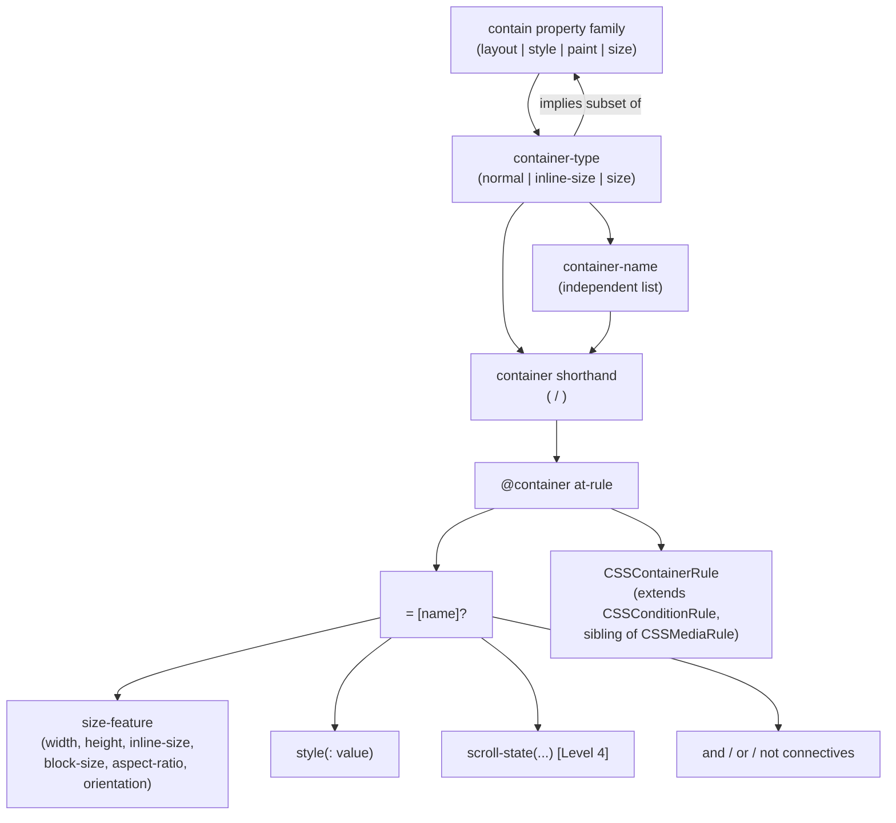
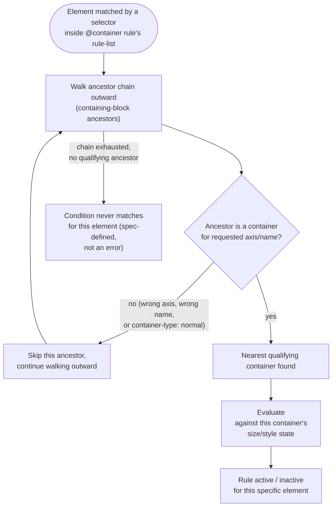
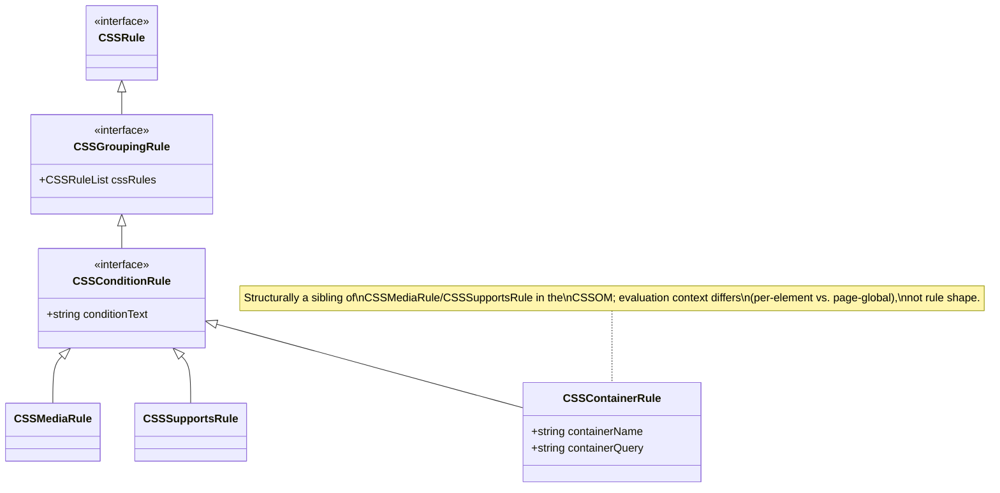

# 006 — Container Queries (CSS Containment Module Level 3)

## 1. Title

**Critical CSS Extraction Engine — Browser Specification Reference: CSS Containment / Container Queries**

## 2. Version

| Field | Value |
|---|---|
| Document Version | 1.0.0 |
| Status | Accepted |
| Last Updated | 2026-07-10 |
| Owners | Selector Engine Working Group |
| Stability | Stable (Phase 17 reference document; changes require RFC) |

## 3. Purpose

This document is a reference-summary of the platform specification the engine depends on for container-query support: the **CSS Containment Module Level 3** specification, which defines `contain`, `container-type`, `container-name`, the `container` shorthand, and the `@container` conditional group rule. It exists as a Phase 17 "Browser Specifications" artifact, distinct in purpose from [../design/405-Container-Queries.md](../design/405-Container-Queries.md): that design document specifies *how the engine* determines `@container` applicability without a `matchMedia`-equivalent API, aimed at implementers of the Dependency Resolver and CSSOM Walker; this document specifies *what the platform itself guarantees and does not guarantee* — the grammar, the containment semantics, the queryable feature set, and the boundaries of browser support — so that engine design decisions can be checked against the specification's actual text rather than against a paraphrase embedded in a design rationale.

The distinction matters because design documents necessarily compress and reframe a specification around one engine's needs; this document does not compress. It is the durable, implementation-agnostic anchor that [405-Container-Queries.md](../design/405-Container-Queries.md), the Dependency Resolver's container-query dependency-graph node type (Phase 7, forthcoming), and any future test-fixture author can all cite as the ground truth for "what does the specification actually say happens here," independent of how any one subsystem chooses to act on it. Every claim in this document is either drawn directly from the CSS Containment Module Level 3 specification text and its interaction with the CSS Sizing, CSS Display, and CSSOM specifications, or explicitly marked as an implementation-observed behavior where specification text is ambiguous or where browser engines diverge.

Readers should treat this document as authoritative for **what container queries are and how they behave**, and treat [405-Container-Queries.md](../design/405-Container-Queries.md) as authoritative for **what the engine does about it**. Where the two appear to disagree, this document's specification citations take precedence, and the design document should be corrected — a discipline explicitly established so that specification drift (as the CSS Containment spec continues to evolve past Level 3) has a single, clearly-owned location to update.

## 4. Audience

- Implementers of the Dependency Resolver's container-query dependency-graph node type (Phase 7), who need the precise specification semantics of containment, named containers, and condition evaluation before designing a schema that must faithfully represent them.
- Implementers and reviewers of [405-Container-Queries.md](../design/405-Container-Queries.md) and the CSSOM Walker ([../design/300-CSSOM-Walker.md](../design/300-CSSOM-Walker.md)), who need a specification reference independent of any one document's engine-specific framing.
- Test-fixture authors responsible for the "Container Queries" fixture named in BRIEF.md Section 2.15, who need to know the full queryable feature surface (size features, style features, container query length units) to construct a fixture that exercises the specification comprehensively rather than only the subset one design document happened to emphasize.
- Engineers evaluating cross-browser compatibility risk, who need a clear statement of which parts of the specification are broadly interoperable (basic size containment, `@container` size queries) versus newer or less uniformly supported (style queries, scroll-state queries in later levels).
- Anyone auditing whether the engine's behavior is spec-conformant, who needs a citation-grade reference rather than a design rationale to check against.

## 5. Prerequisites

- Working knowledge of the CSS box model, containing blocks, and the CSS `display` property's effect on formatting contexts.
- Familiarity with `@media` conditional group rules (see [003-Media-Queries.md](./003-Media-Queries.md)), since `@container` is deliberately modeled as a structural sibling of `@media` at the grammar level.
- Familiarity with CSS specificity and the cascade (see [002-Cascade.md](./002-Cascade.md)), since rules nested inside `@container` blocks participate in the ordinary cascade once the container condition is satisfied — the conditional group rule gates *participation*, not specificity.
- Basic familiarity with CSS custom properties (see [001-CSS-Variables.md](./001-CSS-Variables.md)), relevant to `@container style(...)` conditions, which query custom-property computed values rather than size.

## 6. Related Documents

- [../design/405-Container-Queries.md](../design/405-Container-Queries.md) — the engine design document specifying how the engine determines `@container` applicability by direct rendered-size inspection in the absence of a `matchMedia`-equivalent container API; this document is that document's specification-reference counterpart.
- [003-Media-Queries.md](./003-Media-Queries.md) — the sibling at-rule specification reference for `@media`, structurally parallel to `@container` at the grammar level but fundamentally different in evaluation-context cardinality (page-global vs. per-element).
- [002-Cascade.md](./002-Cascade.md) — cascade and specificity semantics that continue to apply, unmodified, to rules nested inside `@container` blocks once the condition is satisfied.
- [000-CSSOM.md](./000-CSSOM.md) — the CSSOM interfaces (`CSSContainerRule`, `CSSConditionRule` hierarchy) through which `@container` rules are exposed to script and to the engine's CSSOM Walker.
- [007-Nested-CSS.md](./007-Nested-CSS.md) — the CSS Nesting specification reference, relevant because `@container` blocks, like `@media` blocks, may contain nested rules using the `&` nesting selector per the CSS Nesting Module.
- [008-Constructable-Stylesheets.md](./008-Constructable-Stylesheets.md) — relevant because `@container` rules can be authored into constructable stylesheets (e.g., inside a Shadow DOM component's adopted stylesheet) exactly as any other rule, and the containment context can itself cross shadow boundaries.
- [004-Shadow-DOM.md](./004-Shadow-DOM.md) — relevant to nearest-container resolution when the ancestor walk must cross shadow tree boundaries.
- [../adr/ADR-0002-No-Custom-Selector-Parser.md](../adr/ADR-0002-No-Custom-Selector-Parser.md) — the architectural decision this document's Section 8 findings are checked against when [405-Container-Queries.md](../design/405-Container-Queries.md) designs the engine's condition-evaluation approach.
- CSS Containment Module Level 3 (W3C) — https://www.w3.org/TR/css-contain-3/ — the normative source this entire document summarizes.
- CSS Containment Module Level 4 (W3C, editor's draft) — the successor level, introducing `@container style()` (partially back-ported to Level 3 in some engines) and scroll-state container queries.

## 7. Overview

CSS Containment Module Level 3 defines two related but separable mechanisms. The first is **containment** proper: the `contain` property (and its longhands `contain-layout`, `contain-style`, `contain-size`, `contain-paint`) that lets an author declare an element's subtree as isolated from the rest of the document for layout, paint, style, and/or size purposes — a performance-and-predictability primitive with no direct connection to conditional CSS. The second, built on top of the first, is **container queries**: `container-type` (a value shorthand for a specific, size-flavored subset of containment: `size`, `inline-size`, or `normal`), `container-name` (an identifier for named-container targeting), the `container` shorthand combining both, and the `@container` at-rule, which conditionally activates a nested rule block based on the queried size (or, per Level 3's later additions and Level 4, computed style state) of the nearest ancestor element that qualifies as a container for the requested axis and name.

The specification's central design goal is enabling **element-relative responsive design**: prior to container queries, conditional styling could only respond to page-global characteristics (`@media`'s viewport, `prefers-color-scheme`, etc.), which is insufficient for reusable components that must adapt their internal layout to the space *they* are given, independent of the page's overall viewport — a sidebar-embedded card and a full-width-embedded card at an identical viewport width need different internal layouts, a distinction `@media` cannot express and `@container` can. This is achieved without introducing a genuinely new "engine" — `@container` is, at the CSSOM level, another `CSSConditionRule` subtype alongside `CSSMediaRule` and `CSSSupportsRule`, sharing the same conditional-group-rule shape; what differs is the *evaluation context* the condition is checked against (Section 8.1), not the rule's structural role in the stylesheet.

This document summarizes: the `container-type`/`container-name`/`container` property grammar and the specific containment guarantees each `container-type` value implies (Section 8.1); the `@container` at-rule's condition grammar, covering size features, boolean connectives, and (per Level 3's later text and Level 4's expansion) style features (Section 8.2); the nearest-container resolution algorithm the specification defines, including named-container skip-over semantics (Section 8.3); the containment guarantees (layout/style/paint isolation) that make container-query evaluation well-defined and non-circular (Section 8.4); and the platform API surface — critically, the *absence* of a `matchMedia`-equivalent query API for containers as of this document's writing (Section 8.5), which is the single fact from this specification with the most direct bearing on [405-Container-Queries.md](../design/405-Container-Queries.md)'s engine design.

## 8. Detailed Design

### 8.1 The `container-type` Property and Its Containment Implications

`container-type` accepts three values, and the specification defines each in terms of the underlying `contain` longhands it implies:

| `container-type` value | Implied containment | Queryable axes |
|---|---|---|
| `normal` (initial value) | None (not a size container) | None (size); may still be a `style()` container target |
| `inline-size` | `contain: inline-size` — containment on the inline axis only (layout and style containment on that axis, plus inline-size containment meaning the element's inline size does not depend on its contents) | `inline-size`-flavored features only (`width`/`min-width`/`max-width` in horizontal writing modes) |
| `size` | `contain: size layout style` — full layout, style, and size containment on both axes | Both size and inline-size features (`width`, `height`, and their `min-`/`max-` variants) |

The specification is explicit that `container-type: size` is the most constraining option: because it applies size containment on **both** axes, the element's block-size (height, in a horizontal writing mode) can no longer be determined by its content in the ordinary way — an element with `container-type: size` and no explicit height will collapse to zero block-size unless a height is otherwise specified (e.g., via explicit height, `min-height`, or a fallback from `contain-intrinsic-size`). This is a deliberate consequence, not a defect: it is what makes it well-defined and non-circular for a `@container` condition to query that element's height at all — if the element's height could still depend on descendant content, and a descendant's applicable rules could depend on that same height via `@container`, the system would have no well-defined fixed point. `container-type: inline-size` avoids this height-collapse problem by containing only the inline axis, at the cost of making block-size features non-queryable against that container (Section 8.2 edge case).

`container-name` is a separate, independently-settable property holding a whitespace-separated `<custom-ident>` list (never `none`, `and`, `or`, `not`, or other CSS-wide/at-rule keywords, per the specification's `<custom-ident>` production). It has no containment implication whatsoever — declaring `container-name: sidebar` on an element with `container-type: normal` makes that element discoverable by name for `@container style(...)` targeting but does not, by itself, make it a valid target for any size-based `@container` condition (Section 8.3 covers the resolution algorithm's handling of this split).

The `container` shorthand accepts `<container-type> / <container-name-list>` (e.g., `container: inline-size / sidebar`) and resets both longhands per ordinary CSS shorthand-property reset semantics when only one part is specified.

### 8.2 The `@container` At-Rule Grammar

The at-rule's grammar, per the specification, is:

```
@container <container-condition># { <rule-list> }
<container-condition> = [ <container-name> ]? <container-query>
<container-name>      = <custom-ident>
<container-query>     = not <container-query>
                       | <container-query> [ and <container-query> ]*
                       | <container-query> [ or <container-query> ]*
                       | <container-query-in-parens>
<container-query-in-parens>
                       = ( <container-query> )
                       | <size-feature>
                       | style( <style-query> )
                       | scroll-state( <scroll-state-query> )   // Level 4
```

**Size features** mirror the media-feature range syntax `@media` uses (see [003-Media-Queries.md](./003-Media-Queries.md) Section 8.3): both the discrete `min-width: 400px` form and the range form `400px <= width < 800px` are valid, and the queryable feature names are `width`, `height`, `inline-size`, `block-size`, `aspect-ratio`, and `orientation`, each restricted to the axis (or axes) the resolved container's `container-type` supports (Section 8.1's table).

**Style features**, introduced within the Level 3 timeframe and formalized more fully in Level 4, take the form `style(<custom-property-name>: <value>)` and query the resolved container's *computed* custom-property value rather than its size — notably, style queries do not require `container-type: size`/`inline-size` at all; an element need only be a *named* container (or the query targets any ancestor, per implementation) for a `style()` condition to resolve against it, since no containment is needed to make a computed-style read well-defined the way a size read requires size containment to avoid circularity.

**Boolean connectives** (`and`, `or`, `not`) combine sub-conditions with standard operator precedence and required parenthesization when mixing `and`/`or` at the same nesting level (`not (A and B)` valid; `A and B or C` invalid without disambiguating parentheses), mirroring `@media`'s connective grammar exactly.

### 8.3 Nearest-Container Resolution Algorithm

The specification defines container-query applicability determination as, for each element matched by a selector inside an `@container` rule's rule-list: walk the element's ancestor chain (its containing-block ancestors, which for most layout modes coincides with DOM ancestors but can diverge under certain positioning schemes — see Edge Cases) outward from the element, and select the **nearest** ancestor that is (a) established as a container via `container-type` other than `normal` for the requested axis (size queries) or is any named container (style queries), and (b) if the `@container` condition specifies a `<container-name>`, has that name present in its `container-name` list. An ancestor that is a container but fails the axis or name requirement is **skipped**, not treated as a resolution failure — the walk continues outward past it. If no ancestor in the entire chain qualifies, the condition **never matches** for that element (not an error, not a fallback to the viewport) — this is the specification's explicit behavior for what would otherwise look like a dangling reference to a nonexistent container.

This walk-and-skip behavior is the specification's mechanism for letting nested containers with the *same* name resolve correctly to the nearest one (inner wins by construction, since the walk terminates at the first qualifying ancestor) and for letting differently-purposed containers coexist in an ancestor chain without interfering (`@container sidebar (...)` skips past an intervening `container-type: size` container with no `sidebar` name to reach a farther, correctly-named one).

### 8.4 Containment Guarantees That Make Container Queries Well-Defined

The specification's `contain` property family provides four independently toggleable guarantees, of which `container-type`'s implied subset (Section 8.1) draws on `layout`, `style`, and `size`:

- **`contain: layout`** — the element establishes an independent formatting context; layout of its descendants cannot affect layout outside the element, and vice versa (with limited, well-defined exceptions the specification enumerates, e.g., the element remains a positioning containing block for `position: absolute`/`fixed` descendants under certain conditions).
- **`contain: style`** — certain style effects that could otherwise "escape" the element's subtree (specifically, counters and quotes) are scoped to not affect elements outside it.
- **`contain: size`** — the element's size is computed as if it had no content at all, i.e., its size does not depend on its descendants' sizes (falling back to `contain-intrinsic-size` or `0` if no other sizing information is available).
- **`contain: paint`** — descendants are guaranteed not to display outside the element's bounds (a clipping-and-isolation guarantee, not used by `container-type`'s implied set but part of the same property family).

The combination `layout style size` (what `container-type: size` implies) is precisely the set needed to guarantee that querying the element's size is well-defined and non-circular: layout containment ensures the element's internal layout does not leak information about its size determination outward in a way that could create a dependency cycle with an ancestor query; size containment ensures the element's own size is fixed independent of its content, which is the specific guarantee that prevents "a descendant's `@container`-gated rule affects the descendant's rendered size, which affects the container's size, which affects the same rule's applicability" from being a genuine circularity — the container's size is fixed *before* any such rule is evaluated against it, by construction of size containment, not as an emergent property of some fixed-point computation the browser performs at query-evaluation time.

### 8.5 The Absent Query API

As of this document's writing, no browser exposes a script-facing API analogous to `window.matchMedia()` that takes a container-query condition string and an element and returns whether the condition currently holds. `window.matchMedia()` is meaningful as a page-global, single-call API precisely because `@media`'s evaluation context is single-valued per page load (Section 8.1 of [../design/405-Container-Queries.md](../design/405-Container-Queries.md) develops this contrast at length); `@container`'s evaluation context is per-element, and no equivalent `element.matchContainer(conditionString)` primitive exists in any specification level through Level 4's current editor's draft. Scripts wishing to determine current container-query applicability must compose `getComputedStyle()` (to read `container-type`/`container-name` per ancestor) and `getBoundingClientRect()` (to read the resolved container's rendered size) themselves — precisely the composition [../design/405-Container-Queries.md](../design/405-Container-Queries.md) Section 8.3 specifies for this engine. This is a genuine, specification-acknowledged capability gap in the platform (the CSS Working Group's public discussions have periodically raised the possibility of such an API without shipping one), not an implementation detail this document should be expected to work around; any future browser API filling this gap would be a strict simplification for the engine (see Section 16).

## 9. Architecture

### 9.1 Specification Concept Hierarchy



### 9.2 Nearest-Container Resolution (Specification Algorithm)



### 9.3 CSSOM Interface Relationship



## 10. Algorithms

### 10.1 Specification's Nearest-Container Selection (Restated Formally)

**Problem statement.** Formalize the specification's prose ancestor-walk (Section 8.3) as an algorithm independent of any one engine's implementation, for use as a conformance reference.

**Inputs.** `element` (a DOM element matched by a selector inside an `@container` rule body), `requestedName: string | null`, `requestedAxes: Set<'width'|'height'|'inline-size'|'block-size'>` (derived from which size features the condition references), `queryKind: 'size' | 'style'`.

**Outputs.** `container: Element | null`.

**Pseudocode.**

```text
function specNearestContainer(element, requestedName, requestedAxes, queryKind):
    ancestor = containingBlockAncestor(element)   // spec: containing-block chain,
                                                    // not strictly parentElement in all
                                                    // positioning schemes (see Edge Cases)
    while ancestor is not null:
        ct = computedContainerType(ancestor)       // 'normal' | 'inline-size' | 'size'
        names = computedContainerNameList(ancestor)

        isCandidate =
            (queryKind == 'style' and (ct != 'normal' or names.length > 0))
            or
            (queryKind == 'size' and containerSupportsAxes(ct, requestedAxes))

        nameOk = (requestedName is null) or (requestedName in names)

        if isCandidate and nameOk:
            return ancestor

        ancestor = containingBlockAncestor(ancestor)

    return null

function containerSupportsAxes(containerType, requestedAxes):
    if containerType == 'size':
        return true   // both axes queryable
    if containerType == 'inline-size':
        return requestedAxes subsetOf {'width', 'inline-size'}   // horizontal writing mode
    return false        // 'normal' supports no size axis
```

**Time complexity.** O(H), H = containing-block ancestor chain length, identical asymptotic shape to [../design/405-Container-Queries.md](../design/405-Container-Queries.md) Section 10.1's engine-side restatement of this same algorithm.

**Memory complexity.** O(1) beyond the traversal cursor.

**Failure cases.** Chain exhausted with no candidate (spec-defined non-match, Section 8.3); a container satisfying `nameOk` but not `isCandidate` must not terminate the walk — the specification requires continuing past it, a detail easy to get wrong in a naive re-implementation that checks name before axis and returns early.

**Optimization opportunities.** Specification text does not mandate any particular caching strategy — this is intentionally left to implementations (browsers and, per [../design/405-Container-Queries.md](../design/405-Container-Queries.md) Section 10.1, this engine) since the algorithm's *result* is what conformance requires, not its computational path.

## 11. Implementation Notes

1. **This document is descriptive of the specification, not prescriptive of engine architecture.** Where [../design/405-Container-Queries.md](../design/405-Container-Queries.md) makes an engine-specific choice (e.g., ancestor-chain caching, condition tokenizer scoping), that choice is evaluated for conformance against this document's Section 8/10 content, not the other way around.
2. **Style queries (`style()`) should not be assumed universally available** at the same conformance level as size queries across all target browser versions the engine's Playwright configuration may drive — implementers integrating with [../design/405-Container-Queries.md](../design/405-Container-Queries.md) Implementation Notes item 5 should verify actual support in the Playwright-bundled Chromium/WebKit/Firefox builds in use, since `style()` queries were finalized later than basic size queries.
3. **`container-name` values are ordinary `<custom-ident>` tokens**, meaning they are subject to the same case-sensitivity and reserved-keyword-avoidance rules as other custom identifiers in CSS (e.g., `none`, `inherit`, `initial`, `unset`, `revert`, `revert-layer` are disallowed) — any test-fixture author or dependency-graph schema designer should validate against this production rather than treating container names as free-form strings.
4. **`aspect-ratio` and `orientation` size features**, while less commonly used than `width`/`height`/`inline-size`/`block-size`, are part of the specification's queryable feature set and should be included in the "Container Queries" fixture (BRIEF.md Section 2.15) for completeness, even though [../design/405-Container-Queries.md](../design/405-Container-Queries.md)'s worked examples focus on width-based conditions.
5. **Container query length units** (`cqw`, `cqh`, `cqi`, `cqb`, `cqmin`, `cqmax`) are a specification feature adjacent to, but distinct from, the `@container` at-rule itself — they can appear in ordinary property values with no enclosing `@container` block at all, and resolve against the nearest size-containing ancestor's dimensions exactly as `vw`/`vh` resolve against the viewport. This document flags them as in-scope for a comprehensive test fixture even though condition-based `@container` evaluation (this document's main subject) does not itself require them.

## 12. Edge Cases

- **Containing-block ancestor vs. DOM `parentElement` divergence.** The specification's nearest-container walk is defined in terms of containing-block ancestry, which for `position: absolute`/`fixed` elements can skip past several DOM ancestors to the nearest positioned (or, for `fixed`, the viewport-establishing) ancestor — a naive `element.parentElement`-based walk can produce a different, incorrect result for absolutely/fixed-positioned descendants of a query container. This is the single most consequential divergence between "the specification's algorithm" (this document) and "a straightforward DOM-tree walk" (a natural but not strictly correct implementation shortcut).
- **`container-type: size` collapsing an element's own layout.** As Section 8.1 notes, an element with `container-type: size` and no explicit sizing information will render at zero block-size — a common authoring mistake (forgetting to pair `container-type: size` with an explicit height or `contain-intrinsic-size`) that produces a container that is always queried as zero-height, silently making any block-size-based `@container` condition against it permanently false rather than raising any error.
- **`style()` queries against non-custom-property computed values.** The specification's `style()` container queries are defined only for custom properties (`--foo: bar`), not arbitrary standard CSS properties — a stylesheet attempting `@container style(color: red)` (a non-custom-property) is not valid per Level 3/Level 4's current text and should be treated as a non-matching or invalid condition, not silently coerced.
- **Nested `@container` rules referencing different container names at each nesting level.** The specification permits arbitrary nesting of conditional group rules including `@container` inside `@container`; nearest-container resolution for the innermost rule's condition still starts its ancestor walk from the matched element, not from whatever container the outer `@container` rule already resolved — each nesting level's resolution is independent per the specification's condition-evaluation model.
- **Shadow DOM boundary crossing.** The containing-block ancestor chain, and therefore the nearest-container walk, crosses shadow tree boundaries transparently at the specification level (a shadow host's containing block can be an ancestor of elements inside its shadow tree, and vice versa is not applicable since shadow content cannot be an ancestor of light-DOM content) — see [004-Shadow-DOM.md](./004-Shadow-DOM.md) for the general shadow-boundary containing-block model this inherits.
- **Print and other non-continuous media.** `container-type: size`/`inline-size` containment and `@container` queries are defined in terms of a rendered box's dimensions, which is a continuous-media concept; behavior under paginated media (print) is comparatively under-specified and implementation-varying, a gap the specification itself acknowledges as an area of ongoing refinement.

## 13. Tradeoffs

| Specification Decision | Rationale (per spec) | Alternative Considered | Consequence for Consumers |
|---|---|---|---|
| `container-type` as a small, closed enum (`normal`/`inline-size`/`size`) rather than exposing raw `contain` longhand combinations for query eligibility | Keeps the authoring surface simple and avoids exposing containment combinations that would not yield a well-defined, non-circular query | Allow arbitrary `contain` value combinations to imply container-query eligibility | Implementers (and the engine) can rely on exactly three well-defined containment "flavors" rather than reasoning about arbitrary `contain` combinations |
| No dedicated `matchMedia`-equivalent script API for containers | Left unresolved as of this document's writing; not a deliberate permanent design position, but a gap not yet closed | Ship `element.matchContainer()` alongside the at-rule | Every consumer needing script-level container-query awareness (including this engine) must compose `getComputedStyle`/`getBoundingClientRect` themselves (Section 8.5) |
| Per-element (not page-global) evaluation context | Necessary to satisfy the "element-relative responsive design" goal (Section 7) that motivated container queries in the first place | Restrict container queries to a single page-global "current container" concept | Any consumer's applicability determination is inherently per-(rule, element) rather than per-(rule, page), a materially higher-cardinality problem than `@media` |
| `container-type: size` requires full layout+style+size containment rather than a narrower guarantee | Needed to guarantee non-circularity (Section 8.4) | A weaker containment guarantee with author-managed circularity avoidance | Authors using `container-type: size` must explicitly manage the element's own sizing (Edge Cases), a real authoring cost accepted in exchange for a query model with no undefined circular-dependency states |

## 14. Performance

- **CPU complexity.** Specification-mandated nearest-container resolution is O(H) per (rule, element) pair (Section 10.1), identical in asymptotic shape whether performed by a browser's internal style/layout engine or by this engine's own composed `getComputedStyle`/ancestor-walk (per [../design/405-Container-Queries.md](../design/405-Container-Queries.md) Section 10.1).
- **Memory complexity.** The specification does not mandate any particular caching or memoization strategy; browsers are free to (and in practice do) cache containing-block relationships and container-query results as part of ordinary style/layout invalidation machinery, transparent to specification conformance.
- **Caching strategy.** Not specified; left entirely to implementations. This document does not prescribe a caching approach — see [../design/405-Container-Queries.md](../design/405-Container-Queries.md) Section 14 for this engine's specific caching design.
- **Parallelization opportunities.** Not addressed by the specification, which is silent on implementation strategy; container-query evaluation for distinct elements has no specification-mandated ordering dependency, which is the property [../design/405-Container-Queries.md](../design/405-Container-Queries.md) relies on to justify its own parallelization claims.
- **Scalability limits.** The specification places no explicit limit on the number of query containers or `@container` rules a stylesheet may declare; pathological cases (very large numbers of named containers with deeply nested ancestor chains) are a real-world engineering concern for any consumer, addressed at the engine-design level in [../design/405-Container-Queries.md](../design/405-Container-Queries.md) Section 14, not by the specification itself.

## 15. Testing

- **Unit tests.** Verify the engine's understanding of the `container-type`/`container-name`/`container` shorthand grammar against the specification's formal grammar productions — parsing/serialization round-trips for each `container-type` value and various `container-name` list forms.
- **Integration tests.** Real-browser conformance checks: confirm that `container-type: size` collapses an unconstrained element's block-size to zero absent explicit sizing (Section 12 edge case), confirm axis-mismatch conditions correctly fail to match (Section 8.1/10.1), confirm named-container skip-over behavior across multiple candidate ancestors.
- **Visual tests.** Not directly applicable to this specification-reference document; deferred to [../design/405-Container-Queries.md](../design/405-Container-Queries.md) Section 15 and the fixture corpus's visual-regression suite.
- **Stress tests.** Deferred to [../design/405-Container-Queries.md](../design/405-Container-Queries.md); this document's role is specification fidelity, not performance validation.
- **Regression tests.** Any update to this document following a CSS Containment Level 4 specification change (e.g., `scroll-state()` queries reaching Candidate Recommendation) should be paired with a corresponding review of [../design/405-Container-Queries.md](../design/405-Container-Queries.md) and the Dependency Resolver's schema for continued conformance.
- **Benchmark tests.** Not applicable at the specification-reference level.

## 16. Future Work

- **Track CSS Containment Module Level 4's `scroll-state()` container queries** (querying an ancestor scroll container's scroll/snap state) as they move toward broader interoperable support — a genuinely new queryable-condition category beyond size and style, requiring its own future amendment to this document and to [../design/405-Container-Queries.md](../design/405-Container-Queries.md)'s applicability-determination design.
- **Monitor for a future `matchMedia`-equivalent container-query script API** (Section 8.5) — should one ship, this document's Section 8.5 and [../design/405-Container-Queries.md](../design/405-Container-Queries.md)'s composed-primitives design would both need updating, with the engine side almost certainly simplifying.
- **Container query length units as ordinary declaration values** (Implementation Notes item 5) warrant their own more detailed future document or amendment once the Dependency Resolver's schema (Phase 7) formalizes how non-conditional, size-container-dependent declarations are tracked in the dependency graph, a distinct concern from `@container` condition evaluation.
- **Open question:** as containment and container queries continue to evolve (Level 4 and beyond), should this document be versioned per CSS Containment specification level explicitly (e.g., `006-Container-Queries-L3.md` / `006-Container-Queries-L4.md`), or should it remain a single living document updated in place? Current lean is the latter, consistent with how [003-Media-Queries.md](./003-Media-Queries.md) is expected to track the Media Queries specification's own level progression, to be finalized jointly across all Phase 17 documents.

## 17. References

- [../design/405-Container-Queries.md](../design/405-Container-Queries.md)
- [003-Media-Queries.md](./003-Media-Queries.md)
- [002-Cascade.md](./002-Cascade.md)
- [000-CSSOM.md](./000-CSSOM.md)
- [001-CSS-Variables.md](./001-CSS-Variables.md)
- [004-Shadow-DOM.md](./004-Shadow-DOM.md)
- [007-Nested-CSS.md](./007-Nested-CSS.md)
- [008-Constructable-Stylesheets.md](./008-Constructable-Stylesheets.md)
- [../adr/ADR-0002-No-Custom-Selector-Parser.md](../adr/ADR-0002-No-Custom-Selector-Parser.md)
- CSS Containment Module Level 3 (W3C) — https://www.w3.org/TR/css-contain-3/
- CSS Containment Module Level 4 (W3C, editor's draft) — https://drafts.csswg.org/css-contain-4/
- MDN documentation: `@container`, `container-type`, `container-name`, `container`, `contain`, CSS container query length units
- CSSWG GitHub issue tracker discussions on a proposed script-facing container-query matching API
