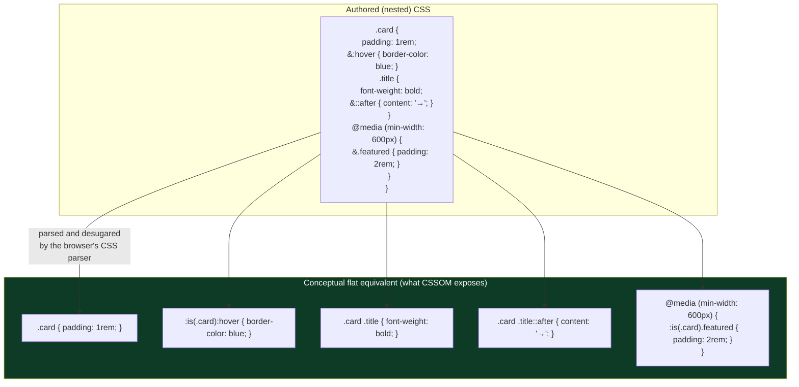
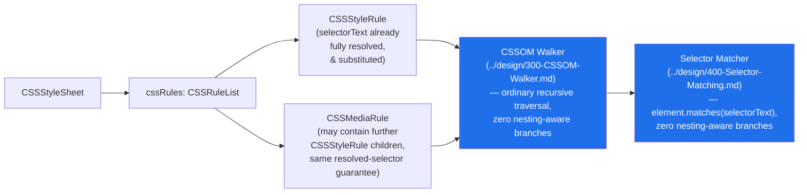

# 007 — Nested CSS (CSS Nesting Module)

## 1. Title

**Critical CSS Extraction Engine — Browser Specification Reference: CSS Nesting**

## 2. Version

| Field | Value |
|---|---|
| Document Version | 1.0.0 |
| Status | Accepted |
| Last Updated | 2026-07-10 |
| Owners | CSSOM Working Group |
| Stability | Stable (Phase 17 reference document; changes require RFC) |

## 3. Purpose

This document is a reference-summary of the **CSS Nesting Module** specification, which defines the ability to write one style rule inside another, using an explicit or implicit `&` nesting selector to relate the inner rule's selector to the outer one. Nesting is an authoring-time convenience with a precisely defined desugaring to ordinary flat CSS rules — the specification's core guarantee, and the fact this document exists to make legible to every downstream consumer, is that **nested CSS has no new runtime semantics**: the CSSOM, cascade, specificity, and selector-matching machinery this engine already depends on ([../design/300-CSSOM-Walker.md](../design/300-CSSOM-Walker.md), [../design/400-Selector-Matching.md](../design/400-Selector-Matching.md), [002-Cascade.md](./002-Cascade.md)) operate on nested rules exactly as they operate on any other rule, once the desugaring is understood.

The engine's own architectural commitment ([../adr/ADR-0002-No-Custom-Selector-Parser.md](../adr/ADR-0002-No-Custom-Selector-Parser.md)) is to never hand-parse or hand-match selectors, relying instead on `element.matches()` and the live CSSOM — and this document's central finding is that nesting requires **no exception** to that commitment: browsers themselves perform the desugaring (or an equivalent internal representation) when they parse a nested stylesheet and expose `CSSStyleRule.selectorText` and `.cssText` already reflecting the *browser's own resolved, flattened selector text* for a nested rule, meaning the engine can treat every nested rule exactly as it treats any other `CSSStyleRule` node in the CSSOM without writing a single line of nesting-aware selector logic. This document exists to state that finding precisely, grounded in the specification, distinct from any one design document's paraphrase of it — establishing the reference other Phase 17/Phase 3/Phase 6 documents can cite when explaining why nested CSS support required comparatively little new engine machinery.

## 4. Audience

- Implementers of the CSSOM Walker ([../design/300-CSSOM-Walker.md](../design/300-CSSOM-Walker.md)), who need to know exactly what `CSSStyleRule.selectorText` returns for a nested rule and whether any special-casing is needed during traversal (finding: no special-casing needed, Section 8.3).
- Implementers and reviewers of the Selector Matcher ([../design/400-Selector-Matching.md](../design/400-Selector-Matching.md)), who need assurance that nested rules do not require a nesting-aware `matches()` variant or any bespoke selector-composition logic.
- Test-fixture authors responsible for the "Nested CSS" fixture named in BRIEF.md Section 2.15, who need the full grammar (implicit vs. explicit nesting, nesting inside `@media`/`@supports`/`@layer`) to construct a comprehensive fixture.
- Engineers reasoning about specificity and cascade order for stylesheets authored with nesting (e.g., stylesheets produced by Tailwind's or a CSS-in-JS tool's nesting-emitting output, both named as fixture targets in BRIEF.md Section 2.15), who need the specificity-composition rules nesting introduces.
- Anyone auditing whether the engine correctly handles a stylesheet authored with nesting versus its equivalent hand-flattened form, who needs a citation-grade specification reference for expected equivalence.

## 5. Prerequisites

- Familiarity with CSS selector grammar (combinators, compound/complex selectors, selector lists) — see [../design/400-Selector-Matching.md](../design/400-Selector-Matching.md) Prerequisites.
- Familiarity with CSS specificity calculation (see [002-Cascade.md](./002-Cascade.md)), since nesting composes specificity across nesting levels in a way this document must state precisely.
- Familiarity with `:is()`/`:where()` selector functions (see [../design/404-Is-Where-Has.md](../design/404-Is-Where-Has.md)), since the implicit `&` nesting selector's specificity behaves like `:is()`, not like a plain compound selector, per the specification.
- Familiarity with `@media`, `@supports`, and `@layer` conditional/grouping rules (see [003-Media-Queries.md](./003-Media-Queries.md), [../design/304-Supports-Rules.md](../design/304-Supports-Rules.md), [../design/305-Cascade-Layers.md](../design/305-Cascade-Layers.md)), since these may themselves be nested inside a style rule under this specification, an authoring capability that did not previously exist.

## 6. Related Documents

- [../design/300-CSSOM-Walker.md](../design/300-CSSOM-Walker.md) — the stylesheet traversal that enumerates nested rules; this document establishes why no nesting-specific traversal logic is required beyond ordinary `CSSRuleList` recursion.
- [../design/400-Selector-Matching.md](../design/400-Selector-Matching.md) — the `element.matches()`-based matching pipeline; this document establishes why nested-rule selectors require no special handling once the browser has resolved `selectorText`.
- [../design/404-Is-Where-Has.md](../design/404-Is-Where-Has.md) — the specificity behavior of `:is()`/`:where()`, directly relevant to the implicit `&`'s specificity treatment (Section 8.4).
- [002-Cascade.md](./002-Cascade.md) — the cascade and specificity model nesting composes with, unmodified in its own rules.
- [../design/305-Cascade-Layers.md](../design/305-Cascade-Layers.md) — `@layer` nested inside a style rule (Section 8.5) interacts with layer assignment in a way this sibling document should be consulted alongside.
- [003-Media-Queries.md](./003-Media-Queries.md) — `@media` nested inside a style rule (Section 8.5), the historically-familiar precedent (via preprocessors) for the pattern CSS Nesting standardizes natively.
- [../design/304-Supports-Rules.md](../design/304-Supports-Rules.md) — `@supports` nested inside a style rule (Section 8.5).
- [000-CSSOM.md](./000-CSSOM.md) — the `CSSStyleRule`/`CSSNestedDeclarations` interfaces through which nested rules and interleaved plain declarations are exposed.
- [006-Container-Queries.md](./006-Container-Queries.md) — sibling Phase 17 document; `@container` may also be nested inside a style rule under the same general nested-conditional-rule pattern this document covers for `@media`/`@supports`/`@layer`.
- [../adr/ADR-0002-No-Custom-Selector-Parser.md](../adr/ADR-0002-No-Custom-Selector-Parser.md) — the architectural decision this document confirms nesting support does not require an exception to.
- CSS Nesting Module (W3C) — https://www.w3.org/TR/css-nesting-1/ — the normative source this document summarizes.

## 7. Overview

Prior to native CSS nesting, writing `.card { &:hover { ... } }`-style rules required a preprocessor (Sass, Less) or a CSS-in-JS runtime (styled-components, Emotion — both explicitly named as required test fixtures in BRIEF.md Section 2.15) to desugar the nested authoring form into flat CSS before it ever reached a browser. The CSS Nesting Module standardizes this desugaring as a native browser capability: authors write nested rules directly in CSS delivered to the browser, and the browser's own CSS parser performs the flattening, exposing the result through the ordinary CSSOM (`CSSStyleRule`, `CSSRuleList`) rather than through any new, nesting-specific interface.

The specification defines two nesting forms. **Explicit nesting** uses the `&` character (the "nesting selector") to designate where the parent rule's selector is substituted into a compound selector position within the nested rule's selector — e.g., `.card { & > .title { ... } }` desugars to `.card > .title { ... }`. **Implicit (relaxed) nesting**, permitted for nested rules whose selector begins with a type selector or certain other restricted forms was initially disallowed pending disambiguation from property declarations, but the finalized specification permits a nested rule to omit a leading `&` in most cases (e.g., `.card { .title { ... } }` is equivalent to `.card { & .title { ... } }`, and `.card { &.active { ... } }` can be written `.card { &.active { ... } }` explicitly or, for many selector shapes, without the leading `&` at all) — the precise disambiguation rules the parser applies to distinguish a nested selector from a custom-property-like declaration are covered in Section 8.2.

This document's primary contribution beyond restating the grammar is establishing, precisely, **why this engine needs no new selector-matching machinery for nested CSS at all**: because `CSSStyleRule.selectorText`, as exposed by the CSSOM for a rule that was authored with nesting, already reflects the browser's fully resolved, flat selector text (the `&` substitutions already performed) — the CSSOM Walker ([../design/300-CSSOM-Walker.md](../design/300-CSSOM-Walker.md)) reads this resolved text through the exact same code path it uses for any other rule, and the Selector Matcher ([../design/400-Selector-Matching.md](../design/400-Selector-Matching.md)) calls `element.matches(selectorText)` against it with zero nesting-specific logic. The only engine-relevant subtlety is specificity computation (Section 8.4), where the implicit `&`'s specificity contribution follows `:is()`-like "highest-specificity-alternative" rules rather than a naive textual substitution's specificity — a subtlety that matters for the Cascade Resolver, not for selector matching itself.

## 8. Detailed Design

### 8.1 Explicit Nesting: the `&` Nesting Selector

The `&` nesting selector may appear anywhere within a compound selector of a nested rule's selector list and is substituted, per the specification, with the parent rule's selector **wrapped in an implicit `:is()`** — this wrapping is the specification's mechanism for correctly handling parent selectors that are themselves selector lists (e.g., `.card, .panel { &:hover { ... } }` desugars to `:is(.card, .panel):hover { ... }`, not to two separate rules with `.card:hover` and `.panel:hover`, though the two are behaviorally equivalent for matching purposes — the difference is a single rule with a compound `:is()`-wrapped selector versus two, which matters for the CSSOM Walker's rule enumeration count and for specificity, Section 8.4).

`&` may appear multiple times in a single nested selector (`& & { ... }`, unusual but valid, matching a descendant of an element matching the parent selector, of an element matching the parent selector — i.e., self-descendant-of-self), and may appear in non-leading compound-selector positions (`.card { > & { ... } }` is not valid since `&` in that position does not resolve to a meaningful relative-selector origin the same way, but `.card { & + & { ... } }` — adjacent-sibling matching two elements both matching `.card` — is valid and a real, if unusual, authoring pattern for "second instance of the same component immediately following the first").

### 8.2 Implicit Nesting and Parser Disambiguation

The specification permits omitting `&` for nested selectors that begin with specific tokens unambiguous with a CSS declaration: nested rules whose selector starts with a type selector require special handling because `.card { color: red; }`'s `color` could, in principle, be confused with a nested type-selector rule `.card { color { ... } }` (matching a `<color>` element, admittedly rare but not disallowed by HTML). The finalized specification resolves this by requiring nested rules starting with an identifier that is *also* a valid custom-property-like token to be written with an explicit `&` prefix or wrapped differently, while nested rules starting with `.`, `#`, `[`, `:`, `*`, or a combinator (`>`, `+`, `~`) — none of which collide with declaration syntax — are permitted without a leading `&` and are treated as implicitly descendant-combined with the parent (`.card { .title { ... } }` desugars to `.card .title { ... }`, precisely as `& .title` would).

**Nested at-rules** (`@media`, `@supports`, `@layer`, `@container`) inside a style rule do not require any `&` handling themselves — an at-rule token unambiguously begins an at-rule, never a declaration — but any style rules *inside* the nested at-rule that reference the outer rule's selector still use `&` (or implicit nesting) exactly as they would if the at-rule were not present (Section 8.5).

### 8.3 Desugaring to Flat Rules: The Conceptual Model

The specification frames nesting as sugar with a precise conceptual desugaring, though it does not mandate that implementations literally construct flat rule objects internally (an implementation may represent nesting however it likes internally as long as observable CSSOM behavior matches the desugared model). The desugaring, applied recursively for arbitrarily deep nesting, is:

1. For a top-level rule `S { declarations; nested-rule-1; nested-rule-2; ... }`, the plain `declarations` (those not part of any nested rule) remain associated with selector `S` — the specification introduces `CSSNestedDeclarations` as the CSSOM representation for a run of plain declarations that is interleaved with nested rules (i.e., declarations appearing *after* a nested rule within the same block), since a single `CSSStyleRule`'s `style` property cannot represent two non-contiguous declaration blocks under one selector; when declarations appear before any nested rule, ordinary `CSSStyleRule.style` handling suffices without needing a `CSSNestedDeclarations` wrapper.
2. Each nested rule `N { ... }` is desugared to a new top-level (or, for nested at-rules, appropriately-scoped) rule whose selector is `N`'s selector with every `&` replaced by `:is(S)` (or, for implicit nesting, with the equivalent explicit-descendant form per Section 8.2), and whose position in cascade order is **immediately following** the point in the original nesting where it appeared — nesting does not reorder rules relative to their lexical position, a detail that matters because cascade order (for equal-specificity rules) is source-order-dependent (see [002-Cascade.md](./002-Cascade.md)).
3. The process recurses: a rule nested inside a nested rule desugars its own `&` relative to its **immediate** parent's already-desugared selector, not directly relative to the outermost ancestor — e.g., `.card { &:hover { & .title { ... } } }` desugars first to `.card:hover { & .title { ... } }` conceptually, and then to `.card:hover .title { ... }` — `&` inside the innermost rule refers to `.card:hover` (its immediate parent's resolved selector), not to `.card` alone.

### 8.4 Specificity Implications

The specification is explicit that `&`'s specificity contribution is computed **as if it were `:is(<parent selector>)`**, meaning it contributes the specificity of its **most specific selector-list alternative**, not the sum or a flattened textual reconstruction's specificity — this is identical to `:is()`'s and `:where()`-contrasting specificity rule already established for the engine in [../design/404-Is-Where-Has.md](../design/404-Is-Where-Has.md) Section 8.2, and this document explicitly cross-references that treatment rather than re-deriving it: `.card, #sidebar .panel { &:hover { ... } }` contributes the higher of `.card`'s specificity (0,1,0) and `#sidebar .panel`'s specificity (1,1,0) — i.e., (1,1,0) — to the nested rule's total specificity for its `&:hover` portion, precisely as `:is(.card, #sidebar .panel):hover` would, **not** the specificity of two separately-considered rules (which is what an equivalent hand-flattened, non-`:is()`-wrapped pair of rules would have computed instead, a genuine behavioral difference between the nesting desugaring and a naive hand-flattening that does not use `:is()`).

This matters concretely for the Cascade Resolver: a stylesheet hand-authored with nesting and its "equivalent" hand-flattened form are only truly cascade-equivalent if the hand-flattening also wraps the substituted parent selector in `:is()` — a hand-flattening that instead emits separate rules per parent-selector-list alternative changes both rule count (affecting per-rule source-order tie-breaking) and, in mixed-specificity parent-selector-list cases, specificity outcomes for shared descendant selectors, versus the single `:is()`-wrapped nested-origin rule the specification defines.

### 8.5 Nested Conditional/Grouping At-Rules

The specification permits `@media`, `@supports`, `@layer`, and (per [006-Container-Queries.md](./006-Container-Queries.md)) `@container` to appear nested inside a style rule's block, a capability CSS previously lacked natively (available only via preprocessors) and one directly relevant to the "Cascade Layers" and "Container Queries" fixtures named alongside "Nested CSS" in BRIEF.md Section 2.15, since real-world stylesheets frequently combine all three. Nesting one of these at-rules inside a style rule does not change that at-rule's own applicability semantics in any way — `@media` nested inside `.card { @media (min-width: 600px) { &.featured { ... } } }` still evaluates its media condition exactly as [003-Media-Queries.md](./003-Media-Queries.md) specifies, page-globally, unaffected by being lexically nested — the *only* thing nesting changes is that the inner style rule's `&` still resolves relative to `.card` (not to the `@media` block, which has no selector of its own to nest relative to), and the desugared, conceptually-flat result is `@media (min-width: 600px) { .card.featured { ... } }`, structurally identical to what a preprocessor or hand-authored flat stylesheet would have produced.

`@layer` nested inside a style rule is a related but distinct case worth flagging precisely because of an easy misreading: `.card { @layer base { & { color: blue; } } }` assigns the *nested* rule's declarations to layer `base`, while any plain declarations directly on `.card` (outside the nested `@layer` block) remain unlayered (or in whatever layer, if any, the outer context already established) — nesting an `@layer` block does not retroactively relayer the entire parent rule, only the nested block's own contents, exactly mirroring how a non-nested `@layer base { .card { color: blue; } }` only layers what is textually inside it.

## 9. Architecture

### 9.1 Nested CSS Desugaring Example



### 9.2 CSSOM Traversal: No Nesting-Specific Path Required



### 9.3 Specificity Composition Class Model

```mermaid
classDiagram
    class NestedSelector {
        +string rawText
        +ParentSelectorRef ampersandRef
    }
    class ParentSelectorRef {
        +SelectorList parentSelectorList
        +computeSpecificity() Specificity
    }
    class SelectorList {
        +Selector[] alternatives
    }
    class Specificity {
        +int idCount
        +int classCount
        +int typeCount
    }

    NestedSelector --> ParentSelectorRef : contains "&"
    ParentSelectorRef --> SelectorList : wraps as :is(...)
    ParentSelectorRef ..> Specificity : "contributes MAX specificity\nacross alternatives,\nnot sum, not per-alternative rules"
    SelectorList --> Specificity : "each alternative has its own"
```

## 10. Algorithms

### 10.1 Conceptual Desugaring Algorithm

**Problem statement.** Given a parsed nested-rule tree (as the browser's parser would produce internally), define the conceptual flattening to a sequence of ordinary flat rules, preserving source order and correct specificity, for use as a conformance reference when validating that the engine's CSSOM-based consumption (which never performs this desugaring itself — it reads the browser's already-resolved `selectorText`) is consistent with specification-mandated behavior.

**Inputs.** `ruleTree`: a tree of `{selector: SelectorList, declarations: Declaration[], nestedRules: RuleNode[]}` nodes, as parsed from authored nested CSS.

**Outputs.** `flatRules: FlatRule[]`, each `{selector: string, declarations: Declaration[], sourceOrderIndex: number}`, in source order.

**Pseudocode.**

```text
function desugarNesting(ruleTree, parentSelector = null, out = []):
    resolvedSelector = parentSelector is null
        ? ruleTree.selector
        : substituteAmpersand(ruleTree.selector, wrapAsIs(parentSelector))

    if ruleTree.declarations is not empty:
        out.push({ selector: resolvedSelector, declarations: ruleTree.declarations })
        // NOTE: if declarations appear both before AND after nested rules within
        // the same block, the specification's CSSNestedDeclarations model requires
        // emitting them as separate declaration groups at their correct source
        // position, not merged into one — omitted here for brevity; see spec text.

    for each child in ruleTree.nestedRules (in source order):
        if child.isConditionalGroupingAtRule:   // @media/@supports/@layer/@container
            wrappedChildren = desugarNesting(child.body, resolvedSelector, [])
            out.push({ atRule: child.atRuleText, children: wrappedChildren })
        else:
            desugarNesting(child, resolvedSelector, out)   // recurse, appends to out

    return out

function substituteAmpersand(selectorList, parentAsIs):
    // Replace every "&" token in every compound selector of selectorList
    // with parentAsIs's text (":is(...)"); non-"&" nested selectors
    // (implicit nesting, Section 8.2) are first rewritten to an explicit
    // descendant-combinator form ("& <rest>") before this substitution.
    return textualSubstitute(selectorList, '&', parentAsIs)
```

**Time complexity.** O(N × D) where N is the total number of nodes in the nested-rule tree and D is the maximum nesting depth, since each level's `&` substitution is a linear scan over that level's selector text and the recursion depth is bounded by D.

**Memory complexity.** O(N) for the output flat-rule list, plus O(D) recursion stack depth.

**Failure cases.** A `&` appearing where no enclosing rule exists (a top-level `& { ... }`, invalid per specification — `&` only has meaning inside a nested context); declaration/nested-rule interleaving requiring `CSSNestedDeclarations` splitting, which a naive single-pass implementation (as elided above) can get wrong by merging non-contiguous declaration runs into one group, silently reordering declarations relative to interleaved nested rules — a source-order-sensitive correctness bug for cascade tie-breaking.

**Optimization opportunities.** This desugaring is a conceptual reference only — the engine itself never runs this algorithm (Section 8 established that the browser has already performed the equivalent work by the time `CSSStyleRule.selectorText` is read); it exists here purely so that test-fixture authors and Dependency Resolver schema designers have a precise, checkable definition of "correct" against which to validate that the browser-produced `selectorText` for a given nested-CSS fixture matches expectations.

## 11. Implementation Notes

1. **The engine performs zero nesting-specific parsing or desugaring.** Per [../adr/ADR-0002-No-Custom-Selector-Parser.md](../adr/ADR-0002-No-Custom-Selector-Parser.md), the CSSOM Walker reads `CSSStyleRule.selectorText` as-is; because the browser has already resolved `&` substitutions by the time this property is read, no engine code path needs to recognize `&`, implicit nesting, or nested at-rule structure at all — this is the single most important implementation takeaway of this document, and any future engine change that introduces nesting-aware selector logic should be treated as a scope-creep signal warranting review against this document and the ADR.
2. **`CSSNestedDeclarations` (Section 8.3 item 1) is a CSSOM interface the CSSOM Walker must enumerate alongside `CSSStyleRule`** when traversing a rule's children — a stylesheet with declarations interleaved before and after nested rules produces multiple such nodes attached to the same logical parent selector, and a traversal that only looks for `CSSStyleRule.style` and ignores `CSSNestedDeclarations` nodes will silently miss declarations, a correctness gap for the "Nested CSS" fixture (BRIEF.md Section 2.15) specifically when it includes interleaved declaration/nested-rule ordering.
3. **Specificity for `&`-containing selectors must be read from the browser's own cascade/specificity computation** (via the ordinary mechanisms [002-Cascade.md](./002-Cascade.md) already establishes), never recomputed by hand-parsing `selectorText` and summing per-token specificity — doing so risks exactly the sum-vs-max error Section 8.4 identifies as the naive, incorrect approach, another instance of the general "never reimplement what the browser already resolves" discipline.
4. **CSS-in-JS libraries (styled-components, Emotion) and Tailwind, named as required fixtures in BRIEF.md Section 2.15, may emit either native nested CSS or already-flattened output** depending on their build configuration and target browser support matrix — a comprehensive "Nested CSS" fixture should include at least one native-nesting sample and confirm the CSSOM Walker's behavior is identical regardless of whether nesting was authored natively or pre-flattened by a build tool, since per Section 8 there should be no observable engine-side difference.

## 12. Edge Cases

- **Ambiguous implicit-nesting parse (Section 8.2).** A nested rule whose selector could be misread as a custom-property-like declaration (rare in practice, but specification-relevant) requires explicit `&` to disambiguate; a fixture exercising this boundary should confirm the engine's CSSOM-based consumption is unaffected either way (since, per Implementation Notes item 1, the engine never re-parses the selector text itself, this ambiguity is entirely the browser parser's problem, not the engine's).
- **`&` in adjacent-sibling position matching the same class** (`.card { & + & { ... } }`, Section 8.1) — an unusual but valid pattern the Selector Matcher must handle correctly, though because it flows through ordinary `element.matches()`, no special handling is actually required; flagged here only because it is easy to mistakenly assume `&` cannot appear more than once and write a fixture that never exercises this form.
- **Deeply nested rules (3+ levels) with `&` at each level** (Section 8.3 item 3) — specificity and selector text must compose correctly across all levels; the "conceptual desugaring" (Section 10.1) is the reference for validating deep-nesting fixtures specifically, since shallow (1-level) nesting fixtures would not catch a per-level substitution bug that only manifests at depth.
- **`CSSNestedDeclarations` interleaving** (Implementation Notes item 2) — a rule with declarations both before and after a nested child rule is a specification-legal but comparatively unusual authoring pattern that a minimal fixture corpus might accidentally never exercise; BRIEF.md Section 2.15's "Nested CSS" fixture should explicitly include this shape.
- **Nested `@layer` scoping (Section 8.5)** — confirm that a nested `@layer` block's declarations are correctly attributed to that layer while sibling, non-nested declarations on the same parent selector remain unlayered, a case easy to get wrong if the CSSOM Walker's layer-attribution logic ([../design/305-Cascade-Layers.md](../design/305-Cascade-Layers.md)) assumes layer membership is uniform across an entire style rule's declarations rather than potentially split by nested-`@layer` scoping.
- **Interaction with `@container` nested inside a style rule** ([006-Container-Queries.md](./006-Container-Queries.md)) — the nested rule's `&` still resolves relative to the enclosing style rule's selector, not to any container-query-specific context; the nearest-container resolution ([../design/405-Container-Queries.md](../design/405-Container-Queries.md) Section 8.2) operates on the fully resolved selector exactly as it would for a non-nested `@container` rule.

## 13. Tradeoffs

| Specification Decision | Rationale (per spec) | Alternative Considered | Consequence for Consumers |
|---|---|---|---|
| `&` desugars to `:is(<parent selector list>)`, not to per-alternative rule duplication | Avoids a combinatorial explosion of duplicated rules for parent selector lists with many alternatives, and gives a single, well-defined specificity rule | Duplicate the nested rule once per parent selector-list alternative | Specificity is computed as `:is()`'s max-of-alternatives, a real behavioral difference from a naive hand-flattening that consumers (and any hand-authored "equivalent" flat stylesheet used in a golden-snapshot test) must account for (Section 8.4) |
| Implicit nesting permitted for most selector-leading tokens, with `&` required only where ambiguous with a declaration | Reduces authoring verbosity relative to requiring `&` universally, matching long-standing preprocessor ergonomics | Require explicit `&` universally, eliminating parser disambiguation complexity entirely | Slightly more complex parser disambiguation rules (Section 8.2), entirely absorbed by the browser parser and invisible to this engine (Implementation Notes item 1) |
| `CSSNestedDeclarations` as a distinct CSSOM interface for interleaved declaration runs, rather than forcing all declarations under one selector into a single contiguous block | Preserves authoring flexibility (declarations may be interleaved with nested rules in any order) without silently reordering source position, which would break cascade tie-breaking | Require all plain declarations to precede all nested rules within a block (a stricter authoring constraint) | CSSOM Walker implementers must know to enumerate `CSSNestedDeclarations` nodes distinctly, a small but real additional traversal surface (Implementation Notes item 2) |
| Nested conditional at-rules (`@media`/`@supports`/`@layer`/`@container`) permitted with unchanged applicability semantics | Lets authors colocate a component's conditional variants with its base rule, a significant authoring ergonomics win matching CSS-in-JS/preprocessor patterns already in wide use | Disallow nesting at-rules inside style rules, requiring them to remain top-level as in pre-nesting CSS | No engine-visible cost — applicability logic for each at-rule kind is entirely unchanged (Section 8.5); this is a pure authoring-ergonomics win with zero downstream engine complexity |

## 14. Performance

- **CPU complexity.** Because the engine performs no nesting-specific desugaring itself (Implementation Notes item 1), nested CSS introduces **zero additional CPU cost** to the CSSOM Walker or Selector Matcher relative to an equivalent hand-flattened stylesheet — the browser's own parser absorbs the desugaring cost before the CSSOM is ever exposed to the engine.
- **Memory complexity.** `CSSNestedDeclarations` nodes (Implementation Notes item 2) add a small, bounded number of additional CSSOM nodes per rule with interleaved declarations, proportional to the number of interleaving points, not to stylesheet size overall — negligible relative to total CSSOM size for realistic stylesheets.
- **Caching strategy.** No new caching concern — the Selector Matcher's existing memoization ([../design/401-Selector-Memoization.md](../design/401-Selector-Memoization.md)) operates on resolved `selectorText` strings exactly as it does for any other rule, nested-origin or not, since resolved selector text is indistinguishable at that layer.
- **Parallelization opportunities.** None specific to nesting; the CSSOM Walker's existing per-stylesheet/per-rule parallelization opportunities ([../design/300-CSSOM-Walker.md](../design/300-CSSOM-Walker.md)) apply unchanged, since nested rules are just ordinary `CSSStyleRule`/`CSSMediaRule` nodes in the traversed tree.
- **Scalability limits.** The only nesting-specific scalability consideration is parser-side (browser-internal, out of this engine's control): pathologically deep nesting (dozens of levels) could in principle produce very long resolved `:is(...)`-wrapped selector strings, a cost borne entirely by the browser's parser and by `element.matches()` call cost proportional to selector complexity — not a new class of scalability concern for this engine beyond what [../design/400-Selector-Matching.md](../design/400-Selector-Matching.md) Performance already discusses for complex selectors generally.

## 15. Testing

- **Unit tests.** Confirm the CSSOM Walker correctly enumerates `CSSStyleRule` and `CSSNestedDeclarations` nodes for a range of nested-CSS fixtures (single-level, multi-level, interleaved declarations) and that no nesting-specific branch exists in the traversal code that could silently diverge from ordinary rule handling.
- **Integration tests.** Real-browser fixtures comparing extraction output for a natively-nested stylesheet against its hand-flattened `:is()`-wrapped equivalent (per Section 10.1's conceptual desugaring), asserting byte-for-byte or semantically-equivalent extracted critical CSS between the two, per the specification's equivalence guarantee.
- **Visual tests.** A fixture exercising nested `&:hover`/`&::after`/nested-`@media` combinations, screenshotted at the relevant breakpoints/interaction states, verified against the extracted critical CSS's rendered result.
- **Stress tests.** A fixture with deep nesting (5+ levels) and a large number of nested rules per parent, to catch any latent quadratic behavior in a hypothetical future desugaring-aware code path (guarding against regression toward Implementation Notes item 1's "zero nesting-specific cost" guarantee being violated by a future change).
- **Regression tests.** A golden-snapshot fixture pairing every nested-CSS authoring pattern this document identifies (explicit `&`, implicit nesting, nested at-rules, interleaved declarations, deep nesting, adjacent-sibling `& + &`) with its expected flat-equivalent extraction result, per BRIEF.md Section 2.15's explicit "Nested CSS" fixture requirement.
- **Benchmark tests.** Confirm extraction wall-clock time for a nested-CSS fixture is statistically indistinguishable from its hand-flattened equivalent, validating Performance's "zero additional CPU cost" claim empirically rather than by specification argument alone.

## 16. Future Work

- **Track CSS Nesting Module specification stabilization** — the module reached broad interoperable implementation comparatively recently, and edge cases in the implicit-nesting disambiguation grammar (Section 8.2) have seen refinement across draft revisions; this document should be revisited if a future specification revision changes disambiguation rules in an observably different way.
- **`CSSNestedDeclarations` CSSOM support verification across the Playwright-bundled browser matrix** — confirm Chromium, WebKit, and Firefox builds in active use all expose this interface consistently, since it is a comparatively newer addition to the CSSOM than `CSSStyleRule` itself; any inconsistency would be a genuine cross-browser fixture-generation risk worth flagging back to [../design/300-CSSOM-Walker.md](../design/300-CSSOM-Walker.md).
- **Investigate whether build-tool-emitted nested CSS (Tailwind, PostCSS nesting plugins) always produces specification-conformant desugaring** — some legacy preprocessor-nesting output predates the native specification and may use non-`:is()`-wrapped flattening for multi-selector parents, a subtle specificity divergence (Section 8.4) worth surfacing as a stylesheet-hygiene diagnostic in the Reporter, analogous to other stylesheet-hygiene signals this project's design documents raise elsewhere.
- **Open question:** should the Dependency Graph track nested-rule parent/child relationships explicitly (e.g., for diagnostics showing "this critical rule originated from nesting under `.card`"), or is this purely a Reporter-level source-map concern outside the Dependency Resolver's schema? Current lean is the latter, deferred to Phase 7/8 documents, since the CSSOM Walker's consumption of nested rules (Implementation Notes item 1) does not itself require preserving nesting-origin metadata for correctness.

## 17. References

- [../design/300-CSSOM-Walker.md](../design/300-CSSOM-Walker.md)
- [../design/400-Selector-Matching.md](../design/400-Selector-Matching.md)
- [../design/401-Selector-Memoization.md](../design/401-Selector-Memoization.md)
- [../design/404-Is-Where-Has.md](../design/404-Is-Where-Has.md)
- [../design/305-Cascade-Layers.md](../design/305-Cascade-Layers.md)
- [002-Cascade.md](./002-Cascade.md)
- [003-Media-Queries.md](./003-Media-Queries.md)
- [006-Container-Queries.md](./006-Container-Queries.md)
- [000-CSSOM.md](./000-CSSOM.md)
- [../design/304-Supports-Rules.md](../design/304-Supports-Rules.md)
- [../adr/ADR-0002-No-Custom-Selector-Parser.md](../adr/ADR-0002-No-Custom-Selector-Parser.md)
- BRIEF.md Section 2.15 (Testing Strategy fixtures) — repository root
- CSS Nesting Module (W3C) — https://www.w3.org/TR/css-nesting-1/
- MDN documentation: CSS nesting, the `&` nesting selector, `CSSNestedDeclarations`
