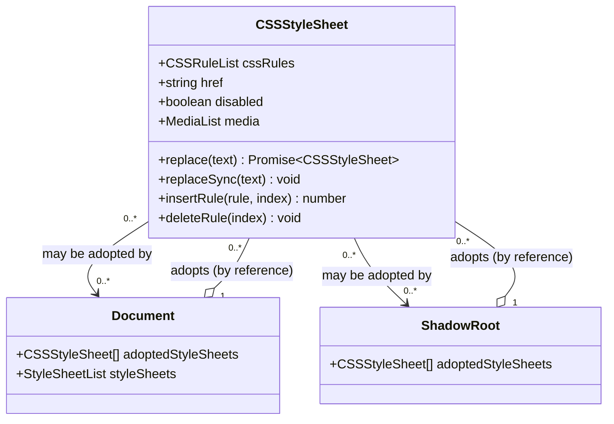
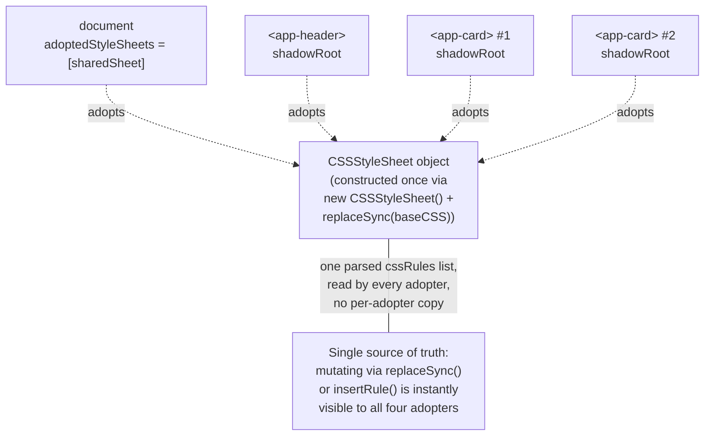

# Constructable Stylesheet Objects — Specification Reference

## 1. Title

Constructable Stylesheet Objects — Specification Reference

## 2. Version

1.0.0 — Phase 17 (Browser Specifications)

## 3. Purpose

This document is a reference-grade summary of the **Constructable Stylesheets** feature of the CSSOM specification — the `CSSStyleSheet` constructor, `CSSStyleSheet.prototype.replace`/`replaceSync`, and the `adoptedStyleSheets` property exposed on both `Document` and `ShadowRoot` — written for engineers implementing or reviewing this project's CSSOM Walker, DOM Collector, and Cache Manager. It exists to give those implementers a single, authoritative, engine-agnostic description of the specification's actual text and behavioral guarantees — constructor semantics, synchronous vs. asynchronous replacement, the array-valued `adoptedStyleSheets` property and its ordering/mutability semantics, and the sharing-by-reference model that lets one constructed sheet be adopted by many documents and shadow roots simultaneously — decoupled from any single implementation's design decisions. [307-Constructable-Stylesheets.md](../design/307-Constructable-Stylesheets.md) is this project's *design* document for how the CSSOM Walker discovers and processes adopted stylesheets; this document is the *specification* reference that design document is built on top of, and the two are intentionally kept separate so that a specification-level correction (e.g., a TC39/CSSWG clarification) can be reconciled against this file without touching the walker's design rationale, and vice versa.

## 4. Audience

Senior engineers implementing the CSSOM Walker (`packages/collector`), the DOM Collector's shadow-root traversal, the Cache Manager's fingerprinting logic, or any Selector Matcher code that must resolve which rules apply within a given shadow-root scope. Also relevant to engineers building fixtures for Web Component libraries (Lit, Stencil, hand-written custom elements) and to reviewers auditing changes to stylesheet discovery for spec fidelity. Familiarity with the base CSSOM object model (`CSSStyleSheet`, `CSSRule`, `CSSRuleList`), Shadow DOM fundamentals, and this project's [006-Design-Principles.md](../architecture/006-Design-Principles.md) is assumed.

## 5. Prerequisites

- Working knowledge of the CSSOM specification's baseline `CSSStyleSheet` interface (the same interface `document.styleSheets` entries implement) — this document only covers the *constructable extension* to that interface, not the interface itself
- Familiarity with `Document` and `ShadowRoot` as CSSOM/DOM host objects
- Familiarity with the Shadow DOM specification's style-scoping model (a shadow root's style surface is its own `<style>` elements plus its own `adoptedStyleSheets`, not its host document's stylesheets)
- Awareness of this project's Principle 1 (Browser Is the Source of Truth), which is the reason this project queries `adoptedStyleSheets` directly rather than inferring adoption from build artifacts or fallback `<style>` tags

## 6. Related Documents

- [307-Constructable-Stylesheets.md](../design/307-Constructable-Stylesheets.md) — this project's design for the CSSOM Walker's adopted-stylesheet discovery pass, dedup-by-reference-identity algorithm, and `AdoptionSite` attribution model; consumes the specification behavior summarized here
- [106-DOM-Snapshot.md](../design/106-DOM-Snapshot.md) — the DOM Collector's Shadow DOM traversal, whose shadow-root visitation callback is the hook point this project's adopted-stylesheet discovery rides on top of
- [000-CSSOM.md](./000-CSSOM.md) — baseline CSSOM object model (`CSSStyleSheet`, `CSSRuleList`, `CSSRule` hierarchy) that this document's constructable extension builds on
- [001-Selectors-Level-4.md](./001-Selectors-Level-4.md) — selector grammar that rules inside adopted sheets are subject to identically to rules from any other discovery mechanism
- [002-Media-Queries.md](./002-Media-Queries.md), [003-Container-Queries.md](./003-Container-Queries.md) — conditional grouping rules that may appear inside a constructed sheet's rule list, subject to the same nesting rules as any other sheet
- [004-Cascade-Layers.md](./004-Cascade-Layers.md) — `@layer` interaction with adopted sheets; layer membership is determined by rule content, not by adoption mechanism
- [005-CSS-Custom-Properties.md](./005-CSS-Custom-Properties.md) — custom property declarations inside adopted sheets participate in inheritance/cascade exactly as elsewhere
- [006-At-Rules-Reference.md](./006-At-Rules-Reference.md) — general at-rule grammar reference, relevant to what `replace`/`replaceSync` will and will not accept
- [007-Nested-CSS.md](./007-Nested-CSS.md) — native CSS nesting syntax, which is fully legal inside a constructed sheet's source text and parsed identically to any other stylesheet
- [009-Shadow-DOM-CSS.md](./009-Shadow-DOM-CSS.md) *(sibling Phase 17 file, if present)* — Shadow DOM style-scoping specification detail that this document's `adoptedStyleSheets`-on-`ShadowRoot` section depends on

## 7. Overview

Constructable Stylesheets is a CSSOM extension, originally proposed and shipped as part of the broader Web Components effort, that lets script construct a `CSSStyleSheet` object directly — `new CSSStyleSheet()` — populate it with CSS text via `sheet.replaceSync(cssText)` (synchronous) or `await sheet.replace(cssText)` (asynchronous, returns a Promise resolving to the sheet itself), and then make it participate in one or more documents' or shadow roots' style resolution by assigning it into that host's `adoptedStyleSheets` array: `document.adoptedStyleSheets = [sheet]` or `shadowRoot.adoptedStyleSheets = [sheet, otherSheet]`.

Before this API existed, the only ways to attach CSS to a document or a shadow root were markup-based: a `<link rel="stylesheet">` element (network fetch, one `CSSStyleSheet` object per element, not shareable across documents/roots) or a `<style>` element (inline text, parsed independently every time the element appears — critically, once per shadow root instance if a component template with an inline `<style>` block is stamped out many times). Neither construction path allows a single parsed stylesheet object to be *shared by reference* across many consumers. Constructable Stylesheets solves exactly this: it is possible to construct one `CSSStyleSheet`, parse its rule list exactly once, and adopt that same object into a thousand different shadow roots, each of which resolves style against it without re-parsing or re-fetching anything.

This has direct, load-bearing consequences for two categories of consumer this specification was designed for:

1. **Web Component libraries** (Lit, Stencil, and hand-written custom elements using the native Shadow DOM APIs) that want per-instance style encapsulation without per-instance parse cost. A component with a thousand rendered instances on a page can construct its base stylesheet once (often at module-evaluation time, cached on the component class) and adopt it into every instance's shadow root at attach time.
2. **CSS-in-JS libraries** that target Shadow DOM as an encapsulation strategy and want to avoid injecting redundant `<style>` tags into every shadow tree they manage.

The specification defines the feature narrowly and precisely: a constructor, two replacement methods (one sync, one async), and a settable, array-valued property on two host interfaces. It says nothing about *how* an implementation should optimize sharing internally (that is left to the user agent), and nothing about *policy* for how many sheets a document should adopt or in what order authors should compose them — those are entirely author/library concerns. This document is a specification summary; behavioral consequences for a specific tool (this project's CSSOM Walker) are covered in [307-Constructable-Stylesheets.md](../design/307-Constructable-Stylesheets.md), not here.

## 8. Detailed Design

### 8.1 The `CSSStyleSheet` constructor

`new CSSStyleSheet(options?)` creates a new, empty `CSSStyleSheet` object that is not yet associated with any document, node, or `<link>`/`<style>` element. The optional `options` dictionary may include:

- `baseURL` — the base URL used to resolve relative URLs (e.g., in `url()` references) found in CSS text later supplied via `replace`/`replaceSync`. Defaults to the URL of the document in whose realm the sheet is constructed.
- `media` — an initial media query list string (equivalent to a `<link media="...">` attribute), defaulting to `"all"`.
- `disabled` — an initial boolean disabled state, defaulting to `false`.

A freshly constructed sheet has an empty `cssRules` list (a live `CSSRuleList`, identical in kind to that of any other `CSSStyleSheet`) until populated via `replace`/`replaceSync`. Critically: **construction alone has no rendering effect whatsoever.** A constructed-but-unadopted sheet is inert script-visible state; it is not part of any document's or shadow root's style resolution until explicitly adopted (§8.3). This is the single most important behavioral fact for any discovery-oriented tool: a `CSSStyleSheet` object existing somewhere in JavaScript memory is not, by itself, evidence that its rules affect any rendered output.

### 8.2 `replace()` and `replaceSync()`

Both methods parse the supplied CSS text and, on success, atomically replace the sheet's `cssRules` list with the newly parsed rules. They differ only in synchronicity and in what CSS constructs they accept:

- **`replaceSync(text: string): void`** — parses synchronously and throws if the text contains constructs requiring asynchronous resolution. In virtually every implementation, this specifically means: **`@import` rules are not permitted** inside text passed to `replaceSync`, because resolving an `@import` requires a network fetch, which cannot complete synchronously. Any `@import` rule encountered is dropped (parsed as an invalid rule and ignored, per general CSS error-recovery rules) rather than causing the whole call to throw — the specification treats it as a per-rule parse failure, not a call-level exception, for consistency with how a normal stylesheet's per-rule error recovery behaves.
- **`replace(text: string): Promise<CSSStyleSheet>`** — parses asynchronously and resolves once done, allowing `@import` targets to be fetched and incorporated before the promise settles. In practice, most implementations still restrict `@import` support in constructed sheets even via the async path, or support it only partially; authors should not assume parity with `<link>`/`<style>`-sourced `@import` behavior. Both methods return/resolve to the sheet itself for chaining (`const sheet = await new CSSStyleSheet().replace(text)`).

Both methods can be called repeatedly on the same sheet object over its lifetime — replacement is not a one-time operation. Every adopter of that sheet observes the new rule content immediately after a successful replace, because adoption is by reference: there is exactly one `cssRules` list per sheet object, and every adopting document/shadow-root resolves style against that same list.

A constructed sheet may also be mutated incrementally via the standard `CSSStyleSheet.insertRule()`/`deleteRule()` methods inherited from the base CSSOM interface — `replace`/`replaceSync` are convenience methods for bulk (re)population, not the only mutation path.

### 8.3 `adoptedStyleSheets`

Both `Document` and `ShadowRoot` expose an `adoptedStyleSheets` property: a settable, array-like sequence of `CSSStyleSheet` objects. Setting it (`target.adoptedStyleSheets = [...]`) replaces the entire adopted set for that host in one step; per-index mutation methods (`push`, `splice`, direct index assignment) are also observable in current implementations, though the specification's normative surface is centered on whole-array assignment via a setter that validates every element is a constructed, adoptable sheet.

**Validation constraint.** Every sheet assigned into `adoptedStyleSheets` must have been constructed via `new CSSStyleSheet()` (or otherwise be explicitly adoptable) in the *same* JavaScript realm/global as the target document — a sheet constructed in one browsing context's realm cannot be adopted by a document in a different realm (e.g., a different same-origin iframe's `window`). Attempting to assign a non-constructed sheet (e.g., one obtained from `document.styleSheets`, which is a `<link>`/`<style>`-backed sheet) throws. This constraint has a direct implication for discovery: every entry found while walking any `adoptedStyleSheets` array is *guaranteed* to be a constructed sheet, never a `<link>`/`<style>`-sourced one, so no additional type-narrowing is needed to distinguish the two populations at read time.

**Ordering is cascade-significant.** The array's iteration order determines relative position in the cascade among the adopted sheets themselves: for two rules of otherwise equal specificity, origin, and layer, the rule from the sheet at the later array index wins, exactly as a later `<link>` element in document order would win over an earlier one. This makes the array's order — not merely its membership — part of the sheet's observable contribution to style resolution, and any consumer that reads `adoptedStyleSheets` for extraction purposes must preserve position, not just presence.

**Sharing by reference, not by copy.** The same `CSSStyleSheet` object reference may appear in the `adoptedStyleSheets` array of arbitrarily many documents and shadow roots simultaneously. There is no cloning, no serialization, and no per-adopter copy of the rule list — every adopter's style resolution reads the identical, single `cssRules` list. This is the specification's central design property and the entire reason the feature exists: it lets an implementation (and a well-written library) share one parsed representation across unbounded adopters at O(1) marginal memory cost per adoption, in contrast to `<style>` tag duplication, which costs a full parse and a full rule-list allocation per instance.

### 8.4 Removal and re-adoption

Removing a sheet from a host's adopted set is done by re-assigning `adoptedStyleSheets` to a new array that omits it (there is no dedicated "unadopt" method) or via mutation of the live array where supported. A sheet removed from every adopter it was previously part of does not cease to exist — the `CSSStyleSheet` object persists in JavaScript memory for as long as script holds a reference to it, and can be re-adopted later, at which point its (possibly further mutated) current rule content applies again. This "adopt, unadopt, re-adopt" lifecycle is fully legal and has no special-cased behavior distinct from first adoption.

### 8.5 Interaction with the Shadow DOM specification

`ShadowRoot.adoptedStyleSheets` is defined by the Shadow DOM specification (not the CSSOM specification proper) as the sole mechanism, besides in-tree `<style>` elements physically present inside the shadow tree, by which a shadow root acquires style rules that apply within its scope. A shadow root has no `styleSheets` property analogous to `Document.styleSheets` — `<link rel="stylesheet">` elements are permitted inside a shadow tree in modern specifications, but the historical and still-dominant pattern for shadow-scoped styling that this project's fixtures target is `<style>` elements plus `adoptedStyleSheets`. Style scoping is absolute: a rule contributed via a shadow root's `adoptedStyleSheets` entry applies only to elements within that shadow tree's own light-DOM-equivalent content, never to the host document or to sibling shadow trees, even when the identical sheet object is simultaneously adopted elsewhere (§8.3's sharing-by-reference does not imply sharing of *scope* — each adopter's resolution is independently scoped).

## 9. Architecture

The relationship between the specification's object model and a page adopting a shared stylesheet across several shadow roots is illustrated below.



The following diagram shows one constructed stylesheet, `sharedSheet`, adopted simultaneously by the top-level document and by three separate shadow roots belonging to three different custom-element instances — the canonical Lit/Stencil sharing pattern this specification exists to support.



## 10. Algorithms

The specification itself defines no extraction or discovery algorithm — it defines object construction, mutation, and array-assignment semantics only. The two procedures below describe the *specification-mandated behavior* an implementer must model correctly; this is distinct from, and simpler than, this project's own discovery algorithm in [307-Constructable-Stylesheets.md](../design/307-Constructable-Stylesheets.md), which additionally handles reference-identity dedup and `AdoptionSite` bookkeeping specific to this project's extraction goals.

### Algorithm: `replaceSync` rule-list replacement

**Problem statement.** Given a `CSSStyleSheet` and a CSS text string, atomically replace the sheet's rule list with the parsed result, or leave the rule list unmodified if a synchronous constraint is violated.

**Inputs.** `sheet: CSSStyleSheet`, `text: string`.

**Outputs.** `sheet.cssRules` updated in place; no return value.

**Pseudocode.**
```
function replaceSync(sheet, text):
    parsedRules = parseStylesheet(text)          // standard CSS parsing, top-level rule list
    for rule in parsedRules:
        if rule.type == IMPORT_RULE:
            markInvalid(rule)                    // dropped per CSS error-recovery rules,
                                                  // not a call-level throw
    sheet.cssRules = parsedRules.filter(rule => rule is valid)
    // Replacement is atomic from an observer's perspective: no adopter ever
    // observes a partially-replaced rule list mid-parse.
```

**Time complexity.** O(N) in the length of `text`, dominated by CSS parsing, identical in order to parsing any other stylesheet source of the same size.

**Memory complexity.** O(R) where R is the number of resulting top-level rules (plus nested rules under conditional groups); the previous rule list becomes eligible for garbage collection once no other reference to it remains (there is exactly one live `cssRules` list per sheet at any time, never two mid-transition).

**Failure cases.** Malformed CSS text does not throw — CSS parsing is defined to be maximally permissive per the general CSS error-recovery model, so invalid top-level constructs are simply dropped from the resulting rule list, identical to how a `<style>` tag with invalid CSS silently ignores the invalid portions. `replaceSync` throws only for constructs that require asynchronous resolution (chiefly `@import` targets requiring network fetch) when called synchronously, and for calls made on a sheet not constructed via `new CSSStyleSheet()`.

**Optimization opportunities.** None specified — this is a parsing-cost-bound operation with no meaningful implementation-level shortcut beyond ordinary CSS parser optimization, which is out of this project's scope (the parser is the browser's, per Principle 1).

### Algorithm: `adoptedStyleSheets` assignment validation

**Problem statement.** Given a candidate array assigned to `target.adoptedStyleSheets` (`target` being a `Document` or `ShadowRoot`), determine whether the assignment is valid and, if so, install it as the new adopted set.

**Inputs.** `target: Document | ShadowRoot`, `candidates: CSSStyleSheet[]`.

**Outputs.** `target.adoptedStyleSheets` updated to `candidates` (by reference, preserving order) or a `TypeError` thrown.

**Pseudocode.**
```
function setAdoptedStyleSheets(target, candidates):
    for sheet in candidates:
        if sheet.constructorRealm != target.relevantRealm:
            throw TypeError("cross-realm adoption not permitted")
        if not sheet.isConstructed:
            throw TypeError("only constructed CSSStyleSheet objects are adoptable")
    // Validation is whole-array: any single invalid entry rejects the entire
    // assignment; there is no partial-adoption outcome.
    target.[[adoptedStyleSheets]] = candidates    // order preserved, references preserved
    scheduleStyleInvalidation(target)             // cascade recomputed to reflect new set
```

**Time complexity.** O(K) for validation where K is `candidates.length`; style invalidation/recomputation cost afterward is proportional to the affected subtree's style-resolution cost, not to this assignment step itself.

**Memory complexity.** O(K) for the new array; no rule-list copying occurs since sheets are held by reference.

**Failure cases.** Cross-realm sheet references throw. Passing a `<link>`/`<style>`-backed (non-constructed) `CSSStyleSheet` throws. Assigning an array containing the same sheet reference at two different indices is not an error at the specification level (implementations vary on whether duplicate adoption within a single array is deduplicated or produces a double contribution; authors should not rely on either behavior, and this project's own dedup model in [307-Constructable-Stylesheets.md](../design/307-Constructable-Stylesheets.md) resolves ambiguity here by deduping unconditionally by reference identity).

**Optimization opportunities.** None at the specification level; this is a validation-and-install step, not a performance-sensitive computation in its own right.

## 11. Implementation Notes

- **Feature detection.** `'adoptedStyleSheets' in Document.prototype` (or the equivalent `ShadowRoot.prototype` check) is the standard feature-detection idiom; any browser automation target old enough to lack it should be treated by this project as out of scope for adopted-sheet discovery entirely, per the general browser-version support policy in [006-Design-Principles.md](../architecture/006-Design-Principles.md).
- **Reading `adoptedStyleSheets` for discovery purposes must happen inside a single in-page evaluation.** Because the array holds live object references, any automation approach that serializes the array across a protocol boundary (e.g., naively returning it from a CDP `Runtime.evaluate` call as a JSON structure) destroys reference identity, which this project's dedup model depends on (§8.3, and see [307-Constructable-Stylesheets.md](../design/307-Constructable-Stylesheets.md) §9.3). The correct approach is to perform sheet identity tracking and rule extraction together inside one `page.evaluate()`-style call, returning only serializable extraction results, not the sheet references themselves.
- **`sheet.href` is `null` for constructed sheets.** Unlike `<link>`-sourced sheets, a constructed sheet has no natural URL; `baseURL` (from the constructor's `options`) governs relative URL resolution but is not exposed as `href`. Any diagnostic tooling that assumes every stylesheet has a meaningful `href` for display purposes must special-case constructed sheets (e.g., displaying a synthetic label like `"constructed:<n>"` or the adopting library's identifiable class name where available).
- **`disabled` and `media` are supported identically to non-constructed sheets** and must be honored by any rule-collection logic: a constructed sheet with `disabled = true`, or whose `media` does not match the current viewport, contributes no active rules despite being adopted, exactly as for a `<link media="...">` element.
- **Timing of `replace`/`replaceSync` relative to adoption.** A sheet may be adopted before, after, or interleaved with calls to `replace`/`replaceSync` — adoption and population are entirely independent operations, and library code commonly constructs, populates, then adopts in that order (though the reverse — adopt an empty sheet, then populate it — is equally valid and observable by every adopter simultaneously once populated). This project's snapshot-based extraction model addresses the resulting timing question by defining extraction relative to one stable snapshot point, per [307-Constructable-Stylesheets.md](../design/307-Constructable-Stylesheets.md) Implementation Notes.

## 12. Edge Cases

- **A constructed sheet is never adopted anywhere.** It remains a valid, fully functional `CSSStyleSheet` object (rules can be inserted, `replace` can be called) but contributes nothing to any render tree, ever, until adopted. Per Principle 1, this project's discovery mechanism must never attempt to find such sheets (there is no browser-exposed enumeration of "all constructed sheets in memory," and inventing one via heap inspection would violate the browser-as-source-of-truth model).
- **The same sheet appears twice in one `adoptedStyleSheets` array.** Specification behavior on double contribution is implementation-variable; author code doing this is almost certainly a bug, but a discovery tool must not crash or infinite-loop on it — it should be treated as (at most) two `AdoptionSite` position entries for one already-deduplicated sheet.
- **`replaceSync` called with `@import` text.** The `@import` rule is silently dropped; the rest of the sheet's rules still populate normally. This is a per-rule failure, not a call failure, and callers who assume `replaceSync` either fully succeeds or fully throws on any invalid input will mismodel this case.
- **Cross-realm adoption attempt (e.g., adopting a sheet constructed in a different same-origin iframe's global).** Throws at assignment time; this project's discovery pass, operating within a single page/frame context per extraction unit, should not encounter this case in ordinary operation but must not assume it is unreachable if iframe-aware extraction is added in a future phase.
- **A sheet adopted by a shadow root that is later detached from the document (component unmount) without the adopting array itself being modified.** The `adoptedStyleSheets` array on the (now detached) shadow root is unchanged — adoption state is a property of the shadow root object, not of its attachment to a document. Whether a detached shadow root's styles matter for extraction is a DOM-Collector-level question (is a detached shadow root ever considered above-the-fold?), not a specification-level ambiguity.
- **Mutating a sheet after it has already been read for extraction.** The specification permits mutation (`replace`, `replaceSync`, `insertRule`, `deleteRule`) at any time, with every adopter observing the new state immediately. Any extraction tool must define its own snapshot semantics — the specification itself provides no "freeze" primitive.
- **Declarative Shadow DOM's evolving relationship to adopted stylesheets.** At time of writing, ongoing specification work on declarative shadow root serialization (`<template shadowrootmode>`) does not yet define a markup-level way to declare `adoptedStyleSheets` membership for a server-rendered shadow tree; current SSR strategies that need adopted-sheet behavior for a declaratively-attached shadow root must still populate `adoptedStyleSheets` via a script step after the declarative shadow root is parsed. Any future specification change here is expected to resolve into the same live `adoptedStyleSheets` array this document describes, per the general pattern noted in [307-Constructable-Stylesheets.md](../design/307-Constructable-Stylesheets.md) Edge Cases.
- **Nested CSS inside a constructed sheet's source text.** Native CSS nesting ([007-Nested-CSS.md](./007-Nested-CSS.md)) is ordinary CSS syntax as far as `replace`/`replaceSync` are concerned — nesting is resolved by the same parser used for any other stylesheet source, with no constructable-sheet-specific restriction; a constructed sheet's `cssRules` list exposes the same (already-expanded, per current parsing model) rule structure as a nested `<style>` block would.
- **`@layer` statements inside a constructed sheet.** Fully supported; layer membership and ordering (per [004-Cascade-Layers.md](./004-Cascade-Layers.md)) are determined by rule content exactly as for any other sheet — adoption mechanism has no bearing on layer semantics.

## 13. Tradeoffs

| Design Choice (specification-level) | Cost Accepted | Benefit Gained | Chosen Because |
|---|---|---|---|
| Adoption by reference, not by value/copy | Any consumer (including this project's CSSOM Walker) must handle a many-to-one adopter-to-sheet relationship rather than a simple 1:1 model | O(1) marginal memory/parse cost per additional adopter; the entire efficiency case for the feature | The API's stated purpose is precisely to let component libraries avoid per-instance parse/memory cost |
| Whole-array assignment semantics for `adoptedStyleSheets` rather than fine-grained insert/remove-only API | Authors replacing one sheet among several must reconstruct and reassign the whole array (mitigated in practice by array mutation methods in most implementations) | Simple, atomic mental model: the adopted set at any instant is exactly what the array currently contains, no incremental-state tracking needed | Matches the specification's general preference for atomic, observable state transitions over incremental APIs with partial-failure modes |
| `replaceSync` disallows `@import`; only `replace` (async) can plausibly support it | Authors needing `@import` inside a constructed sheet must use the async path and cannot get synchronous guarantees | Synchronous parsing is fast, predictable, and never blocks on network I/O — critical for use during synchronous component render paths | `@import` requires a network fetch that cannot complete within a synchronous call by construction |
| No dedicated "unadopt" method; removal is reassignment | Slightly less ergonomic API surface for the single-sheet-removal case | Fewer API surface points to specify and implement; consistent with whole-array assignment philosophy above | Symmetric with the whole-array-is-the-state-of-truth design already chosen for assignment |

## 14. Performance

- **CPU complexity.** Parsing cost for `replace`/`replaceSync` is O(N) in CSS text length, identical in asymptotic terms to parsing any other stylesheet source; the feature's entire performance value is in *avoiding repeated* O(N) parses across many adopters, not in making a single parse faster.
- **Memory complexity.** O(R) per distinct constructed sheet (R = rule count), shared across all adopters at zero marginal cost per additional adoption beyond the O(1) array-slot reference; contrast with the pre-Constructable-Stylesheets norm of O(R) *per shadow root instance* when using inline `<style>` tags in a component template.
- **Caching strategy.** From this project's perspective, a distinct constructed sheet's content must be included in any content-addressed fingerprint used for incremental extraction caching (Principle 8) — a mutation via `replaceSync` changes the sheet's contribution for every adopter simultaneously and must invalidate every cache entry keyed on any of those adopters, a fan-out effect worth being deliberate about when designing the Cache Manager's fingerprint scope (detailed in [307-Constructable-Stylesheets.md](../design/307-Constructable-Stylesheets.md) Performance).
- **Parallelization opportunities.** From a specification standpoint, nothing about `replace`/`replaceSync`/adoption is inherently sequential across distinct sheets; a user agent (or an extraction tool processing many distinct sheets) may parse/process unrelated constructed sheets independently and in parallel.
- **Incremental execution.** The specification provides no native "diff" primitive between two successive states of a sheet's `cssRules`; any incremental reasoning about "what changed since last extraction" is entirely the responsibility of the consuming tool, not something the specification assists with.
- **Scalability limits.** The specification itself imposes no cap on adopted-sheet count, rule count per sheet, or adopter count per sheet; practical scalability limits (thousands of shadow roots each adopting a handful of sheets) are governed by the browser's general style-resolution performance characteristics and by DOM traversal cost (owned by [106-DOM-Snapshot.md](../design/106-DOM-Snapshot.md)), not by anything specific to this feature.

## 15. Testing

- **Unit tests.** Constructing a sheet, calling `replaceSync` with valid/invalid/`@import`-containing text, and asserting the resulting `cssRules` matches expected per-rule validity; asserting `replace`'s Promise resolves/rejects correctly; asserting cross-realm adoption throws.
- **Integration tests.** A fixture adopting one constructed sheet into a document and multiple shadow roots simultaneously, verifying that a mutation via `replaceSync` is observed identically and immediately by every adopter (verifying the by-reference sharing model end-to-end, not merely at construction time).
- **Visual tests.** A fixture where above-the-fold rendering inside a shadow root depends entirely on an adopted sheet's rules, confirmed via `getComputedStyle()` on elements inside that shadow root, cross-checked against this project's own extraction output as specified in [307-Constructable-Stylesheets.md](../design/307-Constructable-Stylesheets.md).
- **Stress tests.** A synthetic fixture with a very high adopter-to-sheet ratio (thousands of shadow roots adopting one shared sheet) to validate that parsing cost does not scale with adopter count, only with distinct-sheet count — a direct specification-level property this project's own algorithm relies on.
- **Regression tests.** Golden fixtures explicitly exercising `@layer`, nested CSS, and `@supports` rules inside a constructed sheet's source text, confirmed to parse and cascade identically to equivalent content in a `<link>`/`<style>`-sourced sheet — verifying the specification's promise that adoption mechanism has no bearing on rule semantics.
- **Benchmark tests.** Parsing-cost benchmarks comparing `replaceSync` against equivalent `<style>` tag parsing for the same CSS text, to empirically confirm no per-mechanism parsing overhead difference exists (the two should be dominated by the same underlying CSS parser).

## 16. Future Work

- Track the CSSWG/WHATWG specification process for any change to cross-realm adoption restrictions, particularly as it might interact with cross-origin iframe scenarios this project may eventually support.
- Monitor Declarative Shadow DOM specification progress for a possible future markup-level `adoptedStyleSheets` declaration mechanism for SSR'd shadow trees, and revisit whether this document's "read after the browser processes any declarative form" framing needs updating once such a proposal ships.
- Investigate whether `CSSStyleSheet.prototype.replace`'s async `@import` support is consistent enough across current evergreen browser versions to be relied upon in any future project feature, or whether it remains inconsistent enough that this project should continue treating "`@import` inside a constructed sheet" as out of scope in practice.
- Open question: whether a future specification revision might expose a lighter-weight, purpose-built enumeration primitive (e.g., a CDP domain event for "sheet adopted/unadopted") that would reduce this project's current reliance on walking every shadow root to discover `adoptedStyleSheets` membership, as already flagged as an open research question in [307-Constructable-Stylesheets.md](../design/307-Constructable-Stylesheets.md) Future Work.
- Research whether duplicate-reference handling within a single `adoptedStyleSheets` array is or will be standardized (currently implementation-variable per §12), since a firm specification answer would let this project remove a defensive assumption from its dedup model.

## 17. References

- [307-Constructable-Stylesheets.md](../design/307-Constructable-Stylesheets.md) — this project's design document for CSSOM Walker discovery of adopted stylesheets, built on the specification behavior summarized here
- [106-DOM-Snapshot.md](../design/106-DOM-Snapshot.md) — DOM Collector's Shadow DOM traversal, the hook point for shadow-root-level `adoptedStyleSheets` discovery
- [006-Design-Principles.md](../architecture/006-Design-Principles.md) — Principle 1 (Browser Is the Source of Truth), the general rationale for querying live browser state rather than static artifacts
- [000-CSSOM.md](./000-CSSOM.md) — baseline `CSSStyleSheet`/`CSSRuleList`/`CSSRule` object model
- [001-Selectors-Level-4.md](./001-Selectors-Level-4.md) — selector grammar applicable to rules inside adopted sheets
- [002-Media-Queries.md](./002-Media-Queries.md) — `media` property and media-conditional rules inside adopted sheets
- [003-Container-Queries.md](./003-Container-Queries.md) — container-conditional rules inside adopted sheets
- [004-Cascade-Layers.md](./004-Cascade-Layers.md) — `@layer` semantics, unaffected by adoption mechanism
- [005-CSS-Custom-Properties.md](./005-CSS-Custom-Properties.md) — custom property cascade behavior inside adopted sheets
- [006-At-Rules-Reference.md](./006-At-Rules-Reference.md) — general at-rule grammar reference
- [007-Nested-CSS.md](./007-Nested-CSS.md) — native nesting syntax, fully legal inside constructed-sheet source text
- CSSOM Specification (W3C Working Draft) — `CSSStyleSheet` interface, `replace`/`replaceSync` methods
- Constructable Stylesheets / `adoptedStyleSheets` extension specification (WICG incubation, since folded into CSSOM and Shadow DOM specification text) — constructor, validation, and array semantics
- Shadow DOM specification (WHATWG DOM) — `ShadowRoot.adoptedStyleSheets`, shadow-tree style scoping
- Lit and Stencil project documentation — representative real-world library usage of `new CSSStyleSheet()` + `adoptedStyleSheets` for component style sharing
