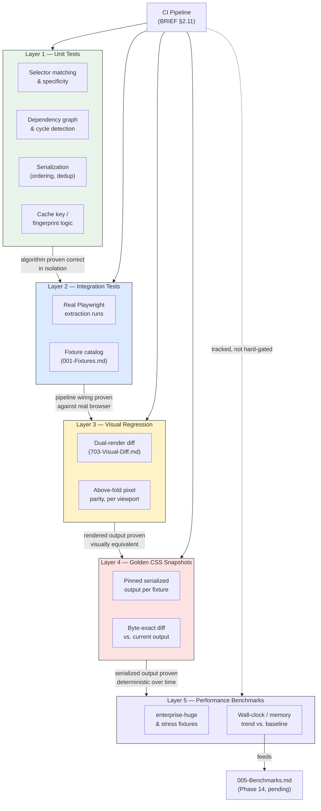
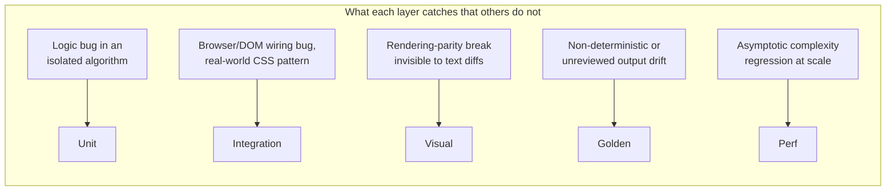

# 000 — Testing Strategy

## 1. Title

**Critical CSS Extraction Engine — Testing Strategy: A Five-Layer Pyramid for a Browser-Grounded, Non-Deterministic-Input System**

## 2. Version

| Field | Value |
|---|---|
| Document Version | 1.0.0 |
| Status | Accepted |
| Last Updated | 2026-07-10 |
| Owners | Testing & Quality Working Group |
| Stability | Stable (Phase 15 design document; this is the top-level contract every sibling testing document and every package's test suite must be traceable to — changes to layer boundaries or CI gating require RFC) |

## 3. Purpose

Every prior phase of this project's design has argued, repeatedly, that the browser is the source of truth ([006-Design-Principles.md](../architecture/006-Design-Principles.md) Principle 1) and that static analysis is a *model* of browser behavior, not a substitute for it. That argument has a direct, uncomfortable consequence for testing: a test suite built entirely of unit tests against hand-constructed CSSOM/DOM fixtures would only prove that the engine's code does what its authors *believe* the browser does — it would not prove the engine does what the browser *actually* does. Conversely, a test suite built entirely of real-browser integration tests would be accurate but slow, flaky under timing pressure, and useless for isolating *which* of the engine's dozen packages regressed when a assertion fails three layers deep in the pipeline. Neither extreme is viable at the scale BRIEF.md Section 2.15 implies: unit tests, integration tests, visual regression, golden CSS snapshots, and performance benchmarks, exercised against a fixture catalog that spans Tailwind's tens-of-thousands-of-utility-classes scale down to a single malformed SVG `style` attribute.

This document is the top-level contract that reconciles those extremes. It defines a five-layer test pyramid — Unit, Integration, Visual Regression, Golden CSS Snapshots, and Performance Benchmarks — states precisely what defect class each layer is *uniquely* responsible for catching (the layers are not redundant with each other; a defect that only Visual Regression catches is not expected to also be caught by Golden Snapshots, and vice versa), and specifies the coverage targets and CI gating rules that make "high test coverage" (BRIEF.md Section 2.18) an enforceable, measurable property of every merge rather than an aspiration. It is the parent document for [001-Fixtures.md](./001-Fixtures.md) (the fixture catalog every layer draws from), [002-Visual-Tests.md](./002-Visual-Tests.md), [003-Golden-Files.md](./003-Golden-Files.md), [004-Performance-Tests.md](./004-Performance-Tests.md), and [005-Regression-Tests.md](./005-Regression-Tests.md), each of which expands one layer (or, for Regression Tests, a cross-cutting discipline) in full.

The central thesis this document defends: **a defect in this engine can originate in four qualitatively different places — pure algorithmic logic, browser/DOM interaction, rendered pixel output, and asymptotic performance under scale — and no single test layer can observe all four.** The pyramid is therefore not a cost-optimization convention (write more cheap unit tests than expensive end-to-end tests, as in the classical Google/Cohn testing pyramid) applied unreflectively; it is a *coverage-completeness* argument, where the shape happens to also be cost-efficient because the layers that see the most of the system (integration, visual) are also the most expensive to run, and are deliberately narrowed to the claims only they can verify.

## 4. Audience

- Implementers of every `packages/*` module, who need to know which layer owns testing their code's algorithmic core versus its browser-facing surface.
- CI/CD pipeline implementers (BRIEF.md Section 2.11), who need the concrete gating rules — which layer's failure blocks a merge, and under what threshold.
- Implementers of [001-Fixtures.md](./001-Fixtures.md) through [005-Regression-Tests.md](./005-Regression-Tests.md), who each own one layer's detailed contract and need this document's boundaries to avoid re-deriving or contradicting them.
- Reviewers auditing a pull request's test coverage, who need a checklist: "does this change to `packages/dependency-graph` have a unit test for the new algorithm, an integration test against a fixture that exercises it end-to-end, and — if it touches serialized output — a golden snapshot update?"
- New engineers onboarding onto the project, for whom this document is the fastest path to understanding "what kind of test do I write for this change" without reading all five sibling documents first.

Readers should be familiar with the general test-pyramid concept (unit/integration/e2e), with Playwright as the browser-automation substrate ([101-Playwright-Adapter.md](../design/101-Playwright-Adapter.md)), and with [006-Design-Principles.md](../architecture/006-Design-Principles.md), particularly Principle 1 (Browser Is Source of Truth) and Principle 5 (Determinism of Output).

## 5. Prerequisites

- [006-Design-Principles.md](../architecture/006-Design-Principles.md) — Principles 1 (Browser Is Source of Truth) and 5 (Determinism of Output) are the two design commitments this entire strategy is built to verify.
- [007-Repository-Structure.md](../architecture/007-Repository-Structure.md) — defines where `fixtures/`, `benchmarks/`, and per-package unit test directories live in the monorepo, which this document assumes as the physical layout for all five layers.
- [703-Visual-Diff.md](../design/703-Visual-Diff.md) — the dual-render screenshot-diff *mechanism* this document's Visual Regression layer reuses as a test-time tool; read that document for the algorithm, this document for how it is deployed as a CI-gating test layer.
- [002-Problem-Statement.md](../architecture/002-Problem-Statement.md) Section 8 — the failure-class taxonomy that BRIEF.md's fixture list (Section 2.15) exists to cover; this document's Integration layer is the enforcement mechanism for "every failure class has a corresponding fixture and test."
- BRIEF.md Section 2.11 (CI/CD Pipeline), Section 2.15 (Testing Strategy), Section 2.18 (Acceptance Criteria) — the root requirements this document operationalizes.

## 6. Related Documents

- [001-Fixtures.md](./001-Fixtures.md) — the fixture catalog consumed by the Integration, Visual Regression, and Golden Snapshot layers defined here.
- [002-Visual-Tests.md](./002-Visual-Tests.md) — full detail on the Visual Regression layer introduced in Section 8.3 below.
- [003-Golden-Files.md](./003-Golden-Files.md) — full detail on the Golden CSS Snapshot layer introduced in Section 8.4 below.
- [004-Performance-Tests.md](./004-Performance-Tests.md) — full detail on the Performance Benchmark layer introduced in Section 8.5 below, and the forward-reference target [005-Benchmarks.md](../performance/005-Benchmarks.md) (Phase 14, pending) for the numeric baselines it tracks.
- [005-Regression-Tests.md](./005-Regression-Tests.md) — the cross-cutting regression discipline (pinned fixtures, pinned thresholds, "every fixed bug gets a permanent test") that spans all five layers rather than being a sixth layer.
- [703-Visual-Diff.md](../design/703-Visual-Diff.md) — the dual-render diff mechanism reused by the Visual Regression layer.
- [007-Repository-Structure.md](../architecture/007-Repository-Structure.md) — physical layout of `fixtures/`, `benchmarks/`, and package-local test directories.
- BRIEF.md Section 2.11 (CI/CD Pipeline), Section 2.15 (Testing Strategy), Section 2.18 (Acceptance Criteria) — repository root.

## 7. Overview

The pyramid, top to bottom by run frequency and bottom to top by system-coverage breadth:

1. **Unit tests** — pure functions and algorithms tested in isolation, no browser. Fastest, run on every keystroke in local dev and on every CI push. Catches: logic bugs in isolated algorithms (selector-specificity comparison, cycle detection, cache-key derivation) with precise, single-function blame.
2. **Integration tests** — real Playwright-driven extraction against the fixture catalog ([001-Fixtures.md](./001-Fixtures.md)). Slower, run on every CI push. Catches: everything a unit test's synthetic mocks cannot — real browser quirks, cross-module wiring bugs, and the entire class of defect this project's Problem Statement exists to name (a static model that diverges from actual rendering).
3. **Visual Regression** — the dual-render screenshot diff of [703-Visual-Diff.md](../design/703-Visual-Diff.md), deployed as a CI-gating test layer. Slower still (real browser, real screenshots). Catches: rendering-parity breaks that are invisible to both unit and integration tests, because those layers assert on *extracted CSS text*, not on *what a browser paints from it* — a rule can be textually present yet functionally inert (wrong selector variant, cascade-order bug) and only a rendered-pixel comparison exposes that.
4. **Golden CSS Snapshots** — deterministic-output verification: the exact serialized critical-CSS text for a fixture is pinned and diffed byte-for-byte on every run. Catches: any unintended change to the *shape* of the output — dedup order, rule ordering, whitespace, a new declaration appearing — even when the change is visually imperceptible (and therefore invisible to Visual Regression) and even when it doesn't reflect an algorithmic logic bug a unit test would catch (e.g., a third-party dependency bump changing float-to-string formatting).
5. **Performance Benchmarks** — wall-clock and memory measurements against `fixtures/enterprise-huge/` and other scale fixtures, tracked over time ([004-Performance-Tests.md](./004-Performance-Tests.md), forward-referencing [005-Benchmarks.md](../performance/005-Benchmarks.md)). Catches: asymptotic regressions (an accidental `O(n)`→`O(n²)` change) that produce *correct* output at small fixture sizes — passing every layer above — while being unshippable at real enterprise scale.

The critical property tying these together: **each layer's blind spot is a different layer's core competency.** A change that only affects performance (e.g., an accidentally-quadratic loop) can produce byte-identical golden output and pixel-identical visual diffs at small fixture scale — it is invisible to layers 1–4 and only layer 5 catches it. A change that only affects visual fidelity without changing the CSS AST's logical content (e.g., a serialization step reordering non-conflicting declarations) can pass unit, integration, and even (if golden snapshots are keyed loosely) golden tests, while breaking nothing visually — conversely, a change that reorders *conflicting* declarations passes every text-level check yet is caught only by Visual Regression. This is why BRIEF.md Section 2.15 lists five layers rather than treating "testing" as a single undifferentiated obligation, and why this document insists all five run in CI rather than treating the expensive ones as optional/manual.

## 8. Detailed Design

### 8.1 Layer 1 — Unit Tests

**Scope.** Every pure, browser-independent algorithm gets a colocated unit test suite (`packages/*/src/**/*.test.ts`, per [007-Repository-Structure.md](../architecture/007-Repository-Structure.md)). "Pure" is the operative constraint: a unit test never launches a browser, never touches the filesystem beyond reading small in-repo fixtures, and never depends on wall-clock time or network I/O. Concretely, this layer owns:

- **Selector matching** ([400-Selector-Matching.md](../design/400-Selector-Matching.md), [401-Selector-Memoization.md](../design/401-Selector-Memoization.md)) — specificity computation, `:is()/:where()/:has()` normalization ([404-Is-Where-Has.md](../design/404-Is-Where-Has.md)), memoization cache-key derivation, tested against synthetic selector strings and synthetic `MatchedRule` structures, not live DOM.
- **Dependency resolution** ([500-Dependency-Resolution-Overview.md](../design/500-Dependency-Resolution-Overview.md) and children) — variable reference graph construction, `@font-face`/`@property`/counter dependency edges, and **cycle detection** specifically, tested with synthetic graphs engineered to contain cycles, diamonds, and self-references, because these are adversarial-input tests that are far cheaper to construct as in-memory graph literals than as real CSS fixtures that happen to produce the same graph shape.
- **Serialization** ([600-Serialization-Overview.md](../design/600-Serialization-Overview.md) and children) — canonical rule ordering, deduplication, compression, tested against synthetic `Rule`/`Declaration` ASTs.
- **Cache** ([800-Cache-Overview.md](../design/800-Cache-Overview.md) and children) — fingerprint derivation, cache-key composition, invalidation-predicate logic, tested with synthetic content hashes, no real cache backend.

**Why isolate these as unit tests rather than folding them into integration tests.** Three reasons, each load-bearing. First, **precision of blame**: when `compareSpecificity(a, b)` has an off-by-one bug in the class-count tier, a unit test asserting `compareSpecificity` directly fails with a message naming the exact function and the exact malformed input; the same bug surfacing only in an integration test manifests as "fixture `bootstrap/navbar.html`'s critical CSS is missing rule N," which requires a debugging session to trace back to the specificity comparator. Second, **adversarial-input feasibility**: cycle detection needs to be tested against a self-referential `--a: var(--a)` and against long transitive cycles (`--a → --b → --c → --a`); constructing real CSS fixtures for every cycle topology worth testing is possible but is strictly more expensive to author and maintain than an in-memory graph literal, for zero additional confidence (the cycle-detection algorithm does not care whether the graph came from parsed CSS or from a test literal). Third, **speed**: the full unit suite must run in seconds, not minutes, so it can execute on every local save and every CI push without becoming a bottleneck; this is only achievable if it never launches a browser.

**Alternative considered.** Testing all algorithmic logic exclusively via integration tests against real fixtures ("if the fixture's golden output is right, the algorithm must be right"). Rejected because it conflates two orthogonal correctness claims — "the algorithm is logically correct for all inputs" and "the algorithm produces the right output for this one fixture's inputs" — and because it makes the adversarial edge cases (cycles, deeply nested `:not()`, pathological specificity ties) either untested (no real-world fixture happens to trigger them) or expensively over-represented as fixtures that exist purely to trigger one algorithmic branch, which is exactly what a unit test is for at a fraction of the authoring cost.

**Coverage target.** ≥90% statement coverage on every package's pure-logic modules (selector matching, dependency graph, serialization core, cache-key logic), enforced by the CI coverage gate (Section 8.6). Coverage below 90% on a pure-logic module blocks merge; coverage on browser-interaction modules (Section 8.2) is not held to this bar because a meaningful fraction of their logic is only exercisable via integration tests (Section 8.2's own target applies there instead).

### 8.2 Layer 2 — Integration Tests

**Scope.** Real Playwright-driven extraction runs against the fixture catalog ([001-Fixtures.md](./001-Fixtures.md)), asserting on the *logical content* of the extracted critical CSS (which selectors, which declarations, which at-rules survived) rather than on rendered pixels (that is Layer 3's job) or on byte-exact serialized text (that is Layer 4's job, though the two overlap in practice — see Section 8.4's note on layering golden assertions onto integration runs).

This is, per this document's Purpose section, **the layer that matters most for this specific project**, because it is the only layer that exercises the actual browser behavior the entire architecture is built around trusting (Principle 1). Every fixture in [001-Fixtures.md](./001-Fixtures.md) exists because some real-world CSS-authoring pattern — Tailwind's utility-class volume, CSS Modules' hashed class names, Shadow DOM's encapsulated adopted stylesheets, container queries' live-layout-dependent applicability — produces browser behavior that a hand-rolled unit-test mock could get subtly wrong, and only a real `page.goto()` + real CSSOM/DOM query proves the engine handles it.

**Structure.** One integration test per fixture family, each asserting:
1. Extraction completes without error (no thrown exception, no timeout — BRIEF.md Section 2.11's "extraction errors occur" build-failure trigger is this assertion's CI-facing counterpart).
2. The extracted CSS contains every selector known (by fixture design — see [001-Fixtures.md](./001-Fixtures.md) Section 8's "what it guards against" for each family) to be required for above-fold rendering, and excludes every selector known to be below-fold-only or otherwise inapplicable.
3. Dependency closure holds: every custom property, `@font-face`, `@keyframes`, and counter referenced by a surviving declaration is itself present in the output ([500-Dependency-Resolution-Overview.md](../design/500-Dependency-Resolution-Overview.md)'s closure guarantee).

**Why this layer cannot be replaced by more unit tests.** A unit test asserting "selector matching returns true for this selector against this synthetic element" only proves the matcher's logic is correct for the synthetic element the test author constructed — it does not prove the *walker* correctly discovered that selector's rule in the first place (e.g., inside an adopted Constructable Stylesheet within a shadow root, [307-Constructable-Stylesheets.md](../design/307-Constructable-Stylesheets.md)), that the *DOM snapshot* correctly represented the shadow-root structure, or that the *dependency resolver* correctly traced the custom property the matched declaration referenced. Integration tests are the only layer that exercises the full pipeline's wiring, and empirically, wiring bugs (a correct component A and a correct component B integrated incorrectly) are a large fraction of real defects in a multi-package pipeline architecture — a fraction that, by construction, unit tests of A and B in isolation cannot see.

**Coverage target.** Every fixture family in [001-Fixtures.md](./001-Fixtures.md) has at least one integration test; every failure class named in [002-Problem-Statement.md](../architecture/002-Problem-Statement.md) Section 8 is traceable to at least one fixture and one assertion. This is a completeness target (every named failure class covered), not a percentage-coverage target, because integration-test "coverage" in the statement-coverage sense is a poor proxy for the actual property being verified (that real browser behavior matches expectation, not that every line executed).

### 8.3 Layer 3 — Visual Regression

**Scope.** This layer *is* the dual-render screenshot-diff mechanism specified in full in [703-Visual-Diff.md](../design/703-Visual-Diff.md), deployed here as a test-suite entry rather than re-specified. [703-Visual-Diff.md](../design/703-Visual-Diff.md) is the authority for the algorithm (dual render, fold-region cropping, anti-aliasing-tolerant diffing, threshold configuration); this document's job is narrower — to state where Visual Regression sits in the pyramid, what it uniquely catches, and how its pass/fail integrates with CI gating.

**What it uniquely catches.** Every defect class in Sections 8.1–8.2 is a *text-level* or *graph-level* assertion: "this selector is present," "this dependency closure holds," "this cycle is detected." None of those assertions can catch a defect where the extracted CSS is textually plausible — every expected selector present, every dependency resolved — but *functionally wrong* in a way that only manifests at render time: a cascade-order bug that makes a lower-specificity rule win when it shouldn't (both rules present in the output, in the wrong order); a pruned rule that was visually load-bearing but whose absence an integration test's selector-presence check didn't think to assert on; a serialization bug that emits a declaration with a subtly wrong value (a unit-off length, a wrong color channel) that a text-diff would need to know to compare against and a rendered-pixel diff catches for free. This is precisely BRIEF.md Section 2.18's "rendering parity" acceptance criterion, and per [703-Visual-Diff.md](../design/703-Visual-Diff.md) Section 7, "a model cannot certify itself; only the rendered pixels can" — Layers 1 and 2 are models (of the algorithm, of the browser's discovery behavior); Layer 3 is the only layer that checks the model's actual output against the ground truth it claims to reproduce.

**Deployment as a test layer.** Every fixture in [001-Fixtures.md](./001-Fixtures.md) that has meaningful above-fold visual content (i.e., all of them except pure-logic edge-case fixtures with no visible rendering, such as a cycle-detection-only synthetic stylesheet) gets a Visual Regression test entry: extract critical CSS, run the dual-render diff at each configured viewport profile, assert PASS. A FAIL is a build-blocking CI failure per BRIEF.md Section 2.11.

**Relationship to Golden Snapshots (Layer 4) — a disambiguation worth stating precisely, since both compare "current output" against "past output."** Visual Regression compares *rendered pixels of the critical-CSS render* against *rendered pixels of the full-CSS render*, of the **same commit** — it is a same-run, cross-render parity check, not a check against a historical baseline. Golden Snapshots (Section 8.4) compare *serialized critical-CSS text* of the **current commit** against a **pinned historical snapshot** — a cross-time check. A change can pass Visual Regression (the critical CSS it produced today still renders identically to today's full CSS) while failing Golden Snapshots (the critical CSS text differs from what was pinned last week, even if the difference is visually inert, e.g., rule reordering among non-conflicting declarations). Both are necessary; neither subsumes the other.

### 8.4 Layer 4 — Golden CSS Snapshots

**Scope.** For each fixture and viewport profile, the exact serialized critical-CSS output ([600-Serialization-Overview.md](../design/600-Serialization-Overview.md)) is committed to the repository as a golden file. Every CI run re-extracts and diffs the current output against the golden byte-for-byte (or AST-normalized-for-byte, per [003-Golden-Files.md](./003-Golden-Files.md)'s exact comparison discipline). A mismatch fails the build unless the golden is deliberately, reviewably updated as part of the same change.

**What it uniquely catches — determinism, not correctness.** This is the layer that operationalizes [006-Design-Principles.md](../architecture/006-Design-Principles.md) Principle 5 (Determinism of Output) as an enforceable test rather than an aspiration. It does not ask "is this output correct" (Layers 1–3 own that question, each from a different angle) — it asks "is this output the *same* output as before, byte for byte, unless someone deliberately changed it." This catches defect classes invisible to every other layer: a non-deterministic ordering bug (a `Set`/`Map` iteration order that happens to be stable on the developer's machine but not in CI, or not across Node versions); an unintentional dependency-version bump that changes float-to-string formatting or whitespace emission; an accidental change to rule ordering that is visually inert (two non-conflicting declarations swapped) and therefore invisible to Visual Regression, but is nonetheless an unreviewed change to a supposedly-deterministic artifact that downstream consumers (a cache keyed by output hash, per [800-Cache-Overview.md](../design/800-Cache-Overview.md) family; a source-map consumer, per [605-Source-Maps.md](../design/605-Source-Maps.md)) may depend on being stable.

**Why golden, not property-based, assertions for this layer.** An alternative design would assert properties of the output ("output contains selector X," "output does not contain selector Y") rather than pinning exact text — this is, in fact, what Layer 2 (Integration) already does. Golden snapshots are deliberately more brittle than that, on purpose: brittleness is the point, because the failure mode this layer exists to catch is precisely *any* unreviewed change to the deterministic artifact, including changes a property-based assertion would consider harmless. The cost of that brittleness — golden files churn on any legitimate serialization change, needing manual review-and-update — is accepted because the alternative (loosening the check until only "obviously wrong" changes fail) is the golden-file layer quietly turning into a second copy of the integration-test layer, contributing zero incremental coverage.

### 8.5 Layer 5 — Performance Benchmarks

**Scope.** Wall-clock time and peak memory, measured for each pipeline stage (CSSOM walk, selector matching, dependency resolution, serialization) and end-to-end, against scale fixtures — principally `fixtures/enterprise-huge/` (per [001-Fixtures.md](./001-Fixtures.md) Section 8's dedicated coverage of that fixture) but also targeted stress variants (high dependency fan-out, deep nesting, large viewport count). This layer is specified in full in the forthcoming [004-Performance-Tests.md](./004-Performance-Tests.md), which forward-references the numeric baselines and regression-tracking mechanism of [005-Benchmarks.md](../performance/005-Benchmarks.md) (Phase 14, pending); this document states only where the layer sits in the pyramid and what it uniquely catches.

**What it uniquely catches.** An asymptotic complexity regression — an accidental change from `O(n log n)` to `O(n²)` in, say, the dependency graph's transitive-closure computation — produces byte-identical output at every fixture size small enough to run in Layers 1–4's normal test suites (a 50-node fixture is fast either way). It is invisible to unit tests (which assert correctness, not speed, and typically run on small synthetic inputs precisely to stay fast), invisible to integration tests (same reason), invisible to Visual Regression (pixels are identical regardless of how long extraction took), and invisible to Golden Snapshots (byte-identical text). Only a benchmark run against a fixture large enough for the asymptotic term to dominate — `fixtures/enterprise-huge/`, per its explicit purpose in [001-Fixtures.md](./001-Fixtures.md) — exposes it, and only if that benchmark's result is compared against a tracked historical baseline (a single run's absolute number is not self-diagnostic; a 40% slowdown from last week's tracked baseline is).

**CI posture — tracked, not always hard-gating.** Unlike Layers 1–4, which are boolean pass/fail per commit, performance benchmarks are noisy (shared CI runner contention, cache warm/cold state) and are therefore tracked as a time series with an alerting threshold (e.g., >20% regression from a rolling baseline triggers a required-review flag) rather than a hard per-commit gate with a fixed absolute number — this distinction and its rationale belong to [004-Performance-Tests.md](./004-Performance-Tests.md) in full; this document states only that the distinction exists, so that the CI gating table in Section 8.6 below is read correctly.

### 8.6 CI Gating (BRIEF.md Section 2.11)

BRIEF.md Section 2.11's pipeline is: `Build → Crawl routes → Generate critical CSS → Compare against baseline → Publish artifacts → Upload reports`, with an explicit build-failure clause: "Fail build if: CSS grows beyond threshold, missing dependencies detected, extraction errors occur." This section maps that clause, plus this document's own layer contracts, onto concrete per-layer CI gating:

| Layer | Blocks merge? | Failure condition | Maps to BRIEF §2.11 clause |
|---|---|---|---|
| Unit | Yes, hard gate | Any failing assertion; coverage <90% on pure-logic modules | (pre-pipeline; runs before "Build") |
| Integration | Yes, hard gate | Any failing assertion; any thrown extraction error; any fixture family without coverage | "extraction errors occur" |
| Visual Regression | Yes, hard gate | Any fixture/viewport combination FAILs the dual-render diff | Implicit in "rendering parity" acceptance criterion; enforced as part of "Compare against baseline" |
| Golden CSS Snapshots | Yes, hard gate (with reviewed-update escape hatch) | Any byte-diff against a golden not accompanied by a deliberate, reviewed golden update in the same change | "Compare against baseline," "missing dependencies detected" |
| Performance Benchmarks | Conditional — required-review flag, not automatic block | Regression beyond rolling-baseline threshold (default >20%, configurable per benchmark) | "CSS grows beyond threshold" (size) plus an analogous time/memory threshold this document extends the clause to cover |

The asymmetry (Layers 1–4 hard-block; Layer 5 flags-for-review rather than hard-blocking) is deliberate: benchmark noise means a hard numeric gate either has to be so loose it catches nothing or so tight it produces false-positive blocks on ordinary CI variance, and [004-Performance-Tests.md](./004-Performance-Tests.md) argues at length that a tracked-trend-plus-required-review posture achieves the actual goal (no regression ships unnoticed) without either failure mode.

## 9. Architecture





## 10. Algorithms

### 10.1 Coverage-Completeness Check (CI meta-test)

**Problem statement.** Before any layer's individual tests run, CI must verify the *test suite itself* is complete relative to the fixture catalog and failure-class taxonomy — a missing test is a silent gap no per-test assertion can catch.

**Inputs:** the fixture manifest (`fixtures/**/manifest.json`, one entry per fixture family per [001-Fixtures.md](./001-Fixtures.md)); the set of registered integration test IDs; the set of registered golden-snapshot file paths; the set of registered visual-regression test IDs.

**Output:** a completeness report; a non-zero exit code (CI-failing) if any fixture family lacks a required test in any applicable layer.

```
function checkTestCompleteness(fixtureManifest, integrationTests, goldenFiles, visualTests):
    missing = []
    for fixture in fixtureManifest:
        if fixture.id not in integrationTests.fixtureIds:
            missing.append((fixture.id, "integration"))
        if fixture.hasVisibleAboveFoldContent and fixture.id not in visualTests.fixtureIds:
            missing.append((fixture.id, "visual-regression"))
        if fixture.id not in goldenFiles.fixtureIds:
            missing.append((fixture.id, "golden-snapshot"))
    return CompletenessReport(missing)
```

**Time complexity:** O(F × (I + V + G)) naively where F = fixture count, I/V/G = test-set sizes; O(F) with the three test sets pre-indexed into hash sets keyed by fixture ID, which is the actual implementation (index construction is O(I + V + G), each lookup O(1)).

**Memory complexity:** O(F + I + V + G) for the manifest and the three index sets.

**Failure cases:** a new fixture family added to `fixtures/` without a corresponding test registration in any layer (the most common failure this check exists to catch — a fixture author remembers to add the HTML/CSS but forgets the test wiring); a fixture renamed such that its ID no longer matches existing test registrations (surfaces as the fixture appearing "new" and every layer "missing" simultaneously, which is itself a useful diagnostic signal distinguishing a rename from a genuine gap).

**Optimization opportunities:** none needed at the fixture-catalog's expected scale (tens of fixture families, not thousands); the O(F) indexed form is already effectively constant-time in CI wall-clock terms.

### 10.2 Layer-Assignment Decision Procedure

**Problem statement.** Given a proposed test for a new piece of engine logic, which layer should it live in? This is a design-time algorithm for contributors, not a runtime algorithm, but is specified as pseudocode per [006-Design-Principles.md](../architecture/006-Design-Principles.md)'s convention of making even process decisions explicit and mechanically checkable in review.

```
function assignLayer(testCandidate):
    if testCandidate.requiresBrowser == false and testCandidate.assertsOnLogicOnly:
        return Layer.Unit
    if testCandidate.requiresBrowser == true and testCandidate.assertsOnExtractedCSSContent:
        return Layer.Integration
    if testCandidate.requiresBrowser == true and testCandidate.assertsOnRenderedPixels:
        return Layer.VisualRegression
    if testCandidate.assertsOnExactSerializedBytes:
        return Layer.GoldenSnapshot
    if testCandidate.assertsOnWallClockOrMemory:
        return Layer.PerformanceBenchmark
    // A candidate matching zero or multiple of the above needs re-scoping
    // before it can be written — this is a design smell, not a missing case.
    return NeedsRescoping
```

**Time/memory complexity:** O(1) per candidate; this is a classification heuristic, not a data-processing algorithm — included for completeness per the Global Rules' algorithm-section requirement, and because a decision procedure that is *not* written down tends, in practice, to produce misplaced tests (a browser-requiring assertion incorrectly written as a "unit" test with a heavy mock, or a pixel assertion smuggled into an integration test as a screenshot-hash string comparison that is really an under-specified Visual Regression test).

**Failure cases:** a candidate matching multiple branches (e.g., a test that both requires a browser and asserts on wall-clock time) is legitimately either an Integration test with an incidental timing assertion (acceptable, low-value) or a Performance Benchmark that happens to also validate correctness (should be split — a benchmark's job is measurement, not correctness assertion, per Section 8.5).

## 11. Implementation Notes

- **Test runner.** A single test runner (Vitest, given the TypeScript-first monorepo) is used for Layers 1 and 2 uniformly, distinguished by a `describe.concurrent` tag (`unit` vs. `integration`) rather than a separate tool, so CI can select `--grep unit` for the fast pre-merge gate and the full suite (including `integration`) for the complete gate — this keeps tooling surface area small, consistent with [006-Design-Principles.md](../architecture/006-Design-Principles.md)'s general preference for fewer, well-understood dependencies over a proliferation of specialized tools.
- **Visual Regression and Golden Snapshot execution.** Both run as a distinct CI job (not folded into the Vitest run), because both require a provisioned browser pool ([102-Browser-Pool.md](../design/102-Browser-Pool.md)) and, for Visual Regression, image-diffing dependencies (per [703-Visual-Diff.md](../design/703-Visual-Diff.md) Section 10.1's `pixelmatch`-family tooling) that are unnecessary weight for the Layer 1/2 job and would slow down the fast-feedback loop if colocated.
- **Golden file storage.** Golden CSS text files live alongside their fixture (`fixtures/<family>/golden/<viewport>.css`), not in a separate `golden/` tree at the repository root, so a fixture and its golden output move and are reviewed together in the same directory — full rationale in [003-Golden-Files.md](./003-Golden-Files.md).
- **Fixture manifest.** Every fixture family declares a `manifest.json` (fixture ID, viewport profiles it must be tested under, whether it has visible above-fold content, which failure class it guards against per [001-Fixtures.md](./001-Fixtures.md) Section 8) that the completeness check (Section 10.1) consumes; this manifest is the single source of truth both the fixture catalog document and this document's CI gate read from, avoiding a drift where the two disagree about what fixtures exist.
- **Flake quarantine.** A Visual Regression or Integration test that fails intermittently (browser-timing flake, not a real defect) is quarantined (marked `skip` with a tracked ticket) rather than deleted or silently ignored, and quarantine is itself CI-visible (a dashboard count of quarantined tests) so quarantine cannot become a silent, permanent escape hatch — full policy in [005-Regression-Tests.md](./005-Regression-Tests.md).

## 12. Edge Cases

- **A fixture with no above-fold visible content** (e.g., a synthetic stylesheet authored purely to exercise cycle detection, with no rendered page at all). Such a fixture is exempt from the Visual Regression layer (Section 8.6's completeness check explicitly gates that requirement on `hasVisibleAboveFoldContent`) but not from Unit, Integration, or Golden layers if it produces any CSS output at all.
- **A change that legitimately alters output for every fixture simultaneously** (e.g., a serialization-format change adopted project-wide, such as switching quote style in generated CSS). This produces a golden-file diff across the entire fixture catalog in one commit; the review burden this creates is intentional (Section 8.4) but the *authoring* burden is mitigated by a bulk "accept all goldens" tooling command, gated on the PR author explicitly invoking it (never automatic) so the mass-update remains a deliberate, reviewed act rather than a rubber-stamped bulk approval.
- **A benchmark run in a resource-constrained CI environment** (shared runner, no dedicated hardware) producing a noisy trend that trips the regression-flag threshold on unrelated changes. Mitigated by a rolling-median rather than single-run baseline and by re-running a flagged benchmark once before flagging for review, per [004-Performance-Tests.md](./004-Performance-Tests.md); not eliminated entirely, because eliminating it would require dedicated benchmark hardware this project does not assume is available.
- **A test that spans two layers' concerns** (e.g., an integration test that also happens to assert an exact byte match, effectively duplicating a golden snapshot). Discouraged per the layer-assignment procedure (Section 10.2) — such duplication means a change fails two ostensibly-different layers for the same underlying reason, which wastes reviewer attention diagnosing what looks like two failures but is one; the fix is to split the exact-match assertion out into the Golden layer and leave the integration test asserting only logical content.
- **A new browser version changing rendering behavior** (font hinting, subpixel rounding) such that the "golden" `R_full` screenshot in [703-Visual-Diff.md](../design/703-Visual-Diff.md)'s reference render drifts from what a newly-updated Playwright/Chromium produces, independent of any engine change. This is a false-positive source for Visual Regression specifically (not Golden CSS Snapshots, which are text-based and immune to rendering drift) and is handled by [703-Visual-Diff.md](../design/703-Visual-Diff.md)'s own noise-tolerance design plus a deliberate, reviewed golden-screenshot re-pin when a browser upgrade is the known cause.

## 13. Tradeoffs

**Five layers vs. three.** A leaner three-layer pyramid (Unit/Integration/E2E, the classical shape) was considered and rejected because it would fold Visual Regression and Golden Snapshots into "E2E," and Section 8.3's disambiguation shows those two catch genuinely disjoint defect classes (visual-parity break vs. deterministic-output drift) — collapsing them would mean a change that breaks one silently passes the merged category if the merged category's assertions happen to only check the other. The cost of five layers is more CI infrastructure and more documentation surface (this document plus four siblings); the benefit is that no defect class is structurally unreachable by the suite.

**Hard-gating Golden Snapshots vs. treating them as advisory.** Hard-gating (Section 8.6) means legitimate, intentional serialization changes always require a golden-update commit, adding friction to otherwise-uncontroversial refactors. The alternative (advisory-only, informational diff without blocking) was rejected because Golden Snapshots' entire value proposition (Section 8.4) is catching *unreviewed* drift, and an advisory check that nobody is forced to look at before merging is a check that, empirically, gets ignored under deadline pressure — the friction is the mechanism, not a side effect to be minimized away.

**Performance Benchmarks as tracked-trend rather than hard gate.** Discussed in Section 8.5; the tradeoff is real (a genuine regression could ship if reviewers ignore the flag) but the alternative (hard numeric gate) trades a smaller false-negative rate for a much larger false-positive rate under realistic CI noise, and repeated false-positive blocks train contributors to distrust and route around the gate entirely — a worse long-run outcome than an honest tracked-trend-plus-review posture.

**Fixture-catalog coupling.** Tying Integration, Visual Regression, and Golden layers all to the same fixture catalog ([001-Fixtures.md](./001-Fixtures.md)) rather than giving each layer its own independent fixture set maximizes reuse (one fixture serves three test layers) and keeps the "does this fixture have full coverage" question answerable from one manifest (Section 10.1), but means a fixture author's changes ripple across three layers' golden/visual baselines simultaneously — accepted because independent per-layer fixture sets would triple fixture-authoring and maintenance cost for no coverage gain (the same real-world CSS pattern that stresses selector matching also stresses serialization and rendering).

## 14. Performance

The test suite's own performance is a first-class constraint, not an afterthought, because a slow suite degrades the fast-feedback loop this pyramid is designed around:

- **Layer 1 (Unit)** must complete in low single-digit seconds for the full suite, enabling on-save local execution. Achieved by construction (no browser, no I/O beyond in-memory fixtures).
- **Layer 2 (Integration)** targets low-single-digit minutes for the full fixture catalog, parallelized across the [102-Browser-Pool.md](../design/102-Browser-Pool.md) worker pool; this is the dominant cost driver of ordinary CI wall-clock time and is the layer most aggressively parallelized.
- **Layer 3 (Visual Regression)** is the single most expensive per-test layer (dual render + screenshot + diff per fixture per viewport) and is therefore run against a curated subset of viewport profiles per fixture in the fast pre-merge gate (e.g., Desktop only) with the full viewport matrix (Mobile/Tablet/Desktop/4K) reserved for a nightly or pre-release full run — full policy in [002-Visual-Tests.md](./002-Visual-Tests.md).
- **Layer 4 (Golden Snapshots)** is nearly free once extraction has already run (it reuses Layer 2's extraction output where the two are colocated in the same CI job, comparing the already-produced serialized text against the pinned golden rather than re-extracting).
- **Layer 5 (Performance Benchmarks)** is deliberately excluded from the per-commit fast gate and run on a separate schedule (nightly, or on-demand for a PR touching a performance-sensitive module), per [004-Performance-Tests.md](./004-Performance-Tests.md), because benchmark measurement requires a quiescent, low-noise environment that a shared per-commit CI runner cannot reliably provide.

## 15. Testing

This document is itself a testing-strategy document; its "testing" section is necessarily about *meta-testing* — verifying the test infrastructure's own correctness:

- **Unit tests for the completeness checker** (Section 10.1): synthetic fixture manifests with deliberately-missing entries in each of the three test-registration sets, asserting the checker reports exactly the expected gaps.
- **Integration test for CI gating wiring**: a deliberately-failing fixture (one integration assertion intentionally broken) run through the actual CI configuration in a sandboxed pipeline run, asserting the pipeline reports failure and blocks merge — this is the test that would have caught a misconfigured "continue-on-error" flag silently neutering a gate.
- **Golden test for the layer-assignment decision procedure's documentation-code consistency**: a lint rule (or a small script run in CI) that scans new test files for characteristic patterns (`page.goto` inside a file under a `unit/` directory, for instance) and flags likely layer-assignment violations for reviewer attention — advisory, not blocking, since automatic classification of test intent is imperfect.
- **Regression tests for past gating failures**: any incident where a defect shipped despite passing CI (per [005-Regression-Tests.md](./005-Regression-Tests.md)'s discipline) gets a permanent addition to this meta-test suite naming which layer should have caught it and why it didn't, so the gap is closed structurally rather than just patched at the point defect.

## 16. Future Work

- **Mutation testing** for Layer 1's pure-logic modules (selector matching, dependency graph) to validate that the 90% statement-coverage target (Section 8.1) is not hollow coverage (lines executed but not meaningfully asserted on) — a mutation-testing pass (e.g., Stryker) that kills <90% of introduced mutants on a nominally-90%-covered module would indicate the coverage number is misleading and prompt targeted test strengthening.
- **Cross-browser Visual Regression** (currently Chromium-only, per [101-Playwright-Adapter.md](../design/101-Playwright-Adapter.md)'s primary-target scope) — extending the dual-render diff to Firefox/WebKit would catch engine-specific rendering divergence but multiplies Layer 3's already-dominant cost by the number of engines; deferred until a concrete cross-browser defect report justifies the investment.
- **Property-based (fuzzed) fixture generation** for the Integration layer — instead of only hand-authored fixtures, a generator that produces randomized-but-realistic CSS (bounded nesting depth, randomized selector combinations) to probe for defects no hand-authored fixture happened to trigger; deferred pending evidence that hand-authored fixture coverage (Section 8.2's completeness target) has plateaued.
- **Automatic golden-diff visual explanation** — when a Golden Snapshot fails, auto-generating a human-readable summary of *what* changed (e.g., "declaration order changed for `.btn-primary`, values unchanged") rather than a raw text diff, to reduce the review burden Section 8.4's brittleness-by-design tradeoff imposes.
- **Benchmark-triggered bisection** — when [004-Performance-Tests.md](./004-Performance-Tests.md)'s tracked-trend flags a regression, automatically bisecting the commit range that introduced it (analogous to `git bisect` driven by the benchmark itself) rather than relying on manual investigation, closing the gap between "flagged" and "root-caused."

## 17. References

- [001-Fixtures.md](./001-Fixtures.md)
- [002-Visual-Tests.md](./002-Visual-Tests.md)
- [003-Golden-Files.md](./003-Golden-Files.md)
- [004-Performance-Tests.md](./004-Performance-Tests.md)
- [005-Regression-Tests.md](./005-Regression-Tests.md)
- [703-Visual-Diff.md](../design/703-Visual-Diff.md)
- [006-Design-Principles.md](../architecture/006-Design-Principles.md)
- [002-Problem-Statement.md](../architecture/002-Problem-Statement.md)
- [007-Repository-Structure.md](../architecture/007-Repository-Structure.md)
- [400-Selector-Matching.md](../design/400-Selector-Matching.md), [401-Selector-Memoization.md](../design/401-Selector-Memoization.md), [404-Is-Where-Has.md](../design/404-Is-Where-Has.md)
- [500-Dependency-Resolution-Overview.md](../design/500-Dependency-Resolution-Overview.md)
- [600-Serialization-Overview.md](../design/600-Serialization-Overview.md), [605-Source-Maps.md](../design/605-Source-Maps.md)
- [800-Cache-Overview.md](../design/800-Cache-Overview.md)
- [101-Playwright-Adapter.md](../design/101-Playwright-Adapter.md), [102-Browser-Pool.md](../design/102-Browser-Pool.md)
- [../performance/005-Benchmarks.md](../performance/005-Benchmarks.md) (Phase 14, pending)
- BRIEF.md Section 2.11 (CI/CD Pipeline), Section 2.15 (Testing Strategy), Section 2.18 (Acceptance Criteria) — repository root
- Cohn, "Succeeding with Agile" — origin of the classical test-pyramid shape this document extends
- Beizer, "Software Testing Techniques" — general coverage/completeness testing theory referenced in Section 10.1
