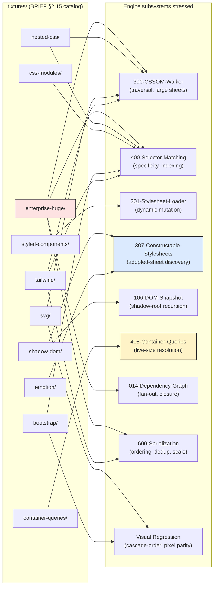
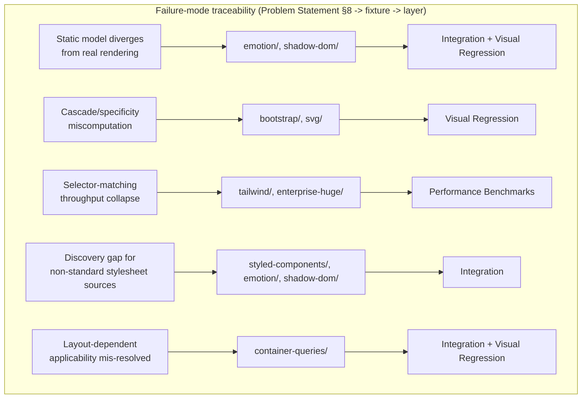

# 001 — Fixtures

## 1. Title

**Critical CSS Extraction Engine — Fixture Catalog: Real-World CSS-Authoring Patterns as Adversarial Test Input**

## 2. Version

| Field | Value |
|---|---|
| Document Version | 1.0.0 |
| Status | Accepted |
| Last Updated | 2026-07-10 |
| Owners | Testing & Quality Working Group |
| Stability | Stable (Phase 15 design document; adding a fixture family requires updating this catalog and the completeness check in [000-Testing-Strategy.md](./000-Testing-Strategy.md) Section 10.1) |

## 3. Purpose

[002-Problem-Statement.md](../architecture/002-Problem-Statement.md) argues that existing critical-CSS tools fail not because their algorithms are unsound in the abstract, but because they were validated against a narrow slice of how CSS is actually authored in production — typically hand-written, non-scoped, `<link>`-sourced stylesheets — and then silently break the moment they encounter a CSS-in-JS constructable stylesheet, a Shadow-DOM-encapsulated Web Component, or a 40,000-selector enterprise Tailwind build. BRIEF.md Section 2.15 names ten fixture families explicitly for exactly this reason: Tailwind, Bootstrap, CSS Modules, Styled Components, Emotion, Shadow DOM, SVG, Container Queries, Nested CSS, and huge enterprise stylesheets. This document is the catalog that makes that list concrete and testable — for each family, it specifies what the fixture actually contains, which engine subsystem it is designed to stress, and, most importantly, **which specific failure mode it guards against** — the defect that would ship, undetected, if this fixture did not exist.

This last point is the document's organizing discipline. A fixture that exists only because "it's a popular library" is a weak fixture; a fixture is only as valuable as the falsifiable claim it tests. Every entry below is therefore written as: *this fixture exists because, absent it, defect X could ship silently.* This framing is also what makes the fixture catalog machine-checkable via [000-Testing-Strategy.md](./000-Testing-Strategy.md) Section 10.1's completeness check — every failure class named in [002-Problem-Statement.md](../architecture/002-Problem-Statement.md) Section 8 must trace to at least one fixture family here, and every fixture family here must trace to at least one integration test, one golden snapshot, and (where it has visible above-fold content) one Visual Regression test.

## 4. Audience

- Implementers authoring or extending fixtures under `fixtures/`, who need to know what makes a fixture *correctly scoped* (stressing one specific failure mode precisely, not a diffuse "realistic-looking page").
- Implementers of the Integration test layer ([000-Testing-Strategy.md](./000-Testing-Strategy.md) Section 8.2), who consume this catalog to know what assertions each fixture warrants.
- Implementers of [300-CSSOM-Walker.md](../design/300-CSSOM-Walker.md), [307-Constructable-Stylesheets.md](../design/307-Constructable-Stylesheets.md), [400-Selector-Matching.md](../design/400-Selector-Matching.md), and [405-Container-Queries.md](../design/405-Container-Queries.md), whose subsystems this document maps fixtures onto explicitly.
- Reviewers evaluating whether a new CSS-authoring pattern (a framework this catalog does not yet cover) needs a new fixture family, using this document's "what failure mode does it guard against" template as the bar a new fixture must clear.
- Performance engineers using `fixtures/enterprise-huge/` as the scale-stress input for [004-Performance-Tests.md](./004-Performance-Tests.md) and the forthcoming [005-Benchmarks.md](../performance/005-Benchmarks.md).

Readers should be familiar with [002-Problem-Statement.md](../architecture/002-Problem-Statement.md)'s failure-class taxonomy, [007-Repository-Structure.md](../architecture/007-Repository-Structure.md)'s `fixtures/` layout convention, and at a conceptual level with the CSS-authoring patterns this catalog names (utility-first CSS, CSS-in-JS, Shadow DOM, container queries).

## 5. Prerequisites

- [000-Testing-Strategy.md](./000-Testing-Strategy.md) — the parent document defining which test layers consume this catalog and how fixture completeness is enforced in CI.
- [002-Problem-Statement.md](../architecture/002-Problem-Statement.md) Section 8 — the failure-class taxonomy every fixture family below is justified against.
- [007-Repository-Structure.md](../architecture/007-Repository-Structure.md) — the `fixtures/` directory convention (one subdirectory per family, an `expected/` golden subdirectory per viewport profile) this document assumes.
- [307-Constructable-Stylesheets.md](../design/307-Constructable-Stylesheets.md) — required reading before the Styled Components/Emotion and Shadow DOM entries (Sections 8.4–8.6), which stress exactly the discovery gap that document specifies.
- [405-Container-Queries.md](../design/405-Container-Queries.md) — required reading before the Container Queries entry (Section 8.8).
- [703-Visual-Diff.md](../design/703-Visual-Diff.md) — required for understanding how fixtures with visible above-fold content are exercised by the Visual Regression layer.

## 6. Related Documents

- [000-Testing-Strategy.md](./000-Testing-Strategy.md) — parent strategy document; defines the layers this catalog's fixtures are consumed by.
- [002-Visual-Tests.md](./002-Visual-Tests.md), [003-Golden-Files.md](./003-Golden-Files.md), [004-Performance-Tests.md](./004-Performance-Tests.md), [005-Regression-Tests.md](./005-Regression-Tests.md) — sibling Phase 15 documents each detailing one layer that consumes fixtures from this catalog.
- [307-Constructable-Stylesheets.md](../design/307-Constructable-Stylesheets.md) — the discovery mechanism stressed by the Styled Components/Emotion and Shadow DOM fixture families (Sections 8.4–8.6).
- [405-Container-Queries.md](../design/405-Container-Queries.md) — the resolution mechanism stressed by the Container Queries fixture family (Section 8.8).
- [002-Problem-Statement.md](../architecture/002-Problem-Statement.md) — the failure-class taxonomy this catalog is traced against.
- [007-Repository-Structure.md](../architecture/007-Repository-Structure.md) — `fixtures/` layout, including the explicit `fixtures/enterprise-huge/` reference this document's Section 8.10 expands.
- BRIEF.md Section 2.15 (Testing Strategy — fixture list, verbatim source of this catalog's ten families).

## 7. Overview

Ten fixture families, each targeting a distinct, named failure mode:

1. **Tailwind** — utility-class volume; stresses selector-matching and rule-indexing throughput at scale, not correctness of any single selector.
2. **Bootstrap** — component-class conventions and cascade interaction between framework defaults and page-level overrides; stresses specificity/cascade-order correctness.
3. **CSS Modules** — scoped, hashed class names; stresses that the engine treats hashed identifiers as opaque and correctly correlates a build-time hash with its DOM-rendered instance rather than assuming human-readable class semantics.
4. **Styled Components** — runtime CSS-in-JS emitting into the CSSOM dynamically, often via `<style>` tag injection; stresses late-arriving, dynamically-mutated stylesheets and non-deterministic class-name generation.
5. **Emotion** — CSS-in-JS with heavier Constructable Stylesheet usage than Styled Components in some configurations; stresses the [307-Constructable-Stylesheets.md](../design/307-Constructable-Stylesheets.md) discovery path directly.
6. **Shadow DOM** — Web Components with adopted stylesheets and shadow-root style encapsulation; stresses cross-shadow-boundary selector matching and adopted-sheet discovery.
7. **SVG** — inline `style` attributes and `<style>` elements inside SVG, plus SVG-specific presentation attributes interacting with CSS; stresses the engine's handling of a non-HTML, non-standard styling surface.
8. **Container Queries** — `@container` applicability resolved against live-rendered ancestor size, not global viewport; stresses the [405-Container-Queries.md](../design/405-Container-Queries.md) resolution mechanism and its interaction with multi-viewport fan-out.
9. **Nested CSS** — native CSS nesting (`&`-selector, implicit descendant combinators); stresses the selector parser/matcher's handling of a relatively new syntax that changes how a rule's effective selector is derived from its source text.
10. **Huge enterprise stylesheets** (`fixtures/enterprise-huge/`) — scale stress combining high selector count, deep specificity conflicts, and large dependency graphs simultaneously; stresses throughput and memory bounds across every pipeline stage at once, feeding [004-Performance-Tests.md](./004-Performance-Tests.md) directly.

The organizing principle across all ten: each fixture is scoped to isolate *one* authoring pattern's structural consequence for the engine, even though real production pages mix several patterns simultaneously (a real enterprise site plausibly runs Tailwind utilities, a component library with Shadow DOM, and CSS Modules together). Isolating them is deliberate — Section 13 discusses why combined "kitchen sink" fixtures are a secondary, not primary, testing tool.

## 8. Detailed Design

### 8.1 Tailwind

**Contents.** A page built with Tailwind's utility-first methodology: hundreds to tens of thousands of atomic classes (`flex`, `pt-4`, `text-gray-700`, responsive variants like `md:flex-row`, state variants like `hover:bg-blue-500`), typically compiled into a single large stylesheet where most of the selector space is *unused* on any given page (Tailwind's build output includes far more utility classes than any one page references, unless a purge/JIT step has already run).

**What it guards against.** Two distinct failure modes. First, a **selector-indexing throughput failure**: a naive selector-matching implementation that does not index rules by a cheap discriminator (tag name, ID, first class token — per [400-Selector-Matching.md](../design/400-Selector-Matching.md)'s indexing strategy) degrades toward O(rules × elements) for a stylesheet with tens of thousands of rules, which is survivable for a hundred-rule fixture and unusable for a Tailwind-scale one — this fixture is sized specifically to make an unindexed matcher's slowness observable in CI wall-clock time, not just in theory. Second, a **false-negative pruning failure specific to utility classes**: because Tailwind classes are extremely short and high-frequency (`flex`, `p-4`), a selector-matching bug involving substring or prefix confusion (e.g., incorrectly matching `.p-4` against an element classed `.p-40`) is far more likely to manifest — and far more consequential when it does, since a single such bug affects every element using the confused utility — than in a fixture with longer, less overlapping class names.

**Engine subsystems stressed:** [300-CSSOM-Walker.md](../design/300-CSSOM-Walker.md) (large-sheet traversal), [400-Selector-Matching.md](../design/400-Selector-Matching.md) and [401-Selector-Memoization.md](../design/401-Selector-Memoization.md) (indexing and memoization under high rule count), [600-Serialization-Overview.md](../design/600-Serialization-Overview.md) (deduplication at scale, since Tailwind output often contains many structurally-similar rules that a naive serializer might fail to dedupe efficiently).

### 8.2 Bootstrap

**Contents.** A page using Bootstrap's component-class conventions (`.btn`, `.btn-primary`, `.navbar`, `.card`, grid classes `.col-md-6`) alongside page-specific overrides that intentionally conflict with Bootstrap defaults at varying specificity (an ID override, a more-specific descendant selector, an `!important` override, and a same-specificity later-source-order override).

**What it guards against.** A **cascade/specificity-resolution failure at the framework-vs-override boundary**. Bootstrap's component classes are deliberately low-specificity (single class selectors) so that application code can override them easily — which means a correctness bug in the engine's specificity comparator or source-order tiebreaking ([400-Selector-Matching.md](../design/400-Selector-Matching.md)) is disproportionately likely to surface here: if the engine incorrectly determines that `.btn-primary` (Bootstrap default) wins over a page's `#header .cta-button` (higher-specificity override), the extracted critical CSS would preserve the *wrong* rule as the visually-decisive one, and — critically — this specific defect is one that a **text-level** integration assertion ("both rules are present in the output") would not catch, since both rules genuinely are present; only rendering-parity checks ([703-Visual-Diff.md](../design/703-Visual-Diff.md), via the Visual Regression layer) or an assertion on rule *order* in the serialized output would catch a swapped winner. This fixture is deliberately engineered with several such override pairs at different specificity distances (equal specificity/later source order; higher specificity/earlier source order; `!important` override) to probe the comparator's tiebreak logic exhaustively.

**Engine subsystems stressed:** [400-Selector-Matching.md](../design/400-Selector-Matching.md) (specificity computation and comparison), [601-Rule-Ordering.md](../design/601-Rule-Ordering.md) (canonical ordering that must preserve cascade-decisive order), Visual Regression (the only layer that catches a cascade-order bug where both rules are textually present but the wrong one is visually decisive).

### 8.3 CSS Modules

**Contents.** A page built with CSS Modules' scoped-class convention: source-authored class names (`.button`, `.title`) are compiled to build-time-hashed, effectively-opaque identifiers (`.Button_button__a3f9c`, `.Title_title__x02b1`) that are unique per component and per build, with no cross-component name reuse.

**What it guards against. **A **human-readable-class-name assumption failure**. Any part of the engine that implicitly assumes class names are semantically meaningful or human-authored — for instance, a debugging/diagnostics feature (BRIEF.md Section 2.12) that tries to summarize "what kind of element is this" from its class name, or a caching strategy ([800-Cache-Overview.md](../design/800-Cache-Overview.md) family) that fingerprints partly on class-name text under an assumption that similar-looking class names indicate similar-purpose elements — would misbehave against CSS Modules' opaque hashes, which carry no cross-build stability guarantee (the same source `.button` class hashes differently on every build) and no semantic content a heuristic could exploit. This fixture is built specifically with two builds of the *same* source producing *different* hashes for the same logical component, so that any test asserting output stability *by hash value* (rather than by underlying selector-to-element mapping) would incorrectly fail — proving the engine's correctness claims do not implicitly depend on hash stability across builds, only within one build's DOM/CSSOM pairing.

**Engine subsystems stressed:** [400-Selector-Matching.md](../design/400-Selector-Matching.md) (must treat opaque hashed classes identically to any other class selector, with zero special-casing), [801-Fingerprinting.md](../design/801-Fingerprinting.md) (must not derive cache keys from class-name semantics), [1004-Visualization.md](../design/1004-Visualization.md) diagnostics (must not present a hashed class name as if it were meaningful without DOM cross-reference).

### 8.4 Styled Components

**Contents.** A page using `styled-components`' runtime CSS-in-JS: component styles are defined in JavaScript template literals, compiled at runtime into CSS rules injected into a `<style>` tag (styled-components' default injection strategy in most configurations) that is mutated as new component instances mount, with generated class names that are also build/runtime-dependent hashes (similar in spirit to CSS Modules but arriving via a fundamentally different discovery path — dynamic DOM mutation rather than a static `<link>`/`<style>` present at initial parse).

**What it guards against.** A **late-arrival / discovery-timing failure**. Because styled-components injects and mutates its `<style>` tag's content *after* initial page load, as components mount (and, in some usage patterns, unmount and remount, altering the tag's rule list further), an engine that snapshots `document.styleSheets` once, early, or that does not account for the stylesheet loader ([301-Stylesheet-Loader.md](../design/301-Stylesheet-Loader.md)) needing to observe a *settled* state (per [104-Rendering-Stabilization.md](../design/104-Rendering-Stabilization.md)'s stabilization contract) before extraction, would silently miss rules for components that mount after the snapshot but before/at the fold. This fixture is built with components deliberately mounting on a staggered timer (simulating async data-driven rendering, a common real-world pattern with data-fetching component libraries) specifically to make a premature-snapshot bug observable — a naive extraction that runs before stabilization completes will demonstrably miss late-mounted components' styles, which a correct implementation, gated on [104-Rendering-Stabilization.md](../design/104-Rendering-Stabilization.md)'s readiness signal, will not.

**Engine subsystems stressed:** [301-Stylesheet-Loader.md](../design/301-Stylesheet-Loader.md) (dynamic `<style>` tag mutation, not just initial enumeration), [104-Rendering-Stabilization.md](../design/104-Rendering-Stabilization.md) (the stabilization gate this fixture is specifically built to validate), [103-Navigation-Engine.md](../design/103-Navigation-Engine.md) (must wait for the staggered mount sequence, not just `load`/`DOMContentLoaded`).

### 8.5 Emotion

**Contents.** A page using Emotion's CSS-in-JS, configured (as is common and, in several Emotion usage modes including its `@emotion/css` "speedy" mode and certain Shadow-DOM-targeting configurations, the default or recommended path) to use Constructable Stylesheets — `sheet.insertRule()`/`adoptedStyleSheets` — rather than `<style>` tag text injection, in contrast to Styled Components' `<style>`-tag-based approach in Section 8.4.

**What it guards against.** The **Constructable Stylesheet discovery gap** specified in full in [307-Constructable-Stylesheets.md](../design/307-Constructable-Stylesheets.md): a CSSOM Walker that only enumerates `document.styleSheets` will structurally miss every rule that lives in a constructed, adopted `CSSStyleSheet` object, because such an object has no natural home in that collection. This fixture exists to make that exact gap observable at the integration-test level: paired against Section 8.4's Styled-Components fixture, the two together prove the engine handles *both* discovery paths (text-injection and constructable-sheet-adoption) that real CSS-in-JS libraries use, rather than only the more commonly-tested `<style>`-tag path. A secondary case in this fixture — a single constructed sheet adopted by *multiple* components simultaneously (Emotion's sharing optimization, the entire point of the Constructable Stylesheets API per [307-Constructable-Stylesheets.md](../design/307-Constructable-Stylesheets.md)'s Overview) — guards against an **object-identity deduplication failure**: an engine that deduplicates adopted sheets by content-hash rather than object identity would either double-count a shared sheet's rules or, worse, incorrectly merge two distinct sheets that happen to produce identical CSS text.

**Engine subsystems stressed:** [307-Constructable-Stylesheets.md](../design/307-Constructable-Stylesheets.md) directly (this is that document's primary integration-test fixture), [302-Rule-Tree.md](../design/302-Rule-Tree.md) (adoption-context tagging for rules originating from a shared constructed sheet).

### 8.6 Shadow DOM

**Contents.** A page composed of native Web Components (hand-written custom elements, or built with Lit/Stencil) each with an attached shadow root, styles delivered via a mix of a `<style>` element inside the shadow root and `shadowRoot.adoptedStyleSheets`, with at least one component nested inside another's shadow tree (a shadow root within a shadow root) and at least one `::part()`/`::slotted()` selector crossing the shadow boundary.

**What it guards against.** Two distinct failure modes, deliberately combined in one fixture family because they arise from the same encapsulation feature. First, an **enumeration-completeness failure**: a DOM Snapshot ([106-DOM-Snapshot.md](../design/106-DOM-Snapshot.md)) that walks only the light DOM will miss every element inside a shadow root entirely, and a walker that handles one level of shadow nesting but not recursive shadow-in-shadow nesting will miss the second fixture's deeply nested component — this fixture's nested-shadow-root structure exists specifically to catch a walker that "handles Shadow DOM" only shallowly. Second, a **cross-boundary selector-matching failure**: `::part()` and `::slotted()` are selectors whose matching semantics are defined *relative to* the shadow boundary (a `::part()` selector in a light-DOM stylesheet matches an element inside a shadow root that has explicitly exposed itself via the `part` attribute; `::slotted()` matches light-DOM content projected into a shadow root's `<slot>`) — an engine that treats all selectors as if they operate within one flat, unscoped tree will either fail to match these at all or match them against the wrong scope entirely, and this fixture's explicit exercise of both pseudo-elements is what surfaces that.

**Engine subsystems stressed:** [106-DOM-Snapshot.md](../design/106-DOM-Snapshot.md) (recursive shadow-root enumeration), [307-Constructable-Stylesheets.md](../design/307-Constructable-Stylesheets.md) (adopted-sheet discovery per shadow root, this fixture's second angle on that document beyond Section 8.5's Emotion fixture, exercising the *native* Web Component path rather than a CSS-in-JS library's path), [402-Pseudo-Elements.md](../design/402-Pseudo-Elements.md) (`::part()`/`::slotted()` matching semantics).

### 8.7 SVG

**Contents.** An above-fold hero section using inline SVG with: a `<style>` element inside the `<svg>` root (scoped by the SVG specification's own rules, which differ subtly from HTML's `<style>` scoping), presentation attributes (`fill`, `stroke`, `stroke-width`) that participate in the cascade at a defined, low specificity, and an inline `style` attribute on an individual SVG child element (e.g., a `<path>`) that must out-rank both the presentation attribute and the `<svg><style>` block per CSS's cascade-origin rules for SVG.

**What it guards against.** An **SVG-as-second-class-citizen failure mode**. Because SVG is a distinct XML-based document fragment with its own, historically inconsistent treatment across tooling (many CSS tools, including several predecessor critical-CSS tools referenced in [002-Problem-Statement.md](../architecture/002-Problem-Statement.md), either ignore `<svg><style>` blocks entirely, assuming all styling is HTML-side, or mis-rank SVG presentation attributes against CSS declarations), this fixture exists to prove the engine's CSSOM Walker and cascade resolver treat an SVG subtree's styling surface with the same rigor as HTML — discovering the nested `<style>` element (which a walker keyed only on `document.styleSheets` at the top level might, depending on implementation, correctly or incorrectly enumerate — this fixture is the test that removes the ambiguity) and resolving the presentation-attribute-vs-declaration-vs-inline-style precedence correctly, which is a distinct precedence ladder from ordinary HTML/CSS (presentation attributes act as if they were the lowest-precedence author-origin declarations, per the SVG/CSS integration specification, ranking below any CSS rule of any specificity but above user-agent defaults).

**Engine subsystems stressed:** [300-CSSOM-Walker.md](../design/300-CSSOM-Walker.md) (SVG-nested `<style>` discovery), cascade/specificity resolution in [400-Selector-Matching.md](../design/400-Selector-Matching.md) (presentation-attribute precedence, a rule specific to SVG with no HTML analog), Visual Regression (the most reliable way to catch a mis-ranked presentation attribute, since the visible symptom — wrong fill color, wrong stroke width — is exactly what a rendered-pixel diff exists to catch).

### 8.8 Container Queries

**Contents.** A component with `container-type: inline-size` set on an ancestor, styled via `@container (min-width: 400px) { ... }` rules, placed inside multiple different-sized parent contexts on the same page (a wide grid cell and a narrow sidebar) so that the *same* component's container query resolves to a different applicability outcome depending on which container it is currently rendered inside — plus a named-container variant (`container-name: card; @container card (min-width: ...)`) to exercise name-scoped matching, and a case where an element has no qualifying ancestor container at all (the query condition is simply never satisfiable, distinct from being satisfied-false).

**What it guards against.** Per [405-Container-Queries.md](../design/405-Container-Queries.md)'s central problem statement: there is no `window.matchMedia()`-equivalent API for container queries, so applicability must be derived from the *live-rendered* size of the nearest qualifying ancestor via `getBoundingClientRect()`/`getComputedStyle()`, not from any static analysis of the condition text. This fixture guards against a **static-approximation failure** specific to this at-rule: an engine that (incorrectly) tries to resolve `@container` conditions the same way it resolves `@media` conditions — against a single global viewport value — would produce the *same* applicability result for the component regardless of which container context it is rendered in, which is observably wrong the moment the same component appears twice at different container sizes on one page, exactly as this fixture arranges. The no-qualifying-ancestor case guards against a distinct **container-resolution-vs-condition-falseness confusion**: a rule inside an `@container` block with no qualifying ancestor at all must be treated as inapplicable (no container to query), which is a different code path from a qualifying container whose size fails the condition, and a naive implementation collapsing the two cases into "just evaluate false" risks mishandling named-container matching (Section 8.3's `container-name` variant) where the search for a *qualifying* ancestor by name is itself the step that can fail before any size comparison happens.

**Engine subsystems stressed:** [405-Container-Queries.md](../design/405-Container-Queries.md) directly (this is that document's primary fixture), [105-Viewport-Manager.md](../design/105-Viewport-Manager.md) (per-container results must compose correctly with the engine's existing per-viewport-profile fan-out, since a container query's outcome can differ across Mobile/Tablet/Desktop branches independently of, and in combination with, its per-container-instance outcome).

### 8.9 Nested CSS

**Contents.** A stylesheet using native CSS nesting syntax (`.card { & .title { ... } &:hover { ... } & > .icon { ... } }`), including a case where the nesting selector `&` appears mid-compound (`&.active`) rather than only as a leading combinator, and a case with nesting depth of four or more levels, to probe the selector-flattening logic's handling of accumulated specificity and combinator composition across depth.

**What it guards against.** A **selector-derivation failure specific to a syntax where the effective selector is not the literal selector text in the source**. Every other fixture family in this catalog presents selectors whose matched form is textually close to (modulo hashing, in the CSS Modules/CSS-in-JS cases) what a human reads in the stylesheet; nested CSS is different in kind — the browser (and therefore the engine's CSSOM Walker/matcher, per [ADR-0001-Browser-Is-Source-of-Truth](../adr/ADR-0001-Browser-Is-Source-of-Truth.md)'s discipline of trusting the browser's own resolved rule rather than hand-parsing) resolves `& .title` inside `.card { }` to the flattened `.card .title` before any matching happens, and a specificity computation performed on the *literal nested source text* rather than the browser-resolved flattened selector would be wrong. This fixture exists to prove the engine reads the browser's resolved `CSSStyleRule.selectorText` (already flattened by the browser's own CSSOM implementation) rather than attempting to hand-implement CSS nesting's desugaring algorithm — directly testing the same "don't reimplement what the browser already computed for you" principle [405-Container-Queries.md](../design/405-Container-Queries.md) Section 3 states for container queries, applied here to selector desugaring instead of layout-dependent applicability.

**Engine subsystems stressed:** [300-CSSOM-Walker.md](../design/300-CSSOM-Walker.md) and [400-Selector-Matching.md](../design/400-Selector-Matching.md) (must consume the browser-flattened `selectorText`, never the raw nested source), specificity computation (must compute against the flattened form, since nesting depth and combinator accumulation directly affect the specificity tuple).

### 8.10 Huge Enterprise Stylesheets (`fixtures/enterprise-huge/`)

**Contents.** A synthetic-but-realistic stylesheet corpus modeled on a large enterprise site's accumulated CSS: tens of thousands of rules spanning multiple concatenated framework/vendor stylesheets (a Bootstrap-scale framework, a large icon-font stylesheet, several generations of legacy component CSS never fully removed), a correspondingly large dependency graph (deep custom-property reference chains, hundreds of `@font-face`/`@keyframes`/`@property` declarations, a high-fan-out subtree where many rules reference a small number of shared custom properties), and a DOM of comparable scale (thousands of elements above the fold on a dense listing/dashboard-style page, per this project's likely real-world target audience per [002-Problem-Statement.md](../architecture/002-Problem-Statement.md)).

**What it guards against.** Unlike every other fixture in this catalog, this fixture does not target a single correctness failure mode — it targets **asymptotic-complexity and memory-bound failures that are invisible at small scale**, per [000-Testing-Strategy.md](./000-Testing-Strategy.md) Section 8.5's argument that a correctness-only test suite cannot distinguish an `O(n log n)` implementation from an `O(n²)` one when `n` is small. Every pipeline stage has a documented complexity bound in its own design document (e.g., [202-Intersection-Engine.md](../design/202-Intersection-Engine.md)'s `O(V×N)` claim, [600-Serialization-Overview.md](../design/600-Serialization-Overview.md)'s `O(R log R + B)` claim, [014-Dependency-Graph.md](../architecture/014-Dependency-Graph.md)'s batched-discovery claim against a naive per-node round-trip baseline) and this fixture, run at multiple size multipliers (1×, 4×, 16× its base corpus size), is the empirical instrument that confirms each stage's measured wall-clock time scales as its documented bound predicts rather than worse — the specific failure this guards against is a regression that is *logically correct* (produces byte-identical output to a correct implementation) yet silently quadratic, which would pass every other layer in [000-Testing-Strategy.md](./000-Testing-Strategy.md)'s pyramid and only be caught here.

**Engine subsystems stressed:** every stage simultaneously — [300-CSSOM-Walker.md](../design/300-CSSOM-Walker.md) (large-sheet traversal, referenced identically to the Tailwind fixture's throughput concern but at even larger scale and combined with dependency-graph and DOM scale rather than selector count alone), [202-Intersection-Engine.md](../design/202-Intersection-Engine.md) (large-DOM intersection computation), [014-Dependency-Graph.md](../architecture/014-Dependency-Graph.md) (high-fan-out batched discovery), [600-Serialization-Overview.md](../design/600-Serialization-Overview.md) and [604-Output-Validation.md](../design/604-Output-Validation.md) (large-output serialization and validation throughput), [015-Runtime-Model.md](../architecture/015-Runtime-Model.md) (memory-ceiling graceful-degradation behavior under this fixture's peak memory load).

## 9. Architecture





## 10. Algorithms

### 10.1 Fixture-to-Failure-Class Traceability Check

**Problem statement.** Every fixture must justify its existence against a named failure mode (Section 8's discipline); this algorithm is the mechanical check that no fixture in the catalog lacks a traceable justification, and, symmetrically, that no failure class named in [002-Problem-Statement.md](../architecture/002-Problem-Statement.md) Section 8 lacks fixture coverage.

**Inputs:** the fixture catalog (this document's Section 8 entries, encoded as `manifest.json` per fixture with a `guardsAgainst` field naming the failure class); the failure-class taxonomy from [002-Problem-Statement.md](../architecture/002-Problem-Statement.md) Section 8.

**Output:** a bidirectional coverage report — failure classes with zero fixtures, and fixtures with an empty/unspecified `guardsAgainst` field.

```
function traceabilityCheck(fixtureManifests, failureClasses):
    fixtureToClass = {}
    classToFixtures = defaultdict(list)

    for manifest in fixtureManifests:
        if manifest.guardsAgainst is empty:
            report.flag(manifest.id, "no guardsAgainst justification")
            continue
        fixtureToClass[manifest.id] = manifest.guardsAgainst
        classToFixtures[manifest.guardsAgainst].append(manifest.id)

    for failureClass in failureClasses:
        if failureClass.id not in classToFixtures:
            report.flag(failureClass.id, "no fixture covers this failure class")

    return report
```

**Time complexity:** O(F + C) where F = fixture count, C = failure-class count, using a hash map for `classToFixtures`.

**Memory complexity:** O(F + C).

**Failure cases:** a fixture whose `guardsAgainst` field names a failure class that does not exist in the current taxonomy (stale reference after a taxonomy edit — should be flagged as a distinct "dangling reference" case, not silently dropped); a failure class covered only by a fixture that has since been deleted without the taxonomy being updated (the inverse staleness direction).

**Optimization opportunities:** none needed at this scale (tens of fixtures, dozens of failure classes); this check runs as a fast pre-commit or CI-lint step, not a performance-sensitive path.

### 10.2 Fixture Sizing for Scale Fixtures (Enterprise-Huge Multiplier Generation)

**Problem statement.** `fixtures/enterprise-huge/` (Section 8.10) needs to exist at multiple size multipliers (1×, 4×, 16×) to let benchmarks fit a scaling curve rather than a single data point; hand-authoring three separately-maintained corpora would triple maintenance cost and risk the multipliers drifting into structurally different (not just larger) stylesheets, invalidating the scaling comparison.

**Inputs:** a single base corpus (rules, DOM elements, dependency edges); a multiplier `k`.

**Output:** a generated `k`×-scaled fixture, structurally self-similar to the base (same *shape* of dependency graph and rule distribution, `k` times as many instances of it).

```
function generateScaledFixture(baseCorpus, k):
    scaledRules = []
    scaledDom = []
    for i in range(k):
        // Namespace each replica's selectors/classes/ids/custom-properties
        // with a suffix so replicas don't collide or accidentally
        // dedupe against each other -- the fixture must remain
        // "k times as much distinct content," not "1x content shown k times."
        namespacedReplica = namespace(baseCorpus, suffix=f"-rep{i}")
        scaledRules.extend(namespacedReplica.rules)
        scaledDom.extend(namespacedReplica.domElements)

    // A small fraction of cross-replica custom-property references
    // is deliberately introduced to preserve "high fan-out" realism --
    // pure replication alone would understate real-world dependency
    // graph interconnectedness.
    scaledRules = introduceCrossReplicaDependencyEdges(scaledRules, rate=0.02)

    return Fixture(rules=scaledRules, dom=scaledDom)
```

**Time complexity:** O(k × |baseCorpus|) to generate; this is a fixture-build-time cost, not a benchmark-runtime cost, and runs once per CI benchmark job (or is cached, per [000-Testing-Strategy.md](./000-Testing-Strategy.md) Section 11's general caching posture for expensive fixed inputs).

**Memory complexity:** O(k × |baseCorpus|) for the generated fixture's in-memory representation before serialization to disk.

**Failure cases:** insufficient namespacing causing accidental collisions between replicas (two replicas' selectors colliding would make the fixture's *effective* rule count smaller than `k × |baseCorpus|`, silently invalidating the scaling assumption benchmarks depend on); over-aggressive cross-replica dependency-edge introduction making the higher multipliers structurally different in dependency-graph *shape*, not just size, which would make a benchmark comparing 1× against 16× measure two different things rather than one thing at two scales.

**Optimization opportunities:** generate multipliers lazily/on-demand in CI rather than committing all three to the repository, trading a small amount of CI time for a meaningfully smaller repository footprint — the base corpus is committed; 4× and 16× are generated at benchmark-run time from it, per this algorithm.

## 11. Implementation Notes

- **Per-fixture manifest.** Every fixture directory (`fixtures/<family>/`) contains a `manifest.json` with: `id`, `guardsAgainst` (the failure-class justification, Section 10.1), `hasVisibleAboveFoldContent` (boolean, gates Visual Regression applicability per [000-Testing-Strategy.md](./000-Testing-Strategy.md) Section 8.6), `viewportProfiles` (which of Mobile/Tablet/Desktop/4K this fixture must be tested under), and `expectedSelectors`/`expectedExclusions` (the integration-test assertion inputs for Section 8's "known to be required/excluded" claims).
- **Golden subdirectory convention.** Each fixture's `expected/` subdirectory (per [007-Repository-Structure.md](../architecture/007-Repository-Structure.md)) holds one golden CSS file per `viewportProfile`, consumed directly by the Golden Snapshot layer ([003-Golden-Files.md](./003-Golden-Files.md)) without any additional indirection.
- **Fixture independence.** Each fixture family's HTML/CSS is self-contained (no fixture imports another fixture's assets) so that a change to one fixture's content cannot silently perturb another's golden baseline — the one deliberate exception is `fixtures/enterprise-huge/`'s generated multipliers (Section 10.2), which derive from, but are versioned independently of, the base corpus.
- **Framework version pinning.** The Tailwind, Bootstrap, Styled Components, and Emotion fixtures each pin an exact framework/library version (not a floating range) in their local `package.json`, so a library's own breaking change (e.g., Emotion switching its default injection strategy in a major version) cannot silently change what a fixture is testing without a deliberate, reviewed version bump — this directly parallels [000-Testing-Strategy.md](./000-Testing-Strategy.md) Section 8.4's rationale for pinning golden files, applied to fixture *inputs* rather than outputs.
- **Synthetic vs. vendored content.** `fixtures/enterprise-huge/` is entirely synthetically generated (Section 10.2), not vendored from any real customer's production CSS, both to avoid any confidentiality/licensing concern and because a synthetic generator's parameters (rule count, fan-out rate, nesting depth) are the actual lever this project needs to control for scaling experiments — a real vendored stylesheet's structure is fixed and cannot be dialed to 4× or 16× on demand.

## 12. Edge Cases

- **A fixture family whose underlying library ships a breaking change mid-project** (e.g., a Tailwind major version changing its utility-class naming scheme). Handled by the version-pinning discipline (Section 11): the fixture continues testing against the pinned version until a deliberate, reviewed bump; the bump itself is treated as a fixture-content change requiring golden-file and expected-selector updates in the same commit, not a silent drift.
- **A fixture that stresses two failure classes simultaneously** (e.g., the Shadow DOM fixture's Section 8.6 combining an enumeration-completeness concern and a cross-boundary-matching concern). Permitted, and the `manifest.json`'s `guardsAgainst` field accepts a list rather than a single value in this case — but a fixture family accumulating more than two or three such justifications is a signal (per [000-Testing-Strategy.md](./000-Testing-Strategy.md) Section 10.2's layer-assignment discipline, applied here to fixture-scoping) that it should be split into narrower, independently-versioned fixtures rather than continuing to grow into an unfocused "kitchen sink."
- **Container Queries fixture interacting with the multi-viewport fan-out** (Section 8.8): a component's container-query outcome and its viewport-profile-driven media-query outcome can both vary independently, producing a combinatorial matrix (viewport profile × container context) rather than a simple list; the fixture's manifest enumerates the full matrix explicitly rather than relying on an assumed cross-product, because [405-Container-Queries.md](../design/405-Container-Queries.md) Section 8.4 notes the two axes are not always independent (a container's rendered size can itself depend on the viewport profile via responsive layout, so not every viewport × container-context cell is reachable).
- **A new CSS-authoring pattern emerging after this catalog is written** (e.g., a future CSS-in-JS library with a discovery mechanism unlike either Section 8.4's or Section 8.5's). The catalog is not closed; Section 13 states the bar a new fixture family must clear (a distinct, named failure mode not already covered) before being added, and [000-Testing-Strategy.md](./000-Testing-Strategy.md) Section 10.1's completeness check is designed to be extended, not rewritten, when that happens.
- **`fixtures/enterprise-huge/`'s generated multipliers going stale relative to the base corpus** (Section 10.2's generator changing without regenerating cached 4×/16× artifacts, if those are cached rather than always regenerated per Section 11's lazy-generation note). Mitigated by content-hashing the base corpus and invalidating any cached multiplier whose recorded base-corpus hash does not match the current one — directly reusing this project's own fingerprinting design ([801-Fingerprinting.md](../design/801-Fingerprinting.md)) for the fixture-generation pipeline's own cache.

## 13. Tradeoffs

**Isolated single-pattern fixtures vs. one combined "kitchen sink" fixture.** This catalog deliberately keeps each fixture family narrow (one dominant authoring pattern per fixture) rather than authoring a single large fixture combining Tailwind utilities, Shadow DOM components, and CSS Modules together in one realistic-looking page. The combined approach has real appeal — it more closely resembles an actual production page and would catch *interaction* bugs between patterns that isolated fixtures cannot. It is rejected as the *primary* tool because when a combined fixture's test fails, diagnosing which pattern's handling regressed requires the same kind of investigation Section 8.1 of [000-Testing-Strategy.md](./000-Testing-Strategy.md) argues unit tests exist to avoid at the algorithm level — precise blame is lost. The resolution: isolated fixtures are primary (this catalog), and a smaller number of combined fixtures are retained as a *secondary*, lower-priority integration check specifically for cross-pattern interaction, sized to be the exception rather than the rule.

**Synthetic generation for `enterprise-huge/` vs. vendoring real production CSS.** Discussed in Section 11; the tradeoff accepted is that synthetic content is provably *not* representative of every idiosyncrasy a real enterprise stylesheet might contain (dead code, historical accidents, browser-hack workarounds accumulated over a decade), which a vendored corpus would naturally include and a generator would not think to synthesize. This is accepted because the fixture's actual job (Section 8.10) is asymptotic-scale stress, not idiosyncrasy coverage — idiosyncrasy coverage is what the other nine targeted fixtures are for.

**Version-pinning fixtures vs. tracking latest framework releases.** Pinning (Section 11) means the fixture catalog does not automatically validate the engine against a framework's newest release, risking a real compatibility break going undetected until the pin is deliberately bumped. Accepted because an unpinned, always-latest fixture would make CI results non-reproducible across time (a build passing today and failing tomorrow with no code change, purely because an upstream library shipped a change) — reproducibility (a direct corollary of [006-Design-Principles.md](../architecture/006-Design-Principles.md) Principle 5) is weighted higher than automatic freshness, with freshness instead handled by a scheduled, separate "dependency bump" review process outside the main CI gate.

**Ten families vs. a smaller, "representative" subset.** A leaner catalog (e.g., testing only Tailwind and Shadow DOM as "representative enough" stand-ins for utility-CSS and encapsulation concerns generally) was considered and rejected because Section 8's entries repeatedly show that superficially similar patterns exercise genuinely different code paths (Styled Components' `<style>`-tag injection vs. Emotion's Constructable-Stylesheet adoption look similar from a library-user's perspective but stress entirely disjoint discovery mechanisms in [307-Constructable-Stylesheets.md](../design/307-Constructable-Stylesheets.md)) — collapsing them would silently drop coverage of a real discovery path.

## 14. Performance

- **Fixture authoring cost is front-loaded, not ongoing**, for the nine non-scale fixtures (Sections 8.1–8.9): each is authored once, version-pinned (Section 11), and only touched again on a deliberate framework-version bump — the ongoing CI cost is purely the extraction-and-assertion runtime, not fixture maintenance.
- **`fixtures/enterprise-huge/`'s generation cost** (Section 10.2) is O(k × base-corpus-size) and is the one fixture family whose *generation* itself is performance-sensitive; the lazy-generation-with-cache-invalidation approach (Section 11, Edge Cases) keeps this off the critical path of ordinary (non-benchmark) CI runs, which only need the 1× base corpus.
- **Fixture disk footprint** is dominated by `enterprise-huge/`'s base corpus and any committed (rather than lazily-generated) multipliers; per Section 11's lazy-generation recommendation, only the 1× base is committed, keeping repository size bounded regardless of how large the benchmark suite's tested multiplier range grows.
- **Integration-test wall-clock contribution per fixture** varies by family: the nine correctness-focused fixtures are each sized to be as small as their guarded failure mode requires (Section 8's fixtures are deliberately minimal — e.g., Section 8.8's Container Queries fixture needs only a handful of components in a few container contexts, not a large page) precisely so that adding fixture coverage does not itself become a performance liability for the fast Integration-layer CI gate ([000-Testing-Strategy.md](./000-Testing-Strategy.md) Section 14).

## 15. Testing

This document catalogs fixtures; its own "testing" is the meta-level verification that the catalog is internally consistent and complete:

- **Unit tests for the traceability checker** (Section 10.1): synthetic manifests and a synthetic failure-class taxonomy with deliberately introduced gaps in both directions (an uncovered failure class; a fixture with no `guardsAgainst`), asserting the checker flags exactly the expected gaps and none other.
- **Unit tests for the scaled-fixture generator** (Section 10.2): asserting namespace-collision-freedom (no two replicas produce colliding selector/class/id/custom-property names) at each tested multiplier, and asserting the cross-replica dependency-edge introduction rate stays within its configured bound.
- **Integration tests** — each of the ten fixture families gets the full Integration-layer treatment specified in [000-Testing-Strategy.md](./000-Testing-Strategy.md) Section 8.2: extraction completes without error, expected selectors present, expected exclusions absent, dependency closure holds.
- **Visual Regression** — every fixture with `hasVisibleAboveFoldContent: true` (all except any purely-synthetic edge-case fixture with no rendered page) gets the dual-render diff per [002-Visual-Tests.md](./002-Visual-Tests.md), with Sections 8.2 (Bootstrap) and 8.7 (SVG) specifically named above as fixtures whose most important assertion *is* the Visual Regression check, not the text-level Integration check.
- **Golden Snapshots** — every fixture family gets a pinned golden per viewport profile, per [003-Golden-Files.md](./003-Golden-Files.md).
- **Benchmark tests** — `fixtures/enterprise-huge/` at each generated multiplier is the primary input to [004-Performance-Tests.md](./004-Performance-Tests.md) and the forthcoming [005-Benchmarks.md](../performance/005-Benchmarks.md), tracked as a time series per multiplier to fit and monitor the scaling curve Section 8.10 describes.

## 16. Future Work

- **A CSS Nesting + Container Queries combined fixture**, since both are comparatively recent CSS features whose browser-support and edge-case-handling maturity is still evolving faster than the other eight families' underlying specifications — deferred until both individual fixtures (Sections 8.8, 8.9) have stabilized as standalone tests.
- **A fixture targeting `@layer` cascade-layer interaction with the ten families above** (e.g., Tailwind utilities inside a named cascade layer competing against Bootstrap defaults in a different layer) — [305-Cascade-Layers.md](../design/305-Cascade-Layers.md) is covered by its own design-phase fixtures but a cross-cutting layer-plus-authoring-pattern fixture is not yet in this catalog.
- **A vendored, anonymized real-world corpus** as a supplementary (not replacement) input to `enterprise-huge/`-style benchmarking, contributed voluntarily by a partner organization under an anonymization/scrubbing process, to validate that the synthetic generator's structural assumptions (Section 13's accepted tradeoff) are not systematically missing a real idiosyncrasy class.
- **Automatic new-pattern detection** — tooling that scans a representative sample of real-world sites' CSS-authoring patterns (framework usage, CSS-in-JS library detection) periodically, to flag when a sufficiently prevalent pattern (e.g., a new CSS-in-JS library gaining significant market share) is not yet represented in this catalog, making catalog-completeness proactive rather than reactive to bug reports.
- **Cross-family combined ("kitchen sink") fixtures** as the secondary integration layer named in Section 13's tradeoff discussion — not yet built; deferred until the ten isolated families are stable, since a combined fixture's value depends on each of its ingredients already being independently trusted.

## 17. References

- [000-Testing-Strategy.md](./000-Testing-Strategy.md)
- [002-Visual-Tests.md](./002-Visual-Tests.md)
- [003-Golden-Files.md](./003-Golden-Files.md)
- [004-Performance-Tests.md](./004-Performance-Tests.md)
- [005-Regression-Tests.md](./005-Regression-Tests.md)
- [307-Constructable-Stylesheets.md](../design/307-Constructable-Stylesheets.md)
- [405-Container-Queries.md](../design/405-Container-Queries.md)
- [703-Visual-Diff.md](../design/703-Visual-Diff.md)
- [300-CSSOM-Walker.md](../design/300-CSSOM-Walker.md), [301-Stylesheet-Loader.md](../design/301-Stylesheet-Loader.md), [302-Rule-Tree.md](../design/302-Rule-Tree.md), [305-Cascade-Layers.md](../design/305-Cascade-Layers.md)
- [400-Selector-Matching.md](../design/400-Selector-Matching.md), [401-Selector-Memoization.md](../design/401-Selector-Memoization.md), [402-Pseudo-Elements.md](../design/402-Pseudo-Elements.md)
- [106-DOM-Snapshot.md](../design/106-DOM-Snapshot.md), [104-Rendering-Stabilization.md](../design/104-Rendering-Stabilization.md), [105-Viewport-Manager.md](../design/105-Viewport-Manager.md), [103-Navigation-Engine.md](../design/103-Navigation-Engine.md)
- [014-Dependency-Graph.md](../architecture/014-Dependency-Graph.md), [015-Runtime-Model.md](../architecture/015-Runtime-Model.md)
- [600-Serialization-Overview.md](../design/600-Serialization-Overview.md), [604-Output-Validation.md](../design/604-Output-Validation.md), [601-Rule-Ordering.md](../design/601-Rule-Ordering.md)
- [801-Fingerprinting.md](../design/801-Fingerprinting.md)
- [002-Problem-Statement.md](../architecture/002-Problem-Statement.md), [007-Repository-Structure.md](../architecture/007-Repository-Structure.md)
- [ADR-0001-Browser-Is-Source-of-Truth](../adr/ADR-0001-Browser-Is-Source-of-Truth.md)
- BRIEF.md Section 2.15 (Testing Strategy — fixture list) — repository root
- Tailwind CSS, Bootstrap, styled-components, Emotion, Lit/Stencil — official documentation for each library's CSS-authoring/injection conventions referenced throughout Section 8
- CSS Nesting Module Level 1, CSS Containment Module Level 3 (W3C) — specifications underlying Sections 8.8–8.9
