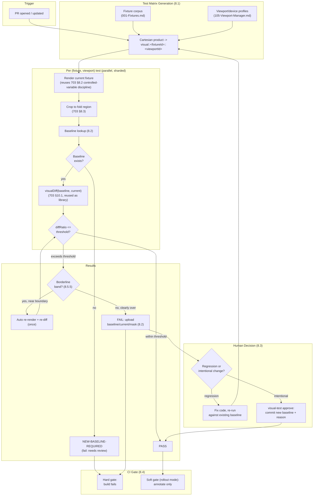
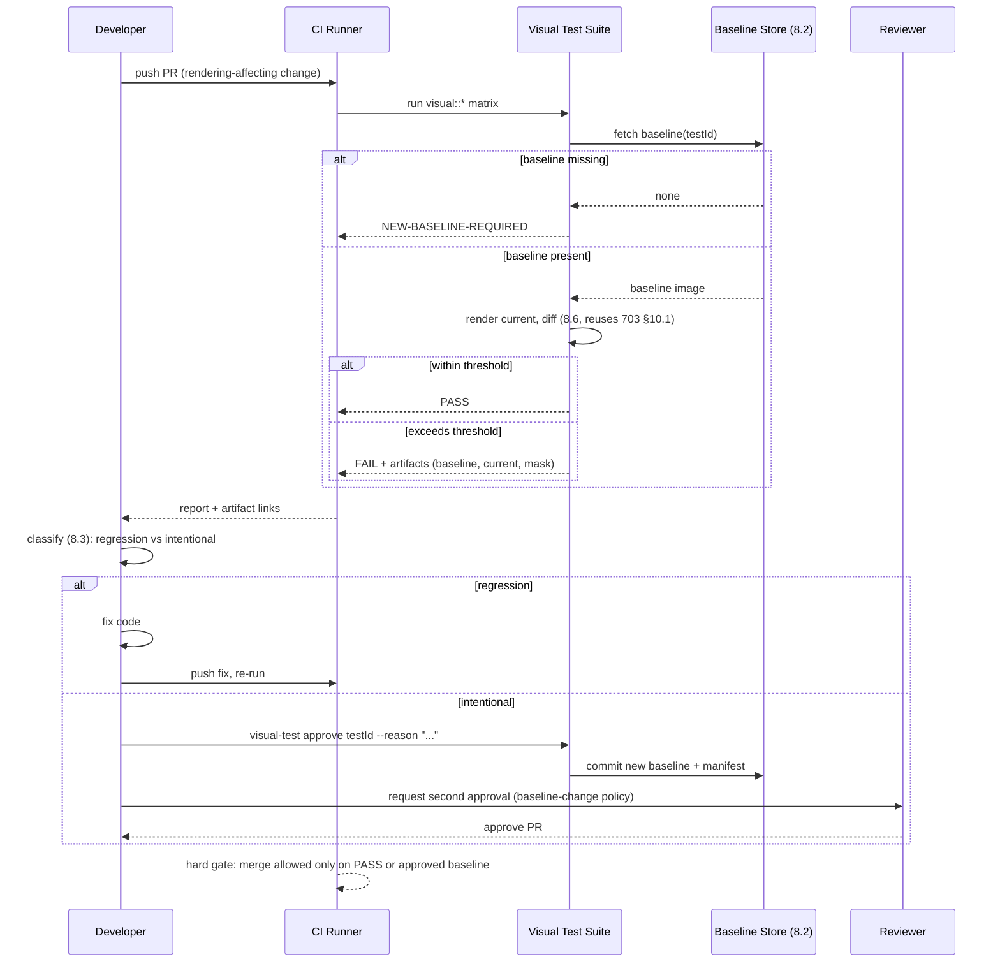

# 002 — Visual Tests

## 1. Title

**Critical CSS Extraction Engine — Visual Regression Test Suite: Baseline Snapshot Testing Across Fixtures and Viewports**

## 2. Version

| Field | Value |
|---|---|
| Document Version | 1.0.0 |
| Status | Draft — Phase 15 (Testing) |
| Last Updated | 2026-07-10 |
| Owners | Test Infrastructure Working Group |
| Stability | Draft; the baseline-storage format and approval workflow are expected to stabilize once the CI runner matrix (Section 8.5) is finalized — changes to the approval workflow require sign-off from the working group because it gates every contributor's merge path |

## 3. Purpose

This document specifies the **visual regression test suite**: the Phase 15 test layer that runs the engine against every fixture in `fixtures/` at every configured viewport, renders the result, and compares that render against a stored baseline image to catch *unintended visual drift* in the engine's own output across commits. It is one of the two Visual-Regression/Golden layers named in BRIEF.md Section 2.15 ("Layers: Unit, Integration, Visual Regression, Golden CSS snapshots, Performance benchmarks") and the empirical backstop for BRIEF.md Section 2.18's "rendering parity with the original page" and "high test coverage" acceptance criteria, evaluated as a *test-suite property* rather than a per-run production check.

**This document must be read against, and disambiguated from, [703-Visual-Diff.md](../design/703-Visual-Diff.md).** That document specifies the *underlying dual-render pixel-diff mechanism* — a single production/CI run renders one page twice (once with the full original CSS, once with the extracted critical CSS) and diffs the two renders against each other, within the same run, to prove that a given extraction's critical CSS is sufficient for first paint. This document is the **test-suite-level application** of that same pixel-diff engine to a *different* question, asked across *time* rather than within a single run: "has the engine's rendering behavior for fixture F at viewport V changed since the last approved baseline?" Concretely:

| | [703-Visual-Diff.md](../design/703-Visual-Diff.md) | This document (002) |
|---|---|---|
| Compares | `R_full` vs `R_crit`, both rendered *now*, in the *same* CI/production run | Current render (of `R_full`, the reference render only) vs a *stored* baseline image checked into the fixture's snapshot directory, potentially from a commit weeks or months old |
| Question answered | "Is this extraction's critical CSS sufficient for this page, right now?" | "Has anything changed — the engine, a dependency, a browser version, a fixture — since we last looked at this fixture's rendering?" |
| Runs | Every extraction (production pipeline, per-route, per-viewport) | Every CI run of the test suite (per fixture, per viewport, not per production route) |
| Failure meaning | A specific extraction dropped a rule the page needed | *Something* changed the engine's rendered output for a known fixture; could be a regression, could be an intentional change requiring a new baseline |
| Owning package | `packages/reporter` (or dedicated validation package) | `fixtures/` + the test suite (`apps/cli` test target, or a dedicated `packages/test-visual`) |

Both layers reuse the *same* pixel-diff algorithm (perceptual, anti-aliasing-aware, threshold-gated — [703-Visual-Diff.md](../design/703-Visual-Diff.md) Section 10.1) as a shared library, because the noise-handling problem (anti-aliasing, sub-pixel font rasterization) is identical in both contexts. What differs is *what the two images being compared are* and *what a failure means operationally*: a 703 failure means "this extraction is wrong, block this specific output"; a 002 failure means "this fixture's rendering differs from its last-approved baseline, a human must decide whether that's a regression or an intentional update." This document is scoped to that second workflow: test organization, baseline lifecycle, CI wiring, and the flakiness problem that is sharper here than in 703 because baselines are compared *across* CI runner instances and *across* time, not within one session on one browser build.

## 4. Audience

- Test infrastructure engineers implementing the visual test runner (`packages/test-visual` or equivalent), who need the fixture × viewport test matrix, the baseline storage format, and the approval CLI.
- Contributors whose changes touch rendering-affecting code (Visibility Engine, CSSOM Walker, Serializer, any strategy under `docs/design/700`–`704`), who will encounter this suite's PASS/FAIL/NEW-BASELINE states in CI and need to know when to approve a new baseline versus investigate a regression.
- CI pipeline maintainers wiring this suite into the pipeline described in BRIEF.md Section 2.11, who need the pass/fail contract, artifact upload behavior, and the runner-matrix flakiness considerations of Section 8.5.
- Reviewers of pull requests that include a baseline update, who need this document's Section 8.3 criteria for judging whether an approved baseline change is legitimate.
- Implementers of [703-Visual-Diff.md](../design/703-Visual-Diff.md), whose diff algorithm this suite consumes as a library and whose noise-handling guidance this suite depends on and extends to the harder cross-runner case.
- Authors of [001-Fixtures.md](./001-Fixtures.md), who define the fixture corpus this suite iterates over, and of [000-Testing-Strategy.md](./000-Testing-Strategy.md), which places this suite in the overall test-layer taxonomy.

Readers should be familiar with [703-Visual-Diff.md](../design/703-Visual-Diff.md) in full (this document assumes its dual-render model, controlled-variable discipline, and noise-handling sections as background) and with conventional snapshot/baseline testing patterns (Jest snapshot testing, Percy, Chromatic, `reg-suit`) as prior art this suite's baseline lifecycle deliberately parallels.

## 5. Prerequisites

- [703-Visual-Diff.md](../design/703-Visual-Diff.md) — the pixel-diff algorithm (Section 10.1), controlled-variable discipline (Section 8.2), and noise-handling layers (Section 8.4) this suite reuses as a library; this document does not re-derive that algorithm.
- [000-Testing-Strategy.md](./000-Testing-Strategy.md) — the overall test-layer taxonomy (Unit, Integration, Visual, Golden, Performance) this document's layer sits within, and the shared CI invocation conventions.
- [001-Fixtures.md](./001-Fixtures.md) — the fixture corpus (Tailwind, Bootstrap, CSS Modules, Styled Components, Emotion, Shadow DOM, SVG, Container Queries, Nested CSS, enterprise-huge) this suite's test matrix is generated from.
- [105-Viewport-Manager.md](../design/105-Viewport-Manager.md) — the `DeviceProfile` set (the "viewport" axis of the fixture × viewport matrix).
- [104-Rendering-Stabilization.md](../design/104-Rendering-Stabilization.md) — the stabilization gate both a fresh render and a stored baseline's original capture must have passed for a diff to be meaningful.
- [101-Playwright-Adapter.md](../design/101-Playwright-Adapter.md) and [102-Browser-Pool.md](../design/102-Browser-Pool.md) — the screenshot substrate.
- BRIEF.md Section 2.15 (Testing Strategy), Section 2.18 (Acceptance Criteria).

## 6. Related Documents

- [703-Visual-Diff.md](../design/703-Visual-Diff.md) — the underlying dual-render pixel-diff mechanism this suite applies at test-suite scope; see the disambiguation table in Section 3.
- [000-Testing-Strategy.md](./000-Testing-Strategy.md) — sibling Phase 15 document; the taxonomy this document's layer is one branch of.
- [001-Fixtures.md](./001-Fixtures.md) — sibling Phase 15 document; the fixture corpus enumerated and versioned there is the input to this suite's test matrix.
- [003-Golden-Files.md](./003-Golden-Files.md) — sibling Phase 15 document; the CSS-text-level analogue of this document's image-level baseline testing, sharing the same "stored artifact vs current output, with a reviewed-update workflow" shape but at a different artifact granularity (bytes of CSS vs pixels of a screenshot).
- [004-Performance-Tests.md](./004-Performance-Tests.md) — sibling Phase 15 document; this suite's own wall-clock cost (two renders per fixture × viewport, at test-suite scale) is a performance-test concern documented there.
- [005-Regression-Tests.md](./005-Regression-Tests.md) — sibling Phase 15 document; a merged baseline update is itself a regression-test artifact (Section 13) that pins the suite's new expected state.
- [105-Viewport-Manager.md](../design/105-Viewport-Manager.md), [104-Rendering-Stabilization.md](../design/104-Rendering-Stabilization.md), [101-Playwright-Adapter.md](../design/101-Playwright-Adapter.md), [102-Browser-Pool.md](../design/102-Browser-Pool.md) — the rendering substrate this suite's test runner drives.
- [006-Design-Principles.md](../architecture/006-Design-Principles.md) — Principle 1 (Browser Is Source of Truth) and Principle 5 (Determinism of Output), both load-bearing for why a baseline diff of zero is the expected steady state.
- BRIEF.md Section 2.11 (CI/CD Pipeline), Section 2.15 (Testing Strategy), Section 2.18 (Acceptance Criteria) — repository root.

## 7. Overview

The visual regression suite, reduced to one sentence: for every `(fixture, viewport)` pair in the test matrix, render the fixture's reference page, screenshot and crop it exactly as [703-Visual-Diff.md](../design/703-Visual-Diff.md) Section 8.3 specifies, diff that image against a checked-in baseline using the same noise-tolerant algorithm, and report PASS (matches baseline), FAIL (differs beyond threshold — a candidate regression), or NEW-BASELINE-REQUIRED (no baseline exists yet, e.g., a newly added fixture).

Four design commitments run through this document:

1. **One test per `(fixture, viewport)` pair, not one test per fixture.** A fixture's rendering can regress at one viewport and not another (a responsive breakpoint bug, a container-query threshold miscalculated at one width). Collapsing viewports into a single test per fixture would average away exactly the kind of failure the suite exists to catch. Section 8.1 specifies the matrix generation.

2. **Baselines are reviewed, versioned artifacts, not silently regenerated.** A baseline image is checked into the repository (or an addressable snapshot store, Section 8.2) and is only replaced through an explicit, reviewed approval step — never automatically overwritten by a passing or failing test run. This mirrors [006-Design-Principles.md](../architecture/006-Design-Principles.md) Principle 5's insistence that changes to what "correct" means must be auditable commits, not silent drift.

3. **A diff is a *signal*, not a verdict.** Because the suite compares across time and across (potentially different) CI runner machines, a diff can mean a real regression, an intentional and correct change, or environmental noise. Section 8.3 gives the decision procedure a reviewer follows to tell these apart, and Section 8.5 describes how the suite's design minimizes the third category so the first two remain distinguishable.

4. **The suite reuses [703-Visual-Diff.md](../design/703-Visual-Diff.md)'s algorithm exactly, not a reimplementation.** Using a second, independently-tuned pixel-diff implementation for the test suite would risk the two layers disagreeing about what counts as "different," undermining confidence in either. The library boundary is Section 8.6.

## 8. Detailed Design

### 8.1 Test Organization: One Visual Test Per Fixture × Viewport

The test matrix is the Cartesian product of the fixture corpus ([001-Fixtures.md](./001-Fixtures.md): Tailwind, Bootstrap, CSS Modules, Styled Components, Emotion, Shadow DOM, SVG, Container Queries, Nested CSS, enterprise-huge, and any project-added fixtures) and the configured viewport/device-profile set ([105-Viewport-Manager.md](../design/105-Viewport-Manager.md): typically mobile, tablet, desktop, and a wide-desktop profile). Each cell of that matrix is one independently-runnable, independently-reportable test case, identified by a stable test ID of the form `visual::<fixtureId>::<viewportId>` (e.g., `visual::tailwind-marketing-page::mobile-375`).

**Why not one test per fixture with an internal loop over viewports.** A single test that loops over viewports and asserts on all of them internally reports as one pass/fail unit; a failure at one viewport is indistinguishable, in the test runner's summary, from a failure at all of them, and a single flaky viewport (Section 8.5) fails the entire fixture's test rather than isolating the flake. Per-`(fixture, viewport)` granularity gives the CI dashboard, the retry mechanism (Section 8.5), and the approval workflow (Section 8.3) a unit small enough to reason about independently — approving one viewport's intentional change does not require re-approving unrelated viewports of the same fixture.

**Why not one test per viewport with an internal loop over fixtures.** Symmetric reasoning: a fixture-specific regression (say, a Shadow-DOM-specific bug) should not be buried inside a viewport-level test that also covers nine unrelated fixtures. The full Cartesian expansion is the only granularity that isolates both axes independently, at the cost of `|fixtures| × |viewports|` test cases to schedule — a cost the suite accepts and manages via parallelization (Section 14) rather than by coarsening granularity.

**Test case identity is stable across fixture/viewport-set changes.** Adding a viewport adds new test IDs without touching existing ones; removing a fixture removes its IDs without renumbering others. This matters because baseline storage (Section 8.2) is keyed by test ID — a renumbering scheme (e.g., positional indices) would silently orphan or misattribute baselines on any corpus change, which is precisely the kind of accidental nondeterminism [006-Design-Principles.md](../architecture/006-Design-Principles.md) Principle 5 warns against at the artifact-identity level, not just the byte-content level.

### 8.2 Baseline Storage and Lifecycle

Each test ID maps to exactly one baseline image, stored at a deterministic path: `fixtures/<fixtureId>/__baselines__/<viewportId>.png` (or, for projects with large baseline sets, an addressable snapshot store keyed by test ID and a content hash, to keep the git repository size bounded — the storage backend is pluggable, but the identity scheme is not). Alongside the image, a small sidecar manifest (`<viewportId>.meta.json`) records: the browser/engine version the baseline was captured under, the diff thresholds in effect at capture time, the commit SHA that introduced or last approved the baseline, and a human-readable reason string supplied at approval time (Section 8.3).

**Lifecycle states for a given test ID:**

- **No baseline exists.** The test reports `NEW-BASELINE-REQUIRED`, not a pass or a fail — a brand-new fixture or viewport has nothing to compare against yet. CI treats this as a required human action (Section 8.6), not a silent pass, because silently accepting whatever the first render happens to produce as ground truth would defeat the purpose of the suite for that test's entire first generation.
- **Baseline exists, current render matches within threshold.** `PASS`. No artifact changes.
- **Baseline exists, current render differs beyond threshold.** `FAIL`. The suite uploads three artifacts — the stored baseline, the current render, and the diff mask (reusing [703-Visual-Diff.md](../design/703-Visual-Diff.md) Section 10.1's mask format) — and the build is marked failed pending the Section 8.3 decision.
- **Baseline explicitly approved for update.** The approval CLI (`visual-test approve <testId>` or the equivalent bulk `--approve-all-in-pr` mode) replaces the stored baseline with the current render, updates the sidecar manifest (new commit SHA, new reason string, mandatory non-empty), and the change is committed as a normal, reviewable diff to the baseline image file. Because image diffs are not human-legible in a textual code review, the PR description and the sidecar manifest's reason string carry the burden of explaining *why* — reviewers are expected to view the before/after images (rendered side-by-side by the CI artifact viewer, Section 9) rather than the raw PNG bytes.

**Why store baselines as committed images rather than regenerate on demand.** An alternative design regenerates the "baseline" on every CI run from a pinned prior commit's checkout, avoiding repository bloat from binary image files. This is rejected as the default because it requires checking out and re-running the *entire* prior extraction pipeline as part of every CI run just to get a comparison image, multiplying wall-clock cost, and because it reintroduces exactly the browser-version/environment drift this suite is trying to detect *as* a false variable in generating the very thing being compared against. A committed (or content-addressed) static baseline image is a fixed point that does not itself drift between CI runs; only the *current* render varies, which is precisely the variable under test. Content-addressed external storage is offered as a scaling mitigation (Section 14) without abandoning the "static, non-regenerated baseline" property.

### 8.3 Approving vs. Flagging: The Decision Procedure

A `FAIL` result requires a human (or, in constrained cases, an automated policy, Section 16) to classify the diff into exactly one of two outcomes, and the suite's UI and CLI are structured to make that classification explicit and auditable rather than an implicit side effect of merging:

1. **Regression (do not approve).** The diff reveals a rendering change that was not the intent of the change under review — a broken layout, a dropped `@font-face`, a color that should not have changed, a Shadow DOM boundary rendering incorrectly. The correct action is to fix the underlying code and re-run the suite until it passes against the *existing* baseline. The failing artifacts (Section 8.2) are the primary debugging aid; [703-Visual-Diff.md](../design/703-Visual-Diff.md) Section 10.2's localization algorithm (region → overlapping elements → suspect rules) is directly reusable here since the underlying diff mask has the same shape.

2. **Intentional change (approve a new baseline).** The diff reflects a deliberate change — a fixture was deliberately updated ([001-Fixtures.md](./001-Fixtures.md)), a design decision changed the reference page's expected rendering, or a dependency upgrade (browser version, font package) legitimately changes pixel output in a way the team accepts. The correct action is `visual-test approve`, which requires the non-empty reason string (Section 8.2) and, by CI policy, a second reviewer's sign-off on the PR (baseline-changing PRs are configured to require an additional approval beyond the project's normal review bar, because an unreviewed baseline approval is a mechanism by which a real regression could be laundered into "accepted").

**The decision procedure the suite recommends to reviewers, in order:**

```
1. Is this test ID's FAIL expected given the PR's stated intent?
     (e.g., PR changes fixture markup, or intentionally restyles a fixture)
   -> If yes: view the diff mask (703 §10.1 format). Does the highlighted region
      match exactly what the PR intended to change, with no unrelated regions
      highlighted?
        -> If yes: approve.
        -> If no (unrelated regions also differ): treat as a regression in an
           unrelated area; do not approve; investigate the unrelated region first.
   -> If no (PR does not obviously explain this fixture changing at all):
        treat as a regression by default; do not approve without further
        investigation, even if the diff looks visually minor.
2. Regardless of (1), check whether the diff ratio is only marginally above
   threshold and spatially scattered (not coherent) -> candidate flakiness
   (§8.5); re-run before deciding either way, since a flaky FAIL should never
   be "approved" (that would bake noise into the baseline) nor treated as a
   confirmed regression on a single run.
```

The last branch is deliberate: approving a baseline over what is actually flaky noise poisons the baseline itself, since the new "true" reference now encodes an arbitrary noisy frame rather than a stable rendering — a mistake that is easy to make under CI-merge time pressure and that Section 8.5 exists specifically to make rare enough that reviewers rarely reach this branch at all.

### 8.4 CI Integration: Fail-the-Build Semantics

The suite is wired into the pipeline described in BRIEF.md Section 2.11 as a required check, following the same hard/soft-gate configurability [703-Visual-Diff.md](../design/703-Visual-Diff.md) Section 8.6 establishes for the production dual-render gate:

- **Default: hard gate.** Any `FAIL` or `NEW-BASELINE-REQUIRED` result across the full fixture × viewport matrix fails the build. `NEW-BASELINE-REQUIRED` fails rather than silently passing so that a new fixture cannot merge without an explicitly reviewed initial baseline — the same "no unreviewed acceptance of the current render as ground truth" reasoning as Section 8.2.
- **Rollout mode: soft gate.** For teams adopting the suite against a large pre-existing fixture corpus with no baselines yet, a `--soft` mode reports all results (uploading artifacts, annotating the PR) without failing the build, until baselines have been captured and approved for the full matrix; the project then flips to hard-gate.
- **Artifact upload.** Every `FAIL` and `NEW-BASELINE-REQUIRED` uploads its triplet of images (baseline-or-absent, current, diff mask) plus the sidecar manifest diff, addressable from the CI run's summary page, so a reviewer never needs local reproduction to make the Section 8.3 call for the common case.
- **Sharding.** The fixture × viewport matrix is partitioned across CI workers (Section 14); the pipeline aggregates shard results before computing the overall gate verdict, and a single shard's infrastructure failure (not a real diff) is retried before being treated as a build failure, to avoid the gate becoming a source of unrelated flakiness itself.

### 8.5 Flakiness Mitigation: Cross-Runner Font and Anti-Aliasing Noise

[703-Visual-Diff.md](../design/703-Visual-Diff.md) Section 8.4 handles noise *within a single session*, where both renders share a browser build, an OS, a GPU/software-compositing configuration, and a font-rendering backend, because both renders happen in the same CI job at the same moment. This suite's comparison is structurally harder: the baseline was captured in a *different* CI job, potentially weeks earlier, potentially on a different runner instance, and the current render happens now — so **the two images being compared are not guaranteed to share a rendering environment at all**, unless the suite actively pins one.

The mitigations, layered in order of preference, mirroring [703-Visual-Diff.md](../design/703-Visual-Diff.md) Section 8.4's "eliminate at the source first" principle but extended to the cross-run axis:

1. **Pin the exact browser build across all CI runners and across time.** The test suite's CI job specifies an exact, version-locked browser binary (not "latest Chromium," per [101-Playwright-Adapter.md](../design/101-Playwright-Adapter.md)'s pinned-version guidance) so that a baseline captured under browser version `X` is compared against a current render under the *same* version `X`, unless a deliberate, reviewed browser-version bump is in flight — in which case that bump is itself expected to require a mass baseline re-approval (Section 8.3), planned and reviewed as a single, labeled PR rather than trickling in as unrelated-looking flakiness.
2. **Pin the font set, including OS-level fallback fonts.** CI runners must have an identical, containerized font set (webfonts bundled with the fixture, plus a pinned, minimal set of system fallback fonts, not whatever fonts happen to be preinstalled on a given runner image) so that a font substitution never differs between the run that captured the baseline and the run being compared now. This is the single largest source of cross-runner visual flakiness in practice — an OS image update that silently changes a default sans-serif fallback face reflows text and produces a suite-wide wave of unrelated-looking failures.
3. **Force software compositing identically on every runner.** As in [703-Visual-Diff.md](../design/703-Visual-Diff.md) Section 8.4 item 1, GPU-accelerated compositing introduces hardware-dependent sub-pixel variance; because this suite's runners may be heterogeneous (different CI provider instance types over time), software compositing is forced unconditionally, trading a small render-time cost for eliminating an entire class of cross-runner noise rather than tolerating it via a widened threshold.
4. **Reuse [703-Visual-Diff.md](../design/703-Visual-Diff.md)'s AA-aware perceptual diff and threshold gate as the final layer, not the first.** After (1)–(3) remove the structural sources of cross-runner drift, the residual noise this suite faces is close in character to 703's within-session noise, and the same `isAntiAliased`/perceptual-distance algorithm and threshold defaults (Section 10.1 below) apply without needing suite-specific loosening. A suite that instead tried to compensate for unpinned browsers/fonts by loosening `maxDiffRatio` would, per [703-Visual-Diff.md](../design/703-Visual-Diff.md) Section 8.4's closing point, widen the blind spot for real regressions rather than eliminate a false one.
5. **Automatic retry-with-quorum for borderline results.** A `FAIL` whose diff ratio is within a small band above `maxDiffRatio` (configurable, e.g., ≤ 2× threshold) triggers one automatic re-render-and-diff before being reported to a human; if the re-run passes, the original is logged as a suspected transient (runner CPU contention affecting a timing-sensitive stabilization gate, most commonly) and does not block the PR. A diff ratio far above threshold, or a diff that fails on both attempts, is never auto-retried away — retry is a tool for absorbing genuine transient noise near the boundary, not a mechanism for suppressing real failures by chance.

### 8.6 Test Framework Wiring: Reusing 703's Diff Engine as a Library

The suite is implemented as a thin orchestration layer over [703-Visual-Diff.md](../design/703-Visual-Diff.md)'s components, not a parallel implementation:

- The **navigation, freeze, stub, and stabilization** steps ([703-Visual-Diff.md](../design/703-Visual-Diff.md) Sections 8.2, 8.5) are reused verbatim to produce this suite's "current render" — the suite's render of a fixture's reference page uses the identical controlled-variable discipline 703 uses for `R_full`, because the same false-difference sources (dynamic content, animation phase, scroll position) apply here too.
- The **crop-to-region** step (Section 8.3 of 703) is reused, parameterized by each fixture's declared fold height per viewport ([001-Fixtures.md](./001-Fixtures.md)).
- The **`visualDiff()` function** ([703-Visual-Diff.md](../design/703-Visual-Diff.md) Section 10.1) is called directly, with `ref` bound to the stored baseline and `cand` bound to the current render — the only wiring difference from 703's own call site (which binds `ref`/`cand` to `R_full`/`R_crit` of the same run) is *which two images* are supplied, not any change to the algorithm itself.
- The suite adds, on top of this reused core: test-ID/baseline-path resolution (Section 8.2), the approval CLI and sidecar manifest (Section 8.3), CI gate wiring (Section 8.4), and the runner-pinning configuration (Section 8.5) — none of which duplicate 703's diff logic.

## 9. Architecture

### 9.1 Visual-Test CI Flow



### 9.2 Baseline Approval Sequence



## 10. Algorithms

### 10.1 Algorithm: Baseline-vs-Candidate Test Execution

**Problem statement.** For a given test ID `(fixtureId, viewportId)`, produce a verdict — `PASS`, `FAIL`, or `NEW_BASELINE_REQUIRED` — by rendering the fixture's current state, comparing it against the stored baseline (if any) using the shared [703-Visual-Diff.md](../design/703-Visual-Diff.md) diff algorithm, applying the borderline-retry policy, and returning the artifacts a human needs to classify a failure.

**Inputs.** `fixtureId`, `viewportId`, `baselineStore` (keyed lookup, Section 8.2), `renderFn` (the 703-reused render pipeline, Section 8.6), `thresholds = { perceptualThreshold, maxDiffRatio, includeAA }`, `borderlineBand` (e.g., `2 × maxDiffRatio`).

**Outputs.** `{ testId, verdict: PASS|FAIL|NEW_BASELINE_REQUIRED, diffRatio?, artifacts?: { baseline, candidate, mask } }`.

**Pseudocode.**

```
function runVisualTest(fixtureId, viewportId, baselineStore, renderFn, thresholds, borderlineBand) -> TestResult:
    testId = "visual::" + fixtureId + "::" + viewportId
    baseline = baselineStore.lookup(testId)              // O(1) keyed store access

    candidate = renderFn(fixtureId, viewportId)          // reuses 703 §8.2/8.3 pipeline:
                                                          // navigate, freeze, stub, stabilize,
                                                          // screenshot, crop to fold region

    if baseline == null:
        return { testId, verdict: NEW_BASELINE_REQUIRED,
                  artifacts: { candidate } }              // no comparison possible

    result = visualDiff(baseline, candidate,               // 703 §10.1, called as a library
                         thresholds.perceptualThreshold,
                         thresholds.maxDiffRatio,
                         thresholds.includeAA)

    if result.verdict == PASS:
        return { testId, verdict: PASS, diffRatio: result.diffRatio }

    // FAIL from visualDiff; check borderline band before reporting
    if result.diffRatio <= thresholds.maxDiffRatio * (1 + borderlineBand):
        candidate2 = renderFn(fixtureId, viewportId)       // one retry only
        result2 = visualDiff(baseline, candidate2, thresholds.perceptualThreshold,
                              thresholds.maxDiffRatio, thresholds.includeAA)
        if result2.verdict == PASS:
            logSuspectedTransient(testId, result, result2)
            return { testId, verdict: PASS, diffRatio: result2.diffRatio }
        // else: falls through, reported as FAIL below using the *first* result's
        // artifacts (deterministic reporting; do not silently prefer the retry)

    return { testId, verdict: FAIL, diffRatio: result.diffRatio,
              artifacts: { baseline, candidate, mask: result.mask } }
```

**Time complexity.** Dominated by `renderFn` (navigation + stabilization + screenshot), which is `O(1)` in image size but constant-factor expensive in wall-clock time — orders of magnitude larger than `visualDiff`'s `O(W · H)` cost per [703-Visual-Diff.md](../design/703-Visual-Diff.md) Section 10.1, exactly as in that document. The borderline-retry path at most doubles the render+diff cost for the (rare, by design — Section 14) subset of tests that land in the borderline band. Across the full suite, total time is `O(|fixtures| · |viewports| · renderCost)`, parallelized across shards (Section 14).

**Memory complexity.** `O(W · H)` per in-flight test for the baseline/candidate/mask images, identical to [703-Visual-Diff.md](../design/703-Visual-Diff.md) Section 10.1; bounded independently per test and released after the verdict is computed, so total suite memory is bounded by the shard concurrency level, not the full matrix size.

**Failure cases.** (a) `baselineStore.lookup` returning a corrupt or undecodable image is treated identically to a missing baseline (`NEW_BASELINE_REQUIRED`) but logged distinctly, since a corrupt-but-present baseline usually indicates a storage or checkout problem rather than a genuinely new test. (b) `renderFn` itself failing (navigation timeout, crash) is reported as an infrastructure failure, retried at the CI-shard level (Section 8.4), and never silently converted into a diff verdict of any kind. (c) A retry (borderline band) that itself fails to render is treated as an infrastructure failure on the retry, and the original `FAIL` from the first attempt is reported rather than being discarded.

**Optimization opportunities.** Skip re-rendering fixtures unaffected by the current PR's diff, using the same fingerprinting approach [704-Incremental-Extraction.md](../design/704-Incremental-Extraction.md) applies to production extraction — a change confined to `packages/matcher` and a fixture that does not exercise the Selector Matcher's changed path can skip its visual test entirely (Section 14, Section 16). Cache decoded baseline images across the shard's test run when several viewports of the same fixture share I/O overhead (though not the pixel buffers themselves, which differ per viewport).

## 11. Implementation Notes

- The render pipeline this suite calls (`renderFn` in Section 10.1) must be *literally* the same code path as [703-Visual-Diff.md](../design/703-Visual-Diff.md)'s `R_full` render, not a reimplementation that happens to look similar — divergence here (e.g., a different stabilization wait, a different viewport-application order) is itself a source of baseline drift unrelated to any real engine change, and is the single most common root cause of an inexplicable suite-wide baseline mismatch after an unrelated refactor.
- The approval CLI must refuse an empty or placeholder reason string (Section 8.2) at the tooling level, not merely by review-culture convention, since an unenforced convention degrades under deadline pressure exactly when the audit trail matters most.
- Baseline images should be stored using a lossless format (PNG) with disabled/pinned compression settings across capture runs — a lossy or nondeterministically-compressed format would introduce its own byte-level (though not necessarily visually perceptible) noise into the stored artifact, complicating any future move toward hashing baselines for deduplication (Section 16).
- The sidecar manifest's recorded browser/engine version (Section 8.2) should be checked at suite startup: if the current CI runner's browser version does not match a baseline's recorded version, the suite should emit a loud warning (not a silent diff attempt) so a stale runner-pinning configuration is caught before it manifests as a wave of confusing FAILs.
- Second-reviewer-required policy for baseline-changing PRs (Section 8.3) should be enforced by the repository's branch-protection configuration keyed on whether the PR's diff touches any `__baselines__/` path, not by asking reviewers to remember the rule.

## 12. Edge Cases

- **New viewport added to an existing fixture.** Produces `NEW-BASELINE-REQUIRED` for every existing fixture at the new viewport ID, a large but expected one-time review batch; the suite should support bulk-approval for exactly this case (Section 16) to avoid the practical friction of one-by-one approval discouraging viewport-matrix expansion.
- **Fixture deleted.** Its baselines become orphaned; the suite should flag (not silently ignore) baseline files with no corresponding fixture, since an orphaned baseline consuming storage and never exercised is itself a form of drift from the fixture corpus's declared state.
- **Legitimate content that is inherently nondeterministic within a fixture (e.g., a fixture that intentionally exercises a random-order list).** Must be neutralized via [703-Visual-Diff.md](../design/703-Visual-Diff.md) Section 8.5's stubbing mechanism at the fixture level, applied identically at baseline-capture time and at every subsequent comparison; a fixture that cannot be made deterministic this way is not a valid candidate for this suite and belongs instead in a suite that does not depend on pixel stability (e.g., a pure functional/unit test of the underlying logic).
- **Browser or OS security patch changes font hinting subtly without a version bump the project tracks.** A rare but real source of a suite-wide, low-magnitude diff wave uncorrelated with any code change; distinguished from a real regression by its *breadth* (nearly every fixture affected similarly) rather than a localized region, which is the signal the reviewer decision procedure (Section 8.3) should watch for and which may justify a deliberate, single mass-reapproval commit rather than individual investigation of each.
- **Fixture whose above-fold region is dominated by a video, canvas, or WebGL element.** Frame timing nondeterminism in such elements can defeat even a well-stabilized render; these fixtures should mask (Section 8.3 of 703, box-masking mode) the nondeterministic region rather than relying on the crop-only default, or should be excluded from pixel-level visual testing in favor of a structural (DOM/CSSOM) assertion instead.
- **Baseline captured on a since-deprecated browser version with no path to re-pin.** Forces a mass re-baseline; treated as a planned migration (Section 8.5 item 1), not an emergency, because the suite's pinning discipline makes this an explicit, scheduled event rather than a surprise.
- **Concurrent PRs both approving conflicting baselines for the same test ID.** A merge-order race; resolved by normal git merge-conflict semantics on the baseline file (binary files conflict outright rather than silently merging), forcing the second PR to re-approve against the first's now-merged baseline — a safety property of storing baselines as ordinary version-controlled files rather than a side-channel database that could silently accept a last-write-wins update.

## 13. Tradeoffs

| Decision | Why | Alternative Considered | Tradeoff Accepted |
|---|---|---|---|
| One test per `(fixture, viewport)` pair | Isolates failures per axis; enables independent approval and retry | One test per fixture, looping over viewports internally | Larger total test count to schedule and report |
| Committed/content-addressed static baseline images | Fixed comparison point immune to its own regeneration drift | Regenerate "baseline" from a pinned prior commit on every run | Repository/storage growth; mitigated by content-addressed external store |
| Reviewed, explicit baseline approval (no silent auto-update) | Prevents regressions being laundered as "the new normal" | Auto-approve on merge to main | Adds a manual step to every intentional rendering change |
| Reuse 703's diff algorithm as a library, not a reimplementation | Guarantees the two layers agree on what "different" means | Independent visual-diff implementation tuned for cross-run comparison | Suite inherits any limitation or future change of 703's algorithm as-is |
| Pin browser/font/compositing identically across all CI runners | Removes the dominant cross-runner noise source structurally | Loosen `maxDiffRatio` to absorb cross-runner variance | Pinning infrastructure cost (container image maintenance); rejected loosening would blind the suite to real regressions of similar magnitude |
| Single automatic retry only in a narrow borderline band | Absorbs genuine transient noise without masking real failures | No retry (report every FAIL immediately); or unlimited retries until pass | A small number of true near-boundary regressions could theoretically flip to PASS on retry noise; mitigated by the band being narrow and by both attempts' artifacts being logged |
| Second-reviewer requirement on baseline-changing PRs | An unreviewed baseline approval defeats the suite's purpose | Standard single-reviewer policy | Slower merge for legitimate rendering-changing PRs |

## 14. Performance

- **CPU/wall-clock complexity.** Per test, dominated by the render step (navigation + stabilization + screenshot), identical in character to [703-Visual-Diff.md](../design/703-Visual-Diff.md) Section 14's analysis, but this suite renders only *one* page per test (the candidate; the baseline is a stored image, not a live render) rather than two — half the render cost of a 703 dual-render pass per test, though the *total* suite cost across `|fixtures| × |viewports|` tests can still dominate CI wall time as the corpus grows.
- **Memory complexity.** `O(W · H)` per concurrently-running test (Section 10.1); total suite memory is bounded by shard concurrency, not matrix size.
- **Caching/incremental strategy.** Fingerprint each `(fixture, viewport)` test's inputs (fixture content hash, engine version, relevant module hashes) the same way [704-Incremental-Extraction.md](../design/704-Incremental-Extraction.md) fingerprints production extraction; skip re-rendering and re-diffing a test whose fingerprint is unchanged since its last PASS, the single largest lever for keeping CI time sublinear as the fixture corpus grows (Section 16 elaborates the finer-grained version of this).
- **Parallelization opportunities.** Tests are embarrassingly parallel across the fixture × viewport matrix (no cross-test dependency); sharded across CI workers up to the browser pool's practical concurrency limit ([102-Browser-Pool.md](../design/102-Browser-Pool.md)). Within a shard, distinct tests use distinct pooled browser contexts.
- **Incremental execution.** See caching above; additionally, a PR that touches only documentation or non-rendering-affecting code (a path-based CI filter) can skip the visual suite entirely, a coarser but cheaper first-pass filter than per-test fingerprinting.
- **Scalability limits.** Total suite wall time scales with `|fixtures| × |viewports|` divided by shard parallelism; as either axis grows (more fixtures, finer viewport granularity), sharding and fingerprint-based skipping are the two levers that keep CI turnaround acceptable, per [004-Performance-Tests.md](./004-Performance-Tests.md)'s tracked budget for this suite specifically.

## 15. Testing

This document specifies a test suite, which raises the meta-question of how the suite *itself* is tested — addressed here rather than deferred, since an untested test suite is a liability masquerading as a safety net.

- **Unit tests.** `runVisualTest()` (Section 10.1) against a mocked `baselineStore` and `renderFn`: missing baseline → `NEW_BASELINE_REQUIRED`; matching images → `PASS`; a coherent synthetic diff → `FAIL` with artifacts populated; a diff just inside the borderline band that passes on retry → `PASS` with a logged suspected-transient; a diff far outside the band → `FAIL` without a retry attempt (verifying the retry policy's boundary is respected exactly, not applied over-eagerly).
- **Integration tests.** Run the suite against a small, controlled fixture set with a deliberately staged sequence of commits: (a) initial baseline capture, (b) an unrelated commit (suite should report all `PASS`), (c) a commit that intentionally changes a fixture's rendering (suite should `FAIL`, and an approval should update the baseline cleanly), (d) a commit that regresses rendering unintentionally (suite should `FAIL`, and the reviewer decision procedure's inputs — diff mask, breadth of affected fixtures — should be verifiably present in the uploaded artifacts).
- **Visual tests (of the suite's own noise floor).** The suite's meta-test is running its own comparison of an *unchanged* fixture against its own baseline, repeatedly, across multiple real (not mocked) CI runner instances, and asserting zero `FAIL`s — this directly validates Section 8.5's cross-runner pinning; any nonzero false-failure rate here is a bug in the pinning configuration, not a fixture problem, and blocks promoting the suite from soft-gate to hard-gate rollout (Section 8.4).
- **Stress tests.** The full fixture × viewport matrix run under artificially constrained CI worker counts (to validate sharding and queuing behavior under contention) and against the `enterprise-huge` fixture at the largest configured viewport (to validate that a single slow test does not stall the whole shard beyond its allotted timeout).
- **Regression tests.** A pinned, checked-in "suite behavior" fixture set — deliberately including a known-flaky-looking synthetic image pair — that asserts the suite's *own* verdict (retry-then-pass, or fail) does not silently change as the suite's own code evolves; this is the visual-test suite's analogue of [005-Regression-Tests.md](./005-Regression-Tests.md)'s pinned-verdict discipline, applied reflexively to the test harness itself.
- **Benchmark tests.** Wall-clock time of the full matrix, and of a representative single test, tracked over time per [004-Performance-Tests.md](./004-Performance-Tests.md), so that the fingerprint-based skip optimization (Section 14) is continuously validated against an un-cached full run rather than assumed to still be effective as the corpus grows.

## 16. Future Work

- **Bulk-approval workflow for matrix-wide changes.** When a single commit legitimately affects many `(fixture, viewport)` baselines at once (a new viewport axis, Section 12; a deliberate global style-guide change), a one-by-one approval CLI is friction without added safety. A bulk-approve mode that still requires a single, mandatory, matrix-wide reason string and a second reviewer's sign-off would preserve the audit trail while removing the friction — deferred pending evidence that one-by-one approval is a measured adoption blocker rather than a hypothetical one.
- **Fine-grained fingerprint-based test skipping.** Extending [704-Incremental-Extraction.md](../design/704-Incremental-Extraction.md)-style fingerprinting below the whole-test granularity (Section 14) to skip re-rendering when only a module provably unreachable from a given fixture's dependency graph changed, rather than skipping only on an exact-match fingerprint — would tighten CI turnaround further as the fixture corpus and module count both grow.
- **Baseline deduplication via content hashing.** Many fixtures may legitimately render near-identically at certain viewports (e.g., two Tailwind fixtures whose above-fold markup differs only below the fold); storing baselines by content hash rather than by test-ID path could reduce storage footprint, at the cost of a slightly more complex baseline-store abstraction (Section 8.2) that must still preserve the per-test-ID audit trail.
- **Automated policy for the Section 8.3 decision procedure's first branch.** Machine-assisted classification (e.g., correlating the diff mask's region with the PR's changed files/selectors, similar to [703-Visual-Diff.md](../design/703-Visual-Diff.md) Section 10.2's localization) could pre-populate a recommended regression-vs-intentional classification for the human reviewer, reducing review time without removing the human sign-off — explicitly not proposed as a replacement for human approval, only as a triage aid.
- **Open question: should this suite share baseline storage with [703-Visual-Diff.md](../design/703-Visual-Diff.md)'s production diff artifacts** (e.g., promoting a passing production `R_full` capture for a real crawled route directly into this suite's fixture corpus as a "production-derived fixture"), closing the gap between synthetic fixtures and real-world page complexity? Current lean is a cautious yes for a curated subset, deferred until the fixture-versioning implications (a production page changing content independent of any code change) are worked out with [001-Fixtures.md](./001-Fixtures.md)'s authors.

## 17. References

- [703-Visual-Diff.md](../design/703-Visual-Diff.md)
- [000-Testing-Strategy.md](./000-Testing-Strategy.md)
- [001-Fixtures.md](./001-Fixtures.md)
- [003-Golden-Files.md](./003-Golden-Files.md)
- [004-Performance-Tests.md](./004-Performance-Tests.md)
- [005-Regression-Tests.md](./005-Regression-Tests.md)
- [105-Viewport-Manager.md](../design/105-Viewport-Manager.md)
- [104-Rendering-Stabilization.md](../design/104-Rendering-Stabilization.md)
- [101-Playwright-Adapter.md](../design/101-Playwright-Adapter.md)
- [102-Browser-Pool.md](../design/102-Browser-Pool.md)
- [704-Incremental-Extraction.md](../design/704-Incremental-Extraction.md)
- [006-Design-Principles.md](../architecture/006-Design-Principles.md)
- BRIEF.md Section 2.11 (CI/CD Pipeline), Section 2.15 (Testing Strategy), Section 2.18 (Acceptance Criteria) — repository root
- Percy, Chromatic, `reg-suit` — prior art for baseline/approval visual-regression workflows referenced in Section 8.2's lifecycle design
- pixelmatch / Blink-diff — anti-aliasing-aware perceptual pixel-diff prior art, reused via [703-Visual-Diff.md](../design/703-Visual-Diff.md) Section 10.1
