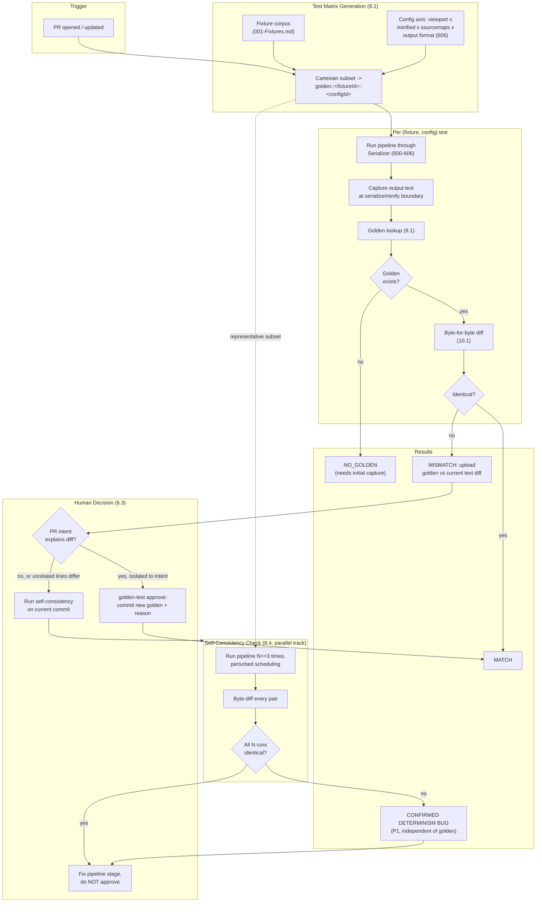

# 003 — Golden Files

## 1. Title

**Critical CSS Extraction Engine — Golden CSS Snapshot Testing: Byte-Exact Verification of Deterministic Serialized Output**

## 2. Version

| Field | Value |
|---|---|
| Document Version | 1.0.0 |
| Status | Draft — Phase 15 (Testing) |
| Last Updated | 2026-07-10 |
| Owners | Test Infrastructure Working Group |
| Stability | Draft; the golden-file diff algorithm (byte comparison) is trivial and stable, but the update-workflow policy (Section 8.3) is expected to be refined once real-world false-positive rates from legitimate engine changes are measured |

## 3. Purpose

This document specifies **golden CSS snapshot testing**: the Phase 15 test layer that captures the exact, serialized CSS text the engine emits for a given `(fixture, configuration)` pair, stores it as a checked-in golden file, and on every subsequent test run re-generates that output and diffs it **byte-for-byte** against the stored golden. It is the "Golden CSS snapshots" layer named explicitly in BRIEF.md Section 2.15 ("Layers: Unit, Integration, Visual Regression, Golden CSS snapshots, Performance benchmarks"), and its entire reason for existing is to make **BRIEF.md Section 2.18's "Deterministic output" acceptance criterion, and [006-Design-Principles.md](../architecture/006-Design-Principles.md)'s Principle 5 (Determinism of Output), into a continuously-verified, mechanically-enforced test property** rather than an architectural aspiration that could silently regress.

**This document operates on CSS text, not pixels, and its comparison is byte-exact, not perceptual — this is the load-bearing distinction from both [703-Visual-Diff.md](../design/703-Visual-Diff.md) and [002-Visual-Tests.md](./002-Visual-Tests.md).** Those two documents compare rendered screenshots using a noise-tolerant, anti-aliasing-aware pixel diff, because two *visually equivalent* renders are almost never bit-identical (Section 8.4 of 703) — glyph rasterization and sub-pixel rendering vary even between "correct" renders. Golden CSS snapshots compare the *serializer's output string*, which is not an image and has no anti-aliasing analogue: two runs of a deterministic serializer over unchanged input **must** produce the identical sequence of bytes, with zero tolerance, or Principle 5 has been violated somewhere in the pipeline. Where 703/002 ask "does this look the same," this document asks "is this the *exact same text*," and where a 703/002 diff can legitimately be zero-but-noisy-under-the-hood (different pixels, same visual meaning), a golden-file diff of zero is the *only* acceptable outcome for unchanged input — any nonzero diff is either an intentional, reviewed engine-behavior change (Section 8.3) or a determinism bug (Section 8.4), and this document's central job is teaching a reader how to tell those two apart, because both produce the identical symptom (the golden file no longer matches).

| | [703-Visual-Diff.md](../design/703-Visual-Diff.md) / [002-Visual-Tests.md](./002-Visual-Tests.md) | This document (003) |
|---|---|---|
| Artifact compared | Rendered screenshot (PNG) | Serialized CSS text (UTF-8 string / `.css` file) |
| Comparison method | Perceptual, anti-aliasing-aware, threshold-gated | Exact byte equality, zero-tolerance |
| A "diff of zero but different bytes" case | Expected and common (rendering nondeterminism is normal) | **Impossible by definition** — if bytes differ, the diff is nonzero; there is no fuzzy match |
| What a nonzero diff on unchanged input means | Environmental/rendering noise (usually) | A **determinism bug** (Section 8.4) — the serializer or an upstream stage is not pure |
| What a nonzero diff on *changed* engine code means | Possibly an intentional visual change | Possibly an intentional output-format/ordering change (Section 8.3) |

## 4. Audience

- Test infrastructure engineers implementing the golden-snapshot test runner and update tooling, who need the exact comparison semantics, storage format, and update workflow.
- Implementers of `packages/serializer` and its sub-concerns ([600-Serialization-Overview.md](../design/600-Serialization-Overview.md) through [606-Output-Formats.md](../design/606-Output-Formats.md)), the primary subsystem this suite exercises, and who will see this suite fail first whenever a change (intentional or not) alters emitted byte sequence.
- Implementers of any upstream stage whose output feeds the serializer — the Cascade Resolver, Selector Matcher, Dependency Graph builder — since a change anywhere upstream that perturbs ordering, deduplication, or content can surface as a golden-file diff even if no serializer code changed, and this document's Section 8.3/8.4 disambiguation applies regardless of which stage introduced the change.
- Contributors whose PR fails a golden-file check in CI and need the update-workflow (Section 8.3) to decide whether to run the snapshot-update command or to treat the failure as a genuine determinism regression.
- Implementers of `packages/cache`, since golden-file testing is the test-suite-level verification of the exact same determinism property the Cache Manager depends on for fingerprint-based cache-hit correctness ([006-Design-Principles.md](../architecture/006-Design-Principles.md) Section on Principle 5's consequences for module design).
- Authors of [002-Visual-Tests.md](./002-Visual-Tests.md), [000-Testing-Strategy.md](./000-Testing-Strategy.md), and [001-Fixtures.md](./001-Fixtures.md), for consistency between this document's snapshot-update workflow and the sibling baseline-approval workflow of 002.

Readers should be familiar with conventional snapshot testing (Jest `toMatchSnapshot()`, `insta` in Rust, `syrupy` in Python) as prior art this document's update workflow deliberately parallels, and with [006-Design-Principles.md](../architecture/006-Design-Principles.md) Principle 5 and [600-Serialization-Overview.md](../design/600-Serialization-Overview.md)'s determinism contract as the property under test.

## 5. Prerequisites

- [006-Design-Principles.md](../architecture/006-Design-Principles.md) — Principle 5 (Determinism of Output) in full; this document is that principle's continuous test.
- [600-Serialization-Overview.md](../design/600-Serialization-Overview.md) — the Serializer's input/output contract and its role as "the single most load-bearing enforcer" of determinism at the byte level; this document tests that enforcement.
- [601-Rule-Ordering.md](../design/601-Rule-Ordering.md), [602-Deduplication.md](../design/602-Deduplication.md), [603-Compression.md](../design/603-Compression.md), [604-Output-Validation.md](../design/604-Output-Validation.md), [605-Source-Maps.md](../design/605-Source-Maps.md), [606-Output-Formats.md](../design/606-Output-Formats.md) — the sub-concerns whose combined output is the exact text this suite snapshots.
- [000-Testing-Strategy.md](./000-Testing-Strategy.md) — the overall test-layer taxonomy this document's layer sits within.
- [001-Fixtures.md](./001-Fixtures.md) — the fixture corpus this suite's golden-file matrix is generated from (a subset or superset of [002-Visual-Tests.md](./002-Visual-Tests.md)'s matrix, per Section 8.1).
- [801-Fingerprinting.md](../design/801-Fingerprinting.md) — the fingerprinting scheme whose correctness this suite indirectly validates, since a fingerprint computed over nondeterministic bytes is unsound.
- BRIEF.md Section 2.15 (Testing Strategy), Section 2.18 (Acceptance Criteria — Deterministic output).

## 6. Related Documents

- [703-Visual-Diff.md](../design/703-Visual-Diff.md) and [002-Visual-Tests.md](./002-Visual-Tests.md) — the pixel-level, perceptual-diff sibling layers; see Section 3's disambiguation table for the artifact-type and tolerance distinction.
- [000-Testing-Strategy.md](./000-Testing-Strategy.md) — sibling Phase 15 document placing this layer in the taxonomy.
- [001-Fixtures.md](./001-Fixtures.md) — sibling Phase 15 document; the fixture corpus this suite iterates over.
- [004-Performance-Tests.md](./004-Performance-Tests.md) — sibling Phase 15 document; this suite's per-fixture cost is far cheaper than 002's (no browser render required for the comparison step itself, only for generating the CSS), a contrast documented in Section 14.
- [005-Regression-Tests.md](./005-Regression-Tests.md) — sibling Phase 15 document; an approved golden-file update is itself a regression-test artifact pinning the suite's new expected output, exactly as [002-Visual-Tests.md](./002-Visual-Tests.md) Section 13 notes for baseline images.
- [600-Serialization-Overview.md](../design/600-Serialization-Overview.md) through [606-Output-Formats.md](../design/606-Output-Formats.md) — the subsystem under test.
- [006-Design-Principles.md](../architecture/006-Design-Principles.md) — Principle 5 (Determinism of Output), the property this entire document exists to verify continuously.
- [801-Fingerprinting.md](../design/801-Fingerprinting.md) — the caching layer's dependence on the same determinism property.
- BRIEF.md Section 2.15 (Testing Strategy), Section 2.18 (Acceptance Criteria) — repository root.

## 7. Overview

Golden CSS snapshot testing, reduced to one sentence: for every `(fixture, config)` pair in the test matrix, run the full extraction pipeline through the Serializer, capture the resulting CSS text (before or after minification, per configuration — Section 8.1), diff it byte-for-byte against a stored golden file, and report `MATCH` (bytes identical — the expected, default state), `MISMATCH` (bytes differ — requires the Section 8.3 disambiguation), or `NO_GOLDEN` (first run for this test ID, requires initial capture).

Four design commitments run through this document:

1. **The comparison is exact, not fuzzy, by design — this is the whole point.** Unlike [002-Visual-Tests.md](./002-Visual-Tests.md)'s pixel comparison, which *must* tolerate rendering noise to be useful at all, a golden CSS diff that tolerated *any* byte-level variance (whitespace normalization before compare, semantic CSS-equivalence checking, etc.) would silently launder away the exact failure mode this suite exists to catch: nondeterminism in the serializer. A comparison that treats `.a{color:red}` and `.a { color: red; }` as "the same" is answering "is the CSS semantically equivalent," which is a different and legitimate question (owned by [604-Output-Validation.md](../design/604-Output-Validation.md)'s parse-and-cascade-faithfulness checks) but is *not* this suite's question. This suite's question is narrower and stricter: "did the serializer, run twice over unchanged input, produce the identical string."

2. **A mismatch is never automatically "fine."** Every `MISMATCH` requires a human decision (Section 8.3), because the two possible causes — an intentional, reviewed engine-behavior change, or a determinism bug — have opposite correct responses (approve the new golden, versus stop and fix a serious architectural violation) and look identical from the diff alone without investigation.

3. **Determinism is tested at two independent levels: single-run stability and cross-run reproducibility.** A serializer could be internally consistent-but-wrong (always produces the same *incorrect* order due to a bug) or could be nondeterministic in a way that only manifests under concurrency (Set/Map iteration order, race-dependent worker-thread completion order per [006-Design-Principles.md](../architecture/006-Design-Principles.md)). Section 8.2 and Section 10.1's algorithm test both: the golden diff catches the first (any output is compared against a fixed, reviewed reference); a repeated-run self-diff (Section 8.4) catches the second (an output compared against *itself*, generated N times, must be identical N times over, independent of any golden file at all).

4. **Golden files are, structurally, the same reviewed-artifact discipline as [002-Visual-Tests.md](./002-Visual-Tests.md)'s baselines, applied to text.** Both are checked-in "last known correct" artifacts, updated only through an explicit, reviewed approval step, never silently regenerated. This document deliberately mirrors that document's workflow shape (Section 8.3) so contributors learn one mental model — "a MISMATCH/FAIL requires classify-then-approve-or-fix" — that applies uniformly across both suites, rather than two workflows that happen to look superficially similar but differ in the details that matter under time pressure.

## 8. Detailed Design

### 8.1 Test Organization and Golden File Format

The golden-file test matrix is keyed by `(fixtureId, configId)`, where `configId` identifies a specific, meaningful extraction configuration rather than every point in the configuration space: at minimum, one `configId` per viewport/device-profile ([105-Viewport-Manager.md](../design/105-Viewport-Manager.md), mirroring [002-Visual-Tests.md](./002-Visual-Tests.md)'s viewport axis so the two suites' matrices are comparable), and additional `configId`s for configuration dimensions that materially change serialized output shape: minified vs. unminified ([603-Compression.md](../design/603-Compression.md)), with/without source maps ([605-Source-Maps.md](../design/605-Source-Maps.md)), and each pluggable output format ([606-Output-Formats.md](../design/606-Output-Formats.md): raw string, inline `<style>` envelope, JSON envelope, SSR-adapter shape).

Each test ID `golden::<fixtureId>::<configId>` maps to exactly one golden file, stored at `fixtures/<fixtureId>/__golden__/<configId>.css` (or the applicable extension for non-CSS output formats, e.g., `.json` for the JSON envelope) — plain text, checked into version control directly (not content-addressed externally, unlike [002-Visual-Tests.md](./002-Visual-Tests.md)'s image baselines), because CSS text is small, and — critically — because **a plain-text golden file is itself human-reviewable in a normal `git diff`**, which is the single largest practical advantage this suite has over the image-based sibling layer: a reviewer does not need a special artifact viewer to see exactly what changed; the PR's diff view shows the changed CSS lines directly, with byte-level precision, in the same review surface as any other code change.

**Why not store goldens as content hashes only (a hash-only golden, comparing hash-of-current to a stored hash).** A hash-only golden would catch *that* something changed but would show *nothing* in the PR diff about *what* changed — the reviewer would have to separately fetch and diff the actual outputs out-of-band. Given that CSS text is cheap to store in full and is the whole point of human-reviewability (contrast [002-Visual-Tests.md](./002-Visual-Tests.md), where images are *not* diffable in a textual review and a hash-only baseline would lose nothing review-wise that a PNG diff view doesn't already lose), storing the full text is strictly better here and the hash-only alternative is rejected.

**Golden capture point.** The golden is captured at the Serializer's final output boundary — after the Minifier if the `configId` specifies minified output, before it otherwise ([600-Serialization-Overview.md](../design/600-Serialization-Overview.md) Section 8.9–8.10's serialize→minify sequence) — because that boundary is the contractually-guaranteed deterministic artifact ([006-Design-Principles.md](../architecture/006-Design-Principles.md) Principle 5), and capturing anywhere else (e.g., an intermediate AST) would test an internal representation with no independent determinism contract of its own.

### 8.2 What "Verifying Determinism Actually Holds" Means

BRIEF.md Section 2.18 states "Deterministic output" as an acceptance criterion; [006-Design-Principles.md](../architecture/006-Design-Principles.md) Principle 5 states it as an architectural principle. Neither, by itself, is a test. This suite operationalizes the principle into two distinct, both-necessary test properties:

1. **Reference stability (the golden diff itself, Section 8.1's primary function).** Running the pipeline against fixture `F` under config `C` *today* produces byte-identical output to the *last reviewed, approved* run of `(F, C)`. This catches drift *relative to a known-good reference* — the same shape of test as [002-Visual-Tests.md](./002-Visual-Tests.md)'s baseline comparison, but exact rather than thresholded.

2. **Self-consistency (the repeated-run self-diff, Section 8.4).** Running the pipeline against fixture `F` under config `C` **multiple times in the same test invocation** (ideally under artificially perturbed scheduling — staggered worker-thread start delays, forced non-default `Set`/`Map` insertion order in test doubles — per [006-Design-Principles.md](../architecture/006-Design-Principles.md)'s own recommendation for a "dedicated CI job that runs the same fixture extraction twice ... and byte-diffs the output") produces byte-identical output on every run, **independent of whether that output matches the golden at all**. This is the property that most directly answers this document's charge: "verifying the determinism Design Principle actually holds," because a pipeline could coincidentally match its golden today while still being internally nondeterministic (e.g., a `Set`-iteration-order bug that happens to iterate in insertion order on the current V8 build but is not guaranteed to) — self-consistency testing exercises exactly the scenario Principle 5's rationale warns about, by deliberately perturbing the conditions (thread timing, collection insertion order) that a fragile-but-accidentally-stable implementation would be sensitive to.

**Why both are necessary and neither subsumes the other.** Reference stability alone cannot distinguish "genuinely deterministic" from "deterministic by V8-implementation-accident, tested once, happened to match" — a single golden comparison run is one sample. Self-consistency alone cannot distinguish "internally reproducible" from "reproducibly *wrong*" — a serializer with a stable-but-incorrect ordering bug would pass every self-consistency check while silently violating the cascade-faithfulness contract ([604-Output-Validation.md](../design/604-Output-Validation.md)) that only a comparison against a *reviewed* reference (the golden) can catch. The two tests are complementary axes of the same underlying property, and this suite runs both (Section 8.4, Section 10.1).

### 8.3 Distinguishing Intentional Engine Change from Broken Determinism

A `MISMATCH` against the golden is the suite's central decision point, and — as with [002-Visual-Tests.md](./002-Visual-Tests.md) Section 8.3 — the same symptom (bytes differ from the stored reference) has two causes with opposite correct responses:

1. **Intentional engine change (approve a new golden).** A deliberate code change altered the emitted output in an expected way: a rule-ordering algorithm was refined ([601-Rule-Ordering.md](../design/601-Rule-Ordering.md)), a new deduplication case was added ([602-Deduplication.md](../design/602-Deduplication.md)), the minifier's token-compression strategy changed ([603-Compression.md](../design/603-Compression.md)), or an output-format envelope's shape was revised ([606-Output-Formats.md](../design/606-Output-Formats.md)). The correct action is to inspect the diff (a normal text diff, per Section 8.1's human-reviewability point), confirm it matches the PR's stated intent with no unexplained collateral changes, and run the update command (`golden-test approve <testId>` or `--update-all-in-pr`), committing the new golden with a mandatory reason string, exactly mirroring [002-Visual-Tests.md](./002-Visual-Tests.md) Section 8.2's sidecar-manifest discipline.

2. **Broken determinism (do not approve — this is a bug, and a more serious one than a typical regression).** The bytes differ **for a reason unrelated to any intentional code change the PR claims to make**, or — more alarmingly — the bytes differ between two runs of the *same* unchanged commit (caught by Section 8.4's self-consistency check, not this golden diff directly, but often first noticed as an inexplicable golden mismatch that a re-run "fixes" or "un-fixes"). Common root causes: iterating a `Set`/`Map`/plain object in an order the language does not guarantee stable in a given context; concatenating parallel-worker results in first-completed order rather than a canonical order keyed by `sourceOrderIndex` ([601-Rule-Ordering.md](../design/601-Rule-Ordering.md)); embedding a wall-clock timestamp, a random UUID, or an unstable hash (e.g., object-identity-based) into the output ([605-Source-Maps.md](../design/605-Source-Maps.md) source-map generation is a common offender if it embeds absolute file-system paths or timestamps); or a floating-point geometry value ([006-Design-Principles.md](../architecture/006-Design-Principles.md)'s noted epsilon/rounding concern) leaking into serialized output without the documented rounding rule applied. The correct action is **never** to approve a new golden to "make the test pass" — doing so does not fix the nondeterminism, it only moves the goalposts to match whichever nondeterministic output happened to be produced on the approving run, after which the *next* nondeterministic run fails against *that* golden instead, and the suite has been silently defeated. The correct action is to treat this as a Priority-1 architectural bug against Principle 5 and trace it via Section 8.4's self-consistency check to the specific stage introducing the nondeterminism.

**The decision procedure, in order:**

```
1. Does the PR's stated intent explain a change to this test ID's output?
     -> If yes: view the text diff. Does every changed line correspond to the
        intended change (e.g., new dedup case touches only affected selectors)?
          -> If yes, and no unrelated lines changed: approve.
          -> If unrelated lines also changed: STOP. Investigate the unrelated
             lines as a possible determinism bug before approving anything,
             even though part of the diff is legitimate -- do not partially
             approve a MISMATCH; a golden file is captured whole, not per-line.
     -> If no (PR does not explain any output change for this fixture):
2. Run the self-consistency check (8.4, 10.1) for this (fixture, config) on the
   CURRENT commit, N >= 3 times.
     -> If any two runs differ from each other: CONFIRMED determinism bug.
        Do not approve. File as P1. Bisect the pipeline stage (8.4).
     -> If all N runs are identical to each other but differ from the golden:
        the golden itself may be stale (e.g., captured before a legitimate but
        undocumented prior change slipped through review) or environment-
        dependent (e.g., a previously-unpinned dependency version changed).
        Investigate the golden's last-approval history before approving a
        "fix" -- this path should be rare if (1) and CI discipline are followed
        and its recurrence is itself a process signal worth escalating.
```

This procedure deliberately routes *every* unexplained mismatch through the self-consistency check *before* considering approval, because approving over an actual determinism bug is the single most damaging failure mode this suite can have — it converts a real architectural violation into a silently "passing" test suite, which is strictly worse than having no golden-file suite at all (a false sense of the determinism guarantee holding).

### 8.4 The Repeated-Run Self-Consistency Check

Independent of any golden comparison, this suite runs a dedicated self-consistency job (directly implementing [006-Design-Principles.md](../architecture/006-Design-Principles.md)'s own recommendation) for a representative subset of `(fixture, config)` pairs — at minimum, one fixture exercising each Serializer sub-concern ([601](../design/601-Rule-Ordering.md)–[606](../design/606-Output-Formats.md)) and the `enterprise-huge` fixture (large enough that parallel-worker code paths, the most common nondeterminism source, are actually exercised):

- Run the full pipeline `N` times (`N ≥ 3`, configurable higher for suspect fixtures) against **identical input**, with the harness deliberately perturbing scheduling nondeterminism where the runtime allows it: artificially staggered worker-thread start delays, forced non-default insertion order into any test-double collections the pipeline touches, and (where feasible) running under both a single-threaded and a multi-threaded execution mode to isolate whether a mismatch is concurrency-dependent.
- Byte-diff every pair of the `N` outputs. All `N × (N-1) / 2` pairs must be identical; any pair differing is a confirmed determinism violation, reported with **both** differing outputs and a diff between them (reusing the same textual diff presentation as the golden-vs-current diff, Section 8.1) so the investigator can see exactly which bytes vary run-to-run.
- This check does **not** require or consult a golden file at all — it is a pure property of the pipeline's repeatability, deliberately independent of whether the shared output happens to be "correct" in the golden-file sense, per Section 8.2's point that the two properties are orthogonal.

**Why perturb scheduling rather than just running N times under default conditions.** Default-condition repeated runs on a single, lightly-loaded CI worker can coincidentally succeed even with a latent race, because the same thread completion order tends to recur under identical load. Perturbing start delays and forcing non-default collection iteration order is the mechanism that actually stresses the failure mode Principle 5's rationale describes (rather than relying on CI infrastructure noise to *accidentally* expose it) — a deliberate, engineered adversarial condition, not a hopeful repeated sample.

## 9. Architecture

### 9.1 Golden-File Test Flow



### 9.2 Golden Comparison Sequence

```mermaid
sequenceDiagram
    participant Dev as Developer
    participant CI as CI Runner
    participant Suite as Golden Test Suite
    participant Store as Golden Store (8.1)
    participant Self as Self-Consistency Check (8.4)

    Dev->>CI: push PR
    CI->>Suite: run golden::* matrix
    Suite->>Suite: run pipeline -> serialized text (8.1)
    Suite->>Store: fetch golden(testId)
    alt golden missing
        Store-->>Suite: none
        Suite-->>CI: NO_GOLDEN
    else golden present
        Store-->>Suite: golden text
        Suite->>Suite: byte-diff (10.1)
        alt identical
            Suite-->>CI: MATCH
        else differs
            Suite-->>CI: MISMATCH + text diff artifact
        end
    end
    CI-->>Dev: report
    alt MISMATCH, PR intent explains it cleanly
        Dev->>Suite: golden-test approve testId --reason "..."
        Suite->>Store: commit new golden
    else MISMATCH, unexplained or partially explained
        Dev->>Self: request self-consistency run (N>=3, perturbed)
        Self->>Self: run pipeline N times, pairwise byte-diff
        alt any pair differs
            Self-->>Dev: CONFIRMED nondeterminism (P1 bug)
            Dev->>Dev: fix pipeline stage, do NOT approve golden
        else all N identical
            Self-->>Dev: pipeline is self-consistent; golden may be stale
            Dev->>Dev: investigate golden history before any approval
        end
    end
```

## 10. Algorithms

### 10.1 Algorithm: Golden Snapshot Byte Comparison

**Problem statement.** Given a freshly-generated serialized output string for `(fixtureId, configId)` and the stored golden text (if any), determine whether they are byte-identical, and if not, produce a precise, human-reviewable diff plus a verdict distinguishing "no golden yet" from "mismatch."

**Inputs.** `fixtureId`, `configId`, `goldenStore` (keyed lookup), `generateFn` (runs the pipeline through the Serializer for this fixture/config, Section 8.1).

**Outputs.** `{ testId, verdict: MATCH|MISMATCH|NO_GOLDEN, diff?: LineDiff[] }`.

**Pseudocode.**

```
function runGoldenTest(fixtureId, configId, goldenStore, generateFn) -> GoldenResult:
    testId = "golden::" + fixtureId + "::" + configId
    golden = goldenStore.lookup(testId)              // O(1) keyed store access; reads raw bytes

    current = generateFn(fixtureId, configId)        // full pipeline through Serializer (8.1);
                                                      // dominant cost is here, not the compare

    if golden == null:
        return { testId, verdict: NO_GOLDEN }         // first run; needs initial capture + review

    if byteEquals(golden, current):                  // O(min(len(golden), len(current))),
        return { testId, verdict: MATCH }             // short-circuits on first differing byte
                                                       // or length mismatch

    diff = lineDiff(golden, current)                  // O(L_g + L_c) expected (Myers diff or
                                                       // equivalent LCS-based line diff), for
                                                       // human-readable presentation only --
                                                       // the verdict itself does not depend on it
    return { testId, verdict: MISMATCH, diff }

function byteEquals(a: bytes, b: bytes) -> bool:
    if length(a) != length(b): return false
    for i in 0..length(a)-1:
        if a[i] != b[i]: return false
    return true
```

**Time complexity.** `generateFn` dominates: it is the full extraction pipeline (CSSOM collection through serialization), the same cost profile as a production extraction run for the fixture, independent of this suite's compare step. `byteEquals` is `O(n)` where `n` is the output length in bytes, with an early exit on the first differing byte or a length mismatch — for the common `MATCH` case this is a single linear scan with no allocation beyond the two buffers already in memory. `lineDiff`, run only on `MISMATCH`, is `O(L_g + L_c)` expected for a standard line-based LCS/Myers diff, where `L_g`, `L_c` are line counts of the golden and current text; CSS text (even minified) rarely exceeds a few thousand lines per fixture, so this is not a performance concern even though it is asymptotically the same order as more sophisticated diff algorithms applied to much larger inputs.

**Memory complexity.** `O(L_g + L_c)` in bytes for holding both texts simultaneously (both are small relative to available memory — CSS text, not images); `lineDiff`'s additional working set is `O(L_g · L_c)` in the worst case for a naive DP table, or `O((L_g + L_c) · D)` for a Myers-style diff where `D` is the edit distance — negligible for the sizes involved here and never the suite's bottleneck (`generateFn`'s pipeline memory usage dominates by orders of magnitude, per [600-Serialization-Overview.md](../design/600-Serialization-Overview.md) and upstream stage cost models).

**Failure cases.** (a) `generateFn` itself throwing (a pipeline crash, e.g., a malformed fixture or an unhandled CSS construct) is reported as an infrastructure/pipeline failure distinct from `MISMATCH` — it must never be silently interpreted as "no output, treat as empty string, diff against golden," which would produce a misleading giant diff instead of surfacing the real crash. (b) A golden file that fails to decode as valid UTF-8 (corruption, encoding mismatch from an OS-level line-ending transformation on checkout — see Edge Cases) is reported as a golden-store integrity error, not a `MISMATCH`, since comparing against corrupted reference bytes would produce a diff with no diagnostic value. (c) Non-CSS output formats ([606-Output-Formats.md](../design/606-Output-Formats.md), e.g., the JSON envelope) still compare as raw bytes/text at this layer — this document does not special-case JSON structural equivalence (a JSON-aware diff that ignored key order, for instance, would reintroduce exactly the "is it semantically the same" question Section 7 explicitly excludes) — a byte-for-byte JSON text diff is used uniformly, and if a JSON serializer's own key-ordering is nondeterministic, that is itself the class of bug this suite exists to catch, not a reason to loosen the comparison.

**Optimization opportunities.** Skip `generateFn` (and thus the whole test) via the same fingerprinting approach [002-Visual-Tests.md](./002-Visual-Tests.md) Section 10.1 and [704-Incremental-Extraction.md](../design/704-Incremental-Extraction.md) apply, when the fixture's content hash and every module hash reachable in its dependency graph are unchanged since the last `MATCH` — the dominant cost here is pipeline execution, not comparison, so incremental skipping is this algorithm's most valuable optimization by far, more so than in the pixel-diff case where the comparison itself is nontrivial. Batch multiple `configId`s of the same `fixtureId` to amortize any shared upstream pipeline stages (e.g., CSSOM collection is `config`-independent and can run once per fixture, with only the Serializer's config-dependent tail re-run per `configId`) — see Section 14.

### 10.2 Algorithm: N-Run Self-Consistency Check

**Problem statement.** Independent of any golden file, verify that running the pipeline `N` times against identical input, under deliberately perturbed scheduling, produces byte-identical output every time — the direct test of the determinism *property* itself, as distinct from reference stability (10.1).

**Inputs.** `fixtureId`, `configId`, `generateFn` (as above), `N ≥ 3`, `perturbations` (a list of scheduling-perturbation strategies to apply, one per run, e.g., staggered worker delays, forced collection iteration orders).

**Outputs.** `{ testId, verdict: CONSISTENT|INCONSISTENT, outputs: bytes[], firstDivergence?: { runA, runB, diff } }`.

**Pseudocode.**

```
function selfConsistencyCheck(fixtureId, configId, generateFn, N, perturbations) -> ConsistencyResult:
    testId = "golden::" + fixtureId + "::" + configId
    outputs = []
    for i in 0..N-1:
        applyPerturbation(perturbations[i % length(perturbations)])   // stagger threads,
                                                                        // force iteration order, etc.
        outputs.push(generateFn(fixtureId, configId))

    for i in 0..N-1:
        for j in i+1..N-1:
            if not byteEquals(outputs[i], outputs[j]):
                diff = lineDiff(outputs[i], outputs[j])
                return { testId, verdict: INCONSISTENT, outputs,
                          firstDivergence: { runA: i, runB: j, diff } }

    return { testId, verdict: CONSISTENT, outputs }
```

**Time complexity.** `O(N)` invocations of `generateFn` (dominant cost, `N` times the single-run pipeline cost) plus `O(N^2)` pairwise `byteEquals` calls in the worst case (early-exits on the first divergence found, so in practice far fewer than `N^2` comparisons are needed once a divergence exists; only a fully-consistent run performs all `N(N-1)/2` comparisons). For the representative subset this check runs against (Section 8.4), `N` is small (3–5) and the pipeline-run cost, not the comparison count, dominates wall time.

**Memory complexity.** `O(N · outputSize)` to hold all `N` outputs simultaneously (needed so any pair can be compared and the specific divergent pair reported, not just "some pair differs"); acceptable given CSS text's small size relative to image-based artifacts.

**Failure cases.** (a) A perturbation strategy that itself is not deterministically reproducible (e.g., relying on real wall-clock timing jitter rather than a seeded, reproducible delay schedule) makes a reported `INCONSISTENT` hard to reproduce for debugging — perturbations should themselves be logged and seeded so a discovered inconsistency can be replayed exactly. (b) If `generateFn` throws on some but not all of the `N` runs, that is itself a form of inconsistency (a crash under one scheduling order and a successful, possibly-differing result under another) and must be reported as `INCONSISTENT` with the crash as the "difference," not silently excluded from the comparison set.

**Optimization opportunities.** Run the `N` invocations in parallel (they are independent, aside from the deliberate scheduling perturbation each one applies to *itself*) to bound wall time to roughly one pipeline run rather than `N` sequential ones, provided the perturbation mechanism does not require exclusive access to shared process-level state (worker-thread pool sizing, in particular, may need to be run sequentially if perturbations manipulate a shared pool — a implementation-level tradeoff between wall-clock cost and perturbation fidelity).

## 11. Implementation Notes

- The golden capture boundary (Section 8.1) must be pinned to a single, documented point in the pipeline (post-Minifier for minified configs, pre-Minifier otherwise) and that boundary must not silently shift as the Serializer's internal staging changes — a refactor that moves where "final output" is captured, without updating every golden, would produce a suite-wide false mismatch wave indistinguishable at first glance from a real determinism regression.
- Golden files must be checked out and compared with line-ending normalization *disabled* (no `git config core.autocrlf` interference, no editor auto-formatting on save) — a golden-file suite is uniquely vulnerable to line-ending or trailing-whitespace transformations silently applied by tooling outside the pipeline itself, which would produce a `MISMATCH` that has nothing to do with the engine and everything to do with the file's on-disk representation; golden files should be marked `-text` (binary-safe, no line-ending conversion) in `.gitattributes`.
- The self-consistency check's perturbation strategies (10.2) should be implemented as an explicit, injectable test-only harness capability in the relevant packages (worker pool, any `Set`/`Map`-based intermediate collection), not as ad hoc `sleep()` calls sprinkled through production code — production code must not need to know it is being perturbed; the harness should intercept at defined seams (e.g., a worker-pool constructor parameter accepting an explicit start-delay schedule in test builds only).
- The update CLI (`golden-test approve`) should, like [002-Visual-Tests.md](./002-Visual-Tests.md)'s approval tool, refuse an empty reason string and should print the full text diff to the terminal (not just a byte-count summary) before prompting for confirmation, so an approval is never a blind action.
- CI should run the self-consistency check (Section 8.4) on a slower cadence than the full golden-diff matrix (e.g., nightly, or on PRs touching the Serializer/Cascade Resolver/worker-pool code specifically) rather than on every PR, since it is `N×` more expensive than a single golden comparison (Section 10.2) and its purpose — catching latent, rare nondeterminism — does not require per-PR cadence to be valuable, per the cost/benefit discussion in Section 14.

## 12. Edge Cases

- **A dependency (CSS minifier library, third-party polyfill embedded in output) changes its own deterministic-but-different output between library versions.** This surfaces as a golden `MISMATCH` correlated with a dependency version bump, not an engine code change — the Section 8.3 decision procedure's first branch ("does PR intent explain it") correctly routes this to "approve," provided the version bump is itself the PR's stated intent; an unstated, transitive dependency bump (a lockfile update pulled in silently) should be caught by CI dependency-pinning discipline before it reaches this suite as a surprise.
- **Locale-dependent string operations (e.g., a case-insensitive selector comparison using a locale-aware `toLowerCase`) producing different output on CI runners with different default locales.** A subtle determinism bug this suite is well-positioned to catch via Section 8.4's self-consistency check if runs are deliberately executed under varied `LANG`/`LC_ALL` settings as one of the perturbation strategies (10.2) — otherwise it could evade detection if all CI runners happen to share one locale.
- **Floating-point geometry values leaking into serialized output** (e.g., an inlined custom property capturing a computed pixel value) **without the documented rounding rule** ([006-Design-Principles.md](../architecture/006-Design-Principles.md)'s noted epsilon rule) **applied.** Manifests as an intermittent, hardware-dependent golden mismatch; the fix belongs upstream (apply the rounding rule before the value reaches the Serializer), not in this suite, which should only ever detect and localize it.
- **Source maps embedding absolute file-system paths or build timestamps** ([605-Source-Maps.md](../design/605-Source-Maps.md)). A textbook nondeterminism source if source-map generation is naive; the golden for a `configId` that includes source maps must use paths relative to a fixed, project-relative root and must omit or fix any timestamp field, or every machine running the suite produces a "unique" mismatch that has nothing to do with engine correctness.
- **Multi-viewport merged output** ([016-Data-Flow.md](../architecture/016-Data-Flow.md) Section 9.3's `MergedMultiViewportRuleSet`) **where the merge step's own iteration over viewports is order-sensitive.** If viewports are merged in an order derived from an unordered collection (e.g., a `Map` keyed by viewport ID iterated without an explicit sort), the merged output can vary run-to-run even though each individual per-viewport extraction is internally deterministic — exactly the class of bug Section 8.4's self-consistency check is designed to catch, and a reminder that "each stage is deterministic in isolation" does not imply "the composition is deterministic" without an explicit canonical merge order.
- **A golden file that itself was captured non-deterministically before this suite existed** (a "grandfathered" golden from an earlier, less rigorous process). Its first re-run under this suite may show a spurious `MISMATCH` unrelated to any current code change; this is resolved by treating the first `NO_GOLDEN`-equivalent recapture as a one-time, clearly-labeled migration commit, distinct from an ordinary approval, so the audit trail does not misattribute the change to the PR that happened to trigger the recapture.
- **Binary or non-UTF-8-safe content accidentally embedded in output** (e.g., a raw base64 image mistakenly inlined without expected encoding normalization). Golden files as plain UTF-8 text assume the output is text; a pipeline configuration that can legitimately produce binary output (rare, but conceivable for some `606-Output-Formats.md` targets) requires a binary-safe golden variant using the same byte-exact comparison but without the line-diff presentation of Section 10.1 (falls back to a byte-offset-of-first-difference report instead).

## 13. Tradeoffs

| Decision | Why | Alternative Considered | Tradeoff Accepted |
|---|---|---|---|
| Byte-exact comparison, zero tolerance | The whole point is verifying determinism; any fuzzy matching would launder real nondeterminism | Semantic/normalized CSS-equivalence comparison | Whitespace-only or cosmetically-irrelevant formatting changes also trigger `MISMATCH`, requiring an approval even when semantically inert — accepted because a "cosmetically irrelevant" change is still a byte-level output change a determinism-focused suite must not silently ignore |
| Full CSS text stored as the golden, not a content hash | Human-reviewable diffs directly in the PR view | Hash-only golden (smaller storage) | Larger repository footprint per golden; accepted since CSS text is small relative to the image baselines of [002-Visual-Tests.md](./002-Visual-Tests.md) |
| Two independent checks: golden diff (reference stability) and N-run self-consistency | Neither alone distinguishes "correct and stable" from "coincidentally stable" or "stable but wrong" | Golden diff only | Extra CI infrastructure and (for self-consistency) N× pipeline cost; mitigated by running self-consistency on a slower cadence (Section 11) |
| Never approve a golden over a confirmed or suspected determinism bug | Approving would silently defeat the suite's core purpose | Allow "temporary" approval with a follow-up ticket | Slower unblocking of an affected PR until the underlying bug is fixed; accepted as the only response consistent with Principle 5 actually being enforced rather than nominally enforced |
| Golden capture pinned to serializer/minifier output boundary only | A single, well-defined, contractually-deterministic boundary | Capture at multiple pipeline stages (AST, pre-merge, etc.) | Less granular localization of *where* in the pipeline a mismatch originates; mitigated by the self-consistency check's bisection guidance (Section 8.4) |
| Self-consistency check on a slower cadence than every PR | N× cost is not justified for every PR given its low expected-value-per-run for already-stable code | Run on every PR alongside the golden diff | A newly-introduced nondeterminism bug may merge before the slower-cadence check catches it; mitigated by triggering it eagerly on PRs touching known nondeterminism-prone code (worker pool, Serializer, Cascade Resolver) |

## 14. Performance

- **CPU complexity.** Dominated entirely by `generateFn` — running the full extraction pipeline through the Serializer — which is orders of magnitude more expensive than the comparison step itself (`O(n)` byte comparison, Section 10.1); this mirrors [703-Visual-Diff.md](../design/703-Visual-Diff.md) Section 14's observation that the diff is cheap relative to producing the artifacts being diffed, but this suite's artifact-production cost (a CSS extraction run, no browser screenshot required for the *comparison* itself, only for generating the extraction if it depends on live browser collection) is typically markedly cheaper per test than [002-Visual-Tests.md](./002-Visual-Tests.md)'s render-plus-screenshot cost, since no image encoding/decoding or crop step is involved.
- **Memory complexity.** `O(L_g + L_c)` for a single golden comparison (Section 10.1); `O(N · outputSize)` for the self-consistency check (Section 10.2) — both negligible relative to the underlying pipeline's own working-set size, since CSS text is small compared to the in-memory rule sets, dependency graphs, and DOM snapshots the pipeline manipulates upstream of the Serializer.
- **Caching strategy.** Fingerprint-based skip (Section 10.1's optimization) is the dominant lever: a `(fixture, config)` pair whose content and reachable module hashes are unchanged since its last `MATCH` skips re-running `generateFn` entirely, exactly mirroring [704-Incremental-Extraction.md](../design/704-Incremental-Extraction.md)'s production caching. Because this suite's tests are cheaper per-run than [002-Visual-Tests.md](./002-Visual-Tests.md)'s, the *absolute* time saved per skip is smaller, but the *relative* importance is similar as the fixture × config matrix grows.
- **Parallelization opportunities.** Golden tests are embarrassingly parallel across `(fixture, config)` pairs, same as [002-Visual-Tests.md](./002-Visual-Tests.md) Section 14; additionally, per Section 8.1's batching optimization, config-independent upstream pipeline stages (CSSOM collection, cascade resolution up to the point configs diverge) can be shared across a fixture's multiple `configId` variants, reducing redundant work within a fixture's own sub-matrix — an optimization with no analogue in the image-based suite, where each viewport genuinely requires an independent render.
- **Incremental execution.** Same fingerprint-based approach as [704-Incremental-Extraction.md](../design/704-Incremental-Extraction.md) and [002-Visual-Tests.md](./002-Visual-Tests.md) Section 14; additionally, the self-consistency check (Section 8.4) is deliberately run incrementally-by-cadence (nightly, or path-filtered to nondeterminism-prone code) rather than fingerprint-skipped per se, since its purpose is adversarial stress-testing of code whether or not its fingerprint superficially "looks unchanged."
- **Scalability limits.** Total suite time scales with `|fixtures| × |configIds| × pipelineCost`, generally cheaper in aggregate than [002-Visual-Tests.md](./002-Visual-Tests.md)'s image-based matrix at equivalent scale, per [004-Performance-Tests.md](./004-Performance-Tests.md)'s tracked budgets for both suites; the self-consistency check's `N×` multiplier is the suite's own scalability pressure point and is managed via the reduced-cadence/targeted-trigger policy (Section 11) rather than by reducing `N` below the point where it meaningfully stresses scheduling nondeterminism.

## 15. Testing

As with [002-Visual-Tests.md](./002-Visual-Tests.md) Section 15, this document specifies a test suite whose own correctness must itself be verified, addressed directly rather than assumed:

- **Unit tests.** `runGoldenTest()` (Section 10.1) against a mocked `goldenStore`/`generateFn`: missing golden → `NO_GOLDEN`; identical bytes → `MATCH`; a single differing byte anywhere in a large output → `MISMATCH` with a correct, minimal line diff; a length mismatch (extra trailing content) → `MISMATCH` detected without needing a full scan past the length check. `selfConsistencyCheck()` (Section 10.2) against a `generateFn` mock configured to return identical outputs on every call → `CONSISTENT`; configured to return a differing output on run 3 of 5 → `INCONSISTENT` with `firstDivergence` correctly identifying runs 3 and (the first prior run compared against it).
- **Integration tests (the core value, mirroring [703-Visual-Diff.md](../design/703-Visual-Diff.md) Section 15's framing).** Real fixtures where a deliberate, correct code change (e.g., a new deduplication rule) produces an expected, reviewed golden diff — verifying the approve workflow round-trips correctly (approve, re-run, now `MATCH`); and a fixture run through a pipeline instrumented with deliberately injected nondeterminism (e.g., a test-only flag that randomizes a `Set`'s iteration order) — verifying the self-consistency check reliably reports `INCONSISTENT` for a known-bad implementation, which is this suite's proof that it can actually catch the failure mode it exists for, not merely pass on well-behaved input.
- **Visual tests.** Not directly applicable to this text-based suite (no pixels are compared here); where a `606-Output-Formats.md` target renders to an image-embedding envelope, that path is exercised by [002-Visual-Tests.md](./002-Visual-Tests.md) instead, and this document explicitly does not duplicate that coverage.
- **Stress tests.** The `enterprise-huge` fixture ([001-Fixtures.md](./001-Fixtures.md)) run through the self-consistency check with `N` elevated (e.g., `N = 20`) and aggressive scheduling perturbation, since a large fixture is the case most likely to exercise parallel-worker code paths where race-dependent nondeterminism actually manifests, per [006-Design-Principles.md](../architecture/006-Design-Principles.md)'s own rationale citing "parallel worker threads complete in a race-dependent sequence."
- **Regression tests.** A pinned set of golden files themselves, whose approval history is part of the reviewed commit log per [005-Regression-Tests.md](./005-Regression-Tests.md) — any unapproved change to a golden file (i.e., a mismatch reaching `main` without going through the approval CLI's commit path, detectable by the sidecar/manifest-equivalent commit-message convention) is itself a regression-test failure at the process level, not just the output level.
- **Benchmark tests.** Wall-clock time of the full golden matrix (cheap, high-frequency, per-PR) and of the self-consistency check (expensive, low-frequency), tracked separately per [004-Performance-Tests.md](./004-Performance-Tests.md), so a regression in either suite's own runtime is caught before it silently degrades CI turnaround or before cost pressure tempts a reduction in `N` or matrix coverage.

## 16. Future Work

- **Semantic-equivalence companion check, explicitly separate from this suite.** A future, distinct test layer (not a modification of this one — Section 7's exact-comparison commitment must not be diluted) that verifies a golden *mismatch* is at least CSS-parseable and cascade-faithful even when bytes differ, giving a fast pre-classification signal ("this looks like a formatting-only change" vs. "this looks like a semantic change") to assist the Section 8.3 decision procedure without replacing the byte-exact gate itself.
- **Automatic bisection for confirmed determinism bugs.** When Section 8.4's self-consistency check reports `INCONSISTENT`, automatically re-run with each pipeline stage's output captured independently (CSSOM collection, matching, cascade resolution, dependency graph, serialization) to localize which stage's output first diverges across runs — turning "the final output is nondeterministic somewhere" into "stage X's output is nondeterministic," directly actionable without manual bisection.
- **Golden diff summarization for large outputs.** For an `enterprise-huge`-scale fixture's golden, a raw line diff can be large even for a small underlying change (e.g., a reordering that shifts many lines); a future diff presentation could detect pure-reordering changes and summarize them ("N rules reordered, 0 content changes") separately from genuine content changes, improving reviewer throughput on the Section 8.3 decision without changing the underlying byte-exact verdict.
- **Expanding perturbation strategies as the runtime evolves.** As the engine adopts new concurrency primitives (e.g., a future move to `Worker` pools with different scheduling semantics, or a WASM-compiled hot path with its own memory-ordering characteristics), Section 8.4's perturbation strategy list should be revisited and extended; a perturbation strategy tuned for today's implementation may fail to stress tomorrow's differently-shaped nondeterminism risk.
- **Open question: should golden files be versioned per supported Node.js/browser-engine runtime**, if a future multi-runtime support matrix ever causes the same input to legitimately (and acceptably) serialize with, say, different `Intl`-dependent string collation on different runtimes? Current lean is that this should not be accepted as "legitimate" at all — any such runtime-dependent output would itself be a Principle 5 violation to fix upstream — but the question is flagged here in case a future runtime-support decision reopens it.

## 17. References

- [703-Visual-Diff.md](../design/703-Visual-Diff.md)
- [002-Visual-Tests.md](./002-Visual-Tests.md)
- [000-Testing-Strategy.md](./000-Testing-Strategy.md)
- [001-Fixtures.md](./001-Fixtures.md)
- [004-Performance-Tests.md](./004-Performance-Tests.md)
- [005-Regression-Tests.md](./005-Regression-Tests.md)
- [600-Serialization-Overview.md](../design/600-Serialization-Overview.md)
- [601-Rule-Ordering.md](../design/601-Rule-Ordering.md)
- [602-Deduplication.md](../design/602-Deduplication.md)
- [603-Compression.md](../design/603-Compression.md)
- [604-Output-Validation.md](../design/604-Output-Validation.md)
- [605-Source-Maps.md](../design/605-Source-Maps.md)
- [606-Output-Formats.md](../design/606-Output-Formats.md)
- [704-Incremental-Extraction.md](../design/704-Incremental-Extraction.md)
- [801-Fingerprinting.md](../design/801-Fingerprinting.md)
- [006-Design-Principles.md](../architecture/006-Design-Principles.md)
- [016-Data-Flow.md](../architecture/016-Data-Flow.md)
- BRIEF.md Section 2.15 (Testing Strategy), Section 2.18 (Acceptance Criteria — Deterministic output) — repository root
- Jest snapshot testing (`toMatchSnapshot()`), `insta` (Rust), `syrupy` (Python) — prior art for the reviewed-update snapshot workflow referenced in Section 8.3
- Myers, "An O(ND) Difference Algorithm and Its Variations" — referenced as the line-diff basis in Section 10.1
