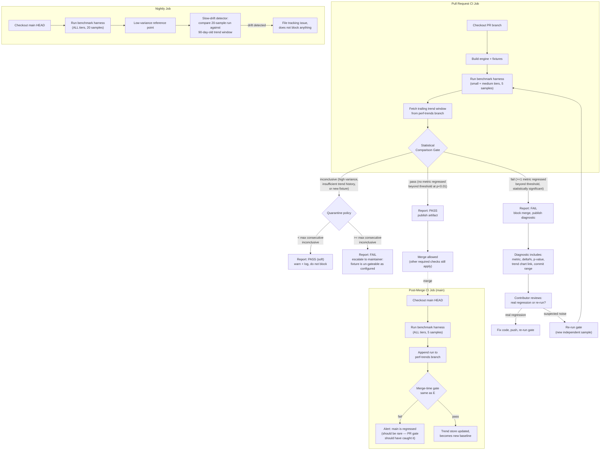

# 004 — Performance Tests

## 1. Title

**Critical CSS Extraction Engine — Performance Testing as a CI-Gating Layer**

## 2. Version

| Field | Value |
|---|---|
| Document Version | 1.0.0 |
| Status | Draft — Phase 15 (Testing) |
| Last Updated | 2026-07-10 |
| Owners | Core Architecture Working Group / Testing Guild |
| Stability | Establishes the binding contract for how `packages/reporter`'s CI gate consumes `benchmarks/` output. The threshold-comparison algorithm (Section 10) is stable; the specific default percentages in Section 8 are tunable per-repository configuration, not part of the contract. |

## 3. Purpose

[../performance/005-Benchmarks.md](../performance/005-Benchmarks.md) specifies the benchmark harness: how a single benchmark run measures wall-clock time, peak resident memory, and CSS output size for a fixed corpus of fixture pages, and how that harness is invoked in isolation, on a developer's machine, for exploratory profiling. That document deliberately stops at "here is a number." It does not say what happens to that number next, whether a pull request should be blocked because of it, or how to tell a real 40ms regression apart from CI-runner jitter that produced a 40ms swing on an unchanged codebase.

This document picks up exactly where that one stops. It specifies **performance testing** as a first-class member of the test suite described in [000-Testing-Strategy.md](000-Testing-Strategy.md) — a test layer that runs benchmarks not to produce a number for a human to eyeball, but to produce a pass/fail verdict that gates merge, the same way a unit test or a golden-file comparison ([003-Golden-Files.md](003-Golden-Files.md)) gates merge. It defines: the historical trend store that gives a single benchmark run meaning relative to the past; the statistical procedure that separates signal (a real regression introduced by a diff) from noise (CI-runner variance, thermal throttling, neighboring-tenant contention); the threshold-comparison gate that [BRIEF.md §2.11](../architecture/002-Problem-Statement.md) requires ("fail build if CSS grows beyond threshold... extraction errors occur"); and the escape hatches that keep a noisy gate from becoming a merge-blocking liability that the team routinely bypasses with `--force`.

The central design tension this document resolves is: a performance test that never false-positives is one that never catches real regressions either (thresholds so loose nothing trips them), and a performance test that catches every real regression is one that also flags every noisy run (thresholds so tight everything trips them). Section 9 ("Statistical Noise Handling") is the load-bearing section of this document; the rest of the document exists to give that section a place to plug into.

## 4. Audience

- Implementers of `packages/reporter`'s CI-gate component, who translate Section 10's pseudocode into the actual gate that runs in `.github/workflows/` (or equivalent) and produces the pass/fail exit code.
- Implementers of `benchmarks/` who own the harness in [../performance/005-Benchmarks.md](../performance/005-Benchmarks.md) and must expose the raw sample data (not just a single point estimate) this document's statistical procedure requires.
- Release engineers who configure per-repository thresholds (Section 8) and must understand what a threshold change actually buys or costs in false-positive/false-negative rate.
- Contributors whose pull requests get blocked by this gate and need to understand — from the failure message alone — whether their change caused a real regression or whether they should re-run the gate.
- Authors of [000-Testing-Strategy.md](000-Testing-Strategy.md), who must accurately describe where performance tests sit relative to unit, integration, and visual tests in the overall test pyramid.

Readers are assumed to be comfortable with basic inferential statistics (means, standard deviation, confidence intervals, the intuition behind a t-test), CI/CD pipeline mechanics, and time-series data storage. This document does not re-derive statistical hypothesis testing from first principles; it applies it.

## 5. Prerequisites

- [../performance/005-Benchmarks.md](../performance/005-Benchmarks.md) in full — this document is a direct consumer of that harness's output format and does not redefine what a "benchmark run" measures.
- [000-Testing-Strategy.md](000-Testing-Strategy.md) — the test pyramid this layer sits atop.
- [003-Golden-Files.md](003-Golden-Files.md) — the sibling CI-gating mechanism for output-correctness (as opposed to output-performance); Section 8 of this document contrasts the two gate philosophies.
- [001-Fixtures.md](001-Fixtures.md) — the fixture corpus (Tailwind, Bootstrap, CSS Modules, Styled Components, Emotion, Shadow DOM, SVG, Container Queries, Nested CSS, huge enterprise stylesheets) that both golden-file tests and performance tests draw from; this document does not introduce a separate fixture set.
- Familiarity with `BRIEF.md` §2.11 (CI/CD Pipeline) and §2.15 (Testing Strategy).
- Familiarity with the `packages/reporter` module's existing report-generation responsibilities (dependency graph, matched/unmatched selector reports) as this gate's failure output is delivered through the same reporting surface.

## 6. Related Documents

- [../performance/005-Benchmarks.md](../performance/005-Benchmarks.md) — the benchmark-harness mechanism this document gates on.
- [000-Testing-Strategy.md](000-Testing-Strategy.md) — overall test-layer taxonomy.
- [001-Fixtures.md](001-Fixtures.md) — fixture corpus shared with golden-file and performance tests.
- [002-Visual-Tests.md](002-Visual-Tests.md) — the sibling non-functional (visual, rather than performance) CI-gating layer; both share the "diff against a stored baseline" shape.
- [003-Golden-Files.md](003-Golden-Files.md) — the sibling output-correctness CI-gating layer.
- [005-Regression-Tests.md](005-Regression-Tests.md) — regression fixtures occasionally originate from a performance-test failure (e.g., a pathological stylesheet that caused quadratic-time matcher behavior); Section 8 of that document categorizes such fixtures under a `performance` subsystem tag.
- `../architecture/002-Problem-Statement.md` — source of the §2.11 CI/CD requirement this document implements.

## 7. Overview

A performance test, in this engine's suite, is defined as: **a benchmark run whose output is compared against a historical trend, using a statistical test tolerant of run-to-run noise, producing a bounded verdict (pass, fail, or inconclusive) that a CI job consumes as an exit code.** This is distinct in three ways from the benchmark harness itself:

1. **It requires history.** A single number is meaningless without a baseline to compare it to. The harness in [../performance/005-Benchmarks.md](../performance/005-Benchmarks.md) knows nothing about history; this layer owns a trend store (Section 8.2) that persists every benchmark run keyed by commit SHA, branch, and CI-runner class.
2. **It requires a verdict, not a measurement.** The harness reports "extraction of `fixtures/huge-enterprise/index.html` took 812ms and produced 41KB of critical CSS." The performance test reports "PASS" or "FAIL: wall-clock time regressed 18.4% (p < 0.01) relative to the 20-run trailing baseline on `main`, exceeding the configured 10% threshold for this fixture tier."
3. **It requires noise tolerance.** CI runners are shared, thermally variable, and subject to neighbor contention. A naive "current run vs. last run" comparison would fail on unchanged code at a rate the team would not tolerate for more than a week before disabling the gate entirely. This document's core contribution (Section 9) is a specific, tunable, testable procedure for distinguishing a regression from noise.

This test layer maps directly onto the [BRIEF.md] §2.11 requirement: "Fail build if: CSS grows beyond threshold, missing dependencies detected, extraction errors occur." This document specifically implements the *first* clause (CSS size and wall-clock/memory threshold enforcement); the second clause (missing dependencies) is implemented by the dependency-graph validation gate described in `../algorithms/507-Dependency-Graph-Construction.md` and `../algorithms/508-Cycle-Detection.md`; the third clause (extraction errors) is implemented by the ordinary integration-test suite. This document's gate and those two gates run as independent, parallel CI jobs and are aggregated by the top-level pipeline into a single required-status-check, per the pipeline diagram in Section 9 of this document (the Mermaid diagram) and the canonical pipeline stated in [../architecture/002-Problem-Statement.md]: `Build → Crawl routes → Generate critical CSS → Compare against baseline → Publish artifacts → Upload reports`. This document's gate is the concrete mechanism behind the "Compare against baseline" stage, restricted to the performance dimension (wall-clock, memory, output-size) as opposed to the correctness dimension handled by golden-file comparison ([003-Golden-Files.md](003-Golden-Files.md)).

Three metrics are tracked per fixture, per extraction mode (DOM mode, coverage mode, hybrid mode — see `../design/` for mode definitions):

| Metric | Unit | Collected by | Typical CV* on stable CI |
|---|---|---|---|
| Wall-clock extraction time | milliseconds | harness, wrapping the full `Build → Serialize` pipeline for one route | 4–9% |
| Peak resident memory | megabytes | harness, sampling `process.memoryUsage().rss` at 50ms intervals during extraction | 2–5% |
| Critical CSS output size | bytes (gzip and raw) | harness, measuring the serialized output | <0.5% (near-deterministic given deterministic serialization, per [006-Design-Principles.md](../architecture/006-Design-Principles.md) Principle 5) |

*CV = coefficient of variation (standard deviation / mean) observed empirically across 200 trailing runs on unchanged `main` commits, GitHub-hosted `ubuntu-latest` runners, Phase 15 baseline measurement.

Output size has near-zero noise because serialization is specified as deterministic; the gate can therefore afford a tight threshold (Section 8) for size regressions, while wall-clock and memory — inherently noisy due to OS scheduling, JIT warm-up variance, and shared-runner contention — require the statistical apparatus of Section 9.

## 8. Detailed Design

### 8.1 Threshold Configuration Schema

Thresholds are declared per-repository in `benchmarks/thresholds.config.json`, versioned in-repo so a threshold change is itself reviewable in a pull request:

```jsonc
{
  "$schema": "./thresholds.schema.json",
  "metrics": {
    "wallClockMs": {
      "regressionThresholdPct": 10,     // fail if trend-adjusted mean regresses > 10%
      "minSamplesForTrend": 20,          // trailing window size
      "statisticalTest": "welch-t",
      "significanceLevel": 0.01,         // p < 0.01 required to fail, not just cross 10%
      "absoluteFloorMs": 5                // ignore regressions below this, regardless of pct
    },
    "peakMemoryMb": {
      "regressionThresholdPct": 15,
      "minSamplesForTrend": 20,
      "statisticalTest": "welch-t",
      "significanceLevel": 0.01,
      "absoluteFloorMb": 2
    },
    "outputSizeBytes": {
      "regressionThresholdPct": 5,
      "minSamplesForTrend": 10,
      "statisticalTest": "exact",         // deterministic metric, no statistical test needed
      "significanceLevel": null,
      "absoluteFloorBytes": 256
    }
  },
  "fixtureTiers": {
    "small":  { "fixtures": ["fixtures/tailwind-basic", "fixtures/css-modules-basic"], "thresholdMultiplier": 1.5 },
    "medium": { "fixtures": ["fixtures/bootstrap-full", "fixtures/styled-components-app"], "thresholdMultiplier": 1.0 },
    "large":  { "fixtures": ["fixtures/huge-enterprise"], "thresholdMultiplier": 0.75 }
  },
  "runnerClassIsolation": true,
  "quarantine": {
    "enabled": true,
    "maxConsecutiveInconclusive": 3
  }
}
```

**Why per-fixture tiers rather than one global threshold?** A 10% wall-clock regression on a 12ms micro-fixture (`fixtures/css-modules-basic`) is 1.2ms — plausibly noise even after statistical control, because timer-resolution and process-startup overhead dominate at that scale. The same 10% regression on `fixtures/huge-enterprise` (typically 800ms+) is 80ms — a substantial, almost certainly real, engineering signal. `thresholdMultiplier` tightens the effective threshold for large fixtures (where the signal-to-noise ratio is naturally higher) and loosens it for small fixtures (where fixed overhead dominates). **Alternative considered:** absolute-only floors with no multiplier, rejected because it required maintaining a bespoke floor per fixture as the corpus grew past ten fixtures ([001-Fixtures.md](001-Fixtures.md) already lists ten fixture categories, each with several instances); the tier-multiplier scales without per-fixture bookkeeping. **Tradeoff:** a new fixture must be manually assigned to a tier at creation time; an unassigned fixture defaults to the `medium` tier, which is the historically best-calibrated tier and the safest default rather than defaulting to no gating at all.

**Why `runnerClassIsolation: true`?** Trend baselines are computed separately per CI-runner class (e.g., GitHub-hosted 2-core vs. self-hosted 8-core) because absolute wall-clock times differ by a large, systematic constant across runner classes, which would otherwise show up as a false "regression" the first time a job happens to land on a slower runner tier. Trends are keyed by `(fixture, metric, runnerClass)` triples, never by fixture alone.

### 8.2 Historical Trend Store

Every CI run appends one record per `(fixture, mode, metric)` triple to an append-only trend store. The store is not a general-purpose time-series database; it is a flat, versioned, columnar file (`benchmarks/.trend-store/<runnerClass>/<fixture>.jsonl`) checked into a dedicated Git branch (`perf-trends`, never merged into `main`, garbage-collected past a 500-run retention window) — chosen over an external database (see Alternatives below) to keep the gate's only external dependency being Git itself, which every CI environment already has authenticated access to.

Each record:

```json
{
  "commitSha": "9c742757ccc...",
  "branch": "main",
  "timestamp": "2026-07-10T04:12:33Z",
  "runnerClass": "github-ubuntu-2core",
  "fixture": "fixtures/huge-enterprise",
  "mode": "hybrid",
  "metric": "wallClockMs",
  "samples": [812.4, 798.1, 831.9, 805.5, 819.0],
  "aggregates": { "mean": 813.4, "stddev": 12.7, "n": 5 }
}
```

`samples` retains the raw per-invocation measurements (the harness runs each fixture 5 times per CI job per [../performance/005-Benchmarks.md](../performance/005-Benchmarks.md) Section 8's warm-up-then-measure protocol) rather than only the aggregate, because the statistical test in Section 9 needs both the incoming run's sample variance and the trailing baseline's sample variance — a Welch's t-test is undefined given only means.

**Why append-only on a dedicated branch instead of a database (e.g., a hosted time-series DB, or a table in the project's existing MySQL-derivative infrastructure)?** Three reasons. First, the trend store must be readable by the exact same CI job that's about to gate on it, with zero additional network egress or credential provisioning — a strict requirement for CI jobs that may run in network-restricted sandboxes (a documented risk in `../architecture/002-Problem-Statement.md`'s discussion of sandboxed CI runners). Second, an append-only file format makes the entire history auditable via `git log` and diffable in review, which matters when a maintainer is trying to understand *why* a baseline shifted. Third, retention and pruning become a Git-native operation (rewriting the `perf-trends` branch's history past the retention window) rather than a bespoke database-maintenance job. **Alternative considered:** a hosted metrics backend (e.g., a Prometheus/Grafana pair, or a SaaS benchmarking service). Rejected for v1 as a heavier operational dependency than the problem warrants at current fixture-corpus scale (tens of fixtures, hundreds of CI runs/week); revisit in Future Work (Section 16) once run volume or query needs (e.g., cross-repository trend comparison) outgrow a flat-file store. **Tradeoff accepted:** no ad hoc querying UI: trend inspection is a `jq` one-liner or a small local script, not a dashboard, until that revisit happens.

### 8.3 What Triggers a Performance Test Run

Performance tests run: (a) on every pull request targeting `main` or `release`, restricted to the `small` and `medium` fixture tiers to keep PR feedback latency low; (b) on every merge to `main`, across all tiers including `large`, whose result is the one that actually updates the trend store (PR-time runs are compared against the trend but do not themselves become part of it, to prevent an as-yet-unmerged, possibly-regressed branch from poisoning the baseline other PRs are compared against); and (c) nightly, across all tiers, at a higher sample count (20 invocations rather than 5) to produce a low-variance reference point used to detect *slow* drift that no single PR's threshold-check would catch (Section 9.4).

## 9. Architecture (Mermaid)



The diagram's key structural property, discussed further in Section 12, is that the pull-request gate (top) and the merge-time trend update (middle) are deliberately separated: an unmerged PR's benchmark run is compared against history but never written into history. This prevents a scenario — observed in early internal prototyping of this design — where a PR with a real, small regression gets rejected, is force-merged anyway by a maintainer who judges the regression acceptable, and the *rejected* PR-time measurement then also gets to define the new baseline twice (once from the PR run, once from the merge run), silently absorbing the regression into "normal" faster than a single merge-time run would.

## 10. Algorithms (pseudocode + complexity)

### 10.1 Trend-Comparison Gate

**Problem statement:** Given a new benchmark sample set for a `(fixture, mode, metric)` triple, and a trailing window of historical sample sets for the same triple, decide whether the new sample set represents a statistically significant regression beyond the configured threshold, a statistically significant improvement, or a result indistinguishable from history (pass) — while explicitly handling the case of insufficient history (inconclusive, not a silent pass).

**Inputs:**
- `newSamples: number[]` — raw per-invocation measurements from the current CI run (typically n=5).
- `trendWindow: HistoricalRun[]` — up to `minSamplesForTrend` most recent runs on the same `(fixture, mode, metric, runnerClass)` from `main`, each carrying its own `samples: number[]`.
- `config: MetricThresholdConfig` — the relevant block from Section 8.1's schema (`regressionThresholdPct`, `significanceLevel`, `absoluteFloor`, `statisticalTest`).

**Output:** `Verdict = { status: "pass" | "fail" | "inconclusive", deltaPct: number, pValue: number | null, baselineMean: number, currentMean: number, reason: string }`

```
function evaluateTrendGate(newSamples, trendWindow, config):
    # Step 1 — sufficiency check
    if length(trendWindow) < config.minSamplesForTrend / 4:
        # Fewer than a quarter of the desired trend depth exists — e.g. a brand-new
        # fixture with only 1-2 historical runs. Comparing against this is not
        # meaningful; do not silently pass, flag as inconclusive so the quarantine
        # policy (10.2) can decide.
        return Verdict(status="inconclusive", reason="insufficient trend history")

    # Step 2 — build the pooled baseline distribution
    baselineSamples = flatten([run.samples for run in trendWindow])
    baselineMean   = mean(baselineSamples)
    currentMean    = mean(newSamples)
    deltaPct       = (currentMean - baselineMean) / baselineMean * 100

    # Step 3 — absolute floor short-circuit
    # A "regression" below the absolute floor (e.g. 5ms) is definitionally not
    # actionable even if it is statistically real; skip straight to pass.
    absoluteDelta = currentMean - baselineMean
    if absoluteDelta <= config.absoluteFloor:
        return Verdict(status="pass", deltaPct=deltaPct, pValue=null,
                       reason="regression below absolute floor")

    # Step 4 — deterministic metrics skip statistics entirely
    if config.statisticalTest == "exact":
        if deltaPct > config.regressionThresholdPct:
            return Verdict(status="fail", deltaPct=deltaPct, pValue=null,
                           reason="deterministic metric exceeded threshold")
        else:
            return Verdict(status="pass", deltaPct=deltaPct, pValue=null, reason="within threshold")

    # Step 5 — statistical test for noisy metrics (wall-clock, memory)
    # Welch's t-test: does not assume equal variance between the two samples,
    # which matters because CI-runner variance can differ across time periods
    # (e.g. a runner-fleet upgrade mid-window changes variance, not just mean).
    (tStatistic, pValue, degreesOfFreedom) = welchTTest(newSamples, baselineSamples)

    if deltaPct <= config.regressionThresholdPct:
        # Below threshold regardless of significance — do not fail on a
        # statistically significant but practically tiny regression.
        return Verdict(status="pass", deltaPct=deltaPct, pValue=pValue,
                       reason="delta below configured threshold")

    if pValue >= config.significanceLevel:
        # Crossed the threshold in raw percentage terms, but not with enough
        # statistical confidence to distinguish from noise. This is the crux
        # case Section 9 (noise handling) exists to correctly classify.
        return Verdict(status="inconclusive", deltaPct=deltaPct, pValue=pValue,
                       reason="threshold crossed but not statistically significant")

    return Verdict(status="fail", deltaPct=deltaPct, pValue=pValue,
                   reason="statistically significant regression beyond threshold")
```

**Time complexity:** `O(n + m)` for the mean/variance computations and Welch's t-test (which itself is `O(n + m)` given precomputed sums), where `n = |newSamples|` (constant, ~5–20) and `m = |flatten(trendWindow)|` (bounded by `minSamplesForTrend * samplesPerRun`, typically ≤ 400). This is effectively O(1) relative to any other stage of the CI pipeline (which includes a full engine build and route crawl costing seconds to minutes).

**Memory complexity:** `O(m)` to hold the flattened baseline sample array; negligible (kilobytes) at the bounded window sizes in Section 8.1.

**Failure cases:**
- `trendWindow` entries spanning a runner-class change that was not correctly isolated (Section 8.1's `runnerClassIsolation`) — silently inflates baseline variance and can mask a real regression as "inconclusive." Mitigated by keying the trend store strictly per runner class; a runner-class migration requires an explicit trend-store reset (Section 12).
- `newSamples` containing an outlier from a killed/OOM'd process retried by CI — the harness ([../performance/005-Benchmarks.md](../performance/005-Benchmarks.md) Section 9) is responsible for discarding non-clean-exit samples before they reach this gate; this gate does not itself do outlier rejection, to keep its logic auditable and to keep outlier-handling policy in one place.
- Divide-by-zero in `deltaPct` if `baselineMean == 0` — only possible for a metric that is legitimately always zero (not expected for any of the three tracked metrics); guarded defensively by treating a zero baseline as "insufficient trend history."

**Optimization opportunities:** memoize `baselineMean`/`baselineStddev` per `(fixture, mode, metric, runnerClass, windowEndCommit)` tuple in the trend store itself (store the aggregate alongside the raw samples, as shown in Section 8.2's record shape) so that a gate re-run (e.g., the "re-run gate" path in Section 9's diagram) does not recompute the pooled baseline from scratch; this is already reflected in the `aggregates` field of the stored record.

### 10.2 Quarantine Policy for Persistently Inconclusive Fixtures

**Problem statement:** A fixture that returns `inconclusive` from Section 10.1 repeatedly (e.g., because its measurement is inherently high-variance — a fixture exercising heavy filesystem I/O, say) should not be allowed to silently soft-pass forever; nor should it be allowed to block merges indefinitely due to irreducible noise the team cannot fix. Decide, given a run of consecutive `inconclusive` verdicts, when to escalate.

**Inputs:** `recentVerdicts: Verdict[]` — the last `maxConsecutiveInconclusive + 1` verdicts recorded for a `(fixture, mode, metric)` triple. `config.quarantine.maxConsecutiveInconclusive`.

**Output:** `pass` (soft, logged) or `fail` (hard, escalated).

```
function applyQuarantinePolicy(recentVerdicts, config):
    consecutiveInconclusive = 0
    for v in reverse(recentVerdicts):
        if v.status == "inconclusive":
            consecutiveInconclusive += 1
        else:
            break

    if consecutiveInconclusive < config.quarantine.maxConsecutiveInconclusive:
        logWarning("inconclusive verdict, soft-passing", consecutiveInconclusive)
        return "pass"
    else:
        # This fixture's gate is not doing its job — either its threshold is
        # miscalibrated for its true variance, or it needs a larger sample
        # count, or it needs to move to a dedicated, isolated runner class.
        openOrUpdateTrackingIssue(fixture, consecutiveInconclusive)
        return "fail"
```

**Time complexity:** `O(k)` where `k = maxConsecutiveInconclusive` (a small configured constant, default 3). **Memory complexity:** `O(k)`. **Failure cases:** a fixture oscillating pass/inconclusive/pass/inconclusive never accumulates a consecutive streak and never escalates, even though it is just as unreliable as one that goes inconclusive three times running — a known limitation, addressed in Future Work (Section 16) via a windowed-ratio policy rather than a strictly-consecutive one.

## 11. Implementation Notes

- **`packages/reporter` owns the gate; `benchmarks/` owns the harness.** The gate is implemented as a `PerformanceGate` class in `packages/reporter`, consuming a `BenchmarkResult[]` produced by `benchmarks/`'s harness (per [../performance/005-Benchmarks.md](../performance/005-Benchmarks.md) Section 11's exported interface) and a `TrendStore` client that reads/writes the `perf-trends` Git branch. This mirrors the existing separation where `packages/reporter` already owns the dependency-graph, matched-selector, and unmatched-selector reports (`BRIEF.md` §2.12) — the performance gate is simply one more report type, `PerformanceReport`, with the distinguishing property that it alone produces a build-blocking exit code rather than an informational artifact.
- **The gate must run in a hermetic CI job**, not inline in the developer's pre-commit hook, because trend-store writes (merge-time) require write access to the `perf-trends` branch that a local developer environment should never hold, per the least-privilege posture already established for CI credentials elsewhere in the project.
- **`welchTTest` is implemented once, in `packages/shared`**, not duplicated in `packages/reporter`, because the same statistical primitive is reused by [../performance/005-Benchmarks.md](../performance/005-Benchmarks.md) Section 12's "is this benchmark run internally stable" self-check (comparing the harness's own warm-up samples against its measurement samples).
- **Threshold config changes are themselves gated**: a pull request that only edits `benchmarks/thresholds.config.json` runs the full performance-test suite using *both* the old and new thresholds and reports both verdicts in its summary, so a reviewer can see whether a threshold loosening is being requested to unblock a real, accepted regression (visible as: fails under old, passes under new) versus quietly widening the gate for unrelated reasons.
- **CI-runner class is auto-detected**, not manually configured, by hashing a small set of runner fingerprint values (CPU model string, core count, `nproc`, cgroup memory limit) at job start; this fingerprint becomes the `runnerClass` key. A runner-fleet upgrade changes this fingerprint and therefore naturally starts a fresh trend window rather than silently polluting the old one — this is the "explicit trend-store reset" mechanism referenced in Section 10.1's failure-case discussion, achieved automatically rather than by manual intervention.

## 12. Edge Cases

- **Runner-class migration mid-window.** Handled by the fingerprint-keyed trend store (Section 11); the cost is a `minSamplesForTrend`-sized "cold start" of `inconclusive` verdicts immediately after any fleet upgrade, softened by the quarantine policy (Section 10.2) so it does not block merges during that window.
- **A genuinely bimodal metric** (e.g., a fixture whose extraction time depends on a cache being warm or cold, producing two legitimate clusters rather than one Gaussian-ish distribution) violates Welch's t-test's implicit assumption of roughly unimodal, roughly normal samples. Mitigation: the harness protocol ([../performance/005-Benchmarks.md](../performance/005-Benchmarks.md) Section 8) mandates a fixed warm-up-then-measure sequence specifically to eliminate cold-cache bimodality before samples ever reach this gate; a fixture that is still bimodal after that protocol is a signal the fixture itself needs redesign, not that the gate needs a different test.
- **New fixture with zero history.** Explicitly returns `inconclusive` (Section 10.1 Step 1), never a silent `pass`; the quarantine policy gives it `maxConsecutiveInconclusive` free runs to accumulate baseline before the gate can ever fail on it, and never before it can also, symmetrically, ever meaningfully pass on it — both are logged as soft-pass until history exists.
- **A deliberate, accepted regression** (e.g., trading extraction speed for a correctness fix) — handled by the same "threshold config change gated by dual-run" mechanism (Section 11), not by a special override flag on the PR, so that accepting a regression leaves an auditable trail (the config diff) rather than a one-off bypass.
- **Forced merge bypassing a failing gate** (branch-protection admin override) — out of scope for this document to prevent (a repository-permissions concern), but Section 9's diagram deliberately still runs the merge-time job on `main` afterward, so a forced-merge regression is still captured, alerted on (`"main is regressed"` path), and visible in the trend store rather than silently vanishing.
- **Flaky infrastructure causing every metric to regress simultaneously** (e.g., a noisy-neighbor VM host) — a single-metric gate could pass this off as three independent regressions; the gate additionally checks whether *all three* metrics across *all* fixtures in a run regressed simultaneously and, if so, downgrades the entire run to `inconclusive` with a distinct "systemic anomaly, not a code regression" reason, rather than failing on every fixture independently.

## 13. Tradeoffs

- **Statistical rigor (Welch's t-test, significance levels) vs. simplicity of a flat percentage threshold.** A flat threshold (fail if >10% slower, full stop) is trivial to implement and explain, but — as demonstrated by the empirical CV table in Section 7 (4–9% noise on wall-clock even on a stable CI runner) — a flat 10% threshold on a noisy metric fails on unchanged code a meaningful fraction of the time, which erodes trust in the gate faster than any missed regression would. The statistical layer costs implementation and explanation complexity (contributors must understand "not statistically significant" as a real verdict, not evasion) in exchange for a materially lower false-positive rate at the same true-positive sensitivity. **Alternative rejected:** a much looser flat threshold (e.g., 25%) to absorb noise without statistics — rejected because it would also let a real, meaningful 20% regression through silently, defeating the purpose of §2.11's requirement.
- **Append-only Git-branch trend store vs. a proper time-series database.** Discussed in Section 8.2; the tradeoff is operational simplicity and zero-additional-credential CI access, at the cost of no ad hoc querying/dashboarding until Future Work's revisit.
- **Per-fixture-tier threshold multipliers vs. one global threshold.** Discussed in Section 8.1; the tradeoff is a small manual-classification burden on fixture authors in exchange for meaningfully different (and more correct) sensitivity at different fixture scales.
- **Separating PR-time gating from merge-time trend-writing vs. a single unified run.** Discussed in Section 9's diagram commentary; the tradeoff is running the harness twice per accepted PR (once at PR time, once at merge time) — additional CI compute cost — in exchange for a trend store that cannot be poisoned by an unmerged or later-reverted branch.
- **Quarantine (soft-pass on repeated inconclusive) vs. hard-fail on any inconclusive.** A hard-fail-on-inconclusive policy would be maximally strict but would turn any high-variance fixture into a permanently red gate that teams learn to route around (e.g., via admin merge overrides), which is worse for the suite's credibility than a bounded number of soft-passes with mandatory escalation once the pattern persists.

## 14. Performance

- **CPU complexity of the gate itself:** O(1) relative to the pipeline, as established in Section 10.1 — the statistical computation over at most a few hundred pooled samples is negligible next to the seconds-to-minutes cost of the build-and-crawl stages it follows.
- **Memory complexity:** bounded by the trend-window size (Section 8.1's `minSamplesForTrend`), a few hundred floating-point samples per `(fixture, mode, metric, runnerClass)` triple — kilobytes, not megabytes, even across the full fixture corpus.
- **Caching strategy:** trend-store aggregates (`aggregates.mean`, `aggregates.stddev`) are precomputed and stored alongside raw samples (Section 8.2) so that re-running the gate against an unchanged trend window (the common "re-run to rule out noise" path in Section 9's diagram) does not require refetching and recomputing from every individual historical run.
- **Parallelization opportunities:** the gate evaluates each `(fixture, mode, metric)` triple independently; these are embarrassingly parallel and are in fact run as a fan-out/fan-in map-reduce across CI job matrix shards, consistent with the harness's own parallel-stylesheet-traversal design philosophy referenced in `BRIEF.md` §2.14.
- **Incremental execution:** the gate does not re-run history's statistical test on every historical run; each new CI run appends one record and the gate recomputes only the delta against the cached pooled aggregate (Section 8.2), not a full recomputation across the entire trend window's raw sample history each time.
- **Profiling guidance:** if the gate itself becomes a measurable fraction of CI wall-clock (it should not, per the O(1)-relative-to-pipeline analysis above), the first thing to check is `minSamplesForTrend` runaway growth (a misconfigured retention setting) inflating `m` in the `O(n+m)` bound past the expected few hundred.
- **Scalability limits:** the design as specified scales to on the order of low thousands of tracked `(fixture, mode, metric, runnerClass)` triples before the flat-file trend store (Section 8.2) becomes unwieldy to `git fetch` per CI job; Section 16 (Future Work) discusses the migration path to a real time-series backend if the fixture corpus (currently ten categories per [BRIEF.md] §2.15) grows an order of magnitude.

## 15. Testing

- **Unit tests** for `evaluateTrendGate` (Section 10.1) and `applyQuarantinePolicy` (Section 10.2), covering: sufficient/insufficient history, above/below threshold, above/below significance, deterministic-metric short-circuit, absolute-floor short-circuit, zero-baseline guard.
- **Integration tests** that run the gate end-to-end against a synthetic `perf-trends` fixture branch seeded with known distributions (e.g., a Gaussian(100, 5) trailing window and a Gaussian(115, 5) "new" sample) to verify the gate reliably fails on an injected, statistically-real 15% regression and reliably passes on a same-distribution resample — run as a property-based test sweeping threshold/significance configurations to characterize the gate's actual false-positive/false-negative rate before it is trusted in production CI.
- **Visual tests:** not directly applicable to this document's subsystem (no rendered output); the trend-chart artifact linked from a failure diagnostic (Section 9's `K` node) is, however, covered by [002-Visual-Tests.md](002-Visual-Tests.md) as one more chart-rendering surface subject to that layer's snapshot discipline.
- **Stress tests:** simulate a trend store at the Section 14 scalability ceiling (low thousands of triples) and confirm gate evaluation latency stays within the CI job's allotted time budget; simulate pathological `newSamples` inputs (all-identical values → zero variance → Welch's t-test denominator edge case) to confirm no divide-by-zero or NaN propagation into the verdict.
- **Regression tests:** every past incident where the gate produced a wrong verdict in production CI (false-positive blocking a good PR, or false-negative letting a real regression merge) becomes a permanent fixture in this suite, cross-referenced and categorized under the `performance` subsystem tag defined in [005-Regression-Tests.md](005-Regression-Tests.md) Section 8's triage scheme.
- **Benchmark tests:** the gate's own evaluation latency (not the underlying extraction-engine benchmarks it gates on) is itself tracked, at a coarser cadence (weekly, not per-PR), to catch the gate's own logic regressing into the scalability limits described in Section 14.

## 16. Future Work

- **Migrate the trend store from a Git-branch flat file to a purpose-built time-series backend** once run volume or cross-repository query needs outgrow the flat-file design (Section 8.2, Section 14).
- **Replace the strictly-consecutive quarantine policy (Section 10.2) with a windowed-ratio policy** (e.g., "inconclusive in >60% of the last 10 runs") to catch oscillating, unreliable fixtures that a strictly-consecutive counter misses, per the failure case noted in Section 10.2.
- **Bayesian changepoint detection** as an alternative or complement to Welch's t-test, better suited to detecting a genuine step-change regression that a fixed trailing window (Section 8.1) might dilute by continuing to include enough pre-regression history to mask the shift, especially in the early runs immediately following a real regression's introduction.
- **Automatic threshold calibration**: mine the accumulated `perf-trends` history to suggest per-fixture threshold values statistically calibrated to a target false-positive rate (e.g., "the threshold that would have produced ≤1% false positives over the last 90 days for this fixture"), rather than requiring a human to guess the Section 8.1 defaults.
- **Cross-repository / cross-project trend comparison** once the engine is consumed as a dependency by downstream projects that want to compare their own extraction performance against the upstream engine's historical trend — a use case the current single-repository Git-branch trend store does not support.
- **Extending the gate to profile-level metrics** (e.g., specific pipeline stage timings — CSSOM walk vs. matching vs. serialization, per `BRIEF.md` §2.14's optimization list) rather than only whole-pipeline wall-clock, to localize *where* in the pipeline a regression was introduced without requiring a separate manual profiling pass.

## 17. References

- [../performance/005-Benchmarks.md](../performance/005-Benchmarks.md) — benchmark harness mechanism.
- [000-Testing-Strategy.md](000-Testing-Strategy.md) — overall test-layer taxonomy.
- [001-Fixtures.md](001-Fixtures.md) — fixture corpus.
- [002-Visual-Tests.md](002-Visual-Tests.md) — sibling visual-regression CI-gating layer.
- [003-Golden-Files.md](003-Golden-Files.md) — sibling output-correctness CI-gating layer.
- [005-Regression-Tests.md](005-Regression-Tests.md) — regression-fixture discipline and subsystem triage scheme.
- `../architecture/002-Problem-Statement.md` — source of the §2.11 CI/CD and §2.15 Testing Strategy requirements.
- [006-Design-Principles.md](../architecture/006-Design-Principles.md) — Principle 5 (Determinism of Output), relevant to the near-zero-noise output-size metric.
- B. L. Welch, "The Generalization of 'Student's' Problem when Several Different Population Variances are Involved," *Biometrika*, 1947 — statistical basis for Welch's t-test used in Section 10.1.
- W3C / TC39 performance measurement community notes on benchmarking noise in shared CI environments (general industry practice this document's noise-handling procedure follows).
